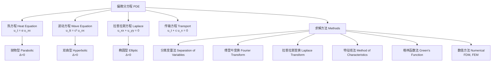

---
aliases:
  - 偏微分方程
  - Partial Differential Equations
  - PDE
  - 傅里叶变换
  - Fourier Transform
  - 拉普拉斯变换
  - Laplace Transform
  - 分离变量法
tags:
  - mathematics
  - PDE
  - Fourier transform
  - Laplace transform
  - separation of variables
  - heat equation
  - wave equation
  - Laplace equation
---

# 偏微分方程与变换 (Partial Differential Equations and Transforms)

## 概述 (Overview)

偏微分方程 (PDE) 涉及多变量函数及其偏导数的关系，是描述物理世界中场、波动、扩散等现象的核心工具。傅里叶变换和拉普拉斯变换是求解 PDE 的重要解析方法。PDE 根据二阶项系数分为椭圆型 (elliptic)、抛物型 (parabolic) 和双曲型 (hyperbolic) 三类。本笔记覆盖三类标准方程的求解方法和积分变换技术。

## 基本分类 (Basic Classification)

### 二阶线性 PDE 标准形式 (Second-Order Linear PDE)

$$
A u_{xx} + 2B u_{xy} + C u_{yy} + D u_x + E u_y + F u = G
$$

判别式 $\Delta = B^2 - AC$：

| $\Delta$ 符号 | PDE 类型 | 典型方程 | 物理意义 |
|---|---|---|---|
| $\Delta < 0$ | 椭圆型 (Elliptic) | $\nabla^2 u = 0$ | 稳态 (Steady State) |
| $\Delta = 0$ | 抛物型 (Parabolic) | $u_t = \alpha \nabla^2 u$ | 扩散 (Diffusion) |
| $\Delta > 0$ | 双曲型 (Hyperbolic) | $u_{tt} = c^2 \nabla^2 u$ | 波动 (Wave Propagation) |

### 定解条件 (Well-Posed Conditions)

| 条件类型 | 数学表示 | 物理含义 |
|---|---|---|
| 初始条件 (IC) | $u(x, 0) = f(x)$, $u_t(x, 0) = g(x)$ | 初位移、初速度 |
| Dirichlet BC | $u = h$ 在边界上 | 固定温度/位移 |
| Neumann BC | $\partial u / \partial n = g$ 在边界上 | 绝热/自由端 |
| Robin BC | $\alpha u + \beta \partial u/\partial n = \gamma$ | 对流/弹性支撑 |
| 周期性 BC | $u(0) = u(L)$, $u_x(0) = u_x(L)$ | 环形区域 |

## 热方程 (Heat Equation)

### 一维热方程 (1D Heat Equation)

$$
u_t = \alpha u_{xx}
$$

扩散率 $\alpha = k/(\rho c_p)$，其中 $k$ 为热导率，$\rho$ 为密度，$c_p$ 为比热容。

### 分离变量法 (Separation of Variables)

设 $u(x, t) = X(x) T(t)$，代入得：

$$
\frac{T'}{\alpha T} = \frac{X''}{X} = -\lambda
$$

解得 $X'' + \lambda X = 0$，$T' + \alpha \lambda T = 0$。

### 傅里叶级数解 (Fourier Series Solution)

对于 $[0, L]$ 上 $u(0, t) = u(L, t) = 0$，$u(x, 0) = f(x)$：

$$
u(x, t) = \sum_{n=1}^\infty b_n \sin\left( \frac{n\pi x}{L} \right) e^{-\alpha (n\pi/L)^2 t}
$$

其中 $b_n = \frac{2}{L} \int_0^L f(x) \sin(n\pi x / L) \, dx$。高频模态 ($n$ 大) 衰减更快，解无限光滑。

### 基本解 (Fundamental Solution)

$$
\Phi(x, t) = \frac{1}{\sqrt{4\pi \alpha t}} e^{-x^2/(4\alpha t)}
$$

初值 $u(x, 0) = \delta(x)$ 的解为 $\Phi(x, t)$，一般初值为卷积 $u = f * \Phi$。

## 波动方程 (Wave Equation)

### 一维波动方程 (1D Wave Equation)

$$
u_{tt} = c^2 u_{xx}
$$

### 达朗贝尔公式 (d'Alembert's Formula)

无界弦 $u(x, 0) = f(x)$，$u_t(x, 0) = g(x)$：

$$
u(x, t) = \frac{1}{2} [f(x + ct) + f(x - ct)] + \frac{1}{2c} \int_{x - ct}^{x + ct} g(s) \, ds
$$

信息以波速 $c$ 沿特征线 $x \pm ct = \text{const}$ 传播。$(x, t)$ 处的解依赖于 $[x - ct, x + ct]$ 上的初值（依赖区间）。

### 有界弦的傅里叶解 (Bounded String)

$$
u(x, t) = \sum_{n=1}^\infty \sin\left( \frac{n\pi x}{L} \right) \left[ A_n \cos\left( \frac{n\pi c t}{L} \right) + B_n \sin\left( \frac{n\pi c t}{L} \right) \right]
$$

## 拉普拉斯方程 (Laplace Equation)

### 极坐标形式 (Polar Form)

$$
u_{rr} + \frac{1}{r} u_r + \frac{1}{r^2} u_{\theta\theta} = 0
$$

分离变量解得 $u(r, \theta) = A_0 + \sum_{n=1}^\infty r^n (A_n \cos n\theta + B_n \sin n\theta)$。

### 调和函数性质 (Properties of Harmonic Functions)

- **平均值性质**：$u(x_0) = \frac{1}{|\partial B_r|} \int_{\partial B_r} u \, dS$
- **极值原理**：最大值和最小值在边界上达到
- **解析性**：调和函数是实解析的

## 傅里叶变换 (Fourier Transform)

$$
\mathcal{F}\{f(x)\} = \hat{f}(\xi) = \int_{-\infty}^\infty f(x) e^{-i\xi x} \, dx
$$

**逆变换**：$f(x) = \frac{1}{2\pi} \int_{-\infty}^\infty \hat{f}(\xi) e^{i\xi x} \, d\xi$

### 变换表与性质

| 性质 | 公式 |
|---|---|
| 导数 | $\mathcal{F}\{f'(x)\} = i\xi \hat{f}(\xi)$ |
| 卷积 | $\mathcal{F}\{f * g\} = \hat{f}(\xi) \hat{g}(\xi)$ |
| 平移 | $\mathcal{F}\{f(x - a)\} = e^{-ia\xi} \hat{f}(\xi)$ |
| 帕塞瓦尔 | $\int |f|^2 = \frac{1}{2\pi} \int |\hat{f}|^2$ |

## 应用 (Applications)

| 方程 | 领域 | 物理意义 |
|---|---|---|
| 热方程 | 传热学 | 温度分布 |
| 波动方程 | 声学 | 声波传播 |
| 拉普拉斯方程 | 静电场 | 电势分布 |
| 薛定谔方程 | 量子力学 | 波函数 |

### 重要傅里叶变换对 (Important Fourier Transform Pairs)

| $f(x)$ | $\hat{f}(\xi)$ | 说明 |
|---|---|---|
| $\delta(x)$ | $1$ | 狄拉克函数 |
| $1$ | $2\pi \delta(\xi)$ | 常数 |
| $e^{-a|x|}$ | $\frac{2a}{a^2 + \xi^2}$ | 指数衰减 |
| $e^{-ax^2}$ | $\sqrt{\frac{\pi}{a}} e^{-\xi^2/(4a)}$ | 高斯函数 |
| $\chi_{[-a, a]}(x)$ | $\frac{2\sin(a\xi)}{\xi}$ | 矩形函数 |
| $\frac{\sin(ax)}{x}$ | $\pi \chi_{[-a, a]}(\xi)$ | sinc 函数 |

### 傅里叶变换在 PDE 中的应用 (Fourier Transform for PDEs)

对热方程 $u_t = \alpha u_{xx}$ 做空间变量的傅里叶变换：

$$
\hat{u}_t(\xi, t) = -\alpha \xi^2 \hat{u}(\xi, t)
$$

解得 $\hat{u}(\xi, t) = \hat{u}_0(\xi) e^{-\alpha \xi^2 t}$，逆变换得 $u(x, t) = \frac{1}{\sqrt{4\pi\alpha t}} \int u_0(y) e^{-(x-y)^2/(4\alpha t)} dy$。

### 拉普拉斯变换在 PDE 中的应用 (Laplace Transform for PDEs)

对时间变量 $t$ 做拉普拉斯变换：$\mathcal{L}\{u_t\} = sU(x, s) - u(x, 0)$，将热方程化为关于 $x$ 的 ODE：$sU - u_0 = \alpha U_{xx}$，求解后做逆变换得到解。

### 格林函数与泊松方程 (Green's Function for Poisson Equation)

$\nabla^2 G(\mathbf{x}, \mathbf{x}_0) = \delta(\mathbf{x} - \mathbf{x}_0)$ 的解：

- 二维：$G = \frac{1}{2\pi} \ln |\mathbf{x} - \mathbf{x}_0|$
- 三维：$G = -\frac{1}{4\pi |\mathbf{x} - \mathbf{x}_0|}$

泊松方程 $\nabla^2 u = f$ 的解为 $u(\mathbf{x}) = \int_\Omega G(\mathbf{x}, \mathbf{x}_0) f(\mathbf{x}_0) dV_0$。

### 特征线法 (Method of Characteristics)

一阶线性 PDE $a(x, y) u_x + b(x, y) u_y = c(x, y, u)$ 沿特征曲线 $\frac{dx}{dt} = a$, $\frac{dy}{dt} = b$ 化为 ODE $\frac{du}{dt} = c$。

### 数值方法简介 (Numerical Methods)

- **有限差分法 (FDM)**：将导数用差商近似，离散化求解
- **有限元法 (FEM)**：变分形式，在有限元空间求近似解
- **谱方法 (Spectral Method)**：用全局基函数展开
