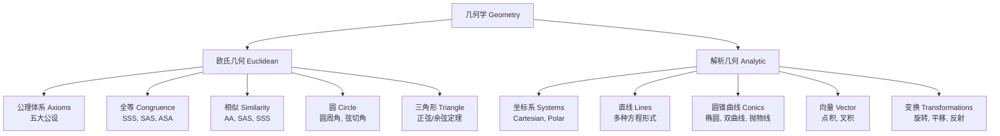

---
aliases:
  - 欧氏几何
  - Euclidean Geometry
  - 解析几何
  - Analytic Geometry
  - 坐标几何
  - 圆锥曲线
tags:
  - mathematics
  - geometry
  - Euclidean
  - analytic geometry
  - conics
  - coordinates
  - transformations
---

# 欧氏几何与解析几何 (Euclidean and Analytic Geometry)

## 概述 (Overview)

欧氏几何是研究平面和空间中图形性质的传统几何学，基于欧几里得 (Euclid) 的五条公设。解析几何由笛卡尔 (Descartes) 和费马 (Fermat) 创立，用代数方法研究几何问题，将点与坐标对应。两者共同构成了现代几何学的基础，也是物理学和工程学中空间分析的基本工具。

## 欧氏几何基础 (Euclidean Geometry Basics)

### 欧几里得五条公设 (Euclid's Five Postulates)

1. 从任意一点到任意另一点可作一条直线
2. 任意有限直线可以无限延长
3. 以任意点为圆心、任意距离为半径可作圆
4. 所有直角彼此相等
5. 平行公设：过直线外一点有且仅有一条平行线

### 三角形 (Triangles)

**勾股定理 (Pythagorean Theorem)**：$a^2 + b^2 = c^2$ 对直角三角形成立。

**三角形内角和**：$\alpha + \beta + \gamma = 180^\circ = \pi$ 弧度。

**正弦定理 (Law of Sines)**：

$$
\frac{a}{\sin A} = \frac{b}{\sin B} = \frac{c}{\sin C} = 2R
$$

其中 $R$ 为外接圆半径。

**余弦定理 (Law of Cosines)**：

$$
c^2 = a^2 + b^2 - 2ab \cos C
$$

| 角 $C$ | 结论 | 三角形类型 |
|---|---|---|
| $C = 90^\circ$ | $c^2 = a^2 + b^2$ | 直角三角形 |
| $C < 90^\circ$ | $c^2 < a^2 + b^2$ | 锐角三角形 |
| $C > 90^\circ$ | $c^2 > a^2 + b^2$ | 钝角三角形 |

### 圆 (Circle)

| 概念 | 公式/定理 |
|---|---|
| 周长 (Circumference) | $C = 2\pi r$ |
| 面积 (Area) | $A = \pi r^2$ |
| 弧长 (Arc Length) | $s = r\theta$（$\theta$ 为弧度） |
| 扇形面积 (Sector Area) | $A = \frac{1}{2} r^2 \theta$ |
| 圆心角定理 | 圆心角等于所对弧的两倍圆周角 |
| 弦切角定理 | 弦切角等于所夹弧的圆周角 |
| 圆幂定理 (Power of a Point) | $PA \cdot PB = PT^2$ |

## 解析几何 (Analytic Geometry)

### 直角坐标系 (Cartesian Coordinates)

**两点间距离**：$d = \sqrt{(x_2 - x_1)^2 + (y_2 - y_1)^2}$

**中点公式**：$M = \left( \frac{x_1 + x_2}{2}, \frac{y_1 + y_2}{2} \right)$

**定比分点**：$P = \left( \frac{m x_2 + n x_1}{m + n}, \frac{m y_2 + n y_1}{m + n} \right)$

### 极坐标系 (Polar Coordinates)

$x = r \cos \theta,\ y = r \sin \theta$，$r = \sqrt{x^2 + y^2}$，$\theta = \arctan(y/x)$。

### 直线 (Straight Lines)

| 形式 | 方程 | 适用场景 |
|---|---|---|
| 一般式 | $Ax + By + C = 0$ | 通用 |
| 斜截式 | $y = kx + b$ | 已知斜率 |
| 点斜式 | $y - y_0 = k(x - x_0)$ | 已知一点和斜率 |
| 截距式 | $x/a + y/b = 1$ | 已知截距 |

**点到直线距离**：$d = \frac{|Ax_0 + By_0 + C|}{\sqrt{A^2 + B^2}}$

### 圆锥曲线 (Conic Sections)

| 曲线 | 标准方程 | 焦点 | 离心率 $e$ |
|---|---|---|---|
| 圆 | $x^2 + y^2 = r^2$ | $(0, 0)$ | $0$ |
| 椭圆 | $\frac{x^2}{a^2} + \frac{y^2}{b^2} = 1$ | $(\pm c, 0)$, $c^2 = a^2 - b^2$ | $e = c/a < 1$ |
| 双曲线 | $\frac{x^2}{a^2} - \frac{y^2}{b^2} = 1$ | $(\pm c, 0)$, $c^2 = a^2 + b^2$ | $e = c/a > 1$ |
| 抛物线 | $y^2 = 4px$ | $(p, 0)$ | $e = 1$ |

**极坐标统一形式**：$r = \frac{ep}{1 - e \cos \theta}$

### 向量几何 (Vector Geometry)

**点积**：$\mathbf{a} \cdot \mathbf{b} = |\mathbf{a}| |\mathbf{b}| \cos \theta = a_1 b_1 + a_2 b_2$

**叉积**：$\mathbf{a} \times \mathbf{b} = (a_1 b_2 - a_2 b_1)$（二维）或 $|\mathbf{a}||\mathbf{b}| \sin \theta \, \mathbf{n}$（三维）

**投影**：$\operatorname{proj}_{\mathbf{b}} \mathbf{a} = \frac{\mathbf{a} \cdot \mathbf{b}}{|\mathbf{b}|^2} \mathbf{b}$

### 坐标变换 (Coordinate Transformations)

**平移**：$\begin{cases} x' = x - h \\ y' = y - k \end{cases}$

**旋转**：$\begin{pmatrix} x' \\ y' \end{pmatrix} = \begin{pmatrix} \cos\theta & -\sin\theta \\ \sin\theta & \cos\theta \end{pmatrix} \begin{pmatrix} x \\ y \end{pmatrix}$

## 空间解析几何 (3D Analytic Geometry)

### 平面方程 (Plane Equation)

一般式 $Ax + By + Cz + D = 0$，截距式 $x/a + y/b + z/c = 1$。

点到平面距离：$d = \frac{|Ax_0 + By_0 + Cz_0 + D|}{\sqrt{A^2 + B^2 + C^2}}$

### 空间直线 (Line in Space)

对称式 $\frac{x - x_0}{m} = \frac{y - y_0}{n} = \frac{z - z_0}{p}$，参数式 $x = x_0 + mt,\ y = y_0 + nt,\ z = z_0 + pt$。

## 等距变换 (Isometries)

| 变换 | 性质 | 2D 齐次矩阵 |
|---|---|---|
| 平移 | 保向 | $\begin{pmatrix} 1 & 0 & h \\ 0 & 1 & k \\ 0 & 0 & 1 \end{pmatrix}$ |
| 旋转 | 保向 | $\begin{pmatrix} \cos\theta & -\sin\theta & 0 \\ \sin\theta & \cos\theta & 0 \\ 0 & 0 & 1 \end{pmatrix}$ |
| 反射 | 反向 | $\begin{pmatrix} 1 & 0 & 0 \\ 0 & -1 & 0 \\ 0 & 0 & 1 \end{pmatrix}$ |
| 缩放 | 相似 | $\begin{pmatrix} s & 0 & 0 \\ 0 & s & 0 \\ 0 & 0 & 1 \end{pmatrix}$ |

### 仿射变换 (Affine Transformations)

仿射变换保持直线和平行关系，但一般不保距或保角。一般形式为 $\mathbf{x}' = A \mathbf{x} + \mathbf{b}$，其中 $A$ 为非奇异矩阵。仿射变换将椭圆映为椭圆，双曲线映为双曲线，抛物线映为抛物线。

## 二次曲线的一般理论 (General Theory of Conics)

二次曲线的一般方程 $Ax^2 + Bxy + Cy^2 + Dx + Ey + F = 0$ 可通过坐标变换化为标准形式：

**判别式 $\Delta = B^2 - 4AC$**：

| $\Delta$ 符号 | 曲线类型 |
|---|---|
| $\Delta < 0$ | 椭圆型（椭圆、虚椭圆、点） |
| $\Delta = 0$ | 抛物型（抛物线、平行直线、重合直线） |
| $\Delta > 0$ | 双曲型（双曲线、相交直线） |

## 空间二次曲面 (Quadric Surfaces in Space)

| 曲面 | 标准方程 | 形状特征 |
|---|---|---|
| 椭球面 (Ellipsoid) | $\frac{x^2}{a^2} + \frac{y^2}{b^2} + \frac{z^2}{c^2} = 1$ | 封闭曲面 |
| 双曲抛物面 (Hyperbolic Paraboloid) | $\frac{x^2}{a^2} - \frac{y^2}{b^2} = z$ | 马鞍面 |
| 单叶双曲面 (Hyperboloid of One Sheet) | $\frac{x^2}{a^2} + \frac{y^2}{b^2} - \frac{z^2}{c^2} = 1$ | 直纹面 |
| 双叶双曲面 (Hyperboloid of Two Sheets) | $\frac{x^2}{a^2} - \frac{y^2}{b^2} - \frac{z^2}{c^2} = 1$ | 两叶分离 |
| 椭圆抛物面 (Elliptic Paraboloid) | $\frac{x^2}{a^2} + \frac{y^2}{b^2} = z$ | 碗状 |
| 锥面 (Cone) | $\frac{x^2}{a^2} + \frac{y^2}{b^2} = \frac{z^2}{c^2}$ | 顶点在原点 |

## 球面三角学 (Spherical Trigonometry)

球面三角形由三个大圆弧围成，边以弧度（角度）度量。球面直角三角形的纳皮尔法则用于求解球面三角形。

### 球面余弦定理与正弦定理

**球面正弦定理**：

$$
\frac{\sin a}{\sin A} = \frac{\sin b}{\sin B} = \frac{\sin c}{\sin C}
$$

**球面余弦定理**：

$$
\cos a = \cos b \cos c + \sin b \sin c \cos A
$$
