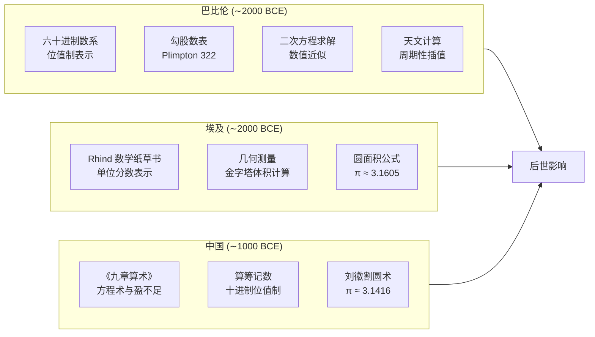
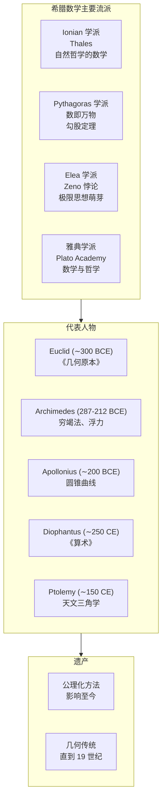

---
aliases:
  - Ancient Mathematics
  - Medieval Mathematics
  - 古代与中世纪数学
  - History of Mathematics
tags:
  - mathematics
  - history
  - ancient
  - medieval
  - Greek_mathematics
  - Islamic_mathematics
---

# 古代与中世纪数学

## 概述

古代与中世纪数学 (Ancient and Medieval Mathematics) 涵盖了从巴比伦、埃及、希腊到伊斯兰世界、印度和中国的数学发展历程。这一时期奠定了几何、数论、代数和三角学的基础。

## 巴比伦数学

### 数系

巴比伦人使用六十进制 (Sexagesimal) 位值制数系，这种系统至今仍影响我们对时间和角度的度量（1小时 = 60分钟，1分钟 = 60秒）。

### 成就

- 勾股数 (Pythagorean Triples) 的列表——早于 Pythagoras 一千多年
- 二次方程的数值解法
- 天文计算中的插值法

### 普林顿 322 号泥板

这是一块包含勾股数表的古巴比伦泥板，展示了令人惊叹的数学成熟度。

## 埃及数学

### Rhind 数学纸草书

现存最重要的古埃及数学文献，包含 84 个问题。

### 分数系统

埃及人使用单位分数 (Unit Fractions) 和 2/3。任何分数 $\frac{a}{b}$ 表示为不同单位分数之和：

$$ \frac{2}{5} = \frac{1}{3} + \frac{1}{15} $$

### 几何应用

- 圆面积计算：$A = \left(\frac{8}{9}d\right)^2$，相当于 $\pi \approx 3.1605$
- 截棱锥体积的正确计算

## 希腊数学

### 早期希腊

#### Thales 与 Pythagoras

- Thales：几何证明的起源，Thales 定理
- Pythagoras 学派：勾股定理，数神秘主义，无理数的发现

### 黄金时代

#### Euclid 与《几何原本》

Euclid 的《几何原本》(Elements) 是最有影响力的数学教科书之一。其公理体系：

1. 任意两点可以连成一条直线
2. 有限直线可以无限延长
3. 以任意点为圆心、任意长为半径可以作圆
4. 所有直角都相等
5. 第五公设（平行公设）

Euclid 算法（求最大公因数）至今是计算机科学的基本算法。

#### Archimedes

- 穷竭法 (Method of Exhaustion) ——积分思想的先驱
- 抛物线弓形面积的精确计算
- 圆周率估值：$3\frac{10}{71} < \pi < 3\frac{1}{7}$
- Archimedes 螺线

#### Apollonius

圆锥曲线 (Conic Sections) 的系统研究——椭圆、抛物线和双曲线。

### 希腊化时期

#### 代数学发展

Diophantus 的《算术》(Arithmetica) 是早期数论和代数的里程碑。

$$ x^2 + y^2 = z^2 $$

Diophantine 方程由此得名。

## 中国数学

### 《九章算术》

成书于约公元前一世纪，包含 246 个问题，分九章：

| 章 | 内容 |
|----|------|
| 方田 | 土地面积计算 |
| 粟米 | 比例问题 |
| 衰分 | 比例分配 |
| 少广 | 开平方、开立方 |
| 商功 | 体积计算 |
| 均输 | 运输问题 |
| 盈不足 | 线性插值 |
| 方程 | 线性方程组 |
| 勾股 | 勾股定理应用 |

### 主要数学家

- **刘徽** (3世纪)：割圆术，π ≈ 3.1416，体积原理
- **祖冲之** (5世纪)：π 介于 3.1415926 和 3.1415927 之间
- **秦九韶** (13世纪)：高次方程数值解，中国剩余定理
- **杨辉** (13世纪)：杨辉三角（Pascal 三角）

### 天元术与四元术

宋元时期的发展：天元术（列方程）和四元术（多元高次方程组）。

## 印度数学

- **零的符号化使用**：零作为数字和占位符
- **十进制位值制**：现代数系的直接来源
- **Brahmagupta** (7世纪)：二次方程、负数运算
- **Madhava** (14世纪)：无穷级数、反正切级数

## 伊斯兰数学

### 黄金时代 (8-15 世纪)

伊斯兰世界保存并发展了希腊数学，同时做出了重大原创贡献。

| 学者 | 贡献 |
|------|------|
| Al-Khwarizmi | 代数学奠基人，《代数学》(al-jabr) 给出二次方程的代数解法 |
| Al-Battani | 三角学发展，引入正弦、正切函数 |
| Omar Khayyam | 三次方程的几何解法 |
| Nasir al-Din al-Tusi | 三角学独立化，平行公设研究 |
| Al-Kashi | 圆周率计算到 16 位小数 |

### Al-Khwarizmi 的代数学

他将代数运算系统化为两种操作：
- **al-jabr**（还原）：将负项移至方程另一侧
- **al-muqabala**（对消）：合并同类项

## 中世纪欧洲数学

- **Fibonacci** (13世纪)：将印度-阿拉伯数字引入欧洲
- **Oresme** (14世纪)：分数指数、坐标几何萌芽
- **Regiomontanus** (15世纪)：三角学著作的系统化

## 参考文献

1. Heath, T. L. *A History of Greek Mathematics*. Dover.
2. Needham, J. *Science and Civilisation in China* (Vol. 3). Cambridge.
3. Katz, V. J. *A History of Mathematics: An Introduction*. Pearson.
4. Boyer, C. B. & Merzbach, U. C. *A History of Mathematics*. Wiley.
