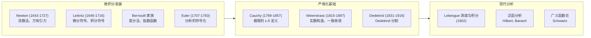
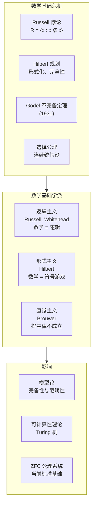

---
aliases:
  - Modern Mathematics
  - Contemporary Mathematics
  - 近代与现代数学
  - 20th Century Mathematics
tags:
  - mathematics
  - history
  - modern
  - calculus
  - set_theory
  - abstraction
---

# 近代与现代数学

## 概述

近代与现代数学 (Modern and Contemporary Mathematics) 从 17 世纪的微积分革命开始，经历了 19 世纪的严格化浪潮，到 20 世纪的公理化、抽象化和专业化爆炸。这一时期数学的深度和广度呈指数级增长。

## 17 世纪：微积分的创立

### Newton 与 Leibniz

微积分 (Calculus) 由 Newton 和 Leibniz 独立发明。

Newton 的流数法 (Method of Fluxions)：

$$ \dot{y} = \frac{dy}{dt} $$

Leibniz 的符号系统：

$$ \frac{dy}{dx}, \quad \int y \, dx $$

### 微积分基本定理

$$ \int_a^b f(x) \, dx = F(b) - F(a), \quad F'(x) = f(x) $$

### Euler 的贡献

Euler 是现代数学符号的奠基人，引入了 $f(x)$、$e$、$\pi$、$i$、$\sum$ 等符号。Euler 公式：

$$ e^{i\theta} = \cos\theta + i\sin\theta $$

## 19 世纪：严格化与抽象化

### 分析的严格化

#### Cauchy 的极限论

$$ \lim_{x \to a} f(x) = L \iff \forall \varepsilon > 0, \exists \delta > 0: 0 < |x - a| < \delta \implies |f(x) - L| < \varepsilon $$

#### Weierstrass 的实数构造

用单调有界序列构造实数，消除了无穷小的神秘性。

### 非欧几何

- **Gauss, Bolyai, Lobachevsky**：独立发现双曲几何
- **Riemann**：Riemann 几何，n 维流形的概念
- **应用**：Einstein 的广义相对论 (1915)

### 抽象代数

#### Galois 理论

Galois 使用群论解决多项式方程的可解性问题：

$$ \text{Gal}(K/F) \text{ 可解} \iff \text{方程可用根式求解} $$

#### 代数结构

| 数学家 | 贡献 |
|--------|------|
| Cayley | 抽象群的定义 |
| Dedekind | 环、理想理论 |
| Noether | 抽象代数的公理化，同态基本定理 |
| Hilbert | 不变理论、类域论 |
| Artin | 一般 Galois 理论 |

### 数论的黄金时代

- **Gauss**：《算术研究》(1801) 奠定了现代数论
- **Dirichlet**：解析数论创始，L-函数
- **Riemann**：Riemann Zeta 函数与素数分布
- **Hadamard & de la Vallée-Poussin**：素数定理 (1896) 证明

## 20 世纪：公理化与专业化

### 集合论与数学基础

#### Cantor 的集合论

Cantor 引入了无穷基数的概念：

$$ |\mathbb{N}| = \aleph_0, \quad |\mathbb{R}| = 2^{\aleph_0} $$

Cantor 对角线论证证明实数不可数。

#### 逻辑与基础危机

#### Gödel 不完备定理

第一不完备定理：任何一致的形式系统（包含算术）都存在不可判定命题。

第二不完备定理：这样的系统不能证明自身的一致性。

### 泛函分析

- **Hilbert 空间理论**
- **Banach 空间与算子理论**
- **分布理论 (Schwartz)**

### 拓扑学

| 分支 | 创始人物 | 核心概念 |
|------|---------|---------|
| 点集拓扑 | Hausdorff | 开集、紧性、连通性 |
| 代数拓扑 | Poincaré | 同伦群、同调群、基本群 |
| 微分拓扑 | Whitney, Milnor | 流形、示性类 |

### 概率论的公理化

Kolmogorov (1933) 使用测度论公理化概率论：

$$ P(\Omega) = 1, \quad P\left(\bigcup_{i=1}^\infty A_i\right) = \sum_{i=1}^\infty P(A_i) $$

### 应用数学的爆发

#### 计算数学

- 有限元方法 (FEM)
- 快速 Fourier 变换 (FFT)
- 线性规划 (Dantzig)
- 蒙特卡洛方法 (von Neumann, Ulam)

#### 信息论

Shannon (1948)：

$$ H(X) = -\sum_i p_i \log_2 p_i $$

## 20 世纪下半叶的里程碑

| 领域 | 突破 | 时间 |
|------|------|------|
| 四色定理证明 | Appel-Haken 计算机辅助证明 | 1976 |
| Fermat 大定理 | Wiles 证明 | 1994 |
| Poincaré 猜想 | Perelman 证明 | 2003 |
| 有限单群分类 | 众多数学家合作 | 1983 (完成) |
| Weil 猜想 | Deligne 证明 | 1974 |
| 映射类群 | Thurston 的几何化 | 1980s |

## 中国现代数学

- **陈省身**：整体微分几何，Chern 示性类
- **华罗庚**：数论、多复变、统筹方法
- **丘成桐**：Calabi-Yau 流形，微分几何
- **吴文俊**：吴示性类、机械化证明

## 参考文献

1. Dieudonné, J. *A History of Algebraic and Differential Topology 1900-1960*. Birkhäuser.
2. Kleiner, I. *A History of Abstract Algebra*. Birkhäuser.
3. Monna, A. F. *Functional Analysis in Historical Perspective*. Wiley.
4. Grattan-Guinness, I. *The Norton History of the Mathematical Sciences*. Norton.
5. 吴文俊 (主编). *世界著名数学家传记*. 科学出版社.
