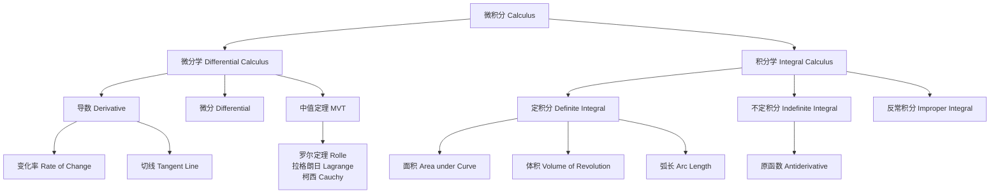
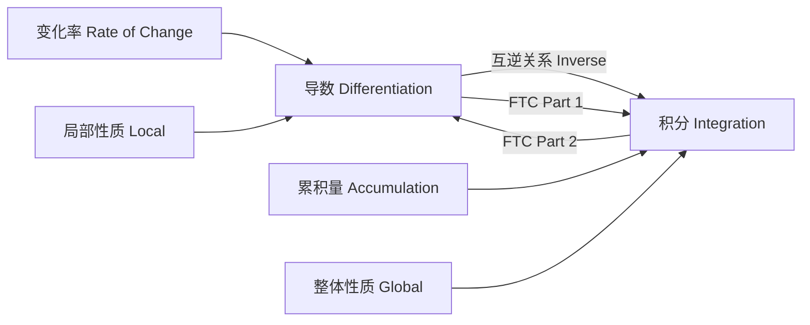

---
aliases:
  - 微积分
  - Calculus
  - 微积分学
  - 微分学
  - 积分学
tags:
  - mathematics
  - analysis
  - calculus
  - derivatives
  - integrals
  - limits
  - FTC
---

# 微积分 (Calculus)

## 概述 (Overview)

微积分是研究变化率和累积量的数学分支，由牛顿 (Newton) 和莱布尼茨 (Leibniz) 在 17 世纪独立创立。其核心概念包括极限 (limits)、导数 (derivatives)、积分 (integrals) 和微积分基本定理 (Fundamental Theorem of Calculus, FTC)。微积分为现代科学提供了描述动态系统的基础语言，在物理、工程、经济、生物等领域具有不可替代的地位。极限思想是微积分的基石，通过无穷逼近 (infinitesimal approximation) 处理连续变化的问题。

## 预备知识 (Preliminaries)

### 函数 (Functions)

函数 $f: D \to \mathbb{R}$ 将定义域 $D$ 中的每个 $x$ 映射到唯一的值 $f(x)$。基本初等函数包括多项式 (polynomials)、三角函数 (trigonometric functions)、指数函数 (exponential functions) 和对数函数 (logarithmic functions)。初等函数是由基本初等函数经有限次四则运算和复合得到的函数。

### 连续 (Continuity)

函数 $f$ 在 $x = a$ 处连续当且仅当 $\lim_{x \to a} f(x) = f(a)$。闭区间上的连续函数具有介值性 (Intermediate Value Property) 和最值性 (Extreme Value Property)。间断点分为可去间断点 (removable)、跳跃间断点 (jump) 和第二类间断点 (essential)。

## 极限 (Limits)

### 定义 (Definition)

函数 $f(x)$ 在 $x \to a$ 时的极限为 $L$，记为：

$$
\lim_{x \to a} f(x) = L
$$

其 $\varepsilon$-$\delta$ 定义：对任意 $\varepsilon > 0$，存在 $\delta > 0$，使得当 $0 < |x - a| < \delta$ 时，有 $|f(x) - L| < \varepsilon$。

### 单侧极限 (One-Sided Limits)

左极限 $\lim_{x \to a^-} f(x)$ 和右极限 $\lim_{x \to a^+} f(x)$。极限存在当且仅当左右极限存在且相等。

### 重要极限 (Important Limits)

| 极限表达式 | 结果 | 备注 |
|---|---|---|
| $\displaystyle \lim_{x \to 0} \frac{\sin x}{x}$ | $1$ | 基本三角极限 |
| $\displaystyle \lim_{x \to 0} \frac{1 - \cos x}{x^2}$ | $\frac{1}{2}$ | 余弦展开近似 |
| $\displaystyle \lim_{x \to \infty} \left(1 + \frac{1}{x}\right)^x$ | $e$ | 自然常数定义 |
| $\displaystyle \lim_{x \to 0} \frac{e^x - 1}{x}$ | $1$ | 指数函数导数 |
| $\displaystyle \lim_{x \to 0} \frac{\ln(1 + x)}{x}$ | $1$ | 对数函数导数 |
| $\displaystyle \lim_{x \to 0} \frac{a^x - 1}{x}$ | $\ln a$ | 一般指数函数 |

### 极限运算法则 (Limit Laws)

若 $\lim f(x) = A$，$\lim g(x) = B$，则：

- **和法则**：$\lim [f(x) \pm g(x)] = A \pm B$
- **积法则**：$\lim [f(x) \cdot g(x)] = A \cdot B$
- **商法则**：$\lim \frac{f(x)}{g(x)} = \frac{A}{B}$，其中 $B \neq 0$
- **复合法则**：$\lim f(g(x)) = f(\lim g(x))$，若 $f$ 连续
- **幂法则**：$\lim [f(x)]^n = A^n$

### 夹逼定理 (Squeeze Theorem)

若在 $a$ 的某去心邻域内有 $g(x) \leq f(x) \leq h(x)$，且 $\lim_{x \to a} g(x) = \lim_{x \to a} h(x) = L$，则 $\lim_{x \to a} f(x) = L$。

### 无穷小与无穷大 (Infinitesimals and Infinity)

若 $\lim f(x) = 0$，称 $f(x)$ 为无穷小 (infinitesimal)。若 $\lim f(x) = \infty$，称 $f(x)$ 为无穷大。

**等价无穷小替换 (Equivalent Infinitesimals)**：当 $x \to 0$ 时，$\sin x \sim x$，$\tan x \sim x$，$\arcsin x \sim x$，$\arctan x \sim x$，$\ln(1 + x) \sim x$，$e^x - 1 \sim x$，$1 - \cos x \sim x^2/2$。

## 导数 (Derivatives)

### 定义 (Definition)

函数 $f$ 在点 $x$ 处的导数定义为：

$$
f'(x) = \frac{df}{dx} = \lim_{h \to 0} \frac{f(x + h) - f(x)}{h}
$$

可导必连续，但连续不一定可导（如 $f(x) = |x|$ 在 $x = 0$ 处）。

### 基本导数公式 (Basic Derivative Formulas)

| 函数 $f(x)$ | 导数 $f'(x)$ |
|---|---|
| $x^n$ | $n x^{n-1}$ |
| $\sin x$ | $\cos x$ |
| $\cos x$ | $-\sin x$ |
| $\tan x$ | $\sec^2 x$ |
| $\cot x$ | $-\csc^2 x$ |
| $\sec x$ | $\sec x \tan x$ |
| $\csc x$ | $-\csc x \cot x$ |
| $e^x$ | $e^x$ |
| $a^x$ | $a^x \ln a$ |
| $\ln x$ | $\frac{1}{x}$ |
| $\log_a x$ | $\frac{1}{x \ln a}$ |
| $\arcsin x$ | $\frac{1}{\sqrt{1 - x^2}}$ |
| $\arccos x$ | $-\frac{1}{\sqrt{1 - x^2}}$ |
| $\arctan x$ | $\frac{1}{1 + x^2}$ |

### 求导法则 (Differentiation Rules)

- **和差法则**：$(f \pm g)' = f' \pm g'$
- **乘积法则**：$(fg)' = f'g + fg'$
- **商法则**：$\left(\frac{f}{g}\right)' = \frac{f'g - fg'}{g^2}$
- **链式法则**：$(f \circ g)'(x) = f'(g(x)) \cdot g'(x)$
- **反函数求导**：$(f^{-1})'(x) = \frac{1}{f'(f^{-1}(x))}$
- **隐函数求导**：对方程两边同时关于 $x$ 求导，解出 $dy/dx$
- **对数求导**：对 $y = f(x)^{g(x)}$ 取 $\ln$ 后求导

### 中值定理 (Mean Value Theorem)

#### 罗尔定理 (Rolle's Theorem)

若 $f$ 在 $[a, b]$ 上连续，在 $(a, b)$ 内可导，且 $f(a) = f(b)$，则存在 $c \in (a, b)$ 使得 $f'(c) = 0$。

#### 拉格朗日中值定理 (Lagrange MVT)

若 $f$ 在 $[a, b]$ 上连续，在 $(a, b)$ 内可导，则存在 $c \in (a, b)$ 使得：

$$
f'(c) = \frac{f(b) - f(a)}{b - a}
$$

#### 柯西中值定理 (Cauchy MVT)

若 $f, g$ 在 $[a, b]$ 上连续，在 $(a, b)$ 内可导，且 $g'(x) \neq 0$，则存在 $c \in (a, b)$ 使得：

$$
\frac{f(b) - f(a)}{g(b) - g(a)} = \frac{f'(c)}{g'(c)}
$$

### 洛必达法则 (L'Hôpital's Rule)

若 $\lim \frac{f(x)}{g(x)}$ 为 $\frac{0}{0}$ 或 $\frac{\infty}{\infty}$ 型不定式，且 $\lim \frac{f'(x)}{g'(x)}$ 存在（或为无穷大），则：

$$
\lim \frac{f(x)}{g(x)} = \lim \frac{f'(x)}{g'(x)}
$$

## 积分 (Integrals)

### 不定积分 (Indefinite Integral)

$$
\int f(x) \, dx = F(x) + C \quad \text{其中 } F'(x) = f(x)
$$

### 定积分 (Definite Integral)

$$
\int_a^b f(x) \, dx = \lim_{n \to \infty} \sum_{i=1}^n f(x_i^*) \Delta x
$$

其中 $\Delta x = (b - a)/n$，$x_i^* \in [x_{i-1}, x_i]$。

### 基本积分公式 (Basic Integral Formulas)

| 不定积分 | 结果 |
|---|---|
| $\int x^n \, dx$ | $\frac{x^{n+1}}{n+1} + C,\ n \neq -1$ |
| $\int \frac{1}{x} \, dx$ | $\ln |x| + C$ |
| $\int \sin x \, dx$ | $-\cos x + C$ |
| $\int \cos x \, dx$ | $\sin x + C$ |
| $\int \tan x \, dx$ | $-\ln |\cos x| + C$ |
| $\int \sec x \, dx$ | $\ln |\sec x + \tan x| + C$ |
| $\int e^x \, dx$ | $e^x + C$ |
| $\int a^x \, dx$ | $\frac{a^x}{\ln a} + C$ |
| $\int \frac{1}{1 + x^2} \, dx$ | $\arctan x + C$ |
| $\int \frac{1}{\sqrt{1 - x^2}} \, dx$ | $\arcsin x + C$ |
| $\int \frac{1}{\sqrt{x^2 \pm a^2}} \, dx$ | $\ln |x + \sqrt{x^2 \pm a^2}| + C$ |
| $\int \sec^2 x \, dx$ | $\tan x + C$ |
| $\int \csc^2 x \, dx$ | $-\cot x + C$ |

### 积分技巧 (Integration Techniques)

**分部积分 (Integration by Parts)**：

$$
\int u \, dv = uv - \int v \, du
$$

**换元法 (Substitution)**：

$$
\int f(g(x)) g'(x) \, dx = \int f(u) \, du, \quad u = g(x)
$$

**部分分式 (Partial Fractions)**：将有理函数分解为简单分式之和，逐项积分。

**三角替换 (Trigonometric Substitution)**：

| 被积表达式 | 替换 | 换后形式 |
|---|---|---|
| $\sqrt{a^2 - x^2}$ | $x = a \sin \theta$ | $a \cos \theta$ |
| $\sqrt{a^2 + x^2}$ | $x = a \tan \theta$ | $a \sec \theta$ |
| $\sqrt{x^2 - a^2}$ | $x = a \sec \theta$ | $a \tan \theta$ |

### 反常积分 (Improper Integrals)

- **无穷限积分**：$\displaystyle \int_a^\infty f(x) \, dx = \lim_{b \to \infty} \int_a^b f(x) \, dx$
- **瑕积分**：$\displaystyle \int_a^b f(x) \, dx = \lim_{t \to a^+} \int_t^b f(x) \, dx$，其中 $x = a$ 为瑕点

## 微积分基本定理 (Fundamental Theorem of Calculus)

### 第一基本定理 (FTC Part 1)

若 $f$ 在 $[a, b]$ 上连续，则函数 $F(x) = \int_a^x f(t) \, dt$ 在 $[a, b]$ 上可导，且 $F'(x) = f(x)$。

### 第二基本定理 (FTC Part 2)

若 $F$ 是 $f$ 的任意一个原函数，则 $\int_a^b f(x) \, dx = F(b) - F(a)$。

## 应用 (Applications)

| 领域 | 微分应用 | 积分应用 |
|---|---|---|
| 物理 (Physics) | 速度、加速度 | 功、质心、转动惯量 |
| 工程 (Engineering) | 优化、边际分析 | 面积、体积、弧长 |
| 经济 (Economics) | 边际成本、弹性 | 消费者/生产者剩余 |
| 生物 (Biology) | 增长率、敏感性 | 总量累积、平均浓度 |

## 参数方程与极坐标 (Parametric and Polar)

参数曲线 $x = f(t), y = g(t)$ 的弧长：$L = \int_a^b \sqrt{(dx/dt)^2 + (dy/dt)^2} \, dt$

极坐标面积：$A = \frac{1}{2} \int_\alpha^\beta r(\theta)^2 \, d\theta$
