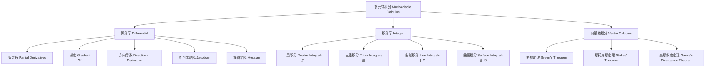

---
aliases:
  - 多元微积分
  - Multivariable Calculus
  - 向量微积分
  - Vector Calculus
  - 多重积分
tags:
  - mathematics
  - calculus
  - multivariable
  - vector
  - partial derivatives
  - multiple integrals
  - Stokes
  - Gauss
---

# 多元微积分 (Multivariable Calculus)

## 概述 (Overview)

多元微积分将单变量微积分推广到多变量函数，是研究物理场、流体力学、电磁学等领域的核心数学工具。核心概念包括偏导数 (partial derivatives)、多重积分 (multiple integrals)、向量场 (vector fields) 和三大积分定理 (Green, Stokes, Gauss theorems)。



## 偏导数 (Partial Derivatives)

### 定义 (Definition)

函数 $f(x, y)$ 对 $x$ 的偏导数定义为：

$$
\frac{\partial f}{\partial x} = \lim_{h \to 0} \frac{f(x + h, y) - f(x, y)}{h}
$$

对 $y$ 的偏导数类似定义。

### 高阶偏导数 (Higher-Order Partial Derivatives)

$$
\frac{\partial^2 f}{\partial x^2},\quad \frac{\partial^2 f}{\partial x \partial y},\quad \frac{\partial^2 f}{\partial y \partial x},\quad \frac{\partial^2 f}{\partial y^2}
$$

**混合偏导相等 (Clairaut's Theorem)**：若 $f_{xy}$ 和 $f_{yx}$ 在点 $(a, b)$ 处连续，则：

$$
\frac{\partial^2 f}{\partial x \partial y}(a, b) = \frac{\partial^2 f}{\partial y \partial x}(a, b)
$$

### 链式法则 (Chain Rule)

若 $z = f(x, y)$，$x = g(t)$，$y = h(t)$，则：

$$
\frac{dz}{dt} = \frac{\partial f}{\partial x} \frac{dx}{dt} + \frac{\partial f}{\partial y} \frac{dy}{dt}
$$

若 $z = f(x, y)$，$x = g(s, t)$，$y = h(s, t)$，则：

$$
\frac{\partial z}{\partial s} = \frac{\partial f}{\partial x} \frac{\partial x}{\partial s} + \frac{\partial f}{\partial y} \frac{\partial y}{\partial s},\quad \frac{\partial z}{\partial t} = \frac{\partial f}{\partial x} \frac{\partial x}{\partial t} + \frac{\partial f}{\partial y} \frac{\partial y}{\partial t}
$$

## 梯度、散度与旋度 (Gradient, Divergence, Curl)

### 梯度 (Gradient)

$$
\nabla f = \left( \frac{\partial f}{\partial x}, \frac{\partial f}{\partial y}, \frac{\partial f}{\partial z} \right)
$$

梯度方向是函数增长最快的方向，其模长等于该方向的方向导数值。

### 方向导数 (Directional Derivative)

沿单位向量 $\mathbf{u} = (a, b, c)$ 的方向导数：

$$
D_{\mathbf{u}} f = \nabla f \cdot \mathbf{u} = a \frac{\partial f}{\partial x} + b \frac{\partial f}{\partial y} + c \frac{\partial f}{\partial z}
$$

### 散度 (Divergence)

对于向量场 $\mathbf{F} = (P, Q, R)$：

$$
\operatorname{div} \mathbf{F} = \nabla \cdot \mathbf{F} = \frac{\partial P}{\partial x} + \frac{\partial Q}{\partial y} + \frac{\partial R}{\partial z}
$$

散度衡量向量场在某点的"源"或"汇"的强度。$\operatorname{div} \mathbf{F} > 0$ 表示源，$\operatorname{div} \mathbf{F} < 0$ 表示汇。

### 旋度 (Curl)

$$
\operatorname{curl} \mathbf{F} = \nabla \times \mathbf{F} = \begin{vmatrix}
\mathbf{i} & \mathbf{j} & \mathbf{k} \\
\frac{\partial}{\partial x} & \frac{\partial}{\partial y} & \frac{\partial}{\partial z} \\
P & Q & R
\end{vmatrix}
$$

旋度衡量向量场的旋转程度，方向由右手定则确定。

### 拉普拉斯算子 (Laplacian)

$$
\nabla^2 f = \nabla \cdot \nabla f = \frac{\partial^2 f}{\partial x^2} + \frac{\partial^2 f}{\partial y^2} + \frac{\partial^2 f}{\partial z^2}
$$

## 极值与条件极值 (Extrema and Lagrange Multipliers)

### 临界点 (Critical Points)

若 $\nabla f(x_0, y_0) = \mathbf{0}$ 或 $\nabla f$ 不存在，则 $(x_0, y_0)$ 为临界点。

### 二阶导数判别法 (Second Derivative Test)

判别式 $D = f_{xx} f_{yy} - (f_{xy})^2$：

| 条件 | 结论 |
|---|---|
| $D > 0$ 且 $f_{xx} > 0$ | 局部极小值 |
| $D > 0$ 且 $f_{xx} < 0$ | 局部极大值 |
| $D < 0$ | 鞍点 (Saddle Point) |
| $D = 0$ | 无法判断，需高阶项分析 |

### 拉格朗日乘数法 (Lagrange Multipliers)

在约束 $g(x, y) = 0$ 下求 $f$ 的极值：

$$
\nabla f = \lambda \nabla g
$$

对于多个约束 $g_1 = 0, g_2 = 0$：

$$
\nabla f = \lambda_1 \nabla g_1 + \lambda_2 \nabla g_2
$$

## 多重积分 (Multiple Integrals)

### 二重积分 (Double Integrals)

直角坐标：

$$
\iint_D f(x, y) \, dA = \int_a^b \int_{c}^{d} f(x, y) \, dy \, dx
$$

**极坐标变换 (Polar Coordinates)**：

$$
x = r \cos \theta,\ y = r \sin \theta,\ dA = r \, dr \, d\theta
$$

$$
\iint_D f(x, y) \, dA = \iint_{D'} f(r \cos \theta, r \sin \theta) \, r \, dr \, d\theta
$$

### 三重积分 (Triple Integrals)

直角坐标：

$$
\iiint_E f(x, y, z) \, dV = \iiint f \, dx \, dy \, dz
$$

**柱坐标 (Cylindrical Coordinates)**：

$$
x = r \cos \theta,\ y = r \sin \theta,\ z = z,\ dV = r \, dr \, d\theta \, dz
$$

**球坐标 (Spherical Coordinates)**：

$$
x = \rho \sin \phi \cos \theta,\ y = \rho \sin \phi \sin \theta,\ z = \rho \cos \phi,\ dV = \rho^2 \sin \phi \, d\rho \, d\phi \, d\theta
$$

### 积分变换与雅可比行列式 (Change of Variables and Jacobian)

$$
\iint_D f(x, y) \, dx \, dy = \iint_{D'} f(x(u, v), y(u, v)) \left| \frac{\partial(x, y)}{\partial(u, v)} \right| \, du \, dv
$$

| 坐标系 | 变换公式 | 雅可比行列式 |
|---|---|---|
| 极坐标 | $x = r\cos\theta,\ y = r\sin\theta$ | $r$ |
| 柱坐标 | $x = r\cos\theta,\ y = r\sin\theta,\ z = z$ | $r$ |
| 球坐标 | $x = \rho\sin\phi\cos\theta,\ y = \rho\sin\phi\sin\theta,\ z = \rho\cos\phi$ | $\rho^2 \sin\phi$ |
| 广义坐标 | $x = x(u, v),\ y = y(u, v)$ | $\left| \frac{\partial x}{\partial u} \frac{\partial y}{\partial v} - \frac{\partial x}{\partial v} \frac{\partial y}{\partial u} \right|$ |

## 曲线积分与曲面积分 (Line and Surface Integrals)

### 曲线积分 (Line Integrals)

**对弧长的曲线积分 (Scalar Line Integral)**：

$$
\int_C f(x, y) \, ds = \int_a^b f(x(t), y(t)) \sqrt{\left( \frac{dx}{dt} \right)^2 + \left( \frac{dy}{dt} \right)^2} \, dt
$$

**对坐标的曲线积分 (Vector Line Integral)**：

$$
\int_C \mathbf{F} \cdot d\mathbf{r} = \int_a^b \mathbf{F}(\mathbf{r}(t)) \cdot \mathbf{r}'(t) \, dt
$$

### 曲面积分 (Surface Integrals)

**对面积的曲面积分 (Scalar Surface Integral)**：

$$
\iint_S f(x, y, z) \, dS = \iint_D f(\mathbf{r}(u, v)) \, \|\mathbf{r}_u \times \mathbf{r}_v\| \, du \, dv
$$

**对坐标的曲面积分 (Vector Surface Integral)**：

$$
\iint_S \mathbf{F} \cdot d\mathbf{S} = \iint_S \mathbf{F} \cdot \mathbf{n} \, dS
$$

## 三大积分定理 (Three Great Theorems)

### 格林定理 (Green's Theorem)

将闭曲线上的线积分转化为区域上的二重积分：

$$
\oint_C (P \, dx + Q \, dy) = \iint_D \left( \frac{\partial Q}{\partial x} - \frac{\partial P}{\partial y} \right) \, dA
$$

### 斯托克斯定理 (Stokes' Theorem)

将空间闭曲线上的线积分转化为曲面上的曲面积分：

$$
\oint_C \mathbf{F} \cdot d\mathbf{r} = \iint_S (\nabla \times \mathbf{F}) \cdot d\mathbf{S}
$$

### 高斯散度定理 (Gauss's Divergence Theorem)

将封闭曲面上的通量积分转化为体积上的三重积分：

$$
\iint_S \mathbf{F} \cdot d\mathbf{S} = \iiint_E (\nabla \cdot \mathbf{F}) \, dV
$$

```mermaid
graph TD
  A[积分定理 Integration Theorems] --> B[格林 Green<br/>2D 旋度 Curl]
  A --> C[斯托克斯 Stokes<br/>3D 旋度 Curl]
  A --> D[高斯 Gauss<br/>3D 散度 Divergence]
  B --> E[∮_C F·dr = ∬_D (∇×F)·k dA]
  C --> F[∮_C F·dr = ∬_S (∇×F)·dS]
  D --> G[∬_S F·dS = ∭_E (∇·F) dV]
  E --> H[高维推广 Stokes 定理的一般形式]
  F --> H
  G --> H
  H --> I[∫_∂Ω ω = ∫_Ω dω<br/>斯托克斯定理的统一形式]
```

### 向量恒等式 (Vector Identities)

- $\nabla \cdot (\nabla \times \mathbf{F}) = 0$
- $\nabla \times (\nabla f) = \mathbf{0}$
- $\nabla \cdot (f \mathbf{F}) = f \nabla \cdot \mathbf{F} + \nabla f \cdot \mathbf{F}$
- $\nabla \times (f \mathbf{F}) = f \nabla \times \mathbf{F} + \nabla f \times \mathbf{F}$
- $\nabla \times (\nabla \times \mathbf{F}) = \nabla(\nabla \cdot \mathbf{F}) - \nabla^2 \mathbf{F}$

## 应用 (Applications)

| 领域 | 具体问题 | 数学工具 |
|---|---|---|
| 流体力学 (Fluid Dynamics) | 通量、环量、涡度 | 散度定理、斯托克斯定理 |
| 电磁学 (Electromagnetism) | 麦克斯韦方程组 | 梯度、旋度、散度 |
| 热传导 (Heat Conduction) | 热流计算 | 梯度、曲面积分 |
| 计算机图形学 (CG) | 法向量、光照 | 梯度、曲面积分 |
| 最优化 (Optimization) | 多维极值 | 梯度、海森矩阵 |
| 弹性力学 (Elasticity) | 应力-应变分析 | 张量微积分 |
