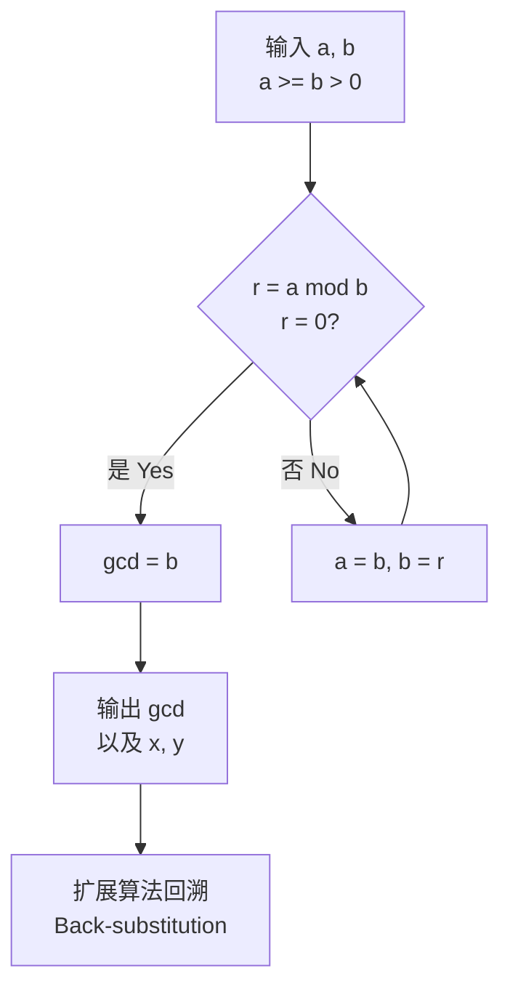

# 数论 (Number Theory)

> 数论是研究整数性质的纯数学分支，被誉为"数学的皇后"。其核心议题包括整除性、素数分布、同余方程、丢番图逼近以及解析与代数方法的应用。

## 整除性与带余除法 (Divisibility)

### 基本定义
对于整数 $a$ 和 $b$（$b \neq 0$），若存在整数 $k$ 使得 $a = bk$，则称 $b$ 整除 $a$，记作 $b \mid a$。

**带余除法**：对任意整数 $a$ 和正整数 $b$，存在唯一整数 $q$ 和 $r$ 满足：

$$
a = bq + r, \quad 0 \leq r < b
$$

### 最大公约数与欧几里得算法

**定义**：$\gcd(a, b)$ 表示同时整除 $a$ 和 $b$ 的最大正整数。

**欧几里得算法** (Euclidean Algorithm)：

$$
\gcd(a, b) = \gcd(b, a \bmod b)
$$

**扩展欧几里得算法**：求解 $ax + by = \gcd(a, b)$ 的整数解 $(x, y)$。



### 最小公倍数

$$
\operatorname{lcm}(a, b) = \frac{|ab|}{\gcd(a, b)}
$$

---

## 素数 (Prime Numbers)

### 定义与基本定理

**素数**是大于 1 且只有 1 和自身两个正因数的自然数。

**算术基本定理** (Fundamental Theorem of Arithmetic)：每个大于 1 的整数均可唯一分解为素数的乘积：

$$
n = p_1^{e_1} p_2^{e_2} \cdots p_k^{e_k}
$$

### 素数分布

| 范围 | 素数个数 | 密度 ≈ 1/ln n |
|------|---------|---------------|
| 1-100 | 25 | 0.217 |
| 1-1000 | 168 | 0.145 |
| 1-10⁶ | 78,498 | 0.072 |
| 1-10⁹ | 50,847,534 | 0.048 |

**素数定理** (Prime Number Theorem)：

$$
\pi(x) \sim \frac{x}{\ln x}
$$

其中 $\pi(x)$ 为不超过 $x$ 的素数个数。

### 素数检验 (Primality Testing)

| 算法 | 确定性 | 时间复杂度 | 说明 |
|------|-------|-----------|------|
| 试除法 (Trial Division) | 确定性 | $O(\sqrt{n})$ | 小素数适用 |
| 费马检验 (Fermat Test) | 概率性 | $O(k \log^3 n)$ | 伪素数可能通过 |
| Miller-Rabin | 概率性 | $O(k \log^3 n)$ | 最常用，$k$ 次测试错误率 $4^{-k}$ |
| AKS 算法 | 确定性 | $O(\log^6 n)$ | 首个多项式时间确定性算法 |

---

## 同余 (Congruences)

### 基本性质

$a \equiv b \pmod{m}$ 当且仅当 $m \mid (a - b)$。

同余运算保持加法和乘法：

$$
a \equiv b \pmod{m}, \; c \equiv d \pmod{m} \implies a + c \equiv b + d \pmod{m}, \; ac \equiv bd \pmod{m}
$$

### 中国剩余定理 (Chinese Remainder Theorem, CRT)

若 $m_1, m_2, \ldots, m_k$ 两两互素，则方程组：

$$
\begin{cases}
x \equiv a_1 \pmod{m_1} \\
x \equiv a_2 \pmod{m_2} \\
\quad \vdots \\
x \equiv a_k \pmod{m_k}
\end{cases}
$$

在模 $M = m_1 m_2 \cdots m_k$ 下有唯一解：

$$
x \equiv \sum_{i=1}^k a_i M_i y_i \pmod{M}
$$

其中 $M_i = M / m_i$，$y_i \equiv M_i^{-1} \pmod{m_i}$。

### 威尔逊定理 (Wilson's Theorem)

$$
p \text{ 是素数} \iff (p-1)! \equiv -1 \pmod{p}
$$

### 费马小定理 (Fermat's Little Theorem)

若 $p$ 为素数且 $p \nmid a$，则：

$$
a^{p-1} \equiv 1 \pmod{p}
$$

### 欧拉定理 (Euler's Theorem)

$$
a^{\varphi(n)} \equiv 1 \pmod{n}, \quad \gcd(a, n) = 1
$$

其中 $\varphi(n)$ 为欧拉函数，表示小于 $n$ 且与 $n$ 互质的正整数个数：

$$
\varphi(n) = n \prod_{p \mid n} \left(1 - \frac{1}{p}\right)
$$

---

## 原根与离散对数 (Primitive Roots & Discrete Logarithms)

### 原根定义
若 $\gcd(g, m) = 1$ 且 $g$ 模 $m$ 的阶为 $\varphi(m)$，则 $g$ 为模 $m$ 的原根（Primitive Root）。

原根的存在条件：$m = 2, 4, p^k, 2p^k$（$p$ 为奇素数）。

### 离散对数问题 (Discrete Logarithm Problem, DLP)

给定素数 $p$、原根 $g$ 和 $y \equiv g^x \pmod{p}$，求 $x$ 的问题称为 DLP。

DLP 的困难性是 Diffie-Hellman 密钥交换和 ElGamal 加密的安全性基础。

---

## 丢番图方程 (Diophantine Equations)

### 线性丢番图方程

$$
ax + by = c
$$

有整数解当且仅当 $\gcd(a, b) \mid c$。

### 勾股数 (Pythagorean Triples)

满足 $a^2 + b^2 = c^2$ 的正整数组 $(a, b, c)$ 可由下式生成：

$$
a = m^2 - n^2, \quad b = 2mn, \quad c = m^2 + n^2
$$

其中 $m > n > 0$，$\gcd(m, n) = 1$，$m, n$ 一奇一偶。

### 费马大定理 (Fermat's Last Theorem)

$$
x^n + y^n = z^n \quad (n > 2)
$$

无正整数解。由 Andrew Wiles 于 1994 年证明。

### Pell 方程

$$
x^2 - Dy^2 = 1
$$

其中 $D$ 为非平方正整数。最小解可通过连分数（Continued Fraction）展开 $\sqrt{D}$ 获得。

---

## 二次剩余 (Quadratic Residues)

### 勒让德符号 (Legendre Symbol)

$$
\left(\frac{a}{p}\right) = \begin{cases}
0 & p \mid a \\
1 & a \text{ 是模 } p \text{ 的二次剩余} \\
-1 & \text{否则}
\end{cases}
$$

### 二次互反律 (Quadratic Reciprocity)

对于奇素数 $p, q$：

$$
\left(\frac{p}{q}\right) \left(\frac{q}{p}\right) = (-1)^{\frac{p-1}{2} \cdot \frac{q-1}{2}}
$$

---

## RSA 加密算法 (RSA Cryptosystem)

### 算法流程

```mermaid
flowchart TD
    subgraph 密钥生成 Key Generation
        A[选择大素数 p, q<br/>Select p, q] --> B[n = p × q]
        B --> C[φ(n) = (p-1)(q-1)]
        C --> D[选择 e<br/>gcd(e, φ(n)) = 1]
        D --> E[d ≡ e⁻¹ mod φ(n)]
        E --> F[公钥: (n, e)<br/>私钥: (n, d)]
    end
    subgraph 加密解密 Encrypt/Decrypt
        G[明文 m<br/>m < n] --> H[c ≡ m^e mod n]
        H --> I[密文 c]
        I --> J[m ≡ c^d mod n]
        J --> K[恢复明文 m]
    end
    F --> H
    F --> J
```

### 安全性基础

RSA 的安全性基于大整数分解问题（Integer Factorization Problem, IFP）的难解性。给定 $n = pq$，恢复 $p$ 和 $q$ 在计算上不可行（目前记录为 RSA-250，829 位）。

### 数论在 RSA 中的应用

- **欧拉定理**：$m^{\varphi(n)} \equiv 1 \pmod{n}$ 保证解密正确
- **扩展欧几里得算法**：计算解密指数 $d$
- **中国剩余定理**：加速解密过程（CRT 可将速度提升约 4 倍）

---

## 解析数论 (Analytic Number Theory)

### 黎曼 ζ 函数 (Riemann Zeta Function)

$$
\zeta(s) = \sum_{n=1}^{\infty} \frac{1}{n^s}, \quad \operatorname{Re}(s) > 1
$$

**欧拉乘积公式**：

$$
\zeta(s) = \prod_{p \text{ prime}} \frac{1}{1 - p^{-s}}
$$

**黎曼猜想** (Riemann Hypothesis)：$\zeta(s)$ 的所有非平凡零点均位于 $\operatorname{Re}(s) = 1/2$ 直线上。这是数学史上最重要的未解决问题之一。

### 哥德巴赫猜想 (Goldbach's Conjecture)

每个大于 2 的偶数均可表示为两个素数之和。尚未证明，但已验证至 $4 \times 10^{18}$。

---

### 相关条目
- [[02_NaturalSciences/Mathematics/NumberTheory/INDEX|Mathematics/NumberTheory 索引]]
- [[02_NaturalSciences/Mathematics/AbstractAlgebra/AbstractAlgebra|抽象代数]]
- [[02_NaturalSciences/Mathematics/AppliedMathematics/Cryptography|密码学]]
- [[INDEX|当前目录索引]]
