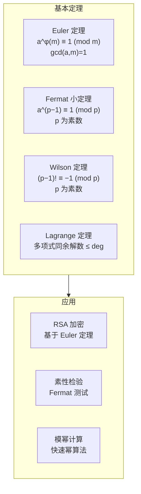
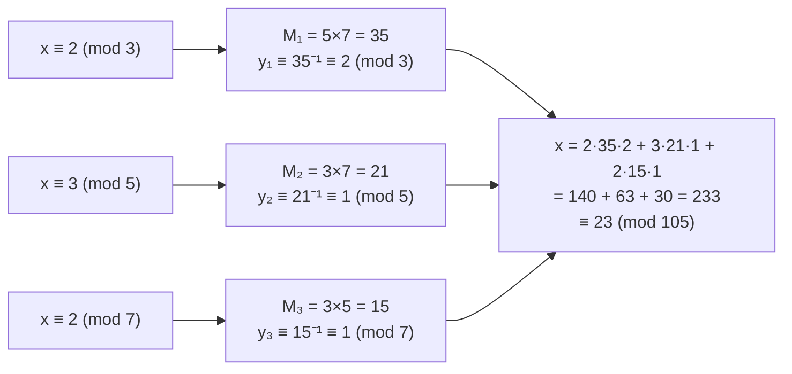

---
aliases:
  - Modular Arithmetic
  - Congruence
  - 同余与模运算
  - CRT
tags:
  - mathematics
  - number_theory
  - modular_arithmetic
  - congruences
---

# 同余与模运算

## 概述

同余 (Congruence) 是数论中最基本的等价关系之一。模运算 (Modular Arithmetic) 在时钟算术、密码学、计算机科学中有广泛而深刻的应用。

## 同余的基本概念

### 定义

设 $m$ 为正整数。若 $m \mid (a - b)$，则称 $a$ 与 $b$ 模 $m$ 同余，记为：

$$ a \equiv b \pmod{m} $$

### 基本性质

$$ a \equiv b \pmod{m} \iff a = b + km, \quad k \in \mathbb{Z} $$

| 性质 | 表达式 |
|------|--------|
| 自反性 | $a \equiv a \pmod{m}$ |
| 对称性 | $a \equiv b \pmod{m} \implies b \equiv a \pmod{m}$ |
| 传递性 | $a \equiv b \pmod{m},\; b \equiv c \pmod{m} \implies a \equiv c \pmod{m}$ |

### 运算规则

若 $a \equiv b \pmod{m}$，$c \equiv d \pmod{m}$，则：

$$ a \pm c \equiv b \pm d \pmod{m} $$

$$ a \cdot c \equiv b \cdot d \pmod{m} $$

$$ a^n \equiv b^n \pmod{m} $$

## 完全剩余系与简化剩余系

完全剩余系 (Complete Residue System)：模 $m$ 的 $m$ 个不同剩余类中各取一个代表元。

简化剩余系 (Reduced Residue System)：与 $m$ 互素的剩余类中的代表元，共 $\varphi(m)$ 个。

## Euler 定理与 Fermat 小定理

### Euler 定理

若 $\gcd(a, m) = 1$，则：

$$ a^{\varphi(m)} \equiv 1 \pmod{m} $$

其中 $\varphi$ 为 Euler  totient 函数。

### Fermat 小定理

若 $p$ 为素数且 $p \nmid a$，则：

$$ a^{p-1} \equiv 1 \pmod{p} $$

Fermat 小定理是 Euler 定理在模数为素数时的特例。

## 中国剩余定理 (CRT)

### 经典 CRT

设 $m_1, m_2, \ldots, m_k$ 两两互素，则对任意 $a_i$，同余方程组：

$$
\begin{cases}
x \equiv a_1 \pmod{m_1} \\
x \equiv a_2 \pmod{m_2} \\
\vdots \\
x \equiv a_k \pmod{m_k}
\end{cases}
$$

在模 $M = m_1 m_2 \cdots m_k$ 下有唯一解：

$$ x \equiv \sum_{i=1}^k a_i M_i y_i \pmod{M} $$

其中 $M_i = M/m_i$，$y_i$ 是 $M_i$ 模 $m_i$ 的逆元（即 $M_i y_i \equiv 1 \pmod{m_i}$）。

### 算法示例

### CRT 的推广

- 不互素模数的 CRT：模数有公因子时解存在的充要条件
- 多项式 CRT：在多项式环 $F[x]$ 上的类似结果
- Garner 算法：高效实现 CRT 的计算机算法

## 模逆元 (Modular Inverse)

### 存在性

$a$ 模 $m$ 的逆元存在当且仅当 $\gcd(a, m) = 1$。

### 计算方法

#### 扩展 Euclid 算法

求解 $ax + my = 1$，则 $x$ 即为 $a$ 模 $m$ 的逆元。

#### Euler 定理法

$$ a^{-1} \equiv a^{\varphi(m)-1} \pmod{m} $$

## 模幂运算

### 快速幂算法 (Exponentiation by Squaring)

$$ a^n \bmod m = \begin{cases}
1 & n = 0 \\
(a^{n/2})^2 \bmod m & n \text{ 为偶} \\
a \cdot (a^{(n-1)/2})^2 \bmod m & n \text{ 为奇}
\end{cases} $$

时间复杂度 $O(\log n)$。

## 高阶同余

### 一次同余方程

$$ ax \equiv b \pmod{m} $$

解存在当且仅当 $d = \gcd(a, m) \mid b$，此时有 $d$ 个解。

### 二次剩余 (Quadratic Residue)

$a$ 为模 $p$ 的二次剩余当且仅当存在 $x$ 使得 $x^2 \equiv a \pmod{p}$。

Legendre 符号：

$$ \left(\frac{a}{p}\right) = a^{\frac{p-1}{2}} \bmod p $$

$$ \left(\frac{a}{p}\right) = \begin{cases}
1 & a \text{ 是二次剩余} \\
-1 & a \text{ 是二次非剩余} \\
0 & p \mid a
\end{cases} $$

### 离散对数 (Discrete Logarithm)

求解 $g^x \equiv h \pmod{p}$ 中的 $x$。这是许多密码系统的安全性基础。

## 应用

- **RSA 加密体制**：模幂运算与 Euler 定理
- **Diffie-Hellman 密钥交换**：离散对数问题
- **ElGamal 加密**：基于离散对数
- **哈希函数**：模运算用于压缩映射
- **校验和**：模运算检测传输错误

## 参考文献

1. Hardy, G. H. & Wright, E. M. *An Introduction to the Theory of Numbers*. Oxford.
2. Rosen, K. H. *Elementary Number Theory and Its Applications*. Pearson.
3. Shoup, V. *A Computational Introduction to Number Theory and Algebra*. Cambridge.
