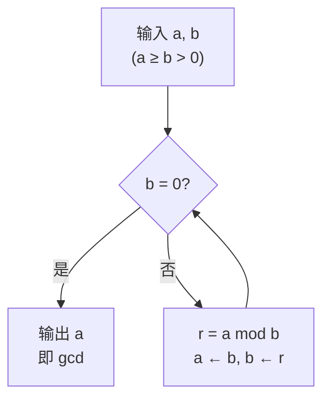
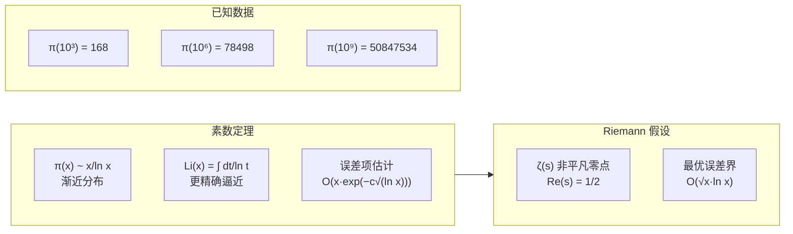

---
aliases:
  - Prime Distribution
  - Divisibility
  - 素数分布与整除理论
  - Prime Number Theorem
tags:
  - mathematics
  - number_theory
  - primes
  - divisibility
  - zeta_function
---

# 素数分布与整除理论

## 概述

素数分布 (Prime Distribution) 研究素数在自然数中的排列规律。整除理论 (Divisibility Theory) 是数论的基础，涉及整数的乘法结构和因子分解。两者在数论、密码学和计算数学中居核心地位。

## 整除的基本理论

### 定义与性质

$a \mid b$ 表示存在整数 $k$ 使得 $b = ak$。

| 性质 | 描述 |
|------|------|
| 传递性 | $a \mid b,\; b \mid c \implies a \mid c$ |
| 线性组合 | $a \mid b,\; a \mid c \implies a \mid (bx + cy)$ |
| 有界性 | $a \mid b,\; b \neq 0 \implies |a| \leq |b|$ |

### 带余除法 (Division Algorithm)

对任意整数 $a, b$（$b > 0$），存在唯一整数 $q, r$ 满足：

$$ a = bq + r, \quad 0 \leq r < b $$

## 最大公因数与 Euclid 算法

### 最大公因数 (GCD)

$$ \gcd(a, b) = \max\{d : d \mid a \text{ 且 } d \mid b\} $$

### Euclid 算法

$$ \gcd(a, b) = \gcd(b, a \bmod b) $$

### 扩展 Euclid 算法

求解 $ax + by = \gcd(a, b)$ 的整数解 $(x, y)$。

### 最小公倍数 (LCM)

$$ \text{lcm}(a, b) = \frac{|ab|}{\gcd(a, b)} $$

## 算术基本定理

### 唯一因子分解定理

每个大于 1 的整数可以唯一分解为素数幂的乘积：

$$ n = p_1^{\alpha_1} p_2^{\alpha_2} \cdots p_k^{\alpha_k} $$

其中 $p_1 < p_2 < \cdots < p_k$ 为素数，$\alpha_i > 0$。

### 标准分解式的应用

$$ \gcd(a, b) = \prod p_i^{\min(\alpha_i, \beta_i)} $$

$$ \text{lcm}(a, b) = \prod p_i^{\max(\alpha_i, \beta_i)} $$

$$ d(n) = \prod (\alpha_i + 1) $$

$$ \sigma(n) = \prod \frac{p_i^{\alpha_i+1} - 1}{p_i - 1} $$

其中 $d(n)$ 为除数函数，$\sigma(n)$ 为因子和函数。

## 素数分布

### 素数定理 (Prime Number Theorem)

$$ \pi(x) \sim \frac{x}{\ln x} $$

其中 $\pi(x)$ 为不超过 $x$ 的素数个数。更精确的形式：

$$ \pi(x) = \text{Li}(x) + O\left(x e^{-c\sqrt{\ln x}}\right) $$

其中 $\text{Li}(x) = \int_2^x \frac{dt}{\ln t}$ 为对数积分。

### Riemann Zeta 函数

$$ \zeta(s) = \sum_{n=1}^{\infty} \frac{1}{n^s} = \prod_{p \text{ prime}} \frac{1}{1 - p^{-s}}, \quad \text{Re}(s) > 1 $$

解析延拓到整个复平面（$s \neq 1$）。

### Euler 乘积公式

$$ \zeta(s) = \prod_{p} \frac{1}{1 - p^{-s}} $$

素数定理与 $\zeta(s)$ 在 $\text{Re}(s) = 1$ 上无零点等价。

### Riemann 假设 (RH)

$\zeta(s)$ 的所有非平凡零点位于 $\text{Re}(s) = \frac{1}{2}$ 的临界线上。

若 RH 成立，则素数定理的最优误差为：

$$ \pi(x) = \text{Li}(x) + O(\sqrt{x} \ln x) $$

## 特殊素数

### Mersenne 素数

形如 $M_p = 2^p - 1$ 的素数，其中 $p$ 为素数。

### Fermat 素数

形如 $F_n = 2^{2^n} + 1$ 的素数。目前已知仅 $n = 0,1,2,3,4$。

### 孪生素数 (Twin Primes)

相差为 2 的素数对，如 $(3, 5), (11, 13), (17, 19)$。

孪生素数猜想：存在无穷多对孪生素数。

## 素数测试与因子分解

### 素性检验

- 试除法：$O(\sqrt{n})$，对小整数有效
- Miller-Rabin 测试：概率算法
- AKS 素性测试：第一个确定性的多项式时间算法，$O(\log^{6} n)$

### 整数分解算法

| 算法 | 时间复杂度 | 特点 |
|------|-----------|------|
| Pollard ρ | $O(n^{1/4})$ | 适用于中等整数 |
| Pollard p-1 | $O(B \log n)$ | 依赖光滑性 |
| 二次筛法 (QS) | $\exp(O(\sqrt{\log n \log \log n}))$ | 历史重要 |
| 数域筛法 (NFS) | 亚指数时间 | 对大整数最优 |

## 应用

- **RSA 密码体制**：依赖大整数因子分解困难性
- **Diffie-Hellman 密钥交换**：安全素数生成
- **哈希函数**：素数用于置乱和均匀分布
- **伪随机数生成**：线性同余生成器使用大素数模数
- **编码理论**：中国剩余定理用于纠错码

## 参考文献

1. Hardy, G. H. & Wright, E. M. *An Introduction to the Theory of Numbers*. Oxford.
2. Ireland, K. & Rosen, M. *A Classical Introduction to Modern Number Theory*. Springer.
3. Edwards, H. M. *Riemann's Zeta Function*. Dover.
4. Crandall, R. & Pomerance, C. *Prime Numbers: A Computational Perspective*. Springer.
