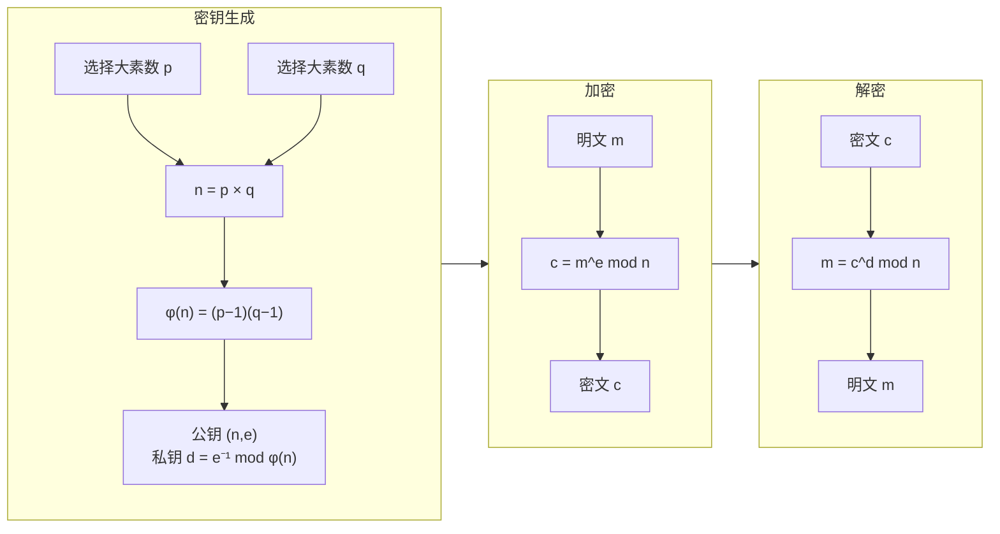

---
aliases:
  - Analytic Number Theory
  - Cryptography
  - 解析数论与密码学
  - L-functions
tags:
  - mathematics
  - number_theory
  - analytic_number_theory
  - cryptography
  - elliptic_curves
---

# 解析数论与密码学

## 概述

解析数论 (Analytic Number Theory) 使用复分析、实分析和调和分析的工具研究整数问题。密码学 (Cryptography) 利用数论中的困难问题构造安全通信协议。两者的交汇深刻影响了现代信息安全。

## Dirichlet 级数与 L-函数

### Dirichlet 级数

$$ L(s, \chi) = \sum_{n=1}^{\infty} \frac{\chi(n)}{n^s} $$

其中 $\chi$ 为 Dirichlet 特征。

### Dirichlet 特征

模 $m$ 的 Dirichlet 特征是群 $(\mathbb{Z}/m\mathbb{Z})^\times$ 到 $\mathbb{C}^\times$ 的乘法同态。

主特征：

$$ \chi_0(n) = \begin{cases}
1 & \gcd(n, m) = 1 \\
0 & \gcd(n, m) > 1
\end{cases} $$

### 函数方程 (Functional Equation)

Dirichlet L-函数满足函数方程，将 $s$ 与 $1-s$ 联系起来：

$$ \Lambda(s, \chi) = \epsilon(\chi) \Lambda(1-s, \bar{\chi}) $$

其中 $\Lambda$ 为完备化的 L-函数，$\epsilon(\chi)$ 为根数。

```mermaid
graph TD
  subgraph DL["Dirichlet L-函数"]
    def["L(s, χ) = Σ χ(n)/n^s<br/>Re(s) > 1"]
    cont["解析延拓<br/>到整个复平面"]
    fe["函数方程<br/>s ↔ 1−s"]
    zeros["零点分布<br/>广义 Riemann 假设"]
  end

  subgraph App["数论应用"]
    arith["算术级数<br/>中的素数"]
    class["类数公式<br/>二次域"]
    density["Chebotarev<br/>密度定理"]
  end

  DL --> App
```

### Dirichlet 定理

若 $\gcd(a, d) = 1$，则算术级数 $a, a+d, a+2d, \ldots$ 中包含无穷多素数。

证明基于 L-函数在 $s = 1$ 处非零的事实。

## Riemann Zeta 函数深探

### 解析延拓

$$ \zeta(s) = \frac{1}{s-1} + \sum_{n=1}^{\infty} \frac{(-1)^n}{n!} \gamma_n (s-1)^n $$

其中 $\gamma_n$ 为 Stieltjes 常数。

### 零点分布

- 平凡零点：$s = -2, -4, -6, \ldots$
- 非平凡零点：位于 $0 < \text{Re}(s) < 1$ 的临界带中

### 显式公式 (Explicit Formula)

$$ \psi(x) = x - \sum_{\rho} \frac{x^\rho}{\rho} - \frac{\zeta'(0)}{\zeta(0)} - \frac{1}{2} \ln\left(1 - \frac{1}{x^2}\right) $$

其中 $\psi(x) = \sum_{p^k \leq x} \ln p$ 为 Chebyshev 函数，求和遍历所有非平凡零点 $\rho$。

## RSA 密码体制

### 密钥生成

1. 选择两个大素数 $p, q$
2. 计算 $n = pq$，$\varphi(n) = (p-1)(q-1)$
3. 选择 $e$ 满足 $1 < e < \varphi(n)$，$\gcd(e, \varphi(n)) = 1$
4. 计算 $d \equiv e^{-1} \pmod{\varphi(n)}$

公钥为 $(n, e)$，私钥为 $(d)$。

### 加密与解密

$$ c \equiv m^e \pmod{n} $$

$$ m \equiv c^d \pmod{n} $$

### 安全性

RSA 的安全性基于大整数因子分解的困难性。目前 2048 位 RSA 被认为安全。



### 攻击方法

- 因子分解攻击：数域筛法 (NFS)
- 低指数攻击：$e$ 过小时的 Coppersmith 攻击
- 时序攻击：测量解密时间的侧信道攻击
- 选择密文攻击：OAEP 填充防范

## 椭圆曲线密码学 (ECC)

### 椭圆曲线定义

$$ y^2 = x^3 + ax + b, \quad 4a^3 + 27b^2 \neq 0 $$

### 群结构

椭圆曲线上的点构成 Abel 群：

- 单位元：无穷远点 $\mathcal{O}$
- 逆元：$-(x, y) = (x, -y)$
- 加法：弦切律定义

### ECDLP

给定 $G$ 和 $Q = kG$，求 $k$。椭圆曲线离散对数问题 (ECDLP) 目前无亚指数时间算法。

### ECDH 密钥交换

1. Alice 选择私钥 $a$，发送 $aG$ 给 Bob
2. Bob 选择私钥 $b$，发送 $bG$ 给 Alice
3. 共享密钥：$K = abG$

## 格密码学 (Lattice-based Cryptography)

### 格 (Lattice)

$$ \mathcal{L} = \left\{ \sum_{i=1}^n x_i b_i : x_i \in \mathbb{Z} \right\} $$

### 困难问题

- 最短向量问题 (SVP)
- 最近向量问题 (CVP)
- Learning With Errors (LWE)

### 后量子密码

格密码抵抗量子计算机攻击，是 NIST 后量子密码标准化的主要方向。

## 应用与展望

| 密码体制 | 安全性基础 | 量子抵抗 |
|----------|-----------|---------|
| RSA | 大整数分解 | 否 (Shor 算法) |
| ECC | ECDLP | 否 (Shor 算法) |
| 格密码 | SVP/LWE | 是 |
| 基于哈希签名 | 哈希函数安全性 | 是 |
| 同态加密 | 格或编码问题 | 部分 |

## 参考文献

1. Montgomery, H. L. & Vaughan, R. C. *Multiplicative Number Theory I*. Cambridge.
2. Iwaniec, H. & Kowalski, E. *Analytic Number Theory*. AMS.
3. Katz, J. & Lindell, Y. *Introduction to Modern Cryptography*. CRC Press.
4. Silverman, J. H. *The Arithmetic of Elliptic Curves*. Springer.
5. Shor, P. W. *Polynomial-Time Algorithms for Prime Factorization and Discrete Logarithms on a Quantum Computer*. SIAM J. Comput.
