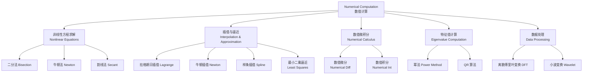

---
aliases: [NumericalComputation]
tags: ['Mathematics/NumericalComputation', 'ScientificComputing']
---

# NumericalComputation

## 概述 (Overview)

数值计算 (Numerical Computation) 研究利用计算机近似求解数学问题的理论和实现方法。当解析解不存在或求解过于复杂时，数值方法提供了可行的替代方案。主要关注数值精度、算法效率和收敛性，涵盖数值逼近、数值微积分、方程求根和优化计算等领域。

## 数值计算核心领域

## 非线性方程求解 (Nonlinear Equations)

求 $f(x) = 0$ 的根，其中 $f: \mathbb{R} \to \mathbb{R}$ 为连续函数。

### 二分法 (Bisection Method)

若 $f(a) \cdot f(b) < 0$，则区间 $[a, b]$ 内存在根。每次取中点 $c = (a + b)/2$，缩小区间一半：

$$c_n = \frac{a_n + b_n}{2}, \quad |c_n - r| \leq \frac{b - a}{2^n}$$

### 牛顿法 (Newton's Method)

在点 $x_n$ 处线性化 $f(x) \approx f(x_n) + f'(x_n)(x - x_n)$，令其为 0：

$$x_{n+1} = x_n - \frac{f(x_n)}{f'(x_n)}$$

收敛阶为二次 (Quadratic Convergence)，前提是 $f'(r) \neq 0$ 且初始点充分接近根：

$$|x_{n+1} - r| \leq C |x_n - r|^2$$

### 割线法 (Secant Method)

用差商近似导数，避免计算 $f'(x)$：

$$x_{n+1} = x_n - f(x_n) \cdot \frac{x_n - x_{n-1}}{f(x_n) - f(x_{n-1})}$$

收敛阶为黄金分割比 $\phi \approx 1.618$。

| 方法 | 收敛阶 | 每步计算量 | 需要导数 |
|------|-------|-----------|---------|
| 二分法 | 线性 | 1 个函数值 | 否 |
| 牛顿法 | 2（二次） | 1 个函数 + 1 个导数值 | 是 |
| 割线法 | $\approx 1.618$ | 1 个函数值 | 否 |
| 逆二次插值 | $\approx 1.839$ | 1 个函数值 | 否 |

## 插值与逼近 (Interpolation and Approximation)

### Lagrange 插值

给定 $n+1$ 个节点 $\{(x_i, y_i)\}_{i=0}^n$ 的 $n$ 次插值多项式：

$$L_n(x) = \sum_{i=0}^n y_i \prod_{\substack{j=0 \\ j \neq i}}^n \frac{x - x_j}{x_i - x_j}$$

插值余项 (Interpolation Error)：
$$R_n(x) = f(x) - L_n(x) = \frac{f^{(n+1)}(\xi)}{(n+1)!} \prod_{i=0}^n (x - x_i)$$

其中 $\xi \in (a, b)$ 依赖于 $x$。当节点均匀分布时，高次插值可能出现 Runge 现象。

### 样条插值 (Spline Interpolation)

三次样条 (Cubic Spline) $S(x)$ 在每个子区间上是三次多项式，在节点处具有 $C^2$ 连续性。其构造满足三对角系统：

$$h_i m_{i-1} + 2(h_i + h_{i+1}) m_i + h_{i+1} m_{i+1} = 6(f[x_i, x_{i+1}] - f[x_{i-1}, x_i])$$

其中 $h_i = x_{i+1} - x_i$，$m_i = S''(x_i)$ 为二阶导数。

### 最小二乘逼近 (Least Squares Approximation)

对数据点 $\{(x_i, y_i)\}_{i=1}^m$ 拟合 $n$ 次多项式 ($n \ll m$)：

$$\min_{\mathbf{a}} \sum_{i=1}^m \left( y_i - \sum_{j=0}^n a_j x_i^j \right)^2$$

法方程 (Normal Equations)：
$$X^T X \mathbf{a} = X^T \mathbf{y}$$

其中 $X_{ij} = x_i^j$ 为 Vandermonde 矩阵。为避免病态，通常使用正交多项式基。

## 数值积分 (Numerical Integration)

目标：近似计算 $I(f) = \int_a^b f(x) \, dx$。

### Newton-Cotes 公式

在等距节点上构造插值型求积公式：

$$\int_a^b f(x) \, dx \approx \sum_{i=0}^n w_i f(x_i)$$

**梯形法则 (Trapezoidal Rule)**：$n=1$
$$\int_a^b f(x) \, dx \approx \frac{b - a}{2} [f(a) + f(b)], \quad \text{误差 } O(h^2)$$

**Simpson 法则**：$n=2$
$$\int_a^b f(x) \, dx \approx \frac{b - a}{6} \left[ f(a) + 4f\left(\frac{a+b}{2}\right) + f(b) \right], \quad \text{误差 } O(h^4)$$

### Gauss 求积 (Gaussian Quadrature)

选择最优节点和权值，使代数精度达到 $2n-1$：

$$\int_a^b f(x) \omega(x) \, dx \approx \sum_{i=1}^n w_i f(x_i)$$

节点 $x_i$ 是正交多项式的根，权值 $w_i$ 通过求解线性系统确定。Gauss-Legendre 求积公式在 $[-1, 1]$ 上的节点为 Legendre 多项式的零点。

### 复化求积 (Composite Quadrature)

将区间 $[a, b]$ 分为 $n$ 个子区间，在各子区间上应用低阶公式：

**复化 Simpson**：
$$\int_a^b f(x) \, dx \approx \frac{h}{3} \left[ f(a) + f(b) + 4\sum_{i=1}^{n} f(a + (2i-1)h) + 2\sum_{i=1}^{n-1} f(a + 2ih) \right]$$

其中 $h = (b - a) / (2n)$，误差阶为 $O(h^4)$。

## 数值微分 (Numerical Differentiation)

基于 Taylor 展开构造差分公式：

**前向差分 (Forward Difference)**：
$$f'(x) \approx \frac{f(x+h) - f(x)}{h} + O(h)$$

**中心差分 (Central Difference)**：
$$f'(x) \approx \frac{f(x+h) - f(x-h)}{2h} + O(h^2)$$

**二阶导数中心差分**：
$$f''(x) \approx \frac{f(x+h) - 2f(x) + f(x-h)}{h^2} + O(h^2)$$

## 矩阵计算 (Matrix Computation)

### 迭代法解线性系统

对于 $A x = b$，Krylov 子空间方法构造：
$$\mathcal{K}_k(A, r_0) = \text{span}\{ r_0, A r_0, A^2 r_0, \dots, A^{k-1} r_0 \}$$

**GMRES**：最小化残差的 $\ell_2$ 范数：
$$x_k = \arg\min_{x \in x_0 + \mathcal{K}_k} \|b - A x\|_2$$

### 奇异值分解 (SVD)

任何矩阵 $A \in \mathbb{R}^{m \times n}$ 可分解为：
$$A = U \Sigma V^T = \sum_{i=1}^r \sigma_i u_i v_i^T$$

其中 $U$ 和 $V$ 为正交矩阵，$\Sigma = \text{diag}(\sigma_1, \sigma_2, \dots, \sigma_r)$，$\sigma_1 \geq \sigma_2 \geq \dots \geq \sigma_r > 0$。

SVD 用于矩阵低秩近似 (Eckart-Young 定理)：
$$\|A - A_k\|_F = \sqrt{\sum_{i=k+1}^r \sigma_i^2}, \quad A_k = \sum_{i=1}^k \sigma_i u_i v_i^T$$

## 外推与加速 (Extrapolation and Acceleration)

### Richardson 外推

对于步长为 $h$ 的近似 $F(h)$，若其误差展开为：

$$ F(h) = L + c_1 h^p + c_2 h^{p+1} + \cdots $$

则通过两个不同步长的结果组合消除主误差项：

$$ L = \frac{2^p F(h/2) - F(h)}{2^p - 1} + O(h^{p+1}) $$

### Romberg 积分

在复化梯形法则的基础上应用 Richardson 外推构造高精度积分公式。记 $T(h)$ 为步长 $h$ 的复化梯形值：

$$ T_1^{(k)} = T(h_k), \quad h_k = \frac{b-a}{2^{k-1}} $$
$$ T_{m+1}^{(k)} = \frac{4^m T_m^{(k+1)} - T_m^{(k)}}{4^m - 1} $$

Romberg 表 (Romberg Table) 的每列消除更高阶误差，对角线项为高精度近似。

## 自适应求积 (Adaptive Quadrature)

自适应 Simpson 法递归细分区间直到误差估计满足容忍度：

$$ |S(a, b) - S(a, m) - S(m, b)| < 15 \cdot \text{tol} $$

其中 $S(a, b)$ 为区间 $[a, b]$ 上的 Simpson 值，$m = (a+b)/2$。误差估计基于 Simpson 值的精度差。

## 常微分方程数值解 (Numerical ODE)

### 多步法 (Multi-step Methods)

**Adams-Bashforth 方法**（显式）：
$$ y_{n+1} = y_n + h \sum_{j=0}^{k-1} \beta_j f(t_{n-j}, y_{n-j}) $$

四阶 Adams-Bashforth：
$$ y_{n+1} = y_n + \frac{h}{24} (55 f_n - 59 f_{n-1} + 37 f_{n-2} - 9 f_{n-3}) $$

**Adams-Moulton 方法**（隐式）：
$$ y_{n+1} = y_n + h \sum_{j=0}^{k-1} \beta_j^* f(t_{n+1-j}, y_{n+1-j}) $$

四阶 Adams-Moulton：
$$ y_{n+1} = y_n + \frac{h}{24} (9 f_{n+1} + 19 f_n - 5 f_{n-1} + f_{n-2}) $$

隐式方法通常更稳定，但需要在每个步骤中求解非线性方程。实际使用中常用预测-校正模式 (Predictor-Corrector)，先显式预测再隐式校正。

### 刚性方程 (Stiff Equations)

刚性系统的特征值 $\lambda$ 满足 $\text{Re}(\lambda) \ll 0$ 且比值 $\max |\text{Re}(\lambda)| / \min |\text{Re}(\lambda)|$ 很大。显式方法求解刚性方程时步长受稳定性限制。

**A-稳定 (A-Stability)**：若数值方法对 $\text{Re}(h\lambda) < 0$ 绝对稳定，则称该方法是 A-稳定的。后向 Euler 和隐式 Runge-Kutta 方法具有 A-稳定性。

后向 Euler 方法：
$$ y_{n+1} = y_n + h f(t_{n+1}, y_{n+1}) $$

### 稳定性区域分析

线性测试方程 $y' = \lambda y$ 的稳定性条件：
$$ |R(z)| \leq 1, \quad z = h\lambda $$

对于 Runge-Kutta 方法，$R(z)$ 是稳定性函数 (Stability Function)：

$$ R(z) = \frac{P(z)}{Q(z)} = \frac{\det(I - zA + z e b^T)}{\det(I - zA)} $$

其中 $(A, b, c)$ 是 Butcher 表 (Butcher Tableau) 中的系数。

## 预处理技术 (Preconditioning)

对线性系统 $A x = b$ 使用预处理矩阵 $M$，将问题转化为：

$$ M^{-1} A x = M^{-1} b $$

或等价地求解：
$$ (L^{-1} A U^{-1}) (U x) = L^{-1} b, \quad M = LU $$

有效预处理 $M \approx A^{-1}$ 的条件数 $\kappa(M^{-1}A) \ll \kappa(A)$，且 $M$ 的构造和求解计算代价低。常见预处理包括 Jacobi、SSOR、不完全 Cholesky 分解 (IC) 和不完全 LU 分解 (ILU)。

## 相关主题

- [[ComputationalMathematics]] 中的算法理论基础
- [[ComputationalGeometry]] 中的几何算法
- [[Polynomial]] 中的多项式求值与插值
