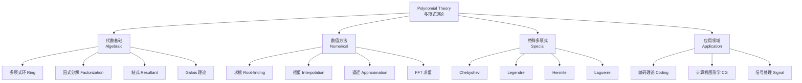

---
aliases: [Polynomial]
tags: ['Mathematics/Polynomial', 'Algebra']
---

# Polynomial

## 概述 (Overview)

多项式 (Polynomial) 是代数学中最基本的研究对象之一，由变量和系数通过加法、减法和乘法构成。多项式理论在现代数学中具有基础性地位，从多项式方程求根到多项式环的结构理论，多项式在代数几何、数论、数值分析和编码理论中都有广泛应用。

## 多项式基础

一个一元多项式的一般形式：

$$P(x) = a_n x^n + a_{n-1} x^{n-1} + \cdots + a_1 x + a_0 = \sum_{k=0}^n a_k x^k$$

其中 $a_k$ 是系数 (Coefficients)，$n$ 是次数 (Degree)，记作 $\deg P = n$，$a_n$ 是首项系数 (Leading Coefficient)。

### 多项式的运算

多项式加法和乘法构成一个环 (Ring)。多项式环记作 $R[x]$，其中 $R$ 是系数的环。

多项式除法：对于 $P(x), Q(x) \neq 0$，存在唯一的 $S(x)$ 和 $R(x)$ 满足：
$$P(x) = Q(x) \cdot S(x) + R(x),\quad \deg R < \deg Q$$

## 多项式理论组成

## 多项式环与理想 (Polynomial Rings and Ideals)

### 唯一分解整环

$F[x]$ 是唯一分解整环 (UFD, Unique Factorization Domain)，每个非常数多项式可唯一分解为不可约多项式的乘积：

$$P(x) = c \cdot p_1(x)^{e_1} p_2(x)^{e_2} \cdots p_k(x)^{e_k}$$

其中 $c$ 为常数，$p_i(x)$ 为首一不可约多项式 (Monic Irreducible Polynomial)。

### 根与重数 (Roots and Multiplicity)

若 $P(r) = 0$，则 $r$ 是 $P$ 的根。若 $(x - r)^m \mid P(x)$ 但 $(x - r)^{m+1} \nmid P(x)$，则 $m$ 为重数 (Multiplicity)。代数基本定理 (Fundamental Theorem of Algebra)：

$$\text{每个 } n \text{ 次复系数多项式恰有 } n \text{ 个复根（计重数）}$$

$$P(x) = a_n \prod_{k=1}^n (x - r_k)$$

Vieta 公式给出根与系数的关系：
$$\sum_{i=1}^n r_i = -\frac{a_{n-1}}{a_n},\quad \sum_{i<j} r_i r_j = \frac{a_{n-2}}{a_n},\quad \prod_{i=1}^n r_i = (-1)^n \frac{a_0}{a_n}$$

## 多项式求根方法 (Root-finding Methods)

| 方法 | 适用范围 | 特点 |
|------|---------|------|
| 求根公式 | 次数 $\leq 4$ | 精确解，次数 $\geq 5$ 无根式解 |
| Newton 法 | 任意次数 | 局部二次收敛，需初始值 |
| Durand-Kerner | 任意次数 | 同时逼近所有根，全局收敛 |
| 伴随矩阵法 | 任意次数 | 转化为特征值问题 $A v = \lambda v$ |
| Sturm 序列 | 实根隔离 | 判定实区间内根的个数 |

伴随矩阵 (Companion Matrix)：多项式 $P(x) = x^n + a_{n-1} x^{n-1} + \cdots + a_0$ 的伴随矩阵的特征值即为多形式的根：

$$C(P) = \begin{pmatrix}
0 & 0 & \cdots & 0 & -a_0 \\
1 & 0 & \cdots & 0 & -a_1 \\
0 & 1 & \cdots & 0 & -a_2 \\
\vdots & \vdots & \ddots & \vdots & \vdots \\
0 & 0 & \cdots & 1 & -a_{n-1}
\end{pmatrix}$$

$$\det(xI - C(P)) = P(x)$$

## 正交多项式 (Orthogonal Polynomials)

在区间 $[a, b]$ 上带权 $\omega(x)$ 正交的多项式族 $\{p_n(x)\}$ 满足：

$$\int_a^b p_m(x) p_n(x) \omega(x) \, dx = 0, \quad m \neq n$$

所有正交多项式满足三递推关系 (Three-term Recurrence)：
$$p_{n+1}(x) = (x - \alpha_n) p_n(x) - \beta_n p_{n-1}(x)$$

### 经典正交多项式

| 名称 | 区间 | 权函数 $\omega(x)$ | 应用 |
|------|------|-------------------|------|
| Legendre | $[-1, 1]$ | $1$ | Gauss 求积 |
| Chebyshev (第一类) | $[-1, 1]$ | $(1-x^2)^{-1/2}$ | 最佳逼近 |
| Chebyshev (第二类) | $[-1, 1]$ | $(1-x^2)^{1/2}$ | 数值积分 |
| Laguerre | $[0, \infty)$ | $e^{-x}$ | 半无限区间 |
| Hermite | $(-\infty, \infty)$ | $e^{-x^2}$ | 概率论、量子力学 |

### Chebyshev 多项式

第一类 Chebyshev 多项式定义为：
$$T_n(x) = \cos(n \arccos x), \quad x \in [-1, 1]$$

递推式：$T_0(x) = 1$，$T_1(x) = x$，$T_{n+1}(x) = 2x T_n(x) - T_{n-1}(x)$

Chebyshev 多项式在 $[-1, 1]$ 上的极值性质：在所有首一 $n$ 次多项式中，$2^{1-n} T_n(x)$ 的最大绝对值最小。

其根（Chebyshev 节点）为：
$$x_k = \cos\left(\frac{2k-1}{2n} \pi\right), \quad k = 1, 2, \dots, n$$

用于多项式插值可有效避免 Runge 现象。

## 结式与判别式 (Resultant and Discriminant)

两个多项式的结式 $ \text{Res}(P, Q) $ 用于判定它们是否有公共根：

$$\text{Res}(P, Q) = a_n^m \prod_{i=1}^n Q(r_i) = (-1)^{mn} b_m^n \prod_{j=1}^m P(s_j)$$

其中 $r_i$ 和 $s_j$ 分别为 $P$ 和 $Q$ 的根，$n = \deg P$，$m = \deg Q$。

判别式 (Discriminant) 用于判定多项式是否有重根：
$$\Delta(P) = a_n^{2n-2} \prod_{i < j} (r_i - r_j)^2$$

当 $\Delta(P) = 0$ 时多项式有重根。对于二次多项式 $ax^2 + bx + c$：
$$\Delta = b^2 - 4ac$$

## 多项式插值 (Polynomial Interpolation)

给定 $n+1$ 个点 $(x_i, y_i)$ 的 $n$ 次插值多项式可以通过 Lagrange 基或 Newton 差商构造。插值误差公式：

$$f(x) - P_n(x) = \frac{f^{(n+1)}(\xi)}{(n+1)!} \prod_{i=0}^n (x - x_i)$$

### 快速求值 (Fast Evaluation)

**Horner 方法**（秦九韶算法）以 $O(n)$ 时间计算 $P(x)$：
$$P(x) = (\cdots((a_n x + a_{n-1})x + a_{n-2})x + \cdots + a_1)x + a_0$$

**FFT 多点求值**：在 $n$ 个点处同时求值，复杂度 $O(n \log^2 n)$。

## Galois 理论 (Galois Theory)

Galois 理论解决了多项式方程何时可用根式求解的问题。

- 次数 $\leq 4$ 的多项式总可用根式求解
- 一般的五次及以上多项式不可用根式求解 (Abel-Ruffini 定理)
- 多项式可根式求解当且仅当其 Galois 群为可解群 (Solvable Group)

$$x^5 - x + 1 = 0 \quad\text{的 Galois 群是 } S_5 \text{，不可根式求解}$$

## 多元多项式 (Multivariate Polynomials)

多元多项式 $P(x_1, x_2, \dots, x_n)$ 是有限个单项式的和。单项式 $x_1^{e_1} x_2^{e_2} \cdots x_n^{e_n}$ 的全次数为 $\sum e_i$。Gröbner 基是多元多项式理想的标准生成元，用于求解多元多项式方程组：

$$\text{LT}(g_1), \text{LT}(g_2), \dots, \text{LT}(g_t) \text{ 生成 } \langle \text{LT}(I) \rangle$$

Buchberger 算法用于计算 Gröbner 基。该理论在代数几何、计算机代数和编码理论中有核心应用。

### Buchberger 算法

Buchberger 算法通过反复添加 S-多项式 (S-polynomial) 到理想基中构造 Gröbner 基。对两个多项式 $f, g$，S-多项式定义为：

$$ S(f, g) = \frac{\text{LCM}(\text{LM}(f), \text{LM}(g))}{\text{LT}(f)} \cdot f - \frac{\text{LCM}(\text{LM}(f), \text{LM}(g))}{\text{LT}(g)} \cdot g $$

其中 $\text{LT}$ 为首项 (Leading Term)，$\text{LM}$ 为首项单项式 (Leading Monomial)，LCM 为最小公倍式。

算法终止条件检查所有 S-多项式约化为零。Gröbner 基在计算消元理想 (Elimination Ideal) 和求解多项式方程组中有根本性应用。

## 生成函数 (Generating Functions)

多项式的系数序列与生成函数密切相关。普通生成函数 (Ordinary Generating Function, OGF)：

$$ A(x) = \sum_{n=0}^\infty a_n x^n $$

指数生成函数 (Exponential Generating Function, EGF)：

$$ A(x) = \sum_{n=0}^\infty a_n \frac{x^n}{n!} $$

**Fibonacci 数列的生成函数**：$F_0 = 0, F_1 = 1, F_{n+2} = F_{n+1} + F_n$

$$ F(x) = \sum_{n=0}^\infty F_n x^n = \frac{x}{1 - x - x^2} = x + x^2 + 2x^3 + 3x^4 + 5x^5 + \cdots $$

生成函数方法将递推关系转化为多项式方程，是组合数学和数论的核心工具。

## 对称多项式 (Symmetric Polynomials)

对称多项式 $P(x_1, \dots, x_n)$ 在变量任意置换下保持不变。基本对称多项式 (Elementary Symmetric Polynomials)：

$$ e_1 = \sum_i x_i, \quad e_2 = \sum_{i<j} x_i x_j, \quad \dots, \quad e_n = x_1 x_2 \cdots x_n $$

幂和对称多项式 (Power Sum Symmetric Polynomials)：

$$ p_k = \sum_{i=1}^n x_i^k $$

Newton 恒等式 (Newton's Identities) 联系 $e_k$ 和 $p_k$：

$$ k e_k = \sum_{i=1}^k (-1)^{i-1} e_{k-i} p_i, \quad 1 \leq k \leq n $$

对称多项式基本定理：每个对称多项式可唯一表示为基本对称多项式的多项式。

## 多项式矩阵与行列式 (Polynomial Matrices and Determinants)

多项式矩阵 $A(\lambda)$ 的元素是多项式。其行列式 $\det A(\lambda)$ 是一个多项式。多项式矩阵的 Smith 正规形式 (Smith Normal Form)：

$$ A(\lambda) = U(\lambda) \, \text{diag}(d_1(\lambda), \dots, d_r(\lambda), 0, \dots, 0) \, V(\lambda) $$

其中 $d_i(\lambda)$ 为不变因子 (Invariant Factors)，满足 $d_i \mid d_{i+1}$。不变因子用于分析线性系统在参数变化下的结构性质。

## 有限域上的多项式 (Polynomials over Finite Fields)

有限域 $\mathbb{F}_q$ 上的多项式在编码理论和密码学中有重要应用。不可约多项式是构造有限扩域的基本工具：

$$ \mathbb{F}_{q^n} \cong \mathbb{F}_q[x] / \langle p(x) \rangle, \quad \deg p = n $$

**Berlekamp 算法**用于分解 $\mathbb{F}_q[x]$ 上的多项式。**Reed-Solomon 码**基于有限域上多项式的多点求值，是纠错码的重要一类。

### 循环冗余校验 (CRC)

CRC 将消息 $M(x)$ 乘以 $x^k$ 后除以生成多项式 $G(x)$：

$$ M(x) \cdot x^k = Q(x) G(x) + R(x) $$
$$ \text{发送: } M(x) \cdot x^k - R(x) = M(x) \cdot x^k + R(x) $$

接收方检验 $G(x) \mid (M(x) \cdot x^k + R(x))$ 是否成立，用于检测传输错误。

## 多项式在数值分析中的应用

多项式被广泛应用于数值分析中作为函数逼近的基本工具。多项式插值、最小二乘拟合、数值积分（Gauss 求积基于正交多项式的根）和数值微分均依赖于多项式性质。切比雪夫多项式在频谱方法和信号处理中扮演关键角色。

## 相关主题

- [[ComputationalMathematics]] 中的数值算法
- [[NumericalComputation]] 中多项式求值的稳定性分析
- [[ComputationalGeometry]] 中隐式曲线曲面表示
