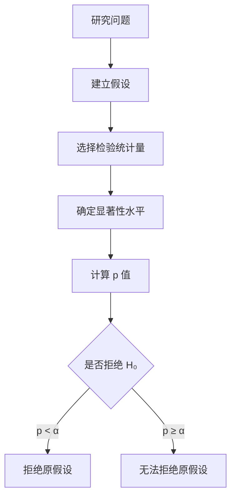
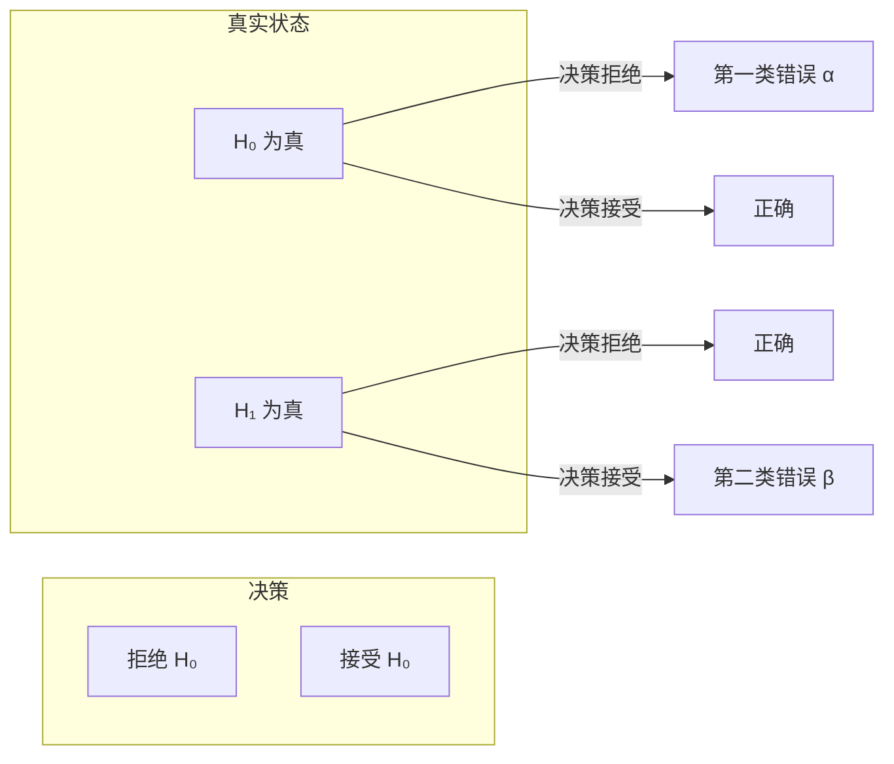

---
aliases:
  - 统计推断
  - 参数估计
  - 假设检验
  - 置信区间
  - p 值
  - Statistical Inference
  - Hypothesis Testing
  - Estimation
  - Confidence Interval
tags:
created: 2026-05-17
updated: 2026-05-17
  - Mathematics
  - Statistics
  - Inference
  - Probability
  - DataScience
  - Estimation
  - HypothesisTesting
  - p-value
---

# 统计推断

## 一、统计推断概述

统计推断（Statistical Inference）是利用样本数据对总体特征进行推断的方法。主要包括参数估计（Estimation）和假设检验（Hypothesis Testing）两大分支。

### 基本概念

| 概念 | 符号 | 描述 |
|------|------|------|
| 总体（Population） | $N$ | 全部研究对象 |
| 样本（Sample） | $n$ | 总体的子集 |
| 参数（Parameter） | $\theta$ | 总体特征值 |
| 统计量（Statistic） | $\hat{\theta}$ | 样本计算的估计值 |
| 标准误（Standard Error） | $SE$ | 统计量的标准差 |

---

## 二、参数估计

### 点估计（Point Estimation）

点估计是用样本统计量的单一数值估计总体参数。

**常用估计量：**

$$ \hat{\mu} = \bar{x} = \frac{1}{n}\sum_{i=1}^{n} x_i $$

$$ \hat{\sigma}^2 = s^2 = \frac{1}{n-1}\sum_{i=1}^{n} (x_i - \bar{x})^2 $$

$$ \hat{p} = \frac{X}{n} $$

### 估计量的评价标准

| 标准 | 英文 | 描述 |
|------|------|------|
| 无偏性 | Unbiasedness | $E(\hat{\theta}) = \theta$ |
| 一致性 | Consistency | $n \to \infty$ 时 $\hat{\theta} \to \theta$ |
| 有效性 | Efficiency | 方差最小的无偏估计 |
| 充分性 | Sufficiency | 包含样本中所有参数信息 |

### 区间估计（Interval Estimation）

置信区间（Confidence Interval, CI）给出参数的可能取值范围。

**总体均值 $\mu$ 的置信区间：**

$$ \bar{x} \pm z_{\alpha/2} \cdot \frac{\sigma}{\sqrt{n}} \quad \text{（方差已知）} $$

$$ \bar{x} \pm t_{\alpha/2, n-1} \cdot \frac{s}{\sqrt{n}} \quad \text{（方差未知）} $$

| 置信水平 | $z_{\alpha/2}$ | 含义 |
|----------|----------------|------|
| 90% | 1.645 | 有90%的信心包含总体参数 |
| 95% | 1.960 | 最常用 |
| 99% | 2.576 | 更保守的估计 |

---

## 三、假设检验

### 假设检验框架

### 原假设与备择假设

- 原假设 $H_0$（Null Hypothesis）：通常是"无差异"或"无效果"的声明
- 备择假设 $H_1$ 或 $H_a$（Alternative Hypothesis）：与研究假设一致

| 类型 | 假设形式 | 拒绝域 |
|------|----------|--------|
| 双侧检验 | $H_0: \mu = \mu_0, H_1: \mu \neq \mu_0$ | 两侧尾部 |
| 左侧检验 | $H_0: \mu \geq \mu_0, H_1: \mu < \mu_0$ | 左侧尾部 |
| 右侧检验 | $H_0: \mu \leq \mu_0, H_1: \mu > \mu_0$ | 右侧尾部 |

---

## 四、常见的假设检验

### 单样本检验

| 检验 | 用途 | 检验统计量 |
|------|------|------------|
| z 检验 | 方差已知，正态总体 | $z = \frac{\bar{x} - \mu_0}{\sigma/\sqrt{n}}$ |
| t 检验 | 方差未知，正态总体 | $t = \frac{\bar{x} - \mu_0}{s/\sqrt{n}}$ |
| 比例检验 | 检验比例 | $z = \frac{\hat{p} - p_0}{\sqrt{p_0(1-p_0)/n}}$ |

### 两样本检验

| 检验 | 用途 | 检验统计量 |
|------|------|------------|
| 独立样本 t 检验 | 比较两组均值 | $t = \frac{\bar{x}_1 - \bar{x}_2}{\sqrt{s_p^2(1/n_1 + 1/n_2)}}$ |
| 配对 t 检验 | 配对数据 | $t = \frac{\bar{d}}{s_d/\sqrt{n}}$ |
| F 检验 | 比较两组方差 | $F = \frac{s_1^2}{s_2^2}$ |

**合并方差（Pooled Variance）：**

$$ s_p^2 = \frac{(n_1-1)s_1^2 + (n_2-1)s_2^2}{n_1 + n_2 - 2} $$

---

## 五、p 值与显著性

### p 值的含义

p 值（p-value）是在原假设成立的情况下，观察到当前或更极端结果的概率。

$$ \text{p-value} = P(\text{observed data or more extreme} \mid H_0 \text{ is true}) $$

### 显著性水平（Significance Level）

| $\alpha$ | 解释 | 常用场景 |
|----------|------|----------|
| 0.10 | 弱证据 | 探索性研究 |
| 0.05 | 标准证据 | 多数科学研究 |
| 0.01 | 强证据 | 医学、药物试验 |

### 两类错误

| 错误类型 | 定义 | 概率 |
|----------|------|------|
| 第一类错误（Type I Error） | 拒绝真的 $H_0$ | $\alpha$ |
| 第二类错误（Type II Error） | 接受假的 $H_0$ | $\beta$ |
| 检验功效（Power） | 正确拒绝假的 $H_0$ | $1 - \beta$ |

---

## 六、方差分析（ANOVA）

### 单因素方差分析

$$ F = \frac{MS_{between}}{MS_{within}} = \frac{SS_{between} / (k-1)}{SS_{within} / (N-k)} $$

| 变异来源 | 平方和 | 自由度 | 均方 |
|----------|--------|--------|------|
| 组间（Between） | $SS_{between}$ | $k-1$ | $MS_{between}$ |
| 组内（Within） | $SS_{within}$ | $N-k$ | $MS_{within}$ |
| 总计（Total） | $SS_{total}$ | $N-1$ | — |

---

## 七、卡方检验

### 拟合优度检验（Goodness-of-Fit）

$$ \chi^2 = \sum_{i=1}^{k} \frac{(O_i - E_i)^2}{E_i} $$

### 独立性检验（Test of Independence）

$$ \chi^2 = \sum_{i=1}^{r} \sum_{j=1}^{c} \frac{(O_{ij} - E_{ij})^2}{E_{ij}} $$

其中 $E_{ij} = \frac{(\text{行合计})(\text{列合计})}{\text{总计}}$

---

## 八、实践注意事项

### 常见误区

1. p 值不是 $H_0$ 为真的概率
2. p 值大不代表效应量（Effect Size）小
3. 统计显著（Statistical Significance）不等于实际显著（Practical Significance）
4. 多重比较（Multiple Comparisons）需要校正（如 Bonferroni Correction）

### 报告建议

- 报告效应量（Cohen's d, $\eta^2$ 等）
- 报告置信区间而非仅 p 值
- 预先进行功效分析（Power Analysis）确定样本量

