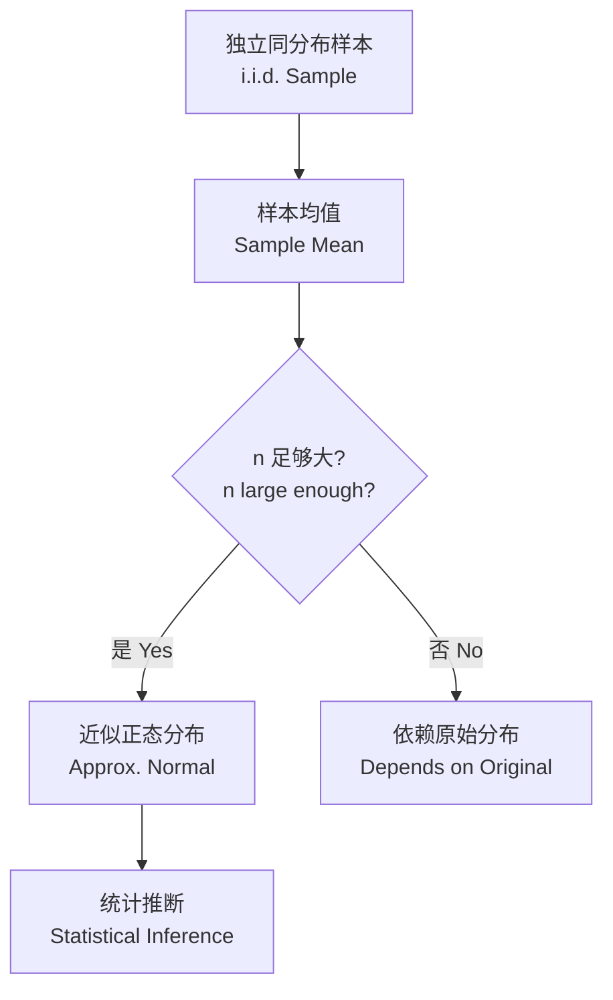
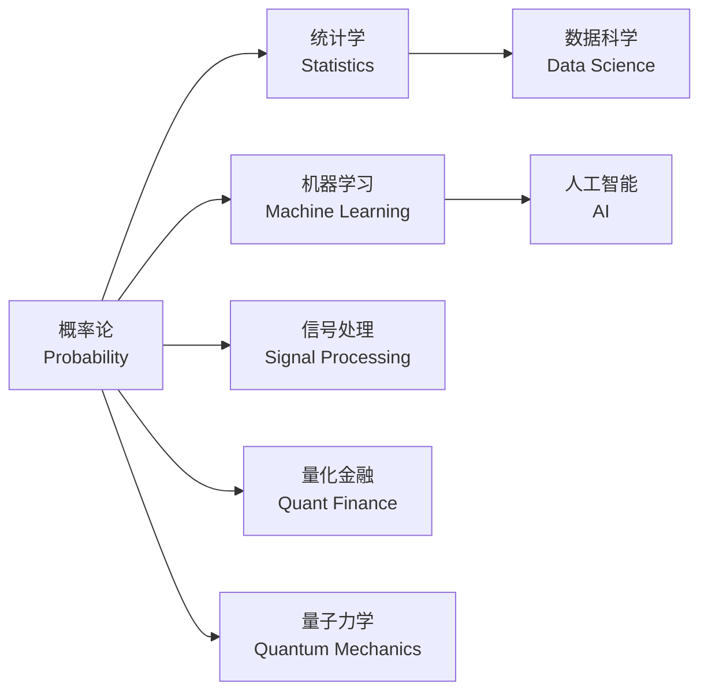

# 概率论 (Probability Theory)

## 一、基本概念 (Basic Concepts)

### 样本空间与事件 (Sample Space and Events)

- **样本空间 $\Omega$**：所有可能结果的集合 (set of all possible outcomes)
- **事件**：$\Omega$ 的子集 (subset of outcomes)
- **事件运算**：并 (union) $\cup$、交 (intersection) $\cap$、补 (complement) $A^c$

### 概率公理 (Probability Axioms)

概率测度 $P$ 满足 Kolmogorov 三公理：

$$P(A) \geq 0 \quad \text{(非负性, Non-negativity)}$$

$$P(\Omega) = 1 \quad \text{(规范性, Normalization)}$$

若 $A_1, A_2, \dots$ 两两互斥 (mutually exclusive)，则：
$$P\left(\bigcup_{i=1}^{\infty} A_i\right) = \sum_{i=1}^{\infty} P(A_i) \quad \text{(可列可加性, Countable Additivity)}$$

### 条件概率 (Conditional Probability)

$$P(A \mid B) = \frac{P(A \cap B)}{P(B)}, \quad P(B) > 0$$

### 全概率公式 (Law of Total Probability)

若 $\{B_i\}$ 是 $\Omega$ 的一个划分 (partition)，则：

$$P(A) = \sum_i P(A \mid B_i) P(B_i)$$

### 贝叶斯定理 (Bayes' Theorem)

**简单形式 (Simple Form)**：
$$P(A \mid B) = \frac{P(B \mid A) P(A)}{P(B)}$$

**全概率展开 (Expanded Form)**：
$$P(B_i \mid A) = \frac{P(A \mid B_i) P(B_i)}{\sum_j P(A \mid B_j) P(B_j)}$$

### 独立性 (Independence)

$A$ 与 $B$ 独立 $\iff$ $P(A \cap B) = P(A) P(B)$

## 二、随机变量 (Random Variables)

### 离散随机变量 (Discrete Random Variables)

**概率质量函数 (PMF)**：$p_X(x) = P(X = x)$

**累积分布函数 (CDF)**：$F_X(x) = P(X \leq x) = \sum_{t \leq x} p_X(t)$

### 连续随机变量 (Continuous Random Variables)

**概率密度函数 (PDF)**：$f_X(x)$，满足 $\int_{-\infty}^{\infty} f_X(x) \, dx = 1$

$$P(a \leq X \leq b) = \int_a^b f_X(x) \, dx$$

**CDF**：$F_X(x) = \int_{-\infty}^x f_X(t) \, dt$

$$f_X(x) = \frac{d}{dx} F_X(x)$$

### 随机变量类型对比

| 类型 (Type) | 概率描述 | 取值范围 | 累计方式 |
|------------|---------|---------|---------|
| 离散 (Discrete) | PMF $p_X(x)$ | 可数集 | 求和 $\sum$ |
| 连续 (Continuous) | PDF $f_X(x)$ | 连续区间 | 积分 $\int$ |
| 混合 (Mixed) | 组合形式 | 两者结合 | 求和 + 积分 |

## 三、期望与方差 (Expectation and Variance)

### 期望 (Expectation)

离散：$E[X] = \sum_x x p_X(x)$

连续：$E[X] = \int_{-\infty}^\infty x f_X(x) \, dx$

性质 (Properties)：
- $E[aX + b] = aE[X] + b$
- $E[X + Y] = E[X] + E[Y]$
- 若 $X \perp Y$，则 $E[XY] = E[X]E[Y]$

### 方差 (Variance)

$$\text{Var}(X) = E[(X - \mu)^2] = E[X^2] - (E[X])^2$$

$$\text{Var}(aX + b) = a^2 \text{Var}(X)$$

### 协方差与相关系数 (Covariance and Correlation)

$$\text{Cov}(X, Y) = E[(X - \mu_X)(Y - \mu_Y)] = E[XY] - E[X]E[Y]$$

$$\rho_{XY} = \frac{\text{Cov}(X, Y)}{\sigma_X \sigma_Y} \in [-1, 1]$$

### 矩母函数 (MGF)

$$M_X(t) = E[e^{tX}]$$

性质：$E[X^n] = M_X^{(n)}(0)$

## 四、常见离散分布 (Common Discrete Distributions)

| 分布 (Distribution) | PMF | $E[X]$ | $\text{Var}(X)$ | 应用场景 |
|-------------------|-----|--------|-----------------|---------|
| Bernoulli$(p)$ | $p^x (1-p)^{1-x}$ | $p$ | $p(1-p)$ | 单次试验结果 |
| Binomial$(n,p)$ | $\binom{n}{x} p^x (1-p)^{n-x}$ | $np$ | $np(1-p)$ | 独立重复试验成功次数 |
| Geometric$(p)$ | $(1-p)^{x-1}p$ | $1/p$ | $(1-p)/p^2$ | 首次成功所需次数 |
| Poisson$(\lambda)$ | $e^{-\lambda} \lambda^x / x!$ | $\lambda$ | $\lambda$ | 单位时间事件出现次数 |
| Uniform$(N)$ | $1/N$ | $(N+1)/2$ | $(N^2-1)/12$ | 等可能取有限个值 |

## 五、常见连续分布 (Common Continuous Distributions)

| 分布 (Distribution) | PDF | $E[X]$ | $\text{Var}(X)$ | 应用场景 |
|-------------------|-----|--------|-----------------|---------|
| Uniform$(a,b)$ | $1/(b-a)$ | $(a+b)/2$ | $(b-a)^2/12$ | 等可能连续取值 |
| Normal$(\mu,\sigma^2)$ | $\frac{1}{\sigma\sqrt{2\pi}} e^{-(x-\mu)^2/(2\sigma^2)}$ | $\mu$ | $\sigma^2$ | 自然现象、测量误差 |
| Exponential$(\lambda)$ | $\lambda e^{-\lambda x}$ | $1/\lambda$ | $1/\lambda^2$ | 等待时间、寿命 |
| Gamma$(\alpha,\beta)$ | $\frac{\beta^\alpha}{\Gamma(\alpha)} x^{\alpha-1} e^{-\beta x}$ | $\alpha/\beta$ | $\alpha/\beta^2$ | 排队论、保险精算 |
| Beta$(\alpha,\beta)$ | $\frac{\Gamma(\alpha+\beta)}{\Gamma(\alpha)\Gamma(\beta)} x^{\alpha-1}(1-x)^{\beta-1}$ | $\frac{\alpha}{\alpha+\beta}$ | $\frac{\alpha\beta}{(\alpha+\beta)^2(\alpha+\beta+1)}$ | 概率建模、贝叶斯先验 |

### 正态分布的标准化 (Standardization)

标准正态 PDF：$\phi(z) = \frac{1}{\sqrt{2\pi}} e^{-z^2/2}$

标准化变换：$Z = \frac{X - \mu}{\sigma} \sim N(0,1)$

### 常用抽样分布 (Sampling Distributions)

**卡方分布 (Chi-squared)**：
若 $Z_i \sim N(0,1)$ 独立，则 $\sum_{i=1}^k Z_i^2 \sim \chi^2(k)$

**$t$-分布 (Student's t)**：
$$T = \frac{Z}{\sqrt{Y/k}} \sim t(k)$$
其中 $Z \sim N(0,1)$ 与 $Y \sim \chi^2(k)$ 独立。

**$F$-分布**：
$$F = \frac{U/d_1}{V/d_2} \sim F(d_1, d_2)$$
其中 $U \sim \chi^2(d_1)$ 与 $V \sim \chi^2(d_2)$ 独立。

## 六、极限定理 (Limit Theorems)

### 大数定律 (Law of Large Numbers)

样本均值 $\bar{X}_n = \frac{1}{n}\sum_{i=1}^n X_i$ 依概率收敛于 $\mu$：

$$\bar{X}_n \xrightarrow{P} \mu$$

- **弱大数定律 (WLLN)**：依概率收敛 (convergence in probability)
- **强大数定律 (SLLN)**：几乎必然收敛 (almost sure convergence)

### 中心极限定理 (CLT)

$$\frac{\bar{X}_n - \mu}{\sigma/\sqrt{n}} \xrightarrow{d} N(0,1)$$

即样本均值的分布随 $n$ 增大趋近于正态分布，无论原始分布为何。

### 不等式 (Inequalities)

| 不等式 | 公式 | 用途 |
|--------|------|------|
| Markov | $P(X \geq a) \leq \frac{E[X]}{a}$ | 尾概率上界 |
| Chebyshev | $P(|X-\mu| \geq k\sigma) \leq \frac{1}{k^2}$ | 离散程度估计 |
| Jensen | $E[g(X)] \geq g(E[X])$ (凸函数) | 期望变换 |
| Cauchy-Schwarz | $|E[XY]|^2 \leq E[X^2]E[Y^2]$ | 相关性上界 |

## 七、概率论与其他学科关联

## 相关条目 (Related Entries)

[[02_NaturalSciences/Mathematics/MathematicalAnalysis/INDEX|MathematicalAnalysis]], [[07_InterdisciplinarySciences/DataScience/INDEX|DataScience]], [[02_NaturalSciences/Mathematics/Algebra/INDEX|Algebra]], [[StatisticalInference]], [[StochasticProcesses]]
