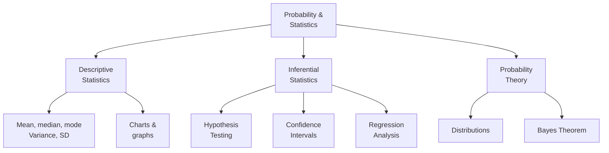
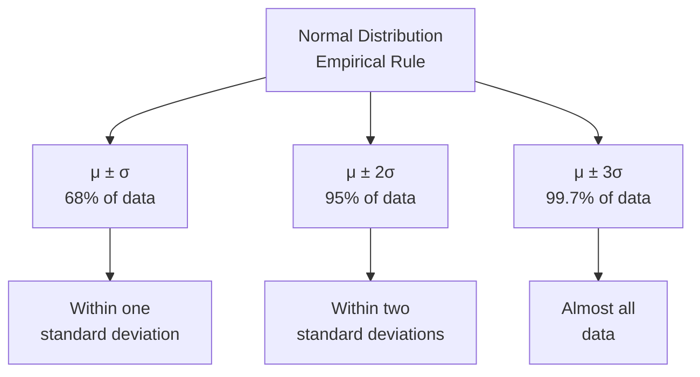
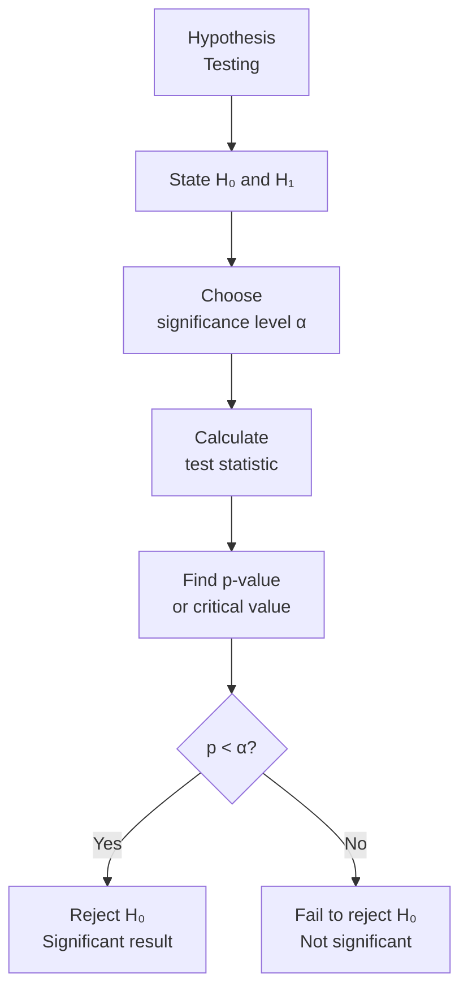

# 概率论与数理统计 (Probability and Statistics)

## 一、概述 (Overview)

**概率论与数理统计 (Probability and Statistics)** 是研究随机现象规律性的数学学科。概率论 (Probability Theory) 建立随机现象的数学模型，统计学 (Statistics) 则从数据中推断规律。

### 1.1 概率 vs 统计

| 维度 | 概率论 | 统计学 |
|------|--------|--------|
| 方向 | 从模型到数据 | 从数据到模型 |
| 已知 | 总体分布 | 样本数据 |
| 未知 | 样本特征 | 总体参数 |
| 问题 | $P(\text{数据} \mid \text{模型})$ | $P(\text{模型} \mid \text{数据})$ |

### 1.2 基本术语

$$ \text{样本空间 (Sample Space): } \Omega = \{\text{所有可能结果}\} $$

$$ \text{事件 (Event): } A \subset \Omega, \quad P(A) \in [0, 1] $$



## 二、概率基础 (Probability Fundamentals)

### 2.1 概率公理 (Kolmogorov Axioms)

1. **非负性**：$P(A) \geq 0$
2. **规范性**：$P(\Omega) = 1$
3. **可加性**：若 $A \cap B = \emptyset$，则 $P(A \cup B) = P(A) + P(B)$

### 2.2 条件概率 (Conditional Probability)

$$ P(A \mid B) = \frac{P(A \cap B)}{P(B)}, \quad P(B) > 0 $$

**全概率公式 (Law of Total Probability)**：

$$ P(A) = \sum_{i=1}^{n} P(A \mid B_i) \cdot P(B_i) $$

其中 $\{B_i\}$ 是样本空间的一个分割。

### 2.3 贝叶斯定理 (Bayes Theorem)

$$ P(B_i \mid A) = \frac{P(A \mid B_i) \cdot P(B_i)}{P(A)} = \frac{P(A \mid B_i) \cdot P(B_i)}{\sum_j P(A \mid B_j) \cdot P(B_j)} $$

```mermaid
flowchart LR
    A[Prior<br/>P(B)] --> B[Likelihood<br/>P(A|B)]
    B --> C[Evidence<br/>P(A)]
    C --> D[Posterior<br/>P(B|A)]
    D -->|Updated belief| A
```

### 2.4 独立性 (Independence)

若 $P(A \cap B) = P(A)P(B)$，则事件 A 与 B 相互独立。

## 三、随机变量与分布 (Random Variables & Distributions)

### 3.1 离散分布 (Discrete Distributions)

| 分布 | 参数 | PMF $P(X=k)$ | 均值 | 方差 |
|------|------|-------------|------|------|
| Bernoulli | $p$ | $p^k(1-p)^{1-k}$ | $p$ | $p(1-p)$ |
| Binomial | $n, p$ | $\binom{n}{k} p^k (1-p)^{n-k}$ | $np$ | $np(1-p)$ |
| Poisson | $\lambda$ | $\frac{e^{-\lambda} \lambda^k}{k!}$ | $\lambda$ | $\lambda$ |
| Geometric | $p$ | $(1-p)^{k-1} p$ | $1/p$ | $(1-p)/p^2$ |
| Negative Binomial | $r, p$ | $\binom{k-1}{r-1} p^r (1-p)^{k-r}$ | $r/p$ | $r(1-p)/p^2$ |

**二项分布 (Binomial Distribution)**：$n$ 次独立 Bernoulli 试验的成功次数。

$$ X \sim B(n, p), \quad E[X] = np, \quad \text{Var}(X) = np(1-p) $$

**泊松分布 (Poisson Distribution)**：单位时间内随机事件发生次数。

$$ X \sim \text{Pois}(\lambda), \quad P(X=k) = \frac{e^{-\lambda} \lambda^k}{k!} $$

### 3.2 连续分布 (Continuous Distributions)

| 分布 | PDF $f(x)$ | 均值 | 方差 |
|------|-----------|------|------|
| Uniform | $\frac{1}{b-a}$ | $\frac{a+b}{2}$ | $\frac{(b-a)^2}{12}$ |
| Normal | $\frac{1}{\sigma\sqrt{2\pi}} e^{-\frac{(x-\mu)^2}{2\sigma^2}}$ | $\mu$ | $\sigma^2$ |
| Exponential | $\lambda e^{-\lambda x}$ | $1/\lambda$ | $1/\lambda^2$ |
| Gamma | $\frac{\beta^\alpha}{\Gamma(\alpha)} x^{\alpha-1} e^{-\beta x}$ | $\alpha/\beta$ | $\alpha/\beta^2$ |
| Beta | $\frac{x^{\alpha-1}(1-x)^{\beta-1}}{B(\alpha,\beta)}$ | $\frac{\alpha}{\alpha+\beta}$ | $\frac{\alpha\beta}{(\alpha+\beta)^2(\alpha+\beta+1)}$ |
| t (Student) | $\frac{\Gamma(\frac{\nu+1}{2})}{\sqrt{\nu\pi}\Gamma(\frac{\nu}{2})} (1+\frac{x^2}{\nu})^{-\frac{\nu+1}{2}}$ | $0\;(\nu>1)$ | $\frac{\nu}{\nu-2}\;(\nu>2)$ |

**正态分布 (Normal Distribution)** 是最重要的连续分布：

$$ X \sim N(\mu, \sigma^2), \quad f(x) = \frac{1}{\sigma\sqrt{2\pi}} e^{-\frac{(x-\mu)^2}{2\sigma^2}} $$

**标准正态分布 (Standard Normal)**：

$$ Z = \frac{X - \mu}{\sigma} \sim N(0, 1) $$

### 3.3 68-95-99.7 法则 (Empirical Rule)



### 3.4 中心极限定理 (Central Limit Theorem)

$$ \bar{X} \xrightarrow{n \to \infty} N\left(\mu, \frac{\sigma^2}{n}\right) $$

对于任意分布（具有有限方差），样本均值的分布随着样本量增大趋近于正态分布。

### 3.5 大数定律 (Law of Large Numbers)

$$ \bar{X}_n = \frac{1}{n}\sum_{i=1}^n X_i \xrightarrow{P} \mu \quad \text{(弱大数定律)} $$

## 四、描述性统计 (Descriptive Statistics)

### 4.1 集中趋势 (Central Tendency)

| 度量 | 定义 | 适用场景 |
|------|------|---------|
| 均值 $\bar{x}$ | $\frac{1}{n}\sum x_i$ | 对称分布 |
| 中位数 $M$ | 中间值 | 偏态分布 |
| 众数 $m$ | 最频繁值 | 分类数据 |

### 4.2 离散程度 (Dispersion)

$$ \text{Variance (方差)}: s^2 = \frac{1}{n-1} \sum_{i=1}^{n} (x_i - \bar{x})^2 $$

$$ \text{Standard Deviation (标准差)}: s = \sqrt{s^2} $$

$$ \text{IQR (四分位距)} = Q_3 - Q_1 $$

### 4.3 协方差与相关系数 (Covariance & Correlation)

$$ \text{Cov}(X, Y) = E[(X - \mu_X)(Y - \mu_Y)] $$

$$ \rho_{XY} = \frac{\text{Cov}(X, Y)}{\sigma_X \sigma_Y}, \quad \rho \in [-1, 1] $$

## 五、参数估计 (Parameter Estimation)

### 5.1 点估计 (Point Estimation)

**最大似然估计 (MLE)**：

$$ \hat{\theta}_{\text{MLE}} = \arg\max_{\theta} \prod_{i=1}^{n} f(x_i \mid \theta) $$

**矩估计 (Method of Moments)**：用样本矩等于总体矩解方程。

### 5.2 区间估计 (Interval Estimation)

$$ \text{置信区间 (CI)}：\bar{x} \pm z_{\alpha/2} \cdot \frac{\sigma}{\sqrt{n}} $$

对于未知 $\sigma$，使用 t 分布：

$$ \bar{x} \pm t_{\alpha/2, n-1} \cdot \frac{s}{\sqrt{n}} $$

| 置信水平 | $z_{\alpha/2}$ |
|---------|----------------|
| 90% | 1.645 |
| 95% | 1.960 |
| 99% | 2.576 |

## 六、假设检验 (Hypothesis Testing)

### 6.1 基本框架

$$ H_0: \text{零假设 (Null Hypothesis)}, \quad H_1: \text{备择假设 (Alternative Hypothesis)} $$

**两类错误**：

$$ \alpha = P(\text{Type I Error}) = P(\text{拒绝 } H_0 \mid H_0 \text{ 真}) $$
$$ \beta = P(\text{Type II Error}) = P(\text{接受 } H_0 \mid H_0 \text{ 假}) $$



### 6.2 常用检验

| 检验 | 用途 | 统计量 |
|------|------|--------|
| z-test | 已知 $\sigma$ 的均值检验 | $z = \frac{\bar{x} - \mu_0}{\sigma/\sqrt{n}}$ |
| t-test | 未知 $\sigma$ 的均值检验 | $t = \frac{\bar{x} - \mu_0}{s/\sqrt{n}}$ |
| $\chi^2$-test | 方差检验/拟合优度 | $\chi^2 = \sum \frac{(O-E)^2}{E}$ |
| F-test | 方差比较 | $F = \frac{s_1^2}{s_2^2}$ |
| ANOVA | 多组均值比较 | $F = \frac{MS_{\text{between}}}{MS_{\text{within}}}$ |

### 6.3 p 值 (p-value)

**p-value (显著性概率)**：在 $H_0$ 为真的情况下，观察到当前或更极端结果的概率。

$$ \text{p 值小} \implies \text{证据强} \implies \text{拒绝 } H_0 $$

## 七、贝叶斯推断 (Bayesian Inference)

### 7.1 贝叶斯 vs 频率学派

| 特征 | 频率学派 | 贝叶斯学派 |
|------|---------|-----------|
| 参数看法 | 固定常数 | 随机变量 |
| 先验信息 | 不用 | 用先验分布 |
| 推断方式 | 点估计 + 置信区间 | 后验分布 |
| 不确定性 | 抽样误差 | 后验概率 |

### 7.2 贝叶斯框架

$$ P(\theta \mid D) = \frac{P(D \mid \theta) \cdot P(\theta)}{P(D)} \propto P(D \mid \theta) \cdot P(\theta) $$

$$ \text{Posterior} \propto \text{Likelihood} \times \text{Prior} $$

**共轭先验 (Conjugate Prior)**：

| 似然 | 共轭先验 | 后验 |
|------|---------|------|
| Binomial | Beta | Beta |
| Poisson | Gamma | Gamma |
| Normal ($\sigma$ known) | Normal | Normal |

## 八、回归分析 (Regression Analysis)

### 8.1 线性回归 (Linear Regression)

$$ Y = \beta_0 + \beta_1 X + \varepsilon, \quad \varepsilon \sim N(0, \sigma^2) $$

**最小二乘法 (OLS)**：

$$ \hat{\beta}_1 = \frac{\sum (x_i - \bar{x})(y_i - \bar{y})}{\sum (x_i - \bar{x})^2} = \frac{s_{xy}}{s_x^2} $$

$$ \hat{\beta}_0 = \bar{y} - \hat{\beta}_1 \bar{x} $$

### 8.2 决定系数 (Coefficient of Determination)

$$ R^2 = 1 - \frac{SS_{\text{res}}}{SS_{\text{tot}}} = \frac{SS_{\text{reg}}}{SS_{\text{tot}}} $$

$$ R^2 \in [0, 1], \quad \text{越接近 1 拟合越优} $$

### 8.3 多元回归 (Multiple Regression)

$$ Y = \beta_0 + \beta_1 X_1 + \beta_2 X_2 + \cdots + \beta_p X_p + \varepsilon $$

矩阵形式：

$$ \hat{\boldsymbol{\beta}} = (\mathbf{X}^T \mathbf{X})^{-1} \mathbf{X}^T \mathbf{y} $$

## 九、关键公式汇表 (Key Formulas)

$$ \bar{x} = \frac{1}{n}\sum x_i, \quad s^2 = \frac{1}{n-1}\sum (x_i - \bar{x})^2 $$

$$ t = \frac{\bar{x} - \mu_0}{s/\sqrt{n}} \sim t_{n-1} $$

$$ \hat{\beta} = (\mathbf{X}^T\mathbf{X})^{-1}\mathbf{X}^T\mathbf{y} $$

$$ P(\theta \mid D) \propto P(D \mid \theta) \cdot P(\theta) $$

$$ \text{CLT: } \bar{X} \sim N(\mu, \sigma^2/n) $$

---

[[02_NaturalSciences/Mathematics/ProbabilityStatistics/INDEX|当前目录索引]]
