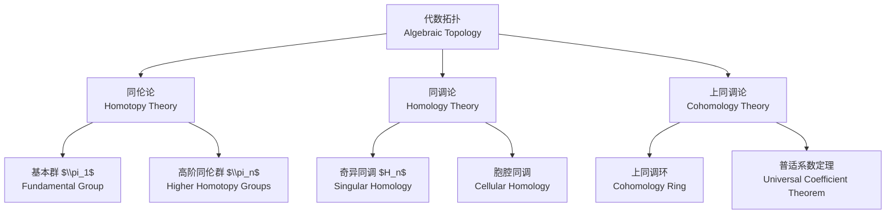
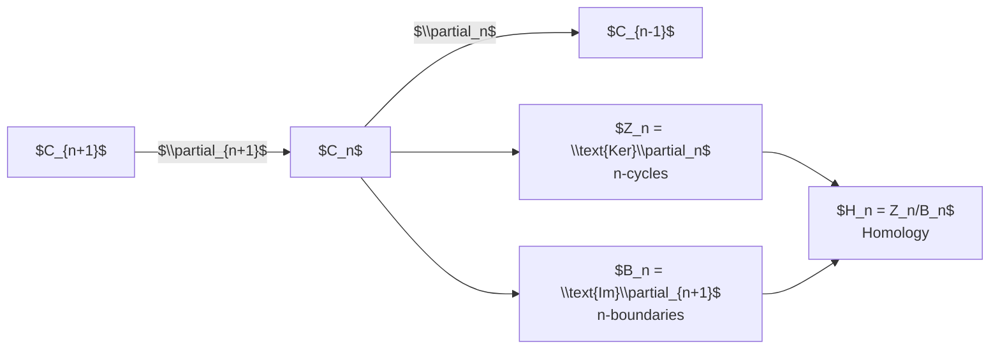

---
aliases:
  - Algebraic Topology
  - 代数拓扑学
  - Homology Theory
tags:
  - mathematics
  - topology
  - algebraic-topology
  - homotopy
  - homology
created: 2025-02-10
updated: 2025-05-16
---

# 代数拓扑 (Algebraic Topology)

## 概述 (Overview)

代数拓扑通过代数工具（群、环、模等）研究拓扑空间的性质。核心思想是将拓扑问题转化为代数问题。

## 基本群 (Fundamental Group)

### 道路与环路 (Paths and Loops)

拓扑空间 $X$ 中的一条道路 (path) 是连续映射：

$$\gamma: [0, 1] \to X$$

环路 (loop) 是满足 $\gamma(0) = \gamma(1) = x_0$ 的道路。

### 同伦等价 (Homotopy Equivalence)

两个连续映射 $f, g: X \to Y$ 称为同伦的，记作 $f \simeq g$，若存在连续映射：

$$H: X \times [0, 1] \to Y$$

使得 $H(x, 0) = f(x)$，$H(x, 1) = g(x)$。

### 基本群的定义 (Definition of Fundamental Group)

基本群 $\pi_1(X, x_0)$ 是以 $x_0$ 为基点的环路同伦类在道路并置运算下构成的群。

$$\pi_1(X, x_0) = \{[\gamma] \mid \gamma: [0,1] \to X, \gamma(0) = \gamma(1) = x_0\}$$

群运算 (group operation)：

$$[\alpha] \cdot [\beta] = [\alpha * \beta]$$

其中 $\alpha * \beta$ 是先走 $\alpha$ 再走 $\beta$ 的并置道路。

### 基本群的计算 (Computations)

| 空间 (Space) | 基本群 (Fundamental Group) | 注释 (Notes) |
|---|---|---|
| $S^1$ (圆周) | $\pi_1(S^1) \cong \mathbb{Z}$ | 由 $[id]$ 生成的无限循环群 |
| $S^n$, $n \geq 2$ | $\pi_1(S^n) = 0$ | 单连通 (simply connected) |
| $\mathbb{R}^n$ | $\pi_1(\mathbb{R}^n) = 0$ | 可缩空间 (contractible) |
| $T^2$ (环面) | $\pi_1(T^2) \cong \mathbb{Z} \times \mathbb{Z}$ | 两个循环的直积 |
| $\mathbb{R}P^2$ (实射影平面) | $\pi_1(\mathbb{R}P^2) \cong \mathbb{Z}_2$ | 二阶循环群 |
| $S^1 \vee S^1$ (楔和) | $\pi_1(S^1 \vee S^1) \cong \mathbb{F}_2$ | 两个生成元的自由群 |

## 范坎彭定理 (van Kampen Theorem)

若 $X$ 是开集 $U$ 和 $V$ 的并集，$U \cap V$ 道路连通，则：

$$\pi_1(X) \cong \pi_1(U) *_{\pi_1(U \cap V)} \pi_1(V)$$

这给出了基本群的融合积 (amalgamated free product) 表示。

## 同调论 (Homology Theory)

### 奇异同调群 (Singular Homology Groups)

奇异 $n$-单形 (singular $n$-simplex) 是连续映射 $\sigma: \Delta^n \to X$。

链群 (chain group) $C_n(X)$ 是以所有奇异 $n$-单形为基的自由阿贝尔群。边缘同态 (boundary homomorphism)：

$$\partial_n: C_n(X) \to C_{n-1}(X)$$

$$\partial_n(\sigma) = \sum_{i=0}^n (-1)^i \sigma \circ F_i^n$$

其中 $F_i^n: \Delta^{n-1} \to \Delta^n$ 是第 $i$ 个面映射。

链复形 (chain complex)：

$$\cdots \xrightarrow{\partial_{n+1}} C_n(X) \xrightarrow{\partial_n} C_{n-1}(X) \xrightarrow{\partial_{n-1}} \cdots$$

### 同调群 (Homology Groups)

$$\partial_{n} \circ \partial_{n+1} = 0$$

因此 $\text{Im}(\partial_{n+1}) \subseteq \text{Ker}(\partial_n)$。定义：

$$Z_n(X) = \text{Ker}(\partial_n) \quad \text{(n-循环, n-cycles)}$$

$$B_n(X) = \text{Im}(\partial_{n+1}) \quad \text{(n-边缘, n-boundaries)}$$

奇异同调群：

$$H_n(X) = Z_n(X) / B_n(X)$$

### 胞腔同调 (Cellular Homology)

对于 CW 复形，胞腔同调群与奇异同调群同构。胞腔链群 $C_n^{CW}(X)$ 以 $n$-胞腔为基，边缘同态由附着映射的度决定：

$$\partial_n(e_\alpha^n) = \sum_\beta d_{\alpha\beta} e_\beta^{n-1}$$

其中 $d_{\alpha\beta} = \deg(f_{\alpha\beta})$ 为附着映射 $f_{\alpha\beta}: S^{n-1} \to S^{n-1}$ 的度。

### 常见空间的同调群

| 空间 (Space) | 同调群 (Homology Groups) |
|---|---|
| $S^n$ | $H_k(S^n) \cong \begin{cases} \mathbb{Z} & k = 0, n \\ 0 & \text{其他} \end{cases}$ |
| $T^n$ | $H_k(T^n) \cong \mathbb{Z}^{\binom{n}{k}}$ |
| $\mathbb{R}P^n$ | $H_k(\mathbb{R}P^n) \cong \begin{cases} \mathbb{Z} & k = 0 \\ \mathbb{Z}_2 & k \text{奇数}, 0<k<n \\ 0 & \text{其他} \end{cases}$ |
| $\mathbb{C}P^n$ | $H_k(\mathbb{C}P^n) \cong \begin{cases} \mathbb{Z} & k = 0, 2, 4, \ldots, 2n \\ 0 & \text{其他} \end{cases}$ |

## 上同调 (Cohomology)

### 上链与上边缘 (Cochains and Coboundaries)

上链群 $C^n(X) = \text{Hom}(C_n(X), \mathbb{Z})$。上边缘算子：

$$\delta^n: C^n(X) \to C^{n+1}(X)$$

$$(\delta^n \varphi)(\sigma) = \varphi(\partial_{n+1}\sigma)$$

上同调群：

$$H^n(X) = \text{Ker}(\delta^n) / \text{Im}(\delta^{n-1})$$

### 杯积与上同调环 (Cup Product and Cohomology Ring)

杯积 (cup product) $\smile: H^p(X) \times H^q(X) \to H^{p+q}(X)$ 使 $\bigoplus_n H^n(X)$ 成为分次环。

对于可定向闭 $n$-流形 $M$，庞加莱对偶 (Poincaré duality) 给出：

$$H^k(M) \cong H_{n-k}(M)$$

## 高阶同伦群 (Higher Homotopy Groups)

$$\pi_n(X, x_0) = \{[\alpha] \mid \alpha: (S^n, s_0) \to (X, x_0)\}$$

对于 $n \geq 2$，$\pi_n$ 是阿贝尔群。

纤维丛的**同伦群长正合序列**：

$$\cdots \to \pi_n(F) \to \pi_n(E) \to \pi_n(B) \to \pi_{n-1}(F) \to \cdots$$

## 覆叠空间 (Covering Spaces)

$p: \tilde{X} \to X$ 是覆叠映射，若每个 $x \in X$ 存在邻域 $U$ 使得 $p^{-1}(U)$ 是 $U$ 的不交并的同胚像。

基本群与覆叠空间的对应关系 (Galois 对应)：

$$\{\text{覆叠空间 } \tilde{X} \to X\} \longleftrightarrow \{\pi_1(X) \text{的子群}\}$$

万有覆叠 (universal cover) $\tilde{X} \to X$ 对应于 $\{1\} \subset \pi_1(X)$。

## 应用 (Applications)

### 布劳威尔不动点定理 (Brouwer Fixed Point Theorem)

任何连续映射 $f: D^n \to D^n$ 必有不动点。

### 博尔苏克-乌拉姆定理 (Borsuk-Ulam Theorem)

任何连续映射 $f: S^n \to \mathbb{R}^n$ 存在 $x \in S^n$ 使得 $f(x) = f(-x)$。

### 毛球定理 (Hairy Ball Theorem)

$S^{2n}$ 上不存在处处非零的连续切向量场。

### 欧拉示性数 (Euler Characteristic)

$$\chi(X) = \sum_{i=0}^\infty (-1)^i \text{rank}(H_i(X)) = \sum_{i=0}^\infty (-1)^i c_i$$

其中 $c_i$ 是 $i$-胞腔的个数。
