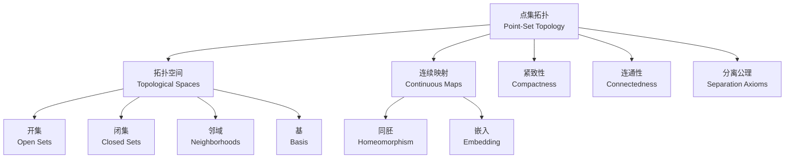
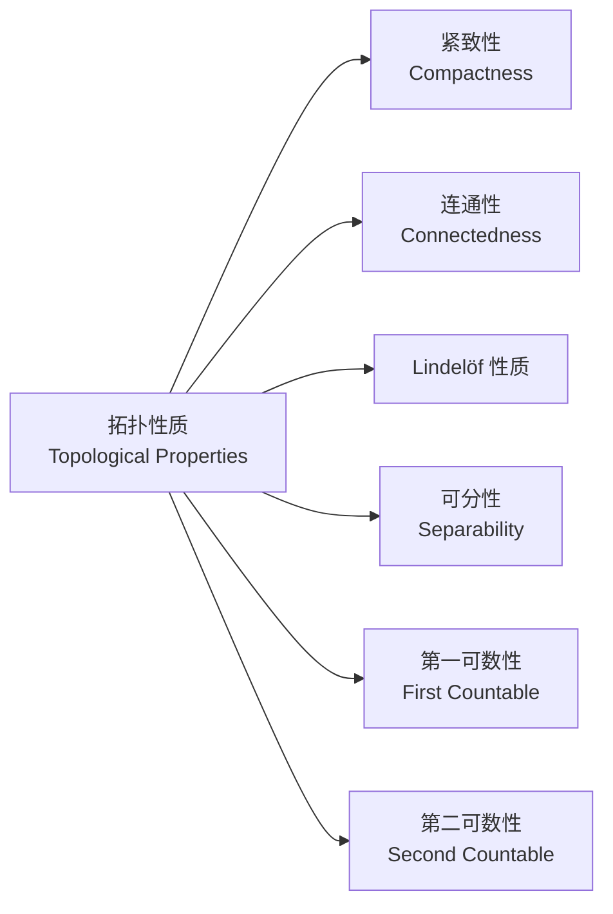

---
aliases:
  - Point-Set Topology
  - 一般拓扑学
  - 基础拓扑学
tags:
  - mathematics
  - topology
  - point-set-topology
  - continuity
  - compactness
created: 2025-02-08
updated: 2025-05-16
---

# 点集拓扑 (Point-Set Topology)

## 概述 (Overview)

点集拓扑是数学的基础分支，研究拓扑空间及其连续映射。它为分析学、几何学和代数学提供了统一的语言框架。



## 拓扑空间的定义 (Definition of Topological Space)

### 拓扑结构 (Topology)

集合 $X$ 上的拓扑 $\mathcal{T}$ 是 $X$ 的子集族，满足：

1. $\emptyset, X \in \mathcal{T}$
2. $\mathcal{T}$ 中任意多个元素的并集仍在 $\mathcal{T}$ 中
3. $\mathcal{T}$ 中有限多个元素的交集仍在 $\mathcal{T}$ 中

$(X, \mathcal{T})$ 称为拓扑空间 (topological space)，$\mathcal{T}$ 中的元素称为开集 (open sets)。

### 拓扑基 (Basis for a Topology)

$\mathcal{B} \subseteq \mathcal{T}$ 是拓扑 $\mathcal{T}$ 的基，若每个开集都是 $\mathcal{B}$ 中元素的并集。等价地，对任意 $x \in X$ 和含 $x$ 的开集 $U$，存在 $B \in \mathcal{B}$ 使得 $x \in B \subseteq U$。

### 子基 (Subbasis)

子基 $\mathcal{S}$ 是 $X$ 的子集族，其有限交的全体构成一个拓扑基。

### 闭集与闭包 (Closed Sets and Closure)

$A \subseteq X$ 是闭集当且仅当 $X \setminus A$ 是开集。

$A$ 的闭包 (closure) $\overline{A}$ 是包含 $A$ 的最小闭集：

$$\overline{A} = \bigcap\{F \subseteq X \mid F \text{ 闭}, A \subseteq F\}$$

$A$ 的内部 (interior) $\text{Int}(A)$ 是包含在 $A$ 中的最大开集：

$$\text{Int}(A) = \bigcup\{U \subseteq X \mid U \text{ 开}, U \subseteq A\}$$

## 连续性与同胚 (Continuity and Homeomorphism)

### 连续映射 (Continuous Map)

$f: X \to Y$ 是连续的，若对任意开集 $V \subseteq Y$，其原像 $f^{-1}(V) \subseteq X$ 是开集。

等价地，对任意 $x \in X$ 和含 $f(x)$ 的邻域 $V$，存在 $x$ 的邻域 $U$ 使得 $f(U) \subseteq V$。

### 同胚 (Homeomorphism)

$f: X \to Y$ 是同胚若 $f$ 是双射且 $f$ 和 $f^{-1}$ 都连续。此时 $X$ 和 $Y$ 称为同胚的 (homeomorphic)，记为 $X \cong Y$。

拓扑性质是在同胚下保持不变的性质。



## 由已知空间构造新拓扑 (Constructing Topologies)

### 子空间拓扑 (Subspace Topology)

若 $(X, \mathcal{T})$ 是拓扑空间，$Y \subseteq X$，则子空间拓扑为：

$$\mathcal{T}_Y = \{Y \cap U \mid U \in \mathcal{T}\}$$

### 积拓扑 (Product Topology)

$X \times Y$ 的积拓扑以 $\{U \times V \mid U \text{ 开于 } X, V \text{ 开于 } Y\}$ 为基。

更一般地，对于任意族 $\{X_\alpha\}_{\alpha \in J}$，积空间 $\prod_{\alpha \in J} X_\alpha$ 的积拓扑由投影映射 $\pi_\beta: \prod X_\alpha \to X_\beta$ 生成。

### 商拓扑 (Quotient Topology)

若 $\sim$ 是 $X$ 上的等价关系，商空间 $X/{\sim}$ 的商拓扑由商映射 $q: X \to X/{\sim}$ 定义：

$$U \subseteq X/{\sim} \text{ 是开集} \iff q^{-1}(U) \subseteq X \text{ 是开集}$$

## 连通性 (Connectedness)

### 连通空间 (Connected Space)

拓扑空间 $X$ 是连通的若它不能表示为两个非空不交开集的并。

等价条件：$X$ 中既开又闭的子集只有 $\emptyset$ 和 $X$。

### 道路连通 (Path-Connectedness)

$X$ 是道路连通的若对任意 $x, y \in X$，存在连续映射 $\gamma: [0,1] \to X$ 使得 $\gamma(0) = x$, $\gamma(1) = y$。

道路连通 $\implies$ 连通，反之不真（例如 $\sin(1/x)$ 曲线的闭包）。

### 连通分支 (Connected Components)

$X$ 的连通分支 (connected components) 是在连通关系下的极大等价类。每个连通分支是闭集。

道路连通分支 (path components) 类似。

| 性质 (Property) | 连通 (Connected) | 道路连通 (Path-Connected) |
|---|---|---|
| 连续像 | 保持 | 保持 |
| 积空间 | 有限积保持 | 任意积保持 |
| 闭包 | 保持 | 不保持 |
| 例子 | $\sin(1/x)$ 曲线的闭包 | $[0,1]$ 中的区间 |

## 紧致性 (Compactness)

### 紧致空间 (Compact Space)

$X$ 是紧致的若每个开覆盖都有有限子覆盖。

**海涅-博雷尔定理 (Heine-Borel Theorem)**：$\mathbb{R}^n$ 的子集是紧致的当且仅当它是有界闭集。

### 紧致性的性质

| 性质 (Property) | 内容 (Statement) |
|---|---|
| 闭子集 | 紧致空间的闭子集是紧致的 |
| 连续像 | 紧致空间的连续像是紧致的 |
| 豪斯多夫 | 紧致子集在豪斯多夫空间中是闭的 |
| 乘积 | 任意数量紧致空间的积是紧致的 (Tychonoff) |
| 博尔扎诺-魏尔斯特拉斯 | 序列紧致 $\iff$ 可度量化空间中的紧致 |

### 序列紧致 (Sequential Compactness)

$X$ 是序列紧致的若每个序列都有收敛子列。在度量空间中，序列紧致等价于紧致。

### 局部紧致 (Local Compactness)

$X$ 是局部紧致的若每个点存在紧邻域。例如 $\mathbb{R}^n$ 是局部紧致的，但 $\mathbb{Q}$ 不是。

## 分离公理 (Separation Axioms)

| 公理 (Axiom) | 名称 (Name) | 条件 (Condition) |
|---|---|---|
| $T_0$ | 柯尔莫哥洛夫 | 任意不同点存在开集仅含其中一点 |
| $T_1$ | 弗雷歇 | 任意单点集是闭集 |
| $T_2$ | 豪斯多夫 | 任意不同点存在不交开邻域 |
| $T_{2\frac{1}{2}}$ | 乌雷松 | 任意不同点存在闭包不交的开邻域 |
| $T_3$ | 正则 | $T_1 +$ 闭集和点可用开集分离 |
| $T_{3\frac{1}{2}}$ | 吉洪诺夫 | $T_1 +$ 完全正则 |
| $T_4$ | 正规 | $T_1 +$ 不交闭集可用开集分离 |

```mermaid
flowchart TD
    A[度量空间<br/>Metric Space] --> B[完全正规 $T_5$]
    A --> C[可度量化的必要条件<br/>$T_3$ + 第二可数]
    B --> D[正规 $T_4$]
    D --> E[完全正则 $T_{3\\frac{1}{2}}$]
    E --> F[正则 $T_3$]
    F --> G[豪斯多夫 $T_2$]
    G --> H[$T_1$]
    H --> I[$T_0$]
```

### 乌雷松引理 (Urysohn Lemma)

在正规空间中，对任意不交闭集 $A, B$，存在连续函数 $f: X \to [0,1]$ 使得 $f(A) = 0$, $f(B) = 1$。

### 蒂茨扩张定理 (Tietze Extension Theorem)

若 $A$ 是正规空间 $X$ 的闭子集，$f: A \to \mathbb{R}$ 连续，则 $f$ 可连续扩张到整个 $X$。

## 可数公理 (Countability Axioms)

| 公理 (Axiom) | 条件 (Condition) | 例子 (Example) |
|---|---|---|
| 第一可数 (First Countable) | 每点有可数邻域基 | 所有度量空间 |
| 第二可数 (Second Countable) | 拓扑有可数基 | $\mathbb{R}^n$ |
| 可分 (Separable) | 存在可数稠密集 | $\mathbb{R}^n$ (有理点) |
| Lindelöf | 每个开覆盖有可数子覆盖 | 第二可数 $\implies$ Lindelöf |

## 度量化定理 (Metrization Theorems)

### 乌雷松度量化定理 (Urysohn Metrization Theorem)

第二可数的正则 $T_1$ 空间可度量化。

### 纳格塔-斯米尔诺夫定理 (Nagata-Smirnov Theorem)

$X$ 可度量化当且仅当 $X$ 是正则的且有 $\sigma$-局部有限基。

## 网与滤子 (Nets and Filters)

在一般拓扑空间中，序列不足以描述收敛性。网 (net) 和滤子 (filter) 提供了更一般的框架。

$X$ 中的网是一个函数 $f: A \to X$，其中 $A$ 是定向集 (directed set)。

$X$ 是紧致的当且仅当每个网有收敛子网。

## 度量空间 (Metric Spaces)

度量 $d: X \times X \to \mathbb{R}_{\geq 0}$ 诱导拓扑，基为开球：

$$B(x, r) = \{y \in X \mid d(x, y) < r\}$$

度量空间必为 $T_4$ (正规) 且第一可数。

度量空间中的等价刻画：
- 紧致 $\iff$ 序列紧致 $\iff$ 完备且完全有界
