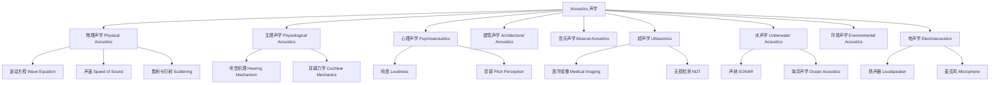

# Acoustics

## 概述 (Overview)

声学 (Acoustics) 是研究机械波在气体、液体和固体中产生、传播、接收和效应的物理分支学科。声学覆盖从次声 (Infrasound, <20Hz) 到可听声 (Audible Sound, 20Hz-20kHz) 再到超声 (Ultrasound, >20kHz) 的广泛频率范围。声学与音乐、建筑、医学、通信、海洋探测和材料科学等多个领域深度交叉。现代声学不仅研究声波本身，还涉及声与物质的相互作用、噪声控制、听觉感知以及声学信号处理。

## 声学分支体系

## 声波的基本方程 (Fundamental Wave Equation)

声波在流体中的传播由波动方程描述。一维声波方程：

$$\frac{\partial^2 p}{\partial x^2} = \frac{1}{c^2}\frac{\partial^2 p}{\partial t^2}$$

其中 $p$ 是声压 (Sound Pressure)，$c$ 是声速 (Speed of Sound)。声速与介质性质的关系：

$$c = \sqrt{\frac{B}{\rho}}$$

其中 $B$ 是体积模量 (Bulk Modulus)，$\rho$ 是密度 (Density)。在理想气体中：

$$c = \sqrt{\frac{\gamma RT}{M}}$$

其中 $\gamma = C_p/C_v$ 是绝热指数，$R$ 是气体常数，$T$ 是绝对温度，$M$ 是摩尔质量。

## 声学量 (Acoustic Quantities)

| 量 | 符号 | 定义 | 单位 |
|---|------|------|------|
| 声压 Sound Pressure | $p$ | $p = P - P_0$ | Pa |
| 质点速度 Particle Velocity | $u$ | $u = p/\rho c$ | m/s |
| 声强 Sound Intensity | $I$ | $I = p^2/\rho c$ | W/m² |
| 声功率 Sound Power | $W$ | $W = \oint I \cdot dS$ | W |
| 声压级 SPL | $L_p$ | $L_p = 20\log_{10}(p/p_{ref})$ | dB |
| 声强级 SIL | $L_I$ | $L_I = 10\log_{10}(I/I_{ref})$ | dB |

参考声压 $p_{ref} = 20\,\mu\text{Pa}$（空气中），参考声强 $I_{ref} = 10^{-12}\,\text{W/m}^2$。

## 波的特性 (Wave Properties)

### 干涉 (Interference)

两个相干声源产生的干涉图案由相位差决定：

$$\Delta\phi = \frac{2\pi\Delta r}{\lambda}$$

当 $\Delta\phi = 2n\pi$ 时发生相长干涉 (Constructive Interference)；当 $\Delta\phi = (2n+1)\pi$ 时发生相消干涉 (Destructive Interference)。

### 多普勒效应 (Doppler Effect)

当声源与观察者存在相对运动时，观察到的频率发生偏移：

$$f' = f\frac{v \pm v_o}{v \mp v_s}$$

其中 $v$ 是声速，$v_o$ 是观察者速度，$v_s$ 是声源速度。上符号对应靠近，下符号对应远离。

### 驻波与共振 (Standing Waves & Resonance)

驻波由两列频率相同、传播方向相反的波叠加形成。在两端固定的弦上，驻波频率为：

$$f_n = \frac{n}{2L}\sqrt{\frac{T}{\mu}},\quad n = 1,2,3,\ldots$$

在闭管中，共振频率为 $f_n = \frac{nc}{4L}$（$n$ 为奇数）；在开管中，$f_n = \frac{nc}{2L}$（$n$ 为任意正整数）。

### 衍射与折射 (Diffraction & Refraction)

声波在遇到障碍物时发生衍射。衍射程度由障碍物尺寸与波长的比值决定。声折射发生在声速随高度变化的介质中，如大气声传播中温度梯度导致的声线弯曲。在海洋中，声速随深度、温度和盐度变化，形成复杂的声传播路径。

## 建筑声学 (Architectural Acoustics)

混响时间 (Reverberation Time, RT60) 是建筑声学中最重要的参数，由赛宾公式 (Sabine's Formula) 给出：

$$T_{60} = \frac{0.161V}{\sum_i \alpha_i S_i}$$

其中 $V$ 是房间体积，$\alpha_i$ 是表面 $i$ 的吸声系数，$S_i$ 是表面积。理想混响时间随用途变化：演讲厅约0.8-1.2秒，音乐厅约1.8-2.2秒。

房间模式 (Room Modes) 是房间内声波共振频率：

$$f_{n_x,n_y,n_z} = \frac{c}{2}\sqrt{\left(\frac{n_x}{L_x}\right)^2 + \left(\frac{n_y}{L_y}\right)^2 + \left(\frac{n_z}{L_z}\right)^2}$$

## 超声学与应用 (Ultrasonics & Applications)

### 医学超声 (Medical Ultrasound)

超声成像利用压电换能器发射和接收超声波。成像分辨率与波长相关：

$$\text{Resolution} \approx \frac{\lambda}{2} = \frac{c}{2f}$$

频率越高分辨率越好但穿透深度越浅。多普勒超声可测量血流速度。超声造影剂 (微泡) 提升成像对比度。

### 无损检测 (Non-Destructive Testing)

超声检测通过分析反射回波定位材料内部的缺陷。A 扫描 (A-Scan) 显示振幅-时间信息，B 扫描 (B-Scan) 显示二维截面图像，C 扫描 (C-Scan) 显示平面投影图。相控阵超声 (Phased Array) 可实现电子束偏转和聚焦。

### 功率超声 (Power Ultrasound)

利用高强度超声进行清洗、焊接、加工、乳化等工业应用。超声粉碎和超声化学 (Sonochemistry) 利用空化效应 (Cavitation) 产生局部高温高压。

## 心理声学 (Psychoacoustics)

等响曲线 (Equal-Loudness Contours, Fletcher-Munson Curves) 描述了人耳对不同频率声音的敏感度。A 计权 (A-weighting) 是最常用的频率计权网络：

$$L_A = 20\log_{10}\left(\frac{p_A}{p_{ref}}\right)\;\text{dBA}$$

临界带 (Critical Bands) 是听觉滤波器组的概念。巴克标度 (Bark Scale) 将频率映射到临界带数：

$$z(\text{Bark}) = 13\arctan(0.76f) + 3.5\arctan(f/7.5)^2$$

### 掩蔽效应 (Masking)

一个声音的存在会降低人耳对其他频率声音的感知能力。掩蔽曲线在频域上呈不对称的三角形。听觉掩蔽是感知音频编码 (MP3, AAC) 的核心原理。同时掩蔽 (Simultaneous Masking) 和时域掩蔽 (Temporal Masking, 前向和后向掩蔽) 是音频压缩的理论基础。

## 噪声控制 (Noise Control)

噪声控制的三要素：声源控制 (Source Control)、传播路径控制 (Path Control)、接收者保护 (Receiver Protection)。降噪量用插入损失 (Insertion Loss, IL) 衡量：

$$IL = L_p^{\text{无}} - L_p^{\text{有}}$$

吸声材料包括多孔材料（玻璃棉、岩棉、聚氨酯泡沫）和共振吸声结构（穿孔板共振器、亥姆霍兹共振器、微穿孔板）。隔声用质量定律 (Mass Law) 描述：单位面积质量每翻倍，隔声量增加6dB。

## 水声学 (Underwater Acoustics)

在水下声速约1500 m/s，远高于空气中的 343 m/s。深海声信道由声速剖面决定，声道轴 (SOFAR Channel) 可传播极远距离。

声纳 (SONAR) 分为主动声纳 (发射声脉冲并接收回波) 和被动声纳 (仅监听目标噪声)。声纳方程：

$$SL - 2TL + TS = NL - DI + DT$$

## 电声学 (Electroacoustics)

电动式扬声器：$F = Bli$，其中 $B$ 是磁通密度，$l$ 是音圈长度，$i$ 是电流。

电容式麦克风利用极板间距变化导致电容变化。心形指向 (Cardioid) 等指向特性通过声学相位干涉实现。

## 声学测量 (Acoustic Measurements)

常用仪器：声级计 (Sound Level Meter)、频率分析仪 (FFT Analyzer)、声强探头 (Sound Intensity Probe)。消声室 (Anechoic Chamber) 和混响室 (Reverberation Chamber) 是标准测试设施。

## 声学建模与数值方法 (Acoustic Modeling)

声学问题的数值求解在工程中非常重要。有限元法 (FEM) 适用于复杂几何形状的声场计算，如汽车车厢和音乐厅的声学设计。边界元法 (BEM) 对无限域问题具有优势。统计能量分析 (SEA) 用于高频振动和噪声预测。射线追踪法 (Ray Tracing) 和虚源法 (Image Source Method) 用于建筑声学模拟。

## 生物声学 (Bioacoustics)

生物声学研究动物如何产生、传播和感知声音。蝙蝠的回声定位系统利用超声波探测环境和捕食，其频率可达20-200kHz。鲸鱼和海豚利用低频声波进行长距离通信。鸟类的鸣叫声种属特异的通信信号。蛙类的鸣叫用于求偶和领土宣示。人类听觉系统的频率范围是20Hz-20kHz，但随年龄增长高频听力逐渐下降。

## 噪声对人的影响 (Noise Effects on Humans)

噪声暴露可引起听力损失 (Hearing Loss)。职业噪声暴露标准通常为85 dBA/8小时，剂量每增3dB 暴露时间减半。噪声的生理影响包括心血管疾病、睡眠障碍和认知能力下降。环境噪声标准如 WHO 指南：居住区夜间噪声 < 40 dB。主动降噪 (Active Noise Control, ANC) 利用反相声波抵消噪声，已广泛应用于耳机和汽车座舱。

## 声学前沿 (Frontiers in Acoustics)

- **声学超材料 (Acoustic Metamaterials)**：利用人工周期结构实现负折射和声学隐身
- **声镊 (Acoustic Tweezers)**：利用声辐射力操控微小颗粒和细胞
- **非线性声学**：冲击波、孤波和参量阵
- **量子声学**：声子与量子比特的耦合
- **声学拓扑绝缘体**：拓扑保护的声波传播

## 历史中的声学 (History of Acoustics)

声学的发展始于古希腊的毕达哥拉斯 (Pythagoras)，他发现了弦长与音高的整数比关系。伽利略研究了弦振动和共鸣。牛顿推导了声速公式。亥姆霍兹 (Helmholtz) 建立了听觉理论和共振器。瑞利勋爵 (Lord Rayleigh) 撰写了经典的《声学理论》(Theory of Sound)。赛宾 (Sabine) 创立了建筑声学。20世纪，电子技术的发展催生了电声学和超声学。现代声学在信号处理、计算模拟和超材料方面不断拓展。

## 声学标准与法规 (Acoustic Standards)

国际标准组织 (ISO) 和各国标准机构制定了大量声学标准：ISO 140 系列（建筑声学测量）、ISO 3740 系列（声功率级测定）、ISO 1996（环境噪声描述与测量）。中国国家标准包括 GB 3096（声环境质量标准）和 GB 12348（工业企业厂界环境噪声排放标准）。

## 声学中的重要常数 (Important Constants)

- 空气中声速 (20°C)：343 m/s
- 水中声速 (~1500 m/s)
- 钢中声速 (~5900 m/s)
- 人耳听觉阈值：0 dB SPL (20 μPa)
- 人耳痛觉阈值：120-130 dB SPL
- 人耳最敏感频率范围：2-5 kHz
- 混响时间最佳值（音乐厅）：1.8-2.2 s
- 混响时间最佳值（演讲厅）：0.8-1.2 s

## 声学职业与发展 (Careers in Acoustics)

声学工程师可在多个领域工作：建筑声学设计顾问负责音乐厅、剧院和录音棚的声学设计。噪声控制工程师为工厂、机场和城市环境设计降噪方案。超声工程师开发医学成像设备和工业检测仪器。音频工程师设计扬声器、麦克风和音频处理系统。水声工程师研发声纳系统和海洋探测设备。环境声学专家进行噪声监测和环境影响评价。

## 声学与音乐的关系 (Acoustics & Music)

音乐声学研究乐器的发声原理和音乐感知。弦乐器（小提琴、钢琴）依靠弦的振动，通过琴体和共鸣箱放大声音。管乐器（长笛、小号）依靠管内空气柱的共振。打击乐器（鼓、木琴）依靠膜或板的振动。音乐家听到的音高由基频决定，音色由泛音 (Overtones) 的频谱分布决定。十二平均律 (Equal Temperament) 将八度音程均分为12个半音，相邻半音的频率比为 $2^{1/12}$。

## 声学标准与法规 (Acoustic Standards)

国际标准 ISO 和各国标准：ISO 140（建筑声学测量）、ISO 3740（声功率级测定）、ISO 1996（环境噪声描述）。中国标准 GB 3096（声环境质量标准）、GB 12348（工业企业厂界环境噪声排放标准）。职业噪声暴露限值各国不同，通常为 85 dBA/8小时。欧美标准 OSHA 规定 90 dBA/8小时，而 NIOSH 建议 85 dBA/8小时。中国《工业企业设计卫生标准》规定 85 dBA/8小时。

## 声学软件工具 (Acoustic Software)

声学模拟常用软件：ODEON、EASE 和 CATT-Acoustic 用于建筑声学和室内声场模拟。COMSOL Multiphysics 的声学模块用于复杂声学问题的有限元分析。Actran 用于振动声学耦合分析。MATLAB 的 Audio Toolbox 用于音频信号处理。开源软件如 I-Simpa 和 SPPS 也可用于声学模拟。Python 的 pyva 和 acoustics 库提供了声学计算的基础工具。

## 声学中的分贝计算 (Decibel Calculations)

声压级叠加：$L_p = 10\log_{10}(10^{L_1/10} + 10^{L_2/10})$。dB(A) 计权使用标准频响曲线。声级计时间计权有 F (125ms) 和 S (1s) 两种。等效连续声级 $L_{eq}$ 是评价非稳态噪声的标准量。噪声剂量 $D = \frac{C_1}{T_1} + \frac{C_2}{T_2} + \cdots$。声环境质量标准：居住区昼间 55 dB(A)，夜间 45 dB(A)；工业区昼间 65 dB(A)，夜间 55 dB(A)。

## 声学中的听觉保护 (Hearing Conservation)

长期暴露于强噪声会导致永久性听力损失 (NIHL)。听力保护计划包括：噪声监测、工程控制（隔声罩、消声器）、行政控制（限制暴露时间）和听力防护用品（耳塞、耳罩）。听力防护用品的降噪值 (NRR) 用于选择合适产品。噪声性听力损失在 4000 Hz 处出现特征性"V"形凹陷。全球约 4.3 亿人患有致残性听力损失。

## 相关条目

- [[../../../INDEX|当前目录索引]]
