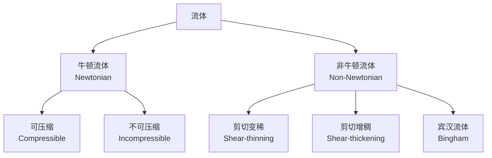
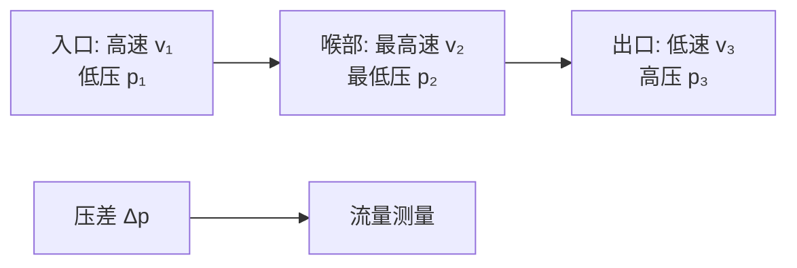

---
aliases: [FluidMechanics, 流体力学, 流体力学概论]
tags: ['02_NaturalSciences', 'Physics', 'ClassicalMechanics', 'Engineering', 'Aerodynamics']
created: 2026-05-17
updated: 2026-05-17
---

# 流体力学 Fluid Mechanics

> 流体力学（Fluid Mechanics）是研究流体（液体和气体）在静止和运动状态下行为规律的学科。它既是理论物理学的分支，也是航空航天、水利工程、能源动力、环境科学和生物医学等工程领域的基础。

## 流体分类

| 分类标准 | 类型 | 定义 | 示例 |
|:--------:|:----:|:----:|:----:|
| 黏性关系 | 牛顿流体 | 剪应力与剪切率成正比 | 水、空气 |
| 黏性关系 | 非牛顿流体 | 剪应力与剪切率非线性 | 血液、牙膏 |
| 可压缩性 | 可压缩流体 | 密度随压力变化 | 气体、高速气流 |
| 可压缩性 | 不可压缩流体 | 密度近似常数 | 液体、低速气体 |

## 流体性质

### 基本物理属性

| 属性 | 符号 | 定义 | 单位 |
|:----:|:----:|:----:|:----:|
| 密度 | $\rho$ | $\rho = m/V$ | kg/m³ |
| 比容 | $v$ | $v = 1/\rho$ | m³/kg |
| 动力黏度 | $\mu$ | 内摩擦系数 | Pa·s |
| 运动黏度 | $\nu$ | $\nu = \mu/\rho$ | m²/s |
| 表面张力 | $\sigma$ | 单位长度上的力 | N/m |
| 压缩系数 | $\kappa$ | $\kappa = -\frac{1}{V}\frac{\partial V}{\partial p}$ | Pa⁻¹ |

### 黏度与温度关系

$$
\mu_{\text{liquid}} \propto \exp\left(\frac{C}{T}\right) \quad \text{(液体黏度随温度升高下降)}
$$

$$
\mu_{\text{gas}} \propto T^{1/2} \quad \text{(气体黏度随温度升高上升)}
$$

## 流体静力学 Fluid Statics

### 静压分布

静止流体中，压力随深度变化：

$$
p = p_0 + \rho g h
$$

其中 $p_0$ 为表面压力，$h$ 为深度。

### 帕斯卡原理 Pascal's Law

封闭流体中，施加的压力等值传递到各处：

$$
\frac{F_1}{A_1} = \frac{F_2}{A_2}
$$

### 阿基米德原理 Archimedes' Principle

浸没物体受到的浮力等于排开流体的重力：

$$
F_b = \rho_{\text{fluid}} \cdot g \cdot V_{\text{displaced}}
$$

**浮力平衡条件**：

| 状态 | 条件 |
|:----:|:----:|
| 沉没 | $\rho_{\text{object}} > \rho_{\text{fluid}}$ |
| 悬浮 | $\rho_{\text{object}} = \rho_{\text{fluid}}$ |
| 浮起 | $\rho_{\text{object}} < \rho_{\text{fluid}}$ |

## 流体动力学 Fluid Dynamics

### 连续性方程 Continuity Equation

质量守恒定律在流体中的表达（定常流动）：

$$
\rho_1 A_1 v_1 = \rho_2 A_2 v_2
$$

不可压缩流体简化：

$$
A_1 v_1 = A_2 v_2 \quad \Rightarrow \quad Q = A v = \text{常数}
$$

其中 $Q$ 为体积流量（m³/s）。

### 伯努利方程 Bernoulli's Equation

理想不可压缩流体的定常无旋流动中：

$$
p + \frac{1}{2}\rho v^2 + \rho g h = \text{常数}
$$

或沿流线：

$$
\frac{p}{\rho g} + \frac{v^2}{2g} + h = \text{常数}
$$

三项分别代表压力头（Pressure Head）、速度头（Velocity Head）和位置头（Elevation Head）。

### 纳维-斯托克斯方程 Navier-Stokes Equations

不可压缩牛顿流体的动量方程：

$$
\rho \left(\frac{\partial \mathbf{v}}{\partial t} + \mathbf{v} \cdot \nabla \mathbf{v}\right) = -\nabla p + \mu \nabla^2 \mathbf{v} + \rho \mathbf{g}
$$

各项物理含义：

| 项 | 名称 | 含义 |
|:--:|:----:|:----:|
| $\rho \frac{\partial \mathbf{v}}{\partial t}$ | 非定常项 | 加速度（当地导数） |
| $\rho \mathbf{v} \cdot \nabla \mathbf{v}$ | 对流项 | 迁移加速度（非线性） |
| $-\nabla p$ | 压力项 | 压力梯度力 |
| $\mu \nabla^2 \mathbf{v}$ | 黏性项 | 黏性扩散力 |
| $\rho \mathbf{g}$ | 体积力项 | 重力等 |

## 流动状态

### 层流与湍流

雷诺数（Reynolds Number）判断流动状态：

$$
Re = \frac{\rho v D}{\mu} = \frac{v D}{\nu}
$$

| 流动状态 | 雷诺数范围 | 特征 |
|:--------:|:----------:|:----:|
| 层流（Laminar） | $Re < 2300$ | 流线有序、无混合 |
| 过渡区 | $2300 < Re < 4000$ | 不稳定 |
| 湍流（Turbulent） | $Re > 4000$ | 随机涡旋、强烈混合 |

### 马赫数 Mach Number

$$
Ma = \frac{v}{c}
$$

其中 $c$ 为当地声速。

| 范围 | 分类 | 特征现象 |
|:----:|:----:|:--------:|
| $Ma < 0.3$ | 不可压缩 | 密度变化可忽略 |
| $0.3 < Ma < 0.8$ | 亚音速 | 可压缩效应明显 |
| $0.8 < Ma < 1.2$ | 跨音速 | 局部激波 |
| $1.2 < Ma < 5.0$ | 超音速 | 激波、膨胀波 |
| $Ma > 5.0$ | 高超音速 | 高温化学反应 |

## 边界层 Boundary Layer

边界层理论由 Ludwig Prandtl（1904 年）提出，将流场分为：

- **边界层内**：黏性效应显著，速度从 0 到 $v_\infty$
- **边界层外**：可视为无黏流（势流）

**边界层厚度**（层流）：

$$
\delta(x) \approx \frac{5.0 x}{\sqrt{Re_x}}
$$

**摩擦阻力系数**：

$$
C_f = \frac{1.328}{\sqrt{Re_L}} \quad \text{(层流)}
$$

$$
C_f = \frac{0.074}{Re_L^{1/5}} \quad \text{(湍流)}
$$

## 工程应用

| 领域 | 应用 | 流体力学原理 |
|:----:|:----:|:-----------:|
| 航空航天 | 机翼升力设计 | 伯努利方程、库塔条件 |
| 水利工程 | 管道输水设计 | 达西-魏斯巴赫公式 |
| 能源动力 | 风力发电机叶片 | 叶素动量理论 |
| 生物医学 | 血流动力学 | 纳维-斯托克斯方程 |
| 环境工程 | 污染物扩散模拟 | 湍流扩散模型 |
| 石油化工 | 多相流输运 | 两相流方程组 |

### 管道压降 Darcy–Weisbach Equation

$$
\Delta p = f \cdot \frac{L}{D} \cdot \frac{\rho v^2}{2}
$$

其中 $f$ 为摩擦因子，由 Moody 图或 Colebrook 方程给出：

$$
\frac{1}{\sqrt{f}} = -2 \log_{10}\left(\frac{\varepsilon/D}{3.7} + \frac{2.51}{Re\sqrt{f}}\right)
$$

## 计算流体力学 Computational Fluid Dynamics (CFD)

数值求解流体控制方程的三大方法：

| 方法 | 原理 | 适用场景 |
|:----:|:----:|:--------:|
| 有限差分法（FDM） | 用差分近似导数 | 结构化网格 |
| 有限体积法（FVM） | 积分形式守恒定律 | 复杂几何（商业软件主流） |
| 有限元法（FEM） | 加权残量法 | 固体-流体耦合 |

## 相关条目

- [[04_EngineeringAndTechnology/EngineeringFundamentals/EngineeringThermophysics/Thermodynamics|Thermodynamics]]
- [[02_NaturalSciences/Mathematics/ComputationalMathematics/NumericalAnalysis|NumericalAnalysis]]
- [[04_EngineeringAndTechnology/AerospaceAndMilitaryEngineering/Aerodynamics/Aerodynamics|Aerodynamics]]
- [[02_NaturalSciences/Mathematics/AppliedMathematics|AppliedMathematics]]
- [[04_EngineeringAndTechnology/EngineeringFundamentals/EngineeringThermophysics/HeatTransfer|HeatTransfer]]
- [[04_EngineeringAndTechnology/HydraulicAndMarineEngineering/HydraulicEngineering/Hydraulics|Hydraulics]]
- [[TurbulenceTheory]]

