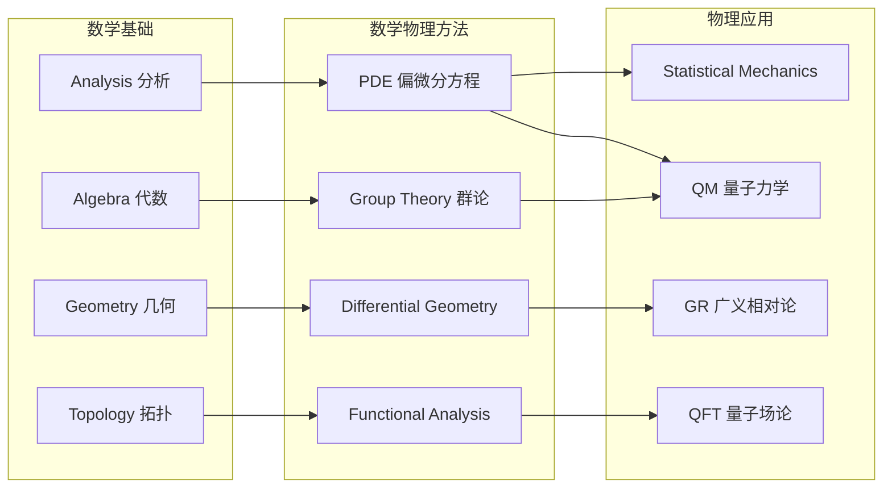

# MathematicalPhysics

## 概述 (Overview)

数学物理 (Mathematical Physics) 是应用数学方法解决物理问题的交叉学科。它不仅仅是"物理学的数学工具"，而是一个将严密的数学结构与物理现实深度结合的研究领域。数学物理为量子力学、相对论、统计力学等现代物理学分支提供了精确的形式化语言。其核心目标是用严格的数学框架描述物理规律，并发展新的数学工具以解决物理中的根本问题。

## 核心领域

## 偏微分方程与物理 (PDEs in Physics)

物理定律通常用偏微分方程 (Partial Differential Equations) 表达。PDE 是数学物理的核心工具。

### 三类经典 PDE

**波动方程 (Wave Equation)**：

$$\frac{\partial^2 u}{\partial t^2} = c^2\nabla^2 u$$

描述声波、电磁波、弦振动等。通解可由达朗贝尔公式 (d'Alembert's Formula) 给出。在一维情形下：$u(x,t) = f(x - ct) + g(x + ct)$。特征线法 (Method of Characteristics) 是求解一阶波动方程的标准方法。

**热传导方程 (Heat Equation)**：

$$\frac{\partial u}{\partial t} = \alpha\nabla^2 u$$

描述热扩散和物质扩散。通过分离变量法 (Separation of Variables) 和傅里叶级数 (Fourier Series) 求解。基本解为高斯核形式：$u(x,t) = \frac{1}{\sqrt{4\pi\alpha t}}e^{-x^2/4\alpha t}$

**拉普拉斯方程 (Laplace Equation)**：

$$\nabla^2 u = 0$$

描述稳态场。调和函数 (Harmonic Functions) 是其解，满足极值原理 (Maximum Principle) 和平均值性质 (Mean Value Property)。在球坐标系中解为球谐函数 (Spherical Harmonics)：

$$\nabla^2 Y_l^m(\theta,\phi) = -\frac{l(l+1)}{r^2}Y_l^m(\theta,\phi)$$

## 变分法 (Calculus of Variations)

变分法是寻找泛函极值的数学方法。物理中的最小作用量原理 (Principle of Least Action) 是其核心应用：

$$\delta S = \delta \int_{t_1}^{t_2} L(q,\dot{q},t)\,dt = 0$$

由此导出的欧拉-拉格朗日方程 (Euler-Lagrange Equation)：

$$\frac{d}{dt}\left(\frac{\partial L}{\partial \dot{q}_i}\right) - \frac{\partial L}{\partial q_i} = 0$$

变分法在经典场论中推广为场论的欧拉-拉格朗日方程：

$$\partial_\mu\left(\frac{\partial \mathcal{L}}{\partial(\partial_\mu\phi)}\right) - \frac{\partial\mathcal{L}}{\partial\phi} = 0$$

## 群论与对称性 (Group Theory & Symmetry)

诺特定理 (Noether's Theorem) 将物理守恒律与对称性联系起来：
- 时间平移对称性 → 能量守恒
- 空间平移对称性 → 动量守恒
- 旋转对称性 → 角动量守恒
- 规范对称性 → 电荷守恒

李群 (Lie Groups) 在粒子物理中起核心作用。标准模型基于 $SU(3) \times SU(2) \times U(1)$ 规范群。李代数 (Lie Algebras) 的生成元满足对易关系：

$$[T^a, T^b] = if^{abc}T^c$$

## 泛函分析 (Functional Analysis)

希尔伯特空间 (Hilbert Space) 是量子力学的数学基础。狄拉克符号 (Dirac Notation) 极大地简化了计算：

$$\langle \psi | \hat{A} | \phi \rangle$$

自伴算子对应可观测物理量。谱定理 (Spectral Theorem) 保证了本征值分解。正则对易关系：

$$[\hat{x}, \hat{p}] = i\hbar$$

## 微分几何 (Differential Geometry)

广义相对论使用黎曼几何 (Riemannian Geometry) 描述弯曲时空。爱因斯坦场方程：

$$R_{\mu\nu} - \frac{1}{2}g_{\mu\nu}R + \Lambda g_{\mu\nu} = \frac{8\pi G}{c^4}T_{\mu\nu}$$

克里斯托费尔符号和黎曼曲率张量：

$$\Gamma^\rho_{\mu\nu} = \frac{1}{2}g^{\rho\sigma}\left(\partial_\mu g_{\nu\sigma} + \partial_\nu g_{\mu\sigma} - \partial_\sigma g_{\mu\nu}\right)$$

$$R^\rho_{\sigma\mu\nu} = \partial_\mu\Gamma^\rho_{\nu\sigma} - \partial_\nu\Gamma^\rho_{\mu\sigma} + \Gamma^\rho_{\mu\lambda}\Gamma^\lambda_{\nu\sigma} - \Gamma^\rho_{\nu\lambda}\Gamma^\lambda_{\mu\sigma}$$

## 特殊函数 (Special Functions)

| 函数 | 微分方程 | 物理应用 |
|------|----------|----------|
| 贝塞尔函数 $J_n(x)$ | $x^2y'' + xy' + (x^2 - n^2)y = 0$ | 圆柱波动、热传导 |
| 勒让德多项式 $P_l(x)$ | $(1-x^2)y'' - 2xy' + l(l+1)y = 0$ | 球对称势、多极展开 |
| 厄米多项式 $H_n(x)$ | $y'' - 2xy' + 2ny = 0$ | 量子谐振子 |
| 拉盖尔多项式 $L_n^k(x)$ | $xy'' + (k+1-x)y' + ny = 0$ | 氢原子径向方程 |

## 格林函数 (Green's Functions)

格林函数法是求解线性微分方程的有力工具：$\mathcal{L}G(x,x') = \delta(x-x')$

解可表示为：$u(x) = \int G(x,x')f(x')\,dx'$

在量子场论中，费曼传播子本质上是格林函数：

$$G_F(x-y) = \int \frac{d^4p}{(2\pi)^4}\frac{i}{p^2 - m^2 + i\varepsilon}e^{-ip\cdot(x-y)}$$

## 积分变换 (Integral Transforms)

傅里叶变换将信号从时域变换到频域：

$$\hat{f}(k) = \int_{-\infty}^{\infty} f(x)e^{-ikx}\,dx,\quad f(x) = \frac{1}{2\pi}\int_{-\infty}^{\infty} \hat{f}(k)e^{ikx}\,dk$$

拉普拉斯变换适用于初值问题：$F(s) = \int_0^{\infty} f(t)e^{-st}\,dt$

## 复分析 (Complex Analysis)

留数定理 (Residue Theorem) 在计算实积分时非常有用：

$$\oint_C f(z)\,dz = 2\pi i\sum_k \text{Res}(f, z_k)$$

## 数值方法 (Numerical Methods)

数学物理中的复杂问题通常需要数值求解。有限差分法 (FDM) 将连续区域离散为网格点。有限元法 (FEM) 将区域划分为单元，在每个单元上近似解。谱方法 (Spectral Method) 使用全局基函数展开，精度高但适用于简单区域。蒙特卡洛方法 (Monte Carlo) 用于统计物理和量子场论中的多维积分。

## 数学物理中的著名问题

- **三体问题 (Three-Body Problem)**：牛顿引力下三体的运动不可积
- **KAM 定理**：不可积系统的扰动保持拟周期运动的条件
- **杨-米尔斯存在性与质量间隙**：千禧年七大数学难题之一
- **纳维-斯托克斯方程的正则性**：流体方程解的光滑性问题
- **孤子与可积系统**：无穷守恒量和 Lax 对的存在条件

## 历史与代表人物

数学物理的发展史：牛顿创立微积分和经典力学；欧拉发展了变分法和流体动力学；拉格朗日和哈密顿完成了分析力学形式化；高斯和黎曼奠定了微分几何；希尔伯特发展了泛函分析；外尔将群论引入物理学。现代数学物理在陈省身、杨振宁、威滕等人的推动下继续发展。威滕 (Edward Witten) 因在弦论和量子场论中的贡献获得菲尔兹奖。

## 数学物理的主要期刊 (Major Journals)

数学物理领域的主要学术期刊包括：《Communications in Mathematical Physics》、《Journal of Mathematical Physics》、《Annales Henri Poincaré》、《Reviews in Mathematical Physics》、《Letters in Mathematical Physics》。中国学者在《中国科学：物理学 力学 天文学》和《物理学报》上也发表了大量数学物理研究。

## 数学物理中的未解决问题 (Open Problems)

千禧年七大难题中杨-米尔斯理论的质量间隙问题是数学物理的核心难题。其他重要开放问题包括：纳维-斯托克斯方程的正则性、铁磁体的低温激发谱、量子霍尔效应的严格数学描述、弦论的数学基础、量子引力的确切数学形式。这些问题推动着数学和物理两个学科的深层互动。

## 数学物理中的著名公式 (Famous Formulas)

$$n! \approx \sqrt{2\pi n}\left(\frac{n}{e}\right)^n \quad\text{(Stirling)}$$

$$e^{i\pi} + 1 = 0 \quad\text{(Euler)}$$

$$\int_{-\infty}^{\infty} e^{-x^2}\,dx = \sqrt{\pi}$$

$$\delta(x) = \frac{1}{2\pi}\int_{-\infty}^{\infty} e^{ikx}\,dk$$

$$\Gamma(z) = \int_0^{\infty} t^{z-1}e^{-t}\,dt$$

$$\zeta(s) = \sum_{n=1}^{\infty}\frac{1}{n^s} = \prod_{p\text{ prime}}\frac{1}{1-p^{-s}}$$

$$u(\nu,T) = \frac{8\pi h\nu^3}{c^3}\frac{1}{e^{h\nu/k_BT} - 1} \quad\text{(Planck)}$$

## 数学物理中的常见技巧 (Common Techniques)

数学物理中的一些常见技巧：对称性简化（利用系统的对称性降低问题维度）、摄动展开（对小参数进行级数展开）、渐进分析 (Asymptotic Analysis) 研究极限行为、维数分析 (Dimensional Analysis) 快速估算、变量分离将 PDE 分解为 ODE、积分变换将微分方程转为代数方程、格林函数构造特定边界条件的解。

## 数学物理的计算工具 (Computational Tools)

现代数学物理研究中常用的计算工具包括：Mathematica 和 Maple 用于符号计算；MATLAB 和 Python (NumPy/SciPy) 用于数值计算；COMSOL Multiphysics 用于有限元模拟；FeynArts 和 FormCalc 用于粒子物理中的费曼图计算。开源软件如 Maxima (符号计算) 和 FreeFEM (有限元) 也被广泛使用。Julia 编程语言在高性能科学计算中日益流行。

## 数学物理与理论物理的区别 (Difference with Theoretical Physics)

数学物理侧重数学方法的严格性和普适性，理论物理侧重物理现象的解释和预测。数学物理家关注：算子的谱理论、PDE 解的存在唯一性、对称群的表示理论等。理论物理学家更关注：计算可观测物理量、与实验数据对比、构建有效模型。两者之间的重叠区域广泛，例如量子场论中的重整化理论既是数学物理的课题也是理论物理的核心。

## 数学物理中的典型问题举例 (Example Problems)

1. 谐振子的量子化：利用阶梯算符方法求解，$a|n\rangle = \sqrt{n}|n-1\rangle$
2. 球对称势的薛定谔方程：分离变量得到径向方程和角向方程
3. 一维散射问题：计算势垒穿透概率 $T = |t|^2$
4. 弦振动问题：波动方程的达朗贝尔解 $u = f(x+ct) + g(x-ct)$
5. 圆柱体的热传导：贝塞尔函数的应用和特征值展开
6. 二维拉普拉斯方程：共形映射将不规则区域映射为圆域
7. 无限深势阱：傅里叶级数展开的波函数
8. 谐振子相干态：最小不确定态 $\Delta x\Delta p = \hbar/2$

## 数学物理中的群表示论 (Group Representation Theory)

SO(3) 群的不可约表示对应轨道角动量 $l=0,1,2,\ldots$，维度 $2l+1$。SU(2) 群是 SO(3) 的双重覆盖，旋量表示对应电子自旋 $s=1/2$。庞加莱群表示对量子场论中粒子分类至关重要。$SU(3)$ 颜色群描述强相互作用，夸克处于 ${\bf 3}$ 和 ${\bf \bar{3}}$ 表示。李代数的根系和邓肯图 (Dynkin Diagram) 分类了所有半单李代数。

## 数学物理与微分方程 (Math Physics & Differential Equations)

数学物理中的 PDE 通常用分离变量法和积分变换法求解。贝塞尔函数、勒让德多项式和球谐函数是求解圆/球对称问题时的标准工具。斯特姆-刘维尔理论 (Sturm-Liouville Theory) 为 PDE 的特征函数展开提供了严格的数学基础。傅里叶级数和傅里叶变换是求解线性 PDE 的最有力工具之一。格林函数法将 PDE 的解表达为源项的积分变换，是量子场论中传播子的数学基础。保角变换 (Conformal Mapping) 将复杂区域的拉普拉斯方程变换为简单区域求解。

## 数学物理与其他学科的联系 (Connections)

数学物理与纯数学（分析、代数、几何、拓扑）有着双向的密切联系。纯粹数学的发展常常受到物理问题的启发，而新的数学工具又为物理学开辟新的可能性。数学物理与量子信息理论共享量子态、纠缠和量子操作的数学语言。数学物理中发展的数值方法在工程科学中得到广泛应用。

## 相关条目

- [[../../../INDEX|当前目录索引]]
