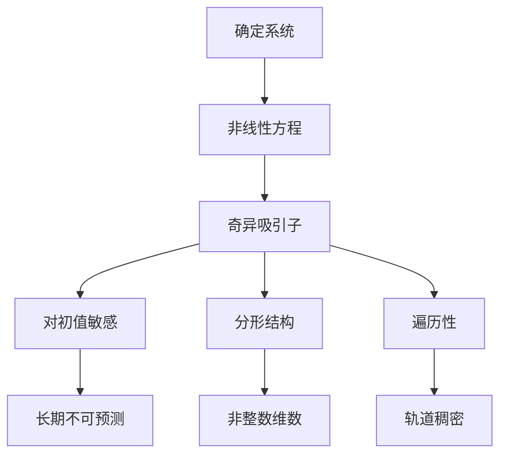
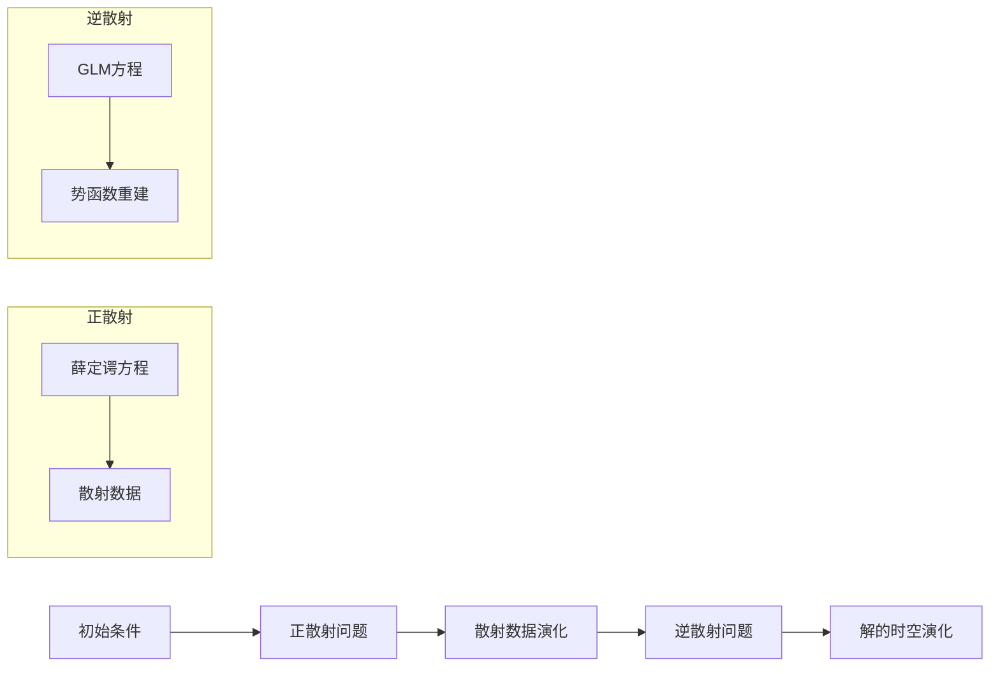

---
aliases:
  - 非线性动力学
  - 混沌理论
  - 孤立子理论
tags:
  - physics
  - classical-mechanics
  - nonlinear-science
  - chaos
  - fractals
  - solitons
---

# 非线性科学 (Nonlinear Science)

## 1 概述 (Overview)

非线性科学研究系统中输入与输出不成正比的现象。与线性系统不同，非线性系统具有叠加原理失效、对初值敏感依赖、自组织行为等特征。其核心分支包括混沌理论 (Chaos Theory)、分形几何 (Fractal Geometry) 和孤立子理论 (Soliton Theory)。

## 2 混沌理论 (Chaos Theory)

### 2.1 洛伦兹系统 (Lorenz System)

1963年，爱德华·洛伦兹 (Edward Lorenz) 在研究大气对流时提出了简化模型：

$$
\begin{cases}
\dot{x} = \sigma (y - x) \\\\
\dot{y} = x (\rho - z) - y \\\\
\dot{z} = xy - \beta z
\end{cases}
$$

其中 $\sigma = 10$、$\rho = 28$、$\beta = 8/3$ 时系统呈现混沌行为，形成著名的洛伦兹吸引子 (Lorenz Attractor)。

### 2.2 李雅普诺夫指数 (Lyapunov Exponent)

混沌系统对初始条件的敏感依赖程度由李雅普诺夫指数量化：

$$
\lambda = \lim_{t \to \infty} \frac{1}{t} \ln \frac{|\delta \mathbf{x}(t)|}{|\delta \mathbf{x}(0)|}
$$

当 $\lambda > 0$ 时，系统呈现混沌行为。最大李雅普诺夫指数 (MLE) 是判断混沌的关键指标。

### 2.3 庞加莱截面与倍周期分岔 (Poincaré Section & Period-Doubling Bifurcation)

费根鲍姆常数 (Feigenbaum Constant) 描述了倍周期分岔的普适性：

$$
\delta = \lim_{n \to \infty} \frac{r_n - r_{n-1}}{r_{n+1} - r_n} \approx 4.6692016
$$

### 2.4 奇异吸引子 (Strange Attractors)

#### 2.4.1 罗斯勒吸引子 (Rössler Attractor)

$$
\begin{cases}
\dot{x} = -y - z \\\\
\dot{y} = x + ay \\\\
\dot{z} = b + z(x - c)
\end{cases}
$$

取 $a = 0.2$、$b = 0.2$、$c = 5.7$ 可得经典的罗斯勒吸引子。

#### 2.4.2 厄农吸引子 (Hénon Attractor)

离散映射形式：

$$
\begin{cases}
x_{n+1} = 1 - a x_n^2 + y_n \\\\
y_{n+1} = b x_n
\end{cases}
$$

标准参数 $a = 1.4$、$b = 0.3$。

## 3 分形理论 (Fractal Theory)

### 3.1 豪斯多夫维数 (Hausdorff Dimension)

分形的核心特征是其维数不为整数。豪斯多夫维数的定义为：

$$
D_H = \lim_{\epsilon \to 0} \frac{\ln N(\epsilon)}{\ln(1/\epsilon)}
$$

其中 $N(\epsilon)$ 是覆盖集合所需边长为 $\epsilon$ 的立方体数目。

### 3.2 经典分形 (Classical Fractals)

| 分形名称 | 豪斯多夫维数 | 生成方式 |
|---------|------------|---------|
| 康托尔集 | $\ln 2 / \ln 3 \approx 0.6309$ | 三等分去中 |
| 谢尔宾斯基地毯 | $\ln 8 / \ln 3 \approx 1.8928$ | 九宫格去中 |
| 门格海绵 | $\ln 20 / \ln 3 \approx 2.7268$ | 体分形 |
| 科赫雪花 | $\ln 4 / \ln 3 \approx 1.2619$ | 三角形迭代 |
| 朱利亚集 | 2.0 | 复映射迭代 |

### 3.3 复分形与曼德勃罗集 (Complex Fractals & Mandelbrot Set)

曼德勃罗集定义为复平面上使 $z_{n+1} = z_n^2 + c$ 收敛的 $c$ 值集合，其中 $z_0 = 0$：

$$
M = \{c \in \mathbb{C} : \lim_{n \to \infty} |z_n| < \infty\}
$$

朱利亚集 (Julia Set) 则为固定 $c$ 下 $z_0$ 的边界集：

$$
J_c = \partial\{z_0 \in \mathbb{C} : \lim_{n \to \infty} |z_n| < \infty\}
$$

### 3.4 分形维数的计算方法

盒维数法 (Box-Counting Dimension)：

$$
D_B = \lim_{\epsilon \to 0} \frac{\ln N_\epsilon}{\ln(1/\epsilon)}
$$

关联维数法 (Correlation Dimension)：

$$
D_C = \lim_{r \to 0} \frac{\ln C(r)}{\ln r}, \quad C(r) = \frac{1}{N^2} \sum_{i \neq j} \Theta(r - |\mathbf{x}_i - \mathbf{x}_j|)
$$

## 4 孤立子理论 (Soliton Theory)

### 4.1 KdV 方程 (Korteweg–de Vries Equation)

描述浅水波中孤立子的传播：

$$
\frac{\partial u}{\partial t} + 6u \frac{\partial u}{\partial x} + \frac{\partial^3 u}{\partial x^3} = 0
$$

单孤立子解 (Single Soliton Solution)：

$$
u(x, t) = \frac{c}{2} \operatorname{sech}^2 \left[ \frac{\sqrt{c}}{2} (x - ct - x_0) \right]
$$

### 4.2 非线性薛定谔方程 (Nonlinear Schrödinger Equation, NLSE)

描述光孤子 (Optical Solitons) 在光纤中的传播：

$$
i \frac{\partial \psi}{\partial t} + \frac{\partial^2 \psi}{\partial x^2} + 2|\psi|^2 \psi = 0
$$

亮孤子解 (Bright Soliton)：

$$
\psi(x, t) = \eta \operatorname{sech}[\eta(x - v_e t)] e^{i(kx - \omega t)}
$$

### 4.3 正弦-戈登方程 (Sine-Gordon Equation)

$$
\frac{\partial^2 \phi}{\partial t^2} - \frac{\partial^2 \phi}{\partial x^2} + \sin \phi = 0
$$

### 4.4 逆散射变换 (Inverse Scattering Transform, IST)

## 5 分岔理论 (Bifurcation Theory)

### 5.1 分岔类型 (Types of Bifurcations)

| 分岔类型 | 法式 (Normal Form) | 示意图 |
|---------|-------------------|-------|
| 鞍结分岔 | $\dot{x} = r + x^2$ | 不动点合并消失 |
| 跨临界分岔 | $\dot{x} = rx - x^2$ | 不动点交换稳定性 |
| 叉形分岔 | $\dot{x} = rx - x^3$ | 对称破缺 |
| 霍普夫分岔 | $\dot{z} = (r + i\omega)z - |z|^2 z$ | 极限环产生 |

### 5.2 霍普夫分岔 (Hopf Bifurcation)

系统参数穿过临界值时，不动点失稳产生极限环。判别准则：

$$
\frac{d}{dr} \operatorname{Re}[\lambda(r)]\big|_{r=r_c} \neq 0, \quad \operatorname{Im}[\lambda(r_c)] \neq 0
$$

## 6 可积系统与不可积性 (Integrable Systems & Nonintegrability)

### 6.1 Lax 对 (Lax Pair)

系统可积的充分条件是存在 Lax 对 $(L, M)$ 满足：

$$
\frac{dL}{dt} = [M, L]
$$

## 7 应用 (Applications)

- **气象学**: 洛伦兹模型用于长期天气预报不确定性的分析
- **流体力学**: KdV 方程描述浅水波和等离子体波
- **光学**: 光纤通信中的光孤子传输
- **生物学**: 心脏节律的混沌控制和心电图分析
- **经济学**: 股市建模中的非线性时间序列分析
- **工程**: 结构动力学中的非线性振动和分岔分析

## 8 数值方法 (Numerical Methods)

混沌系统的数值求解需注意时间步长的选择。经典四阶龙格-库塔法 (RK4)：

$$
\begin{aligned}
k_1 &= f(t_n, y_n) \\\\
k_2 &= f(t_n + \frac{h}{2}, y_n + \frac{h}{2}k_1) \\\\
k_3 &= f(t_n + \frac{h}{2}, y_n + \frac{h}{2}k_2) \\\\
k_4 &= f(t_n + h, y_n + hk_3) \\\\
y_{n+1} &= y_n + \frac{h}{6}(k_1 + 2k_2 + 2k_3 + k_4)
\end{aligned}
$$
