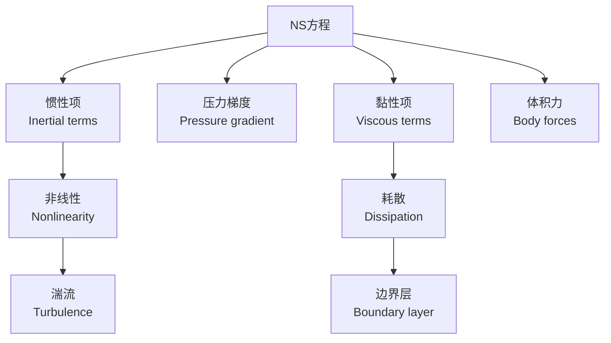

---
aliases:
  - 流体力学
  - Fluid Mechanics
  - 流体动力学
  - Fluid Dynamics
tags:
  - physics
  - fluid-mechanics
  - classical-mechanics
  - continuum-mechanics
---

# 流体力学 (Fluid Mechanics)

## 概述 (Overview)

流体力学 (Fluid Mechanics) 是研究流体（液体和气体）在静止和运动状态下的行为及其与固体边界相互作用的力学分支。它属于连续介质力学 (continuum mechanics) 的一部分，在航空航天、气象学、海洋工程、生物医学等领域有广泛应用。

连续介质假设 (continuum hypothesis) 是流体力学的基石：将流体视为连续填满空间的物质，忽略分子离散结构。在这一假设下，流体的宏观性质（密度 $\rho$、压力 $p$、速度 $\vec{v}$）被定义为空间和时间的连续函数。

---

## 流体静力学 (Fluid Statics)

流体静力学研究静止流体的力学行为。

### 静压力分布 (Hydrostatic Pressure Distribution)

在重力场中，静止流体的压力随深度变化：

$$p(z) = p_0 + \rho g h$$

其中 $p_0$ 是表面压力，$\rho$ 是流体密度，$g$ 是重力加速度，$h$ 是深度。

### 帕斯卡原理 (Pascal's Principle)

施加在封闭流体上的压力会均匀传递到流体的所有部分：

$$\Delta p = \frac{F}{A}$$

### 阿基米德原理 (Archimedes' Principle)

浸没在流体中的物体受到向上的浮力，大小等于排开流体的重量：

$$F_b = \rho g V$$

---

## 流体运动学 (Fluid Kinematics)

### 描述方法 (Description Methods)

| 方法 | 英文 | 描述 |
|------|------|------|
| 拉格朗日法 | Lagrangian | 跟踪单个流体粒子的运动轨迹 |
| 欧拉法 | Eulerian | 在固定空间点观测流体属性随时间变化 |

### 流线与迹线 (Streamlines and Pathlines)

- **流线** (streamline)：在某一瞬时间，与速度矢量相切的曲线
- **迹线** (pathline)：单个流体粒子随时间运动的轨迹
- **脉线** (streakline)：经过同一空间点的所有粒子的连线

对于定常流动 (steady flow)，流线与迹线重合。

---

## 流体动力学基本方程 (Fundamental Equations of Fluid Dynamics)

### 连续性方程 (Continuity Equation)

质量守恒定律在流体力学中的表达：

$$\frac{\partial \rho}{\partial t} + \nabla \cdot (\rho \vec{v}) = 0$$

对于不可压缩流体 (incompressible flow)，$\rho$ 为常数，方程简化为：

$$\nabla \cdot \vec{v} = 0$$

### 欧拉方程 (Euler's Equation)

忽略黏性时，由牛顿第二定律导出：

$$\rho \frac{D\vec{v}}{Dt} = -\nabla p + \rho \vec{g}$$

其中 $\frac{D}{Dt} = \frac{\partial}{\partial t} + \vec{v} \cdot \nabla$ 是物质导数 (material derivative)。

### 伯努利方程 (Bernoulli's Equation)

对于无黏、不可压缩、定常流动，沿流线有：

$$p + \frac{1}{2}\rho v^2 + \rho g h = \text{常数}$$

伯努利方程反映了压力能、动能和势能之间的转换关系。

---

## 纳维-斯托克斯方程 (Navier-Stokes Equations)

纳维-斯托克斯方程 (Navier-Stokes equations) 是描述黏性流体运动的非线性偏微分方程组：

$$\rho \frac{D\vec{v}}{Dt} = -\nabla p + \mu \nabla^2 \vec{v} + \rho \vec{g}$$

其中 $\mu$ 是动力黏度 (dynamic viscosity)，$\mu \nabla^2 \vec{v}$ 项代表黏性力。完整的张量形式为：

$$\rho \left(\frac{\partial v_i}{\partial t} + v_j \frac{\partial v_i}{\partial x_j}\right) = -\frac{\partial p}{\partial x_i} + \mu \frac{\partial^2 v_i}{\partial x_j \partial x_j} + \rho g_i$$

---

## 边界层理论 (Boundary Layer Theory)

边界层 (boundary layer) 是靠近固体表面、黏性效应显著的薄层区域。普朗特 (Ludwig Prandtl) 在1904年提出边界层概念，极大地简化了黏性流动分析。

### 边界层特征 (Boundary Layer Characteristics)

- 边界层厚度 $\delta(x)$ 沿流动方向增长
- 层流边界层：雷诺数较小，流动有序
- 湍流边界层：雷诺数较大，流动混乱
- 转捩 (transition) 发生在临界雷诺数 $Re_c \approx 5 \times 10^5$

边界层分离 (separation) 发生在逆压梯度区域，导致压差阻力大幅增加。

---

## 湍流 (Turbulence)

湍流 (turbulence) 是流体力学中尚未完全解决的核心难题之一。

### 湍流的特征 (Characteristics of Turbulence)

- **随机性**：速度场在时间和空间上随机脉动
- **多尺度性**：包含从最大尺度（含能涡）到最小尺度（耗散涡）的连续谱
- **非线性**：惯性项的非线性导致能量在尺度间传递
- **高耗散**：湍流比层流具有大得多的能量耗散率

### 雷诺数 (Reynolds Number)

$$Re = \frac{\rho v L}{\mu}$$

雷诺数表征惯性力与黏性力的比值，是判断流态的关键无量纲数。

### 科尔莫戈罗夫理论 (Kolmogorov Theory)

科尔莫戈罗夫 (Kolmogorov) 在1941年提出湍流的统计理论，预测能谱满足 $-5/3$ 律：

$$E(k) = C \varepsilon^{2/3} k^{-5/3}$$

其中 $k$ 是波数，$\varepsilon$ 是能量耗散率，$C$ 是科尔莫戈罗夫常数。

---

## 势流理论 (Potential Flow Theory)

对于无旋、不可压缩的流动，速度场可由速度势 $\phi$ 导出：

$$\vec{v} = \nabla \phi$$

代入连续性方程得到拉普拉斯方程：

$$\nabla^2 \phi = 0$$

势流理论通过复变函数方法提供解析解，是理想流体力学的重要工具。

---

## 可压缩流体力学 (Compressible Fluid Dynamics)

当流速接近或超过声速时，必须考虑流体的可压缩性。

### 马赫数 (Mach Number)

$$Ma = \frac{v}{c}$$

其中 $c$ 是当地声速。根据马赫数可对流动分类：

| 范围 | 类别 | 英文 |
|------|------|------|
| $Ma < 0.3$ | 不可压缩 | Incompressible |
| $0.3 < Ma < 0.8$ | 亚声速 | Subsonic |
| $0.8 < Ma < 1.2$ | 跨声速 | Transonic |
| $1.2 < Ma < 5.0$ | 超声速 | Supersonic |
| $Ma > 5.0$ | 高超声速 | Hypersonic |

---

## 计算流体力学 (Computational Fluid Dynamics)

计算流体力学 (CFD) 使用数值方法求解流体力学方程：

### 主要数值方法

- **有限差分法** (FDM)：在结构化网格上离散偏微分方程
- **有限体积法** (FVM)：基于积分形式的守恒定律，确保守恒性
- **有限元法** (FEM)：在非结构化网格上使用变分方法
- **格子玻尔兹曼方法** (LBM)：从介观动力学角度模拟流体

### 湍流数值模拟方法

| 方法 | 英文 | 描述 |
|------|------|------|
| DNS | Direct Numerical Simulation | 直接求解所有尺度 |
| LES | Large Eddy Simulation | 大涡模拟，模化小涡 |
| RANS | Reynolds-Averaged Navier-Stokes | 雷诺平均，模化全部湍流 |
| DES | Detached Eddy Simulation | 分离涡模拟，混合方法 |

---

## 应用领域 (Application Areas)

- **航空航天**：飞行器气动设计、推进系统
- **气象与海洋**：大气环流、海洋洋流、风暴预测
- **生物力学**：血液循环、呼吸气流、鱼类游动
- **能源工程**：风力发电机、涡轮机械、管道输送
- **环境工程**：污染物扩散、河流动力学

---

## 参考与延伸阅读 (References and Further Reading)

1. *Fluid Mechanics* — L. D. Landau and E. M. Lifshitz
2. *Fluid Dynamics* — G. K. Batchelor
3. *Viscous Fluid Flow* — F. M. White
4. *Turbulence* — U. Frisch
5. *Computational Fluid Dynamics* — J. H. Ferziger and M. Perić
6. *Boundary-Layer Theory* — H. Schlichting and K. Gersten
