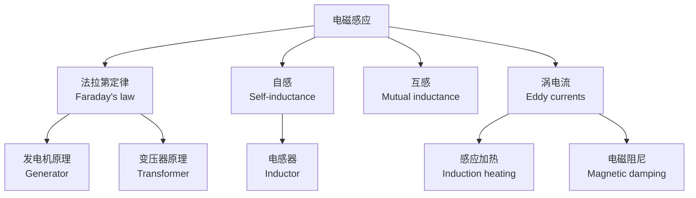

---
aliases:
  - 磁学与电磁感应
  - Magnetism and Electromagnetic Induction
  - 磁学
  - 电磁感应
  - Faraday's law
tags:
  - physics
  - electromagnetism
  - magnetism
  - induction
  - maxwell-equations
---

# 磁学与电磁感应 (Magnetism and Electromagnetic Induction)

## 概述 (Overview)

磁学与电磁感应是经典电磁理论的核心组成部分。磁学研究磁场 (magnetic field) 的产生、性质及与物质的相互作用；电磁感应则揭示了变化的磁场如何激发电场，是现代电力工业的理论基石。麦克斯韦 (James Clerk Maxwell) 最终将电学和磁学统一为完整的电磁理论。

---

## 磁场的基本概念 (Basic Concepts of Magnetic Field)

### 磁场与磁感应强度 (Magnetic Field and Magnetic Flux Density)

磁场由运动的电荷产生。磁感应强度 $\vec{B}$ 是描述磁场的基本物理量，其单位为特斯拉 (Tesla, T)。

$$\vec{F} = q\vec{v} \times \vec{B}$$

这是洛伦兹磁力公式，其中 $q$ 是电荷量，$\vec{v}$ 是速度。

### 毕奥-萨伐尔定律 (Biot-Savart Law)

电流元 $I d\vec{l}$ 在空间产生的磁场为：

$$d\vec{B} = \frac{\mu_0}{4\pi} \frac{I d\vec{l} \times \hat{r}}{r^2}$$

对整条导线积分可得总磁场。

### 安培环路定律 (Ampère's Circuital Law)

$$\oint \vec{B} \cdot d\vec{l} = \mu_0 I_{\text{enc}}$$

磁场沿闭合回路的环量等于穿过回路的总电流乘以 $\mu_0$。

---

## 磁矢势 (Magnetic Vector Potential)

磁矢势 $\vec{A}$ 定义为 $\vec{B} = \nabla \times \vec{A}$。在库仑规范 (Coulomb gauge) $\nabla \cdot \vec{A} = 0$ 下：

$$\nabla^2 \vec{A} = -\mu_0 \vec{J}$$

方程的解为：

$$\vec{A}(\vec{r}) = \frac{\mu_0}{4\pi} \int \frac{\vec{J}(\vec{r}')}{|\vec{r} - \vec{r}'|} d^3r'$$

磁矢势在量子力学（如阿哈罗诺夫-玻姆效应）中具有可观测的物理效应。

---

## 物质的磁性 (Magnetism in Matter)

### 磁化强度 (Magnetization)

物质在外磁场中会产生磁化。磁化强度 $\vec{M}$ 定义为单位体积内的磁偶极矩。

$$\vec{B} = \mu_0(\vec{H} + \vec{M})$$

其中 $\vec{H}$ 是磁场强度 (magnetic field intensity)。

### 磁化率与磁导率 (Susceptibility and Permeability)

对于线性介质：

$$\vec{M} = \chi_m \vec{H}$$
$$\vec{B} = \mu \vec{H} = \mu_0(1 + \chi_m) \vec{H}$$

| 材料类型 | $\chi_m$ | 示例 |
|---------|----------|------|
| 抗磁性 | $\chi_m < 0$，$\approx -10^{-5}$ | 铜、金、水 |
| 顺磁性 | $\chi_m > 0$，$\approx 10^{-3}$ | 铝、铂、氧 |
| 铁磁性 | $\chi_m \gg 1$ | 铁、镍、钴 |

---

## 电磁感应 (Electromagnetic Induction)

### 法拉第电磁感应定律 (Faraday's Law of Induction)

法拉第 (Michael Faraday) 于1831年发现：变化的磁场会在导体回路中产生感应电动势 (electromotive force, EMF)：

$$\mathcal{E} = -\frac{d\Phi_B}{dt}$$

其中磁通量 $\Phi_B = \int \vec{B} \cdot d\vec{A}$。

### 楞次定律 (Lenz's Law)

感应电流的方向总是反抗引起感应电流的磁通量变化。负号体现了能量守恒。

### 感应电场 (Induced Electric Field)

变化的磁场产生非保守电场：

$$\oint \vec{E} \cdot d\vec{l} = -\int \frac{\partial \vec{B}}{\partial t} \cdot d\vec{A}$$

微分形式：

$$\nabla \times \vec{E} = -\frac{\partial \vec{B}}{\partial t}$$

---

## 自感与互感 (Self-Inductance and Mutual Inductance)

### 自感 (Self-Inductance)

线圈中的电流变化会在自身中产生感应电动势：

$$\mathcal{E} = -L \frac{dI}{dt}$$

自感系数 $L$ 取决于线圈的几何形状和磁介质。螺线管的自感：

$$L = \mu_0 \frac{N^2 A}{l}$$

### 互感 (Mutual Inductance)

两个线圈之间的互感由互感系数 $M$ 描述：

$$\mathcal{E}_1 = -M \frac{dI_2}{dt}, \quad \mathcal{E}_2 = -M \frac{dI_1}{dt}$$

互感系数满足 $M_{12} = M_{21}$。

---

## 麦克斯韦方程组 (Maxwell's Equations)

麦克斯韦在安培环路定律中引入位移电流 (displacement current) 项，完成了电磁理论的统一。

### 积分形式 (Integral Form)

$$\oint \vec{E} \cdot d\vec{A} = \frac{Q}{\varepsilon_0}$$

$$\oint \vec{B} \cdot d\vec{A} = 0$$

$$\oint \vec{E} \cdot d\vec{l} = -\int \frac{\partial \vec{B}}{\partial t} \cdot d\vec{A}$$

$$\oint \vec{B} \cdot d\vec{l} = \mu_0 I + \mu_0\varepsilon_0 \int \frac{\partial \vec{E}}{\partial t} \cdot d\vec{A}$$

### 微分形式 (Differential Form)

| 方程 | 名称 | 物理含义 |
|------|------|---------|
| $\nabla \cdot \vec{E} = \rho/\varepsilon_0$ | 高斯定律 | 电荷是电场源 |
| $\nabla \cdot \vec{B} = 0$ | 磁高斯定律 | 无磁单极子 |
| $\nabla \times \vec{E} = -\partial\vec{B}/\partial t$ | 法拉第定律 | 变化磁场产生电场 |
| $\nabla \times \vec{B} = \mu_0\vec{J} + \mu_0\varepsilon_0\partial\vec{E}/\partial t$ | 安培-麦克斯韦定律 | 电流与变化电场产生磁场 |

---

## 电磁波的产生 (Generation of Electromagnetic Waves)

麦克斯韦方程组预言了电磁波的存在。在真空中，电磁波满足波动方程：

$$\nabla^2 \vec{E} = \mu_0\varepsilon_0 \frac{\partial^2 \vec{E}}{\partial t^2}$$

$$\nabla^2 \vec{B} = \mu_0\varepsilon_0 \frac{\partial^2 \vec{B}}{\partial t^2}$$

波速为光速：

$$c = \frac{1}{\sqrt{\mu_0\varepsilon_0}} \approx 3.0 \times 10^8 \, \text{m/s}$$

---

## 磁场能量与磁能密度 (Magnetic Energy and Energy Density)

磁场存储能量。磁能密度为：

$$u_B = \frac{B^2}{2\mu_0}$$

电感器存储的磁能为：

$$U = \frac{1}{2}LI^2$$

---

## 电磁感应技术的应用 (Applications of Electromagnetic Induction)

| 技术 | 原理 | 应用场景 |
|------|------|---------|
| 发电机 | 导体在磁场中旋转产生交流电 | 电力生产 |
| 变压器 | 互感原理升降电压 | 电力传输 |
| 感应电动机 | 旋转磁场驱动转子 | 工业驱动 |
| 无线充电 | 谐振互感耦合 | 手机、电动汽车 |
| 感应炉 | 涡电流产生焦耳热 | 金属冶炼 |
| 磁悬浮 | 电磁力克服重力 | 高速列车 |

---

## 磁学与电磁感应的现代发展 (Modern Developments)

- **巨磁阻效应** (Giant Magnetoresistance, GMR)：1988年发现，2007年诺贝尔物理学奖，推动硬盘读头技术革命
- **自旋转移力矩** (Spin-Transfer Torque, STT)：利用自旋极化电流操控磁化方向
- **拓扑绝缘体中的电磁响应**：轴子电动力学 (axion electrodynamics)
- **磁通量子化** (flux quantization) 与超导量子干涉

---

## 参考与延伸阅读 (References and Further Reading)

1. *Introduction to Electrodynamics* — D. J. Griffiths
2. *Classical Electrodynamics* — J. D. Jackson
3. *Electricity and Magnetism* — E. M. Purcell and D. J. Morin
4. *The Feynman Lectures on Physics, Vol. II* — R. P. Feynman
5. *Magnetism and Magnetic Materials* — J. M. D. Coey
6. *Electromagnetic Fields* — R. K. Wangsness
