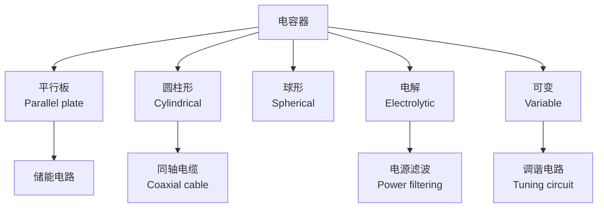

---
aliases:
  - 静电学
  - Electrostatics
  - 静电场
  - 静电现象
tags:
  - physics
  - electromagnetism
  - electrostatics
  - electric-field
  - potential
---

# 静电学 (Electrostatics)

## 概述 (Overview)

静电学 (Electrostatics) 是电磁学中研究静止电荷 (stationary charges) 所产生的电场及其相互作用的分支。静电现象是人类最早认识的电学现象——古希腊人已发现琥珀摩擦起电。现代静电学是高压工程、半导体器件和分子生物学等领域的重要基础。

---

## 电荷与库仑定律 (Electric Charge and Coulomb's Law)

### 电荷的基本性质 (Fundamental Properties of Charge)

- **量子化**：电荷以元电荷 $e = 1.602 \times 10^{-19}$ C 为单位
- **守恒性**：孤立的电荷代数和保持不变
- **可加性**：总电荷是各电荷的代数和

### 库仑定律 (Coulomb's Law)

库仑 (Charles-Augustin de Coulomb) 在1785年通过扭秤实验确立了静电力的平方反比定律：

$$F = k_e \frac{|q_1 q_2|}{r^2}$$

其中 $k_e = \frac{1}{4\pi\varepsilon_0} \approx 8.988 \times 10^9$ N·m²/C²。矢量形式：

$$\vec{F}_{12} = \frac{1}{4\pi\varepsilon_0} \frac{q_1 q_2}{r_{12}^2} \hat{r}_{12}$$

---

## 电场 (Electric Field)

### 电场强度 (Electric Field Intensity)

电场强度定义为试探电荷所受的力与电荷量之比：

$$\vec{E} = \frac{\vec{F}}{q_0}$$

点电荷产生的电场：

$$\vec{E}(\vec{r}) = \frac{1}{4\pi\varepsilon_0} \frac{q}{r^2} \hat{r}$$

### 叠加原理 (Superposition Principle)

多个点电荷产生的总电场为各电场矢量和：

$$\vec{E}_{\text{total}} = \sum_i \vec{E}_i = \frac{1}{4\pi\varepsilon_0} \sum_i \frac{q_i}{r_i^2} \hat{r}_i$$

连续电荷分布的电场：

$$\vec{E}(\vec{r}) = \frac{1}{4\pi\varepsilon_0} \int \frac{\rho(\vec{r}')}{|\vec{r} - \vec{r}'|^2} \hat{\mathcal{R}} \, d^3r'$$

---

## 高斯定律 (Gauss's Law)

### 电通量 (Electric Flux)

$$\Phi_E = \int_S \vec{E} \cdot d\vec{A}$$

### 高斯定律表述 (Statement of Gauss's Law)

通过闭合面的电通量等于面内净电荷除以 $\varepsilon_0$：

$$\oint_S \vec{E} \cdot d\vec{A} = \frac{Q_{\text{enc}}}{\varepsilon_0}$$

微分形式：

$$\nabla \cdot \vec{E} = \frac{\rho}{\varepsilon_0}$$

### 高斯定律的应用 (Applications of Gauss's Law)

利用高斯定律可简便计算高对称性电荷分布的电场：

| 电荷分布 | 对称性 | 电场大小 |
|---------|--------|---------|
| 均匀带电球壳 | 球对称 | $E = \frac{1}{4\pi\varepsilon_0}\frac{Q}{r^2}$ (球外)；$0$ (球内) |
| 无限长均匀线电荷 | 柱对称 | $E = \frac{\lambda}{2\pi\varepsilon_0 r}$ |
| 无限大均匀带电平面 | 平面对称 | $E = \frac{\sigma}{2\varepsilon_0}$ |

---

## 电势与电势能 (Electric Potential and Potential Energy)

### 电势 (Electric Potential)

电场是保守场，可以定义标量势函数 $V$：

$$\vec{E} = -\nabla V$$

点电荷产生的电势：

$$V(\vec{r}) = \frac{1}{4\pi\varepsilon_0} \frac{q}{r}$$

### 电势与电场的关系 (Relation Between Potential and Field)

$$V_b - V_a = -\int_a^b \vec{E} \cdot d\vec{l}$$

### 静电势能 (Electrostatic Potential Energy)

点电荷系的势能：

$$U = \frac{1}{4\pi\varepsilon_0} \sum_{i<j} \frac{q_i q_j}{r_{ij}}$$

连续电荷分布的势能：

$$U = \frac{1}{2} \int \rho V \, d\tau$$

---

## 电场中的导体 (Conductors in Electrostatic Equilibrium)

静电平衡时导体的性质：

- 导体内部电场为零
- 所有净电荷分布在导体表面
- 导体表面是等势面
- 表面附近电场垂直于表面：$E = \frac{\sigma}{\varepsilon_0}$
- 尖端放电效应：曲率半径越小，电荷面密度越大

### 静电屏蔽 (Electrostatic Shielding)

中空导体（法拉第笼, Faraday cage）可屏蔽内部与外部的电场。

---

## 电容器与电容 (Capacitors and Capacitance)

### 电容定义 (Definition of Capacitance)

$$C = \frac{Q}{V}$$

### 常见电容器 (Common Capacitors)

| 类型 | 电容公式 |
|------|---------|
| 平行板电容器 | $C = \varepsilon_0 \frac{A}{d}$ |
| 球形电容器 | $C = 4\pi\varepsilon_0 \frac{ab}{b-a}$ |
| 圆柱形电容器 | $C = \frac{2\pi\varepsilon_0 L}{\ln(b/a)}$ |

### 电容器的串并联 (Series and Parallel Combinations)

- **串联**：$\frac{1}{C_{\text{eq}}} = \sum_i \frac{1}{C_i}$
- **并联**：$C_{\text{eq}} = \sum_i C_i$

### 静电能 (Electrostatic Energy)

电容器存储的能量：

$$U = \frac{1}{2}CV^2 = \frac{1}{2}QV = \frac{Q^2}{2C}$$

电场能量密度：

$$u_E = \frac{1}{2}\varepsilon_0 E^2$$

---

## 电介质 (Dielectrics)

### 极化机制 (Polarization Mechanisms)

- **电子极化**：电子云相对原子核位移
- **离子极化**：正负离子相对位移
- **取向极化**：极性分子在电场中转向

### 极化强度与介电常数 (Polarization and Dielectric Constant)

$$\vec{P} = \varepsilon_0 \chi_e \vec{E}$$

电位移矢量 (electric displacement)：

$$\vec{D} = \varepsilon_0 \vec{E} + \vec{P} = \varepsilon \vec{E}$$

介电常数 $\varepsilon = \varepsilon_0 \varepsilon_r$，相对介电常数 $\varepsilon_r = 1 + \chi_e$。

### 电介质中的高斯定律 (Gauss's Law in Dielectrics)

$$\oint \vec{D} \cdot d\vec{A} = Q_{\text{free, enc}}$$

---

## 静电场的唯一性定理 (Uniqueness Theorem)

给定导体上的电势或电荷分布后，静电场有唯一解。这一定理为镜像法 (method of images) 等解析方法提供了理论保证。

---

## 静电应用与相关领域 (Applications of Electrostatics)

| 应用 | 原理 | 领域 |
|------|------|------|
| 静电复印机 | 光导材料的静电成像 | 办公设备 |
| 静电除尘器 | 荷电粒子在电场中偏转 | 环保工程 |
| 范德格拉夫起电机 | 摩擦起电与静电传输 | 粒子加速器 |
| 静电喷涂 | 带电涂料吸附于工件 | 制造业 |
| 静电防护 | 导电路径防止静电积累 | 电子工业 |
| 电泳 | 带电粒子在电场中迁移 | 生物化学 |

---

## 计算静电学 (Computational Electrostatics)

实际问题的求解通常需要数值方法：

- **有限差分法** (FDM)：求解拉普拉斯方程
- **边界元法** (BEM)：仅对边界离散
- **蒙特卡罗方法**：随机行走求解电势
- **分子动力学模拟**：介观尺度的静电效应

---

## 参考与延伸阅读 (References and Further Reading)

1. *Introduction to Electrodynamics* — D. J. Griffiths
2. *Classical Electricity and Magnetism* — W. K. H. Panofsky and M. Phillips
3. *Electromagnetism: Problems and Solutions* — Yung-Kuo Lim
4. *Static and Dynamic Electricity* — W. R. Smythe
5. *The Feynman Lectures on Physics, Vol. II* — R. P. Feynman
6. *Electrodynamics of Continuous Media* — L. D. Landau and E. M. Lifshitz
