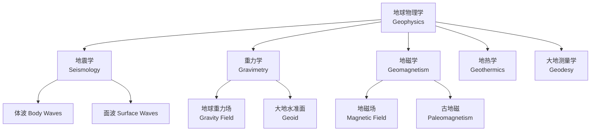
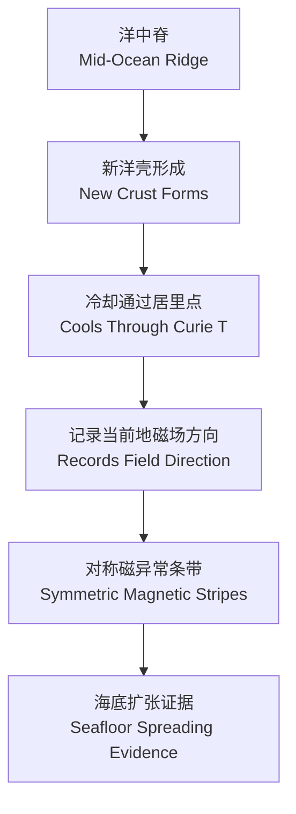

---
aliases:
  - Geophysics
  - 地球物理
  - 地球物理学概论
tags:
  - earth-science
  - geophysics
  - seismology
  - geomagnetism
  - geodesy
created: 2025-01-10
updated: 2025-05-16
---

# 地球物理学 (Geophysics)

## 概述 (Overview)

地球物理学是一门应用物理学原理研究地球内部结构、组成和动力学过程的学科。它涵盖了地震学、重力学、地磁学、地热学等多个分支。



## 地球内部结构 (Earth's Internal Structure)

### 分层模型 (Layer Model)

| 层 (Layer) | 深度范围 (Depth Range) | 状态 (State) | 主要成分 (Composition) |
|---|---|---|---|
| 地壳 (Crust) | $0-35$ km | 固态 | 硅铝质 (大陆) / 硅镁质 (海洋) |
| 地幔 (Mantle) | $35-2890$ km | 固态 (部分熔融) | 橄榄石、辉石 |
| 外核 (Outer Core) | $2890-5150$ km | 液态 | 铁、镍合金 |
| 内核 (Inner Core) | $5150-6371$ km | 固态 | 铁、镍合金 |

### 地震波速结构 (Seismic Velocity Structure)

P波 (纵波) 和 S波 (横波) 速度随深度的变化：

$$v_P = \sqrt{\frac{K + 4\mu/3}{\rho}}, \quad v_S = \sqrt{\frac{\mu}{\rho}}$$

其中 $K$ 是体积模量，$\mu$ 是剪切模量，$\rho$ 是密度。

## 地震学 (Seismology)

### 地震波类型 (Types of Seismic Waves)

```mermaid
flowchart LR
    A[地震波<br/>Seismic Waves] --> B[体波<br/>Body Waves]
    A --> C[面波<br/>Surface Waves]
    B --> D[P 波 (纵波)<br/>Primary / Compressional]
    B --> E[S 波 (横波)<br/>Secondary / Shear]
    C --> F[勒夫波<br/>Love Waves]
    C --> G[瑞利波<br/>Rayleigh Waves]
```

### 地震定位 (Earthquake Location)

使用 P 波和 S 波的到时差 $\Delta t = t_S - t_P$ 计算震源距离：

$$D = \frac{v_P v_S}{v_P - v_S} \Delta t$$

### 震级与能量 (Magnitude and Energy)

| 震级类型 (Magnitude Type) | 定义 (Definition) | 适用范围 (Range) |
|---|---|---|
| 里氏震级 $M_L$ | $M_L = \log A - \log A_0$ | 局部地震 |
| 面波震级 $M_S$ | $M_S = \log(A/T) + \sigma(\Delta)$ | 浅源远震 |
| 体波震级 $m_b$ | $m_b = \log(A/T) + Q(\Delta, h)$ | 深源地震 |
| 矩震级 $M_w$ | $M_w = \frac{2}{3}\log M_0 - 6.07$ | 所有地震 |

地震矩 (seismic moment)：

$$M_0 = \mu A D$$

### 地震层析成像 (Seismic Tomography)

地震层析成像类似于医学 CT，利用大量地震波的走时数据反演地球内部的速度结构。基本方程为：

$$t_i = \int_{ray_i} \frac{ds}{v(\mathbf{r})}$$

## 重力学 (Gravimetry)

### 地球重力场 (Earth's Gravity Field)

正常重力公式 (Somigliana 公式)：

$$g(\phi) = g_e(1 + \beta \sin^2\phi + \beta' \sin^2 2\phi)$$

### 布格异常 (Bouguer Anomaly)

重力异常经过自由空气校正和布格校正后：

$$\Delta g_B = g_{obs} - g_{ref} + \delta g_{FA} - \delta g_B + \delta g_T$$

其中各项校正：
- 自由空气校正：$\delta g_{FA} \approx 0.3086h$ mGal/m
- 布格校正：$\delta g_B = 2\pi G\rho h$
- 地形校正：$\delta g_T$（取决于地形起伏）

### 重力反演 (Gravity Inversion)

$$g_z(\mathbf{r}) = G \int_V \frac{\rho(\mathbf{r}')(z - z')}{|\mathbf{r} - \mathbf{r}'|^3} dV'$$

## 地磁学 (Geomagnetism)

### 地磁场 (Earth's Magnetic Field)

地磁场主要由三个来源组成：

$$\mathbf{B}_{obs} = \mathbf{B}_{主核场} + \mathbf{B}_{地壳场} + \mathbf{B}_{外源场}$$

### 高斯系数 (Gauss Coefficients)

地磁位 $\Phi$ 的球谐展开：

$$\Phi = a\sum_{n=1}^\infty\sum_{m=0}^n \left(\frac{a}{r}\right)^{n+1}(g_n^m\cos m\phi + h_n^m\sin m\phi)P_n^m(\cos\theta)$$

### 古地磁 (Paleomagnetism)

地磁极性倒转历史可以通过海底磁异常条带 (magnetic stripes) 重建。



### 地磁发电机理论 (Dynamo Theory)

地核磁流体动力学 (Magnetohydrodynamics, MHD) 方程：

$$\frac{\partial \mathbf{B}}{\partial t} = \nabla \times (\mathbf{v} \times \mathbf{B}) + \eta \nabla^2 \mathbf{B}$$

磁雷诺数 (magnetic Reynolds number)：

$$Rm = \frac{UL}{\eta}$$

当 $Rm > Rm_c$ 时，发电机自激 (self-excitation) 成为可能。

## 地热学 (Geothermics)

### 热流 (Heat Flow)

地球表面平均热流密度：

$$q = -k\frac{dT}{dz} \approx 87 \text{ mW/m}^2$$

热流的来源：
- 原始热量 (primordial heat)：约 20-30%
- 放射性衰变热 (radiogenic heat)：约 70-80%

### 地温梯度 (Geothermal Gradient)

大陆地壳典型地温梯度约为 20-30 K/km。热传导方程：

$$\frac{\partial T}{\partial t} = \kappa \nabla^2 T + \frac{A}{\rho c_p}$$

其中 $\kappa = k/(\rho c_p)$ 是热扩散率 (thermal diffusivity)，$A$ 是放射性生热率。

## 岩石圈动力学 (Lithosphere Dynamics)

### 板块运动速度

全球板块运动可以从空间大地测量 (GPS/VLBI/SLR) 获得。NNR-MORVEL56 模型给出了相对稳定板块的运动速度。

### 板内应力 (Intraplate Stress)

板内应力场主要由以下因素驱动：
- 洋中脊推挤力 (ridge push)
- 板块拖拽力 (slab pull)
- 地幔对流拖曳力 (mantle drag)
- 碰撞阻力 (collision resistance)

## 地球物理勘探方法 (Geophysical Exploration Methods)

| 方法 (Method) | 测量参数 (Parameter) | 应用 (Application) |
|---|---|---|
| 地震反射 (Seismic Reflection) | 反射波走时和振幅 | 油气勘探、地壳结构 |
| 地震折射 (Seismic Refraction) | 首波走时 | 莫霍面深度、地壳厚度 |
| 大地电磁 (Magnetotelluric) | 电场和磁场变化 | 地壳电性结构、地热资源 |
| 可控源电磁 (CSEM) | 人工电磁场响应 | 海底油气探测 |
| 高精度重力 (Gravity) | 重力异常 | 矿产资源、地质构造 |
| 磁法 (Magnetic) | 磁异常 | 铁矿、考古、地质填图 |

## 地球参考模型 (Reference Earth Model)

PREM (Preliminary Reference Earth Model) 是广泛使用的地球一维参考模型。它给出了密度、P 波速度和 S 波速度随深度的径向分布。

$$v_P(r) = \sum_{i=0}^3 a_{Pi} r^i, \quad v_S(r) = \sum_{i=0}^3 a_{Si} r^i, \quad \rho(r) = \sum_{i=0}^3 a_{\rho i} r^i$$
