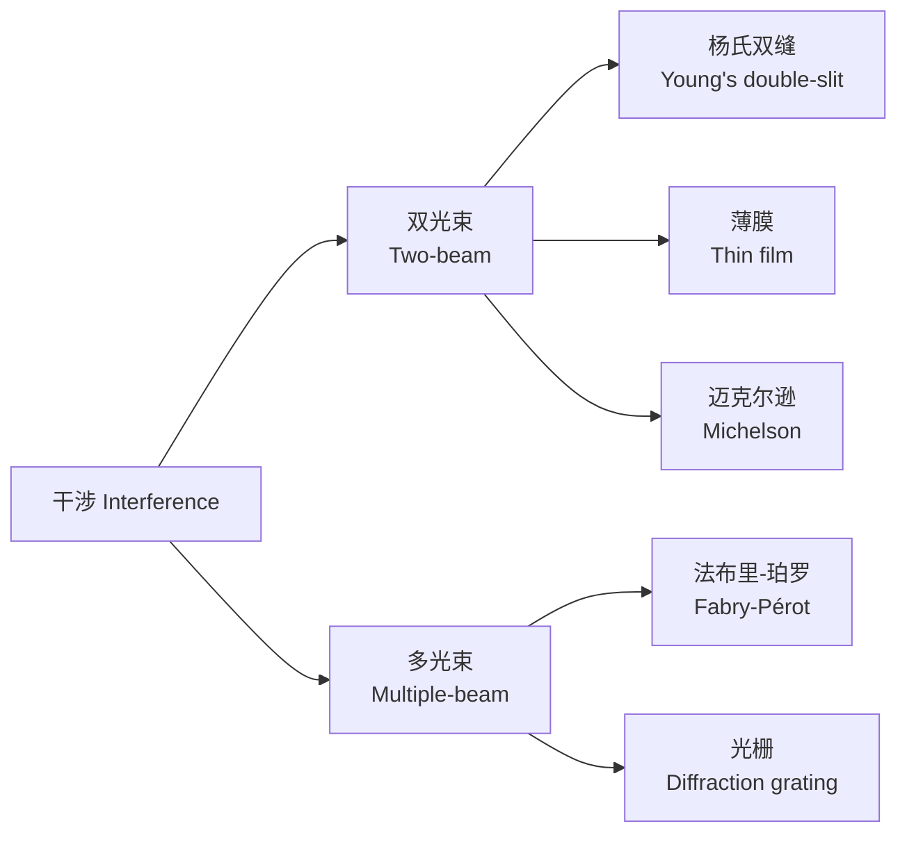

---
aliases:
  - 波动光学
  - Wave Optics
  - 物理光学
  - Physical Optics
  - 干涉
  - 衍射
  - 偏振
tags:
  - physics
  - optics
  - wave-optics
  - interference
  - diffraction
  - polarization
---

# 波动光学 (Wave Optics)

## 概述 (Overview)

波动光学 (Wave Optics)，也称为物理光学 (Physical Optics)，是将光视为电磁波 (electromagnetic wave) 来研究其传播、干涉、衍射和偏振等现象的学科分支。波动光学的建立标志着对光的认识从几何光学 (geometrical optics) 的粒子图像迈向了波图像，最终经由量子光学实现了波粒二象性 (wave-particle duality) 的统一。

---

## 光作为电磁波 (Light as Electromagnetic Wave)

### 电磁波谱 (Electromagnetic Spectrum)

光是特定频率范围内的电磁波，可见光的波长范围约为 380 nm 至 750 nm。

| 波带 | 波长范围 | 频率范围 (Hz) |
|------|---------|--------------|
| 紫外 | 10 – 380 nm | $7.9 \times 10^{14} – 3.0 \times 10^{16}$ |
| 可见光 | 380 – 750 nm | $4.0 \times 10^{14} – 7.9 \times 10^{14}$ |
| 红外 | 0.75 – 1000 $\mu$m | $3.0 \times 10^{11} – 4.0 \times 10^{14}$ |

### 光学基本量 (Fundamental Optical Quantities)

光的波动由频率 $\nu$（或角频率 $\omega = 2\pi\nu$）和波长 $\lambda$ 描述：

$$c = \lambda \nu$$

波数 (wave number)：

$$k = \frac{2\pi}{\lambda}$$

折射率 $n$ 与介质中光速的关系：

$$n = \frac{c}{v}$$

---

## 惠更斯原理 (Huygens' Principle)

惠更斯 (Christiaan Huygens) 在1678年提出：波前上的每一点都可以看作发出次级球面波 (secondary spherical wavelets) 的新波源，这些次级波的包络面构成新的波前。

$$U(\vec{r}, t) = \frac{1}{4\pi} \int_S \left[U \frac{\partial}{\partial n}\left(\frac{e^{ikr}}{r}\right) - \frac{e^{ikr}}{r} \frac{\partial U}{\partial n}\right] dS$$

这是基尔霍夫衍射公式 (Kirchhoff diffraction formula) 的数学表述。

---

## 光的干涉 (Interference of Light)

### 相干条件 (Conditions for Interference)

两束光产生稳定干涉的必要条件：
- 频率相同
- 振动方向相同
- 相位差恒定

### 杨氏双缝实验 (Young's Double-Slit Experiment)

托马斯·杨 (Thomas Young) 在1801年通过双缝实验证明了光的波动性。干涉条纹的明暗位置：

$$d \sin \theta = \begin{cases} m\lambda & \text{明纹 (m = 0, 1, 2, ...)} \\ (m + \frac{1}{2})\lambda & \text{暗纹 (m = 0, 1, 2, ...)} \end{cases}$$

光强分布：

$$I(\theta) = I_0 \cos^2\left(\frac{\pi d \sin\theta}{\lambda}\right)$$

### 薄膜干涉 (Thin-Film Interference)

光在薄膜上下表面的反射光之间产生光程差：

$$\Delta L = 2nd \cos\theta_t + \frac{\lambda}{2}$$

附加半波损 (half-wave loss) 发生在光从折射率较小的介质入射到折射率较大的介质时。

### 迈克尔逊干涉仪 (Michelson Interferometer)

迈克尔逊干涉仪通过分振幅法产生干涉，以极高的精度测量长度变化：

$$\Delta N = \frac{2\Delta L}{\lambda}$$

### 多光束干涉 (Multiple-Beam Interference)

法布里-珀罗干涉仪 (Fabry-Pérot interferometer) 基于多光束干涉，具有极高的分辨能力。其透射率函数为：

$$T = \frac{1}{1 + F \sin^2(\delta/2)}$$

其中 $F$ 是精细度系数 (coefficient of finesse)，$\delta$ 是相邻光束的相位差。

---

## 光的衍射 (Diffraction of Light)

### 惠更斯-菲涅耳原理 (Huygens-Fresnel Principle)

菲涅耳 (Augustin-Jean Fresnel) 丰富了惠更斯原理，加入了次级波干涉的概念：

$$U(P) = \iint_\Sigma \frac{A e^{ikr}}{r} K(\theta) \, d\Sigma$$

其中 $K(\theta)$ 是倾斜因子 (obliquity factor)。

### 夫琅禾费衍射 (Fraunhofer Diffraction)

在远场条件（平行光照射）下的衍射。单缝夫琅禾费衍射的光强分布：

$$I(\theta) = I_0 \left[\frac{\sin(\beta)}{\beta}\right]^2, \quad \beta = \frac{\pi a \sin\theta}{\lambda}$$

$a$ 为缝宽。暗纹条件：$a \sin\theta = m\lambda$ (m = ±1, ±2, ...)。

### 菲涅耳衍射 (Fresnel Diffraction)

在近场条件下，衍射图案随传播距离变化。菲涅耳半波带法 (Fresnel half-zone method) 是分析近场衍射的经典方法。

### 衍射光栅 (Diffraction Grating)

光栅方程：

$$d(\sin\theta_m + \sin\theta_i) = m\lambda, \quad m = 0, \pm 1, \pm 2, ...$$

光栅的分辨能力：

$$R = \frac{\lambda}{\Delta\lambda} = mN$$

其中 $N$ 是光栅的总刻线数。

### 圆孔衍射与分辨极限 (Circular Aperture and Resolution Limit)

艾里斑 (Airy disk) 的半角宽度：

$$\theta = 1.22 \frac{\lambda}{D}$$

瑞利判据 (Rayleigh criterion) 定义了两个点光源可分辨的最小角距离。

---

## 光的偏振 (Polarization of Light)

### 偏振态 (Polarization States)

- **线偏振光** (linearly polarized light)：电场矢量沿一条直线振动
- **圆偏振光** (circularly polarized light)：电场矢量末端在垂直于传播方向的平面内画圆
- **椭圆偏振光** (elliptically polarized light)：一般情况，电场末端画椭圆

琼斯矢量 (Jones vector) 和斯托克斯参量 (Stokes parameters) 用于定量描述偏振态。

### 偏振的产生与检测 (Production and Detection of Polarization)

| 方法 | 原理 | 器件 |
|------|------|------|
| 二向色性 | 选择性吸收 | 偏振片 (Polaroid) |
| 双折射 | 寻常光与非常光分离 | 尼科耳棱镜 |
| 布儒斯特角 | 反射光全偏振 | 玻片堆 |
| 散射 | 瑞利散射 | 蓝天偏振 |

布儒斯特角 (Brewster's angle)：

$$\tan\theta_B = \frac{n_2}{n_1}$$

### 双折射 (Birefringence)

在各向异性晶体中，折射率与光的偏振方向和传播方向有关：

$$\frac{1}{v^2} = \frac{\varepsilon_{xx}}{c^2} l_x^2 + \frac{\varepsilon_{yy}}{c^2} l_y^2 + \frac{\varepsilon_{zz}}{c^2} l_z^2$$

波片 (wave plate) 利用双折射产生相位延迟，实现偏振态转换。

---

## 光的吸收与色散 (Absorption and Dispersion)

### 洛伦兹振子模型 (Lorentz Oscillator Model)

将原子中的束缚电子视为阻尼谐振子：

$$m\ddot{x} + m\gamma\dot{x} + m\omega_0^2 x = -eE_0 e^{-i\omega t}$$

由此可推导出介电常数的频率依赖关系：

$$\varepsilon(\omega) = 1 + \frac{Ne^2}{m\varepsilon_0} \frac{1}{\omega_0^2 - \omega^2 - i\gamma\omega}$$

### 反常色散 (Anomalous Dispersion)

在共振吸收峰附近，折射率随波长增加而增加（与正常色散相反）。

---

## 相干性理论 (Coherence Theory)

### 时间相干性 (Temporal Coherence)

与光源的谱线宽度 $\Delta\nu$ 有关。相干时间 (coherence time)：

$$\tau_c = \frac{1}{\Delta\nu}$$

相干长度 (coherence length)：

$$L_c = c\tau_c = \frac{\lambda^2}{\Delta\lambda}$$

### 空间相干性 (Spatial Coherence)

与光源的大小有关。杨氏双缝干涉的可见度取决于光源的空间相干性。

---

## 现代波动光学应用 (Modern Applications of Wave Optics)

- **全息术** (Holography)：记录和再现光波的振幅和相位信息
- **光学相干断层扫描** (OCT)：医学成像技术
- **表面等离子体共振** (SPR)：生物传感
- **衍射光学元件** (DOE)：光束整形、分束
- **自适应光学** (Adaptive Optics)：消除大气湍流影响

---

## 参考与延伸阅读 (References and Further Reading)

1. *Principles of Optics* — M. Born and E. Wolf
2. *Optics* — E. Hecht
3. *Fundamentals of Photonics* — B. E. A. Saleh and M. C. Teich
4. *Introduction to Fourier Optics* — J. W. Goodman
5. *Optical Coherence and Quantum Optics* — L. Mandel and E. Wolf
6. *Waves and Oscillations* — A. P. French
