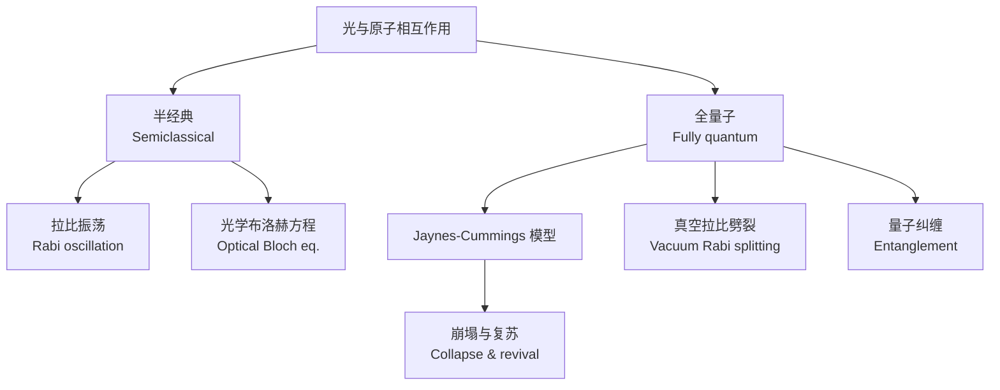

---
aliases:
  - 量子光学与激光
  - Quantum Optics and Lasers
  - 量子光学
  - 激光物理
  - 非线性光学
tags:
  - physics
  - quantum-optics
  - lasers
  - nonlinear-optics
  - photonics
---

# 量子光学与激光 (Quantum Optics and Lasers)

## 概述 (Overview)

量子光学 (Quantum Optics) 是研究光与物质在量子力学框架下相互作用的学科。它从光子的量子化出发，探讨光的量子统计性质、原子与光场的相互作用以及非线性光学过程。激光 (Laser, Light Amplification by Stimulated Emission of Radiation) 是量子光学的核心应用，也是20世纪最重要的发明之一。

---

## 光场的量子化 (Quantization of the Electromagnetic Field)

### 谐振子模型 (Harmonic Oscillator Model)

电磁场的每个模式等效于一个量子谐振子：

$$\hat{H} = \sum_{\vec{k}, s} \hbar\omega_k \left(\hat{a}_{\vec{k}s}^\dagger \hat{a}_{\vec{k}s} + \frac{1}{2}\right)$$

其中 $\hat{a}_{\vec{k}s}^\dagger$ 和 $\hat{a}_{\vec{k}s}$ 分别是产生算符 (creation operator) 和湮灭算符 (annihilation operator)。

### 光子数态 (Fock States / Number States)

光子数态 $|n\rangle$ 是能量本征态：

$$\hat{n} |n\rangle = \hat{a}^\dagger \hat{a} |n\rangle = n |n\rangle$$

### 相干态 (Coherent States)

相干态 $|\alpha\rangle$ 是最接近经典电磁波的量子态，由格劳伯 (Roy J. Glauber) 引入：

$$|\alpha\rangle = e^{-|\alpha|^2/2} \sum_{n=0}^\infty \frac{\alpha^n}{\sqrt{n!}} |n\rangle$$

相干态是湮灭算符的本征态：

$$\hat{a} |\alpha\rangle = \alpha |\alpha\rangle$$

### 压缩态 (Squeezed States)

压缩态在一个正交分量上的量子噪声低于真空涨落：

$$\hat{X}_1 = \frac{1}{2}(\hat{a} + \hat{a}^\dagger), \quad \hat{X}_2 = \frac{1}{2i}(\hat{a} - \hat{a}^\dagger)$$

$$\Delta X_1 \Delta X_2 \geq \frac{1}{4}, \quad (\Delta X_1)^2 < \frac{1}{4} \text{ 或 } (\Delta X_2)^2 < \frac{1}{4}$$

---

## 光子统计 (Photon Statistics)

### 一阶相干性 (First-Order Coherence)

$$g^{(1)}(\tau) = \frac{\langle \hat{E}^-(\tau) \hat{E}^+(0) \rangle}{\langle \hat{E}^-(0) \hat{E}^+(0) \rangle}$$

### 二阶相干性 (Second-Order Coherence)

汉伯里-布朗和特维斯 (Hanbury Brown and Twiss) 实验测量了光子的二阶关联函数：

$$g^{(2)}(\tau) = \frac{\langle \hat{I}(t) \hat{I}(t+\tau) \rangle}{\langle \hat{I}(t) \rangle^2}$$

| 光场类型 | $g^{(2)}(0)$ | 统计特性 |
|---------|-------------|---------|
| 相干态（激光） | $g^{(2)}(0) = 1$ | 泊松统计 (Poissonian) |
| 热光 | $g^{(2)}(0) = 2$ | 超泊松统计 (Super-Poissonian) |
| 单光子态 | $g^{(2)}(0) = 0$ | 亚泊松统计 (Sub-Poissonian) |

反聚束效应 (anti-bunching) 是纯量子效应，表现为 $g^{(2)}(0) < g^{(2)}(\tau)$。

---

## 原子与光场相互作用 (Atom-Field Interaction)

### 半经典理论 (Semiclassical Theory)

原子被处理为量子系统，光场为经典电磁波。拉比振荡 (Rabi oscillation)：

$$P_e(t) = \sin^2\left(\frac{\Omega t}{2}\right)$$

其中 $\Omega$ 是拉比频率 (Rabi frequency)。

### 全量子理论 (Fully Quantum Theory)

Jaynes-Cummings 模型描述了单个二能级原子与单模量子化光场的相互作用：

$$\hat{H}_{\text{JC}} = \frac{\hbar\omega_0}{2}\hat{\sigma}_z + \hbar\omega\hat{a}^\dagger\hat{a} + \hbar g(\hat{\sigma}_+ \hat{a} + \hat{\sigma}_- \hat{a}^\dagger)$$

在共振条件下，真空拉比劈裂 (vacuum Rabi splitting) 发生。

---

## 激光原理 (Principles of Lasers)

### 受激辐射 (Stimulated Emission)

爱因斯坦 (Einstein) 在1917年提出了受激辐射概念。在光场作用下，处于高能级的原子跃迁到低能级并发射与入射光子全同的光子。

### 粒子数反转 (Population Inversion)

激光的必要条件是粒子数反转：高能级粒子数 $N_2$ 大于低能级粒子数 $N_1$。

$$\frac{N_2}{N_1} > 1$$

### 激光速率方程 (Laser Rate Equations)

$$\frac{dN_2}{dt} = R_p - \frac{N_2}{\tau_2} - (N_2 - N_1)B\nu$$

$$\frac{dn}{dt} = (N_2 - N_1)B\nu n - \frac{n}{\tau_c} + \beta \frac{N_2}{\tau_r}$$

### 激光阈值条件 (Laser Threshold Condition)

$$(N_2 - N_1)_{\text{th}} = \frac{1}{B\nu \tau_c}$$

### 激光的纵模与横模 (Longitudinal and Transverse Modes)

- **纵模**：谐振腔的轴向驻波模式，频率间隔 $\Delta\nu = c/(2L)$
- **横模**：垂直轴向的场分布图案，记作 TEM$_{mn}$

---

## 激光器类型 (Types of Lasers)

### 按增益介质分类

| 类型 | 典型波长 | 代表性激光器 |
|------|---------|------------|
| 气体激光器 | UV – IR | He-Ne (632.8 nm), CO$_2$ (10.6 $\mu$m) |
| 固体激光器 | NIR – IR | Nd:YAG (1064 nm), Ti:Sapphire |
| 半导体激光器 | NIR – visible | GaAs, InGaAsP 激光二极管 |
| 染料激光器 | 可调谐 | 罗丹明 6G 激光器 |
| 光纤激光器 | NIR | 掺铒光纤激光器 |

### 按工作模式分类

- **连续波激光器** (CW laser)：连续输出
- **脉冲激光器** (pulsed laser)：Q 开关、锁模
- **单频激光器**：线宽极窄

---

## 非线性光学 (Nonlinear Optics)

### 非线性极化 (Nonlinear Polarization)

当光强足够大时，介质的极化强度与电场呈非线性关系：

$$P = \varepsilon_0 \left(\chi^{(1)} E + \chi^{(2)} E^2 + \chi^{(3)} E^3 + \cdots\right)$$

### 二阶非线性效应 (Second-Order Nonlinear Effects)

- **倍频** (Second Harmonic Generation, SHG)：$\omega + \omega \to 2\omega$
- **和频** (Sum Frequency Generation, SFG)：$\omega_1 + \omega_2 \to \omega_3$
- **差频** (Difference Frequency Generation, DFG)：$\omega_1 - \omega_2 \to \omega_3$
- **光参量放大/振荡** (OPA/OPO)

### 三阶非线性效应 (Third-Order Nonlinear Effects)

- **四波混频** (Four-Wave Mixing, FWM)
- **克尔效应** (Kerr effect)：$n = n_0 + n_2 I$
- **自聚焦** (self-focusing)
- **双光子吸收** (two-photon absorption)
- **拉曼散射** (Raman scattering)

### 相位匹配条件 (Phase Matching Condition)

对于倍频过程：

$$\Delta k = k_{2\omega} - 2k_\omega = 0$$

双折射相位匹配和准相位匹配 (quasi-phase matching) 是两种常用方法。

---

## 量子光学前沿 (Frontiers of Quantum Optics)

| 方向 | 描述 | 应用 |
|------|------|------|
| 量子纠缠光源 | 产生纠缠光子对 | 量子密钥分发 |
| 量子存储 | 光量子态映射到物质 | 量子中继器 |
| 光学频率梳 | 等间距频率梳状谱 | 精密测量、光钟 |
| 腔量子电动力学 | 原子在微腔中与光场耦合 | 量子信息处理 |
| 拓扑光子学 | 光子拓扑绝缘体 | 鲁棒光传输 |

---

## 参考与延伸阅读 (References and Further Reading)

1. *Quantum Optics* — M. O. Scully and M. S. Zubairy
2. *Introductory Quantum Optics* — C. C. Gerry and P. L. Knight
3. *Laser Physics* — A. E. Siegman
4. *Principles of Nonlinear Optics* — Y. R. Shen
5. *The Quantum Theory of Light* — R. Loudon
6. *Optical Coherence and Quantum Optics* — L. Mandel and E. Wolf
