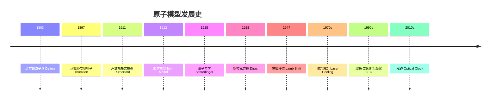

# AtomicPhysics

## 概述 (Overview)

原子物理学 (Atomic Physics) 研究原子的结构、能级、光谱以及原子与外场的相互作用。它是量子力学最重要的验证场所，也是现代精密测量的基础。原子物理的核心问题包括电子排布、角动量耦合、超精细结构和原子光谱。原子物理的发展直接导致了量子力学、激光和原子钟的诞生，深刻影响了现代科技。

## 原子结构理论沿革

## 玻尔模型 (Bohr Model)

玻尔模型于1913年由尼尔斯·玻尔提出，核心假设是电子只在特定轨道上运动，轨道角动量量子化：

$$L = n\hbar,\quad n = 1,2,3,\ldots$$

氢原子能级公式：

$$E_n = -\frac{me^4}{8\varepsilon_0^2 h^2}\cdot\frac{1}{n^2} = -\frac{13.6\;\text{eV}}{n^2}$$

轨道半径：$r_n = n^2 a_0$，其中 $a_0 = 0.529\;\text{Å}$ 是玻尔半径。电子跃迁频率条件：$h\nu = E_i - E_f$

## 量子力学描述 (Quantum Mechanical Description)

### 氢原子波函数

$$\psi_{nlm}(r,\theta,\phi) = R_{nl}(r)Y_l^m(\theta,\phi)$$

径向波函数与拉盖尔多项式相关：

$$R_{nl}(r) = \sqrt{\left(\frac{2}{na_0}\right)^3\frac{(n-l-1)!}{2n[(n+l)!]}} e^{-r/na_0}\left(\frac{2r}{na_0}\right)^l L_{n-l-1}^{2l+1}\left(\frac{2r}{na_0}\right)$$

### 电子概率密度

$|\psi_{nlm}|^2$ 给出了电子在空间某点出现的概率密度。$s$ 轨道 ($l=0$) 呈球形对称，$p$ 轨道 ($l=1$) 呈哑铃形，$d$ 轨道 ($l=2$) 呈四叶草形。径向分布函数 $P_{nl}(r) = r^2|R_{nl}(r)|^2$ 给出了电子在半径 $r$ 处出现的概率。

## 量子数 (Quantum Numbers)

| 量子数 | 符号 | 取值 | 物理意义 |
|--------|------|------|---------|
| 主量子数 | $n$ | $1,2,3,\ldots$ | 能量层 (K, L, M, N...) |
| 角量子数 | $l$ | $0,1,\ldots,n-1$ | 轨道类型 ($s,p,d,f$) |
| 磁量子数 | $m_l$ | $-l,\ldots,+l$ | 空间取向 |
| 自旋量子数 | $s$ | $\pm 1/2$ | 内禀角动量 |

轨道角动量大小和 z 分量：

$$|\vec{L}| = \sqrt{l(l+1)}\hbar,\quad L_z = m_l\hbar$$

## 精细结构与超精细结构

### 自旋-轨道耦合 (Spin-Orbit Coupling)

$$\Delta E_{SO} = \frac{1}{2m^2c^2}\frac{1}{r}\frac{dV}{dr}\vec{L}\cdot\vec{S}$$

总角动量：$\vec{J} = \vec{L} + \vec{S}$。钠原子的 D 线分裂为 D1 (589.6 nm) 和 D2 (589.0 nm)，是自旋-轨道耦合的典型例子。

### 超精细结构 (Hyperfine Structure)

原子核自旋 $I$ 与电子总角动量 $J$ 耦合，总角动量 $F = I + J$。

氢原子 21 cm 谱线：$\nu_{HFS} \approx 1420.405751766\;\text{MHz}$，对应波长 21 cm。

## 原子光谱 (Atomic Spectra)

### 光谱系列

氢原子光谱由里德伯公式统一描述：

$$\frac{1}{\lambda} = R_\infty\left(\frac{1}{n_f^2} - \frac{1}{n_i^2}\right)$$

$R_\infty = 1.0973731568160 \times 10^7\;\text{m}^{-1}$。莱曼系 ($n_f=1$，紫外)、巴耳末系 ($n_f=2$，可见光)、帕邢系 ($n_f=3$，红外)、布拉开系 ($n_f=4$，红外)、普丰德系 ($n_f=5$，远红外)。

### 选择定则 (Selection Rules)

电偶极跃迁：$\Delta l = \pm 1,\ \Delta j = 0,\pm 1,\ \Delta m_j = 0,\pm 1$

自旋翻转跃迁 (如 21 cm 线) 是磁偶极跃迁。

## 塞曼效应 (Zeeman Effect)

$$\Delta E = \mu_B g_J m_j B,\quad \mu_B = \frac{e\hbar}{2m_e},\quad g_J = 1 + \frac{j(j+1) + s(s+1) - l(l+1)}{2j(j+1)}$$

- **正常塞曼效应** ($S=0$)：谱线分裂为三条 ($\pi,\sigma^+,\sigma^-$)
- **反常塞曼效应** ($S\neq 0$)：分裂模式更复杂
- **帕邢-巴克效应**：强磁场下 LS 耦合被破坏

## 斯塔克效应 (Stark Effect)

原子在电场中的能级分裂。氢原子中为线性斯塔克效应，能级移动 $\Delta E \propto E$。其他原子中为平方斯塔克效应，$\Delta E \propto E^2$。

## 多电子原子 (Multi-Electron Atoms)

电子排布遵循泡利不相容原理和洪德规则。LS 耦合适用于轻原子，$jj$ 耦合适用于重原子。光谱项：$^{2S+1}L_J$

洪德规则：
1. 总自旋 $S$ 最大者能量最低
2. 给定 $S$ 时，$L$ 最大者能量最低
3. 次壳层电子数 $< 2l+1$ 时 $J$ 最小能量最低，否则 $J$ 最大能量最低

## 兰姆移位 (Lamb Shift)

兰姆移位 (Lamb Shift, 1947) 是指氢原子 $2S_{1/2}$ 和 $2P_{1/2}$ 能级的微小能量差（约 1058 MHz），狄拉克方程预测这两者简并。兰姆移位的发现催生了量子电动力学 (QED) 的发展。该现象源于真空涨落 (Vacuum Fluctuations) 对电子自能的修正。

## 原子物理的应用 (Applications)

### 原子钟 (Atomic Clocks)

铯-133 原子钟定义秒：超精细跃迁频率 $\nu = 9,192,631,770\;\text{Hz}$。光学晶格钟 (Optical Lattice Clock) 基于锶 (Sr) 或镱 (Yb) 原子的光学跃迁，不确定度已达 $10^{-18}$ 量级。

### 激光冷却 (Laser Cooling)

多普勒冷却 (Doppler Cooling) 将原子冷却至多普勒极限 $T_D = \hbar\gamma/2k_B$。磁光阱 (MOT) 可捕获并冷却原子至 μK 量级。蒸发冷却进一步将原子冷却至 nK 量级。

### 玻色-爱因斯坦凝聚 (BEC)

BEC 是大量玻色子在极低温度下占据同一量子态的现象。1995年 Cornell 和 Wieman 在 $^{87}\text{Rb}$ 中首次实现。BEC 表现出宏观量子现象如干涉和涡旋。

### 量子信息

原子的基态和激发态可以作为量子比特。离子阱 (Ion Trap) 量子计算利用电磁场囚禁离子并实现量子门操作。

## 原子光谱的应用谱系

原子光谱在天体物理中用于确定恒星化学成分（夫琅禾费线）。原子吸收光谱 (AAS) 在分析化学中用于元素定量分析。激光诱导击穿光谱 (LIBS) 实现快速现场元素分析。

## 原子碰撞与电离 (Atomic Collisions & Ionization)

电子与原子的碰撞导致激发、电离和俄歇效应 (Auger Effect)。电离截面 (Ionization Cross Section) 反映了碰撞导致电离的概率。重粒子碰撞在等离子体物理和天体物理中具有重要意义。电荷交换 (Charge Exchange) 在多电荷离子与中性气体的碰撞中常见。

## 里德伯原子 (Rydberg Atoms)

里德伯原子是指主量子数 $n$ 很大的激发态原子。其轨道半径 $r_n \propto n^2$，寿命 $\tau_n \propto n^3$，电偶极矩 $\propto n^2$。里德伯原子对电场极其敏感，是量子信息处理中量子比特的候选体系。里德伯阻塞 (Rydberg Blockade) 效应可用于实现量子门。

## 人造原子 (Artificial Atoms)

量子点 (Quantum Dots) 被称为"人造原子"，其电子能级分立如真实原子。通过调节量子点尺寸和材料，可以改变其能级结构。量子点在量子计算、发光二极管和太阳能电池中有应用前景。

## 原子物理实验技术 (Experimental Techniques)

- 原子束 (Atomic Beam)：真空中定向原子流
- 激光光谱 (Laser Spectroscopy)：高分辨率检测原子能级
- 射频光谱 (Radio-Frequency Spectroscopy)：测量超精细结构
- 光泵浦 (Optical Pumping)：利用偏振光制备特定自旋态
- 饱和吸收光谱 (Saturated Absorption Spectroscopy)：消除多普勒展宽
- 双光子光谱 (Two-Photon Spectroscopy)：高分辨无多普勒光谱
- 冷原子碰撞 (Cold Collisions)：超低温下的量子散射

## 原子光谱在分析化学中的应用

原子发射光谱 (AES) 和原子吸收光谱 (AAS) 是元素分析的标准方法。电感耦合等离子体质谱 (ICP-MS) 联用技术可达到 ppt 级别的检测限。激光诱导击穿光谱 (LIBS) 实现无需样品制备的现场快速分析，在考古学、法医学和材料科学中有广泛应用。

## 原子物理中的重要常数 (Important Constants)

| 常数 | 符号 | 数值 |
|------|------|------|
| 玻尔半径 | $a_0$ | $5.291772\times10^{-11}$ m |
| 里德伯常数 | $R_\infty$ | $1.097373\times10^7$ m$^{-1}$ |
| 玻尔磁子 | $\mu_B$ | $9.274\times10^{-24}$ J/T |
| 电子康普顿波长 | $\lambda_C$ | $2.426\times10^{-12}$ m |
| 精细结构常数 | $\alpha$ | $1/137.036$ |
| 哈特里能量 | $E_h$ | $27.2114$ eV |
| 里德伯能量 | $R_y$ | $13.6057$ eV |

## 原子物理教材推荐 (Textbooks)

《Atomic Physics》(C. Foot)、《Physics of Atoms and Molecules》(Bransden & Joachain)、《原子物理学》(杨福家)、《Modern Atomic and Nuclear Physics》(Fujia Yang & Joseph Hamilton) 是原子物理学的经典教材。高教出版社的《原子物理学》(褚圣麟) 是中国高校的广泛使用教材。《Atomic Spectra and Atomic Structure》(Herzberg) 是光谱学的权威参考书。

## 原子物理与核物理的区别 (Difference with Nuclear Physics)

原子物理研究原子中电子云的行为——轨道填充、能级跃迁、光谱和化学键合。核物理研究原子核的行为——质子和中子的排列、核反应、衰变和核能。两者在能量尺度上差异巨大：原子物理涉及 eV 量级，核物理涉及 MeV 量级。然而两者在超精细结构、同质异能移位 (Isomer Shift) 和穆斯堡尔效应 (Mössbauer Effect) 中有交叉。

## 原子概念的哲学意义 (Philosophical Significance)

德谟克利特最早提出了原子论。道尔顿将原子论引入化学。玻尔兹曼为原子论的接受而斗争，他的熵公式 $S = k\ln W$ 刻在了他的墓碑上。20世纪初佩兰 (Perrin) 通过布朗运动实验最终证实了原子的存在。量子力学揭示：粒子具有波粒二象性，其行为只能用概率描述。原子物理的发展史说明科学理论需要实验和数学的双重验证。

## 原子物理研究中的技术 (Experimental Techniques)

原子束 (Atomic Beam) 在真空中产生定向原子流。激光光谱 (Laser Spectroscopy) 实现高分辨率能级检测。射频光谱 (RF Spectroscopy) 测量超精细结构。光泵浦 (Optical Pumping) 制备特定自旋态。饱和吸收光谱 (Saturated Absorption Spectroscopy) 消除多普勒展宽。双光子光谱 (Two-Photon Spectroscopy) 实现无多普勒高分辨测量。冷原子碰撞研究超低温下的量子散射。

## 原子物理与量子光学 (Atomic Physics & Quantum Optics)

量子光学 (Quantum Optics) 研究光与物质的量子相互作用。原子的自发辐射、受激辐射和光吸收是激光物理的基础。腔量子电动力学 (Cavity QED) 研究原子在光学腔中的行为。电磁感应透明 (EIT) 利用量子相干效应改变介质的吸收特性。拉比振荡 (Rabi Oscillation) 描述原子在共振光场中的周期性能级振荡：

$$P_e(t) = \sin^2\left(\frac{\Omega t}{2}\right)$$

其中 $\Omega$ 是拉比频率。当失谐 $\Delta = \omega - \omega_0 \neq 0$ 时，拉比频率变为广义拉比频率 $\Omega' = \sqrt{\Omega^2 + \Delta^2}$。

## 原子物理中的重要公式 (Important Formulas)

玻尔模型：$E_n = -13.6/n^2$ eV, $r_n = n^2 a_0$
里德伯公式：$\frac{1}{\lambda} = R_\infty(\frac{1}{n_f^2} - \frac{1}{n_i^2})$
塞曼效应：$\Delta E = \mu_B g_J m_j B$
朗德因子：$g_J = \frac{3}{2} + \frac{s(s+1) - l(l+1)}{2j(j+1)}$
选择定则：$\Delta l = \pm 1, \Delta j = 0,\pm 1, \Delta m_j = 0,\pm 1$

## 原子物理实验设计与仪器 (Experimental Instruments)

原子物理实验的主要仪器：光谱仪使用光栅或棱镜分光。激光系统提供单色、高强度相干光源。光检测器 (PMT, CCD, APD) 用于微弱光信号探测。真空系统为冷原子实验提供 $10^{-10}$ Torr 以下的背景压力。磁光阱 (MOT) 由六束激光和反亥姆霍兹线圈构成。电子枪和离子源用于电子和离子碰撞实验。X 射线管用于特征 X 射线产生和吸收谱测量。

## 原子物理的国际研究机构 (Research Institutions)

美国国家标准与技术研究院 (NIST)、德国马克斯-普朗克量子光学研究所 (MPQ)、法国巴黎天文台 (LNE-SYRTE)、日本理化学研究所 (RIKEN)、奥地利因斯布鲁克大学。在中国，中国科学技术大学、北京大学、清华大学、华东师范大学、山西大学设有冷原子重点实验室。中国科学院量子信息与量子科技创新研究院在原子量子模拟方面成果突出。

## 原子物理的诺贝尔奖 (Nobel Prizes in Atomic Physics)

1913年范德瓦耳斯、1922年玻尔、1925年夫兰克和赫兹、1933年薛定谔和狄拉克、1955年兰姆和库什、1966年卡斯特勒、1981年布隆姆贝根和肖洛、1989年拉姆齐、1997年朱棣文等、2001年科内尔等、2005年霍尔和亨施、2012年阿罗什和维因兰德。这些诺贝尔奖涵盖了原子结构、量子力学基础、激光光谱、原子钟、激光冷却和 BEC 等原子物理的核心方向。

## 原子物理的发展趋势 (Future Trends)

更精确的光学原子钟向 $10^{-19}$ 迈进。量子模拟利用冷原子模拟凝聚态物理中的强关联系统。量子计算基于离子阱和中性原子量子比特。超冷分子化学研究极低温度下化学反应的量子效应。原子系统的基础物理检验（基本常数的时间不变性）。原子尺度成像技术（量子显微镜）。原子物理与量子技术的融合加速发展，推动第二次量子革命。

## 原子物理中的教育实验 (Educational Experiments)

夫兰克-赫兹实验直接验证了原子能级分立性，是大学物理实验经典项目。塞曼效应实验测量原子在磁场中的能级分裂。斯特恩-格拉赫实验展示了空间量子化，是量子力学基本概念的实验基础。光泵浦实验演示原子自旋极化和光学检测。饱和吸收光谱实验消除多普勒展宽实现高分辨率光谱。拉姆齐干涉实验是原子钟和精密测量的基础。

## 原子物理与等离子体物理 (Atomic Physics & Plasma Physics)

等离子体由大量离子和自由电子组成。等离子体中的原子过程：电子碰撞激发和电离、辐射复合、三体复合、电荷交换和光致电离。聚变等离子体中杂质输运和辐射损失依赖于原子物理数据库。天体等离子体的光谱诊断同样依赖原子物理数据。激光产生的等离子体在惯性约束聚变中起关键作用。

## 原子物理与化学的联系 (Connection with Chemistry)

原子物理为化学提供了理论基础。电子轨道和能级决定了原子的化学键合能力。电负性和电离能是原子物理量，直接影响元素的化学活性。光谱学是化学分析的重要工具。量子化学利用原子物理的方法计算分子结构和性质。原子物理中的自旋概念在核磁共振 (NMR) 和磁共振成像 (MRI) 中有直接应用。

## 相关条目

- [[../../../INDEX|当前目录索引]]
