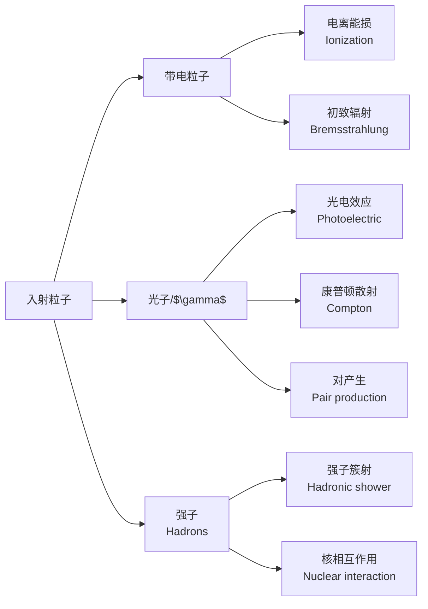

---
aliases:
  - 实验方法
  - Experimental Methods
  - 粒子物理实验
  - 探测器物理
  - 高能物理实验
tags:
  - physics
  - particle-physics
  - experimental-methods
  - detectors
  - accelerators
  - hep
---

# 实验方法 (Experimental Methods)

## 概述 (Overview)

实验方法 (Experimental Methods) 是高能物理 (High Energy Physics, HEP) 研究的实践基础。粒子物理实验通过建造粒子加速器 (particle accelerators) 将粒子加速到极高能量并使其对撞，利用大型探测器 (detectors) 记录对撞产物，再通过复杂的数据分析 (data analysis) 提取物理信号。这一链条融合了加速器技术、精密仪器、电子学、计算科学和统计学等众多学科的前沿成果。

---

## 粒子加速器 (Particle Accelerators)

### 加速器类型 (Types of Accelerators)

| 类型 | 英文 | 结构特征 | 代表设施 |
|------|------|---------|---------|
| 直线加速器 | Linear Accelerator (LINAC) | 直线排列的加速腔 | SLAC (2 mi linac) |
| 回旋加速器 | Cyclotron | 恒定的均匀磁场 | 早期核物理实验 |
| 同步加速器 | Synchrotron | 环形，磁场随能量变化 | LHC, Tevatron |
| 对撞机 | Collider | 两束粒子反向加速对撞 | LHC, BEPCII |

### 加速原理 (Acceleration Principle)

带电粒子在电场中获得能量。粒子在磁场中偏转，洛伦兹力提供向心力：

$$\frac{d\vec{p}}{dt} = q(\vec{E} + \vec{v} \times \vec{B})$$

同步加速器中，粒子能量与磁场和曲率半径的关系：

$$p = q B R \quad \Rightarrow \quad E \approx q B R c$$

### 加速器的关键性能参数 (Key Performance Parameters)

- **束流能量** (beam energy)：决定可产生的粒子质量上限
- **亮度** (luminosity) $\mathcal{L}$：单位时间单位面积的对撞事件数
- **事件率** (event rate)：$\dot{N} = \mathcal{L} \sigma$

$$N = \mathcal{L} \int L dt \times \sigma$$

---

## 粒子与物质的相互作用 (Particle Interactions with Matter)

探测器设计基于粒子穿过物质时产生的各种效应：

### 电离与激发 (Ionization and Excitation)

带电粒子穿过介质时使原子电离或激发，产生电子-离子对或闪烁光。电离能损由贝特-布洛赫公式 (Bethe-Bloch formula) 描述：

$$-\frac{dE}{dx} = \frac{4\pi N_A r_e^2 m_e c^2 z^2}{A\beta^2} \left[\frac{1}{2}\ln\frac{2m_e c^2 \beta^2 \gamma^2 T_{\text{max}}}{I^2} - \beta^2 - \frac{\delta(\beta\gamma)}{2}\right]$$

### 初致辐射 (Bremsstrahlung)

高能电子在原子核库仑场中减速时辐射光子。辐射长度 (radiation length) $X_0$ 是电子能量降至 $1/e$ 所需的平均路程。

### 电磁级联 (Electromagnetic Cascade)

高能光子和电子在介质中通过 **正负电子对产生** (pair production) 和初致辐射交替作用，形成粒子数指数增长的级联簇射。

$$N(t) \approx 2^{t/X_0}, \quad E(t) \approx E_0 \cdot 2^{-t/X_0}$$

---

## 粒子探测器 (Particle Detectors)

### 探测器分类 (Detector Classification)

#### 径迹探测器 (Tracking Detectors)

- **气体探测器**：丝室 (wire chamber)、时间投影室 (TPC)
- **半导体探测器**：硅像素探测器 (silicon pixel)、硅条探测器 (silicon strip)
- **闪烁纤维探测器**：scintillating fiber tracker

#### 量能器 (Calorimeters)

- **电磁量能器**：测量电子和光子的能量
- **强子量能器**：测量强子的能量

能量分辨率通常表示为：

$$\frac{\sigma_E}{E} = \frac{a}{\sqrt{E}} \oplus b$$

其中 $a$ 是取样项，$b$ 是常数项。

#### 粒子识别探测器 (Particle Identification Detectors)

- **切伦科夫探测器** (Cherenkov detector)：测量切伦科夫辐射锥角
- **飞行时间探测器** (Time-of-Flight, TOF)：测量粒子速度
- **穿越辐射探测器** (Transition Radiation Detector, TRD)：区分电子和强子

#### 缪子探测器 (Muon Detectors)

利用缪子穿透能力强、不与强相互作用的特点，在探测器最外层识别缪子。

---

## 现代大型探测器 (Modern Large-Scale Detectors)

### 对撞机探测器结构 (Collider Detector Structure)

典型的现代探测器呈洋葱层状结构：

| 层序 | 探测器类型 | 测量对象 |
|------|-----------|---------|
| 内层 | 硅径迹探测器 | 顶点和径迹重建 |
| 中层 | 时间投影室/漂移室 | 动量测量 |
| 电磁量能器 | PbWO$_4$ 闪烁体晶体等 | 电子/光子能量 |
| 强子量能器 | 闪烁体+黄铜/铁 | 强子能量 |
| 外层 | 缪子探测器 | 缪子识别 |

### 代表性实验 (Representative Experiments)

- **ATLAS** (A Toroidal LHC Apparatus)：通用探测器，2012年发现希格斯玻色子
- **CMS** (Compact Muon Solenoid)：紧凑型缪子螺线管探测器，与ATLAS互验
- **ALICE** (A Large Ion Collider Experiment)：研究夸克-胶子等离子体
- **LHCb**：研究底夸克物理和CP破坏
- **BESIII** (北京谱仪III)：在BEPCII上的陶-粲物理实验

---

## 触发与数据采集 (Trigger and Data Acquisition)

### 触发系统 (Trigger System)

LHC 每秒产生40百万次束团交叉 (40 MHz bunch crossing)，但只有约1 kHz的事件值得存储。触发系统分多级筛选：

- **一级触发** (Level-1 Trigger, L1)：基于硬件逻辑，约100 kHz
- **高级触发** (High-Level Trigger, HLT)：基于商用服务器运行算法，约1 kHz

### 数据采集系统 (Data Acquisition, DAQ)

DAQ系统将触发选中的事件数据组装并通过高速网络传输到存储系统。LHC 实验每年产生约 50 PB 的数据。

---

## 数据分析方法 (Data Analysis Methods)

### 事例重建 (Event Reconstruction)

- **径迹重建** (track reconstruction)：从探测器击中找到带电粒子的轨迹
- **顶点重建** (vertex reconstruction)：确定对撞顶点和次级顶点
- **能量重建** (energy reconstruction)：从量能器信号重建粒子能量
- **粒子鉴别** (particle identification, PID)：结合所有子探测器信息推断粒子种类

### 蒙特卡罗模拟 (Monte Carlo Simulation)

蒙特卡罗方法在粒子物理中用于：
- 模拟物理过程发生（基于矩阵元计算）
- 模拟粒子在探测器中的输运（Geant4 软件包）
- 估计本底和信号效率
- 系统误差研究

### 统计方法 (Statistical Methods)

$$p\text{-value} = \int_{t_{\text{obs}}}^\infty f(t|H_0) dt$$

CL$_s$ 方法是高能物理中排除检验的标准方法。

对于发现一个信号：

$$Z = \frac{S}{\sqrt{S + B}}$$

其中 $S$ 是信号事件数，$B$ 是本底事件数。

---

## 现代实验前沿 (Current Experimental Frontiers)

| 方向 | 实验 | 目标 |
|------|------|------|
| 高能量前沿 | HL-LHC, FCC | 直接搜索新粒子 |
| 高精度前沿 | SuperKEKB/Belle II, Muon g-2 | 精确检验标准模型 |
| 暗物质直接探测 | LZ, XENONnT, PandaX | WIMP 探测 |
| 中微子物理 | JUNO, DUNE, Hyper-K | 中微子质量排序、CP相角 |
| 宇宙线实验 | LHAASO, DAMPE | 高能伽马天文、暗物质间接探测 |

---

## 参考与延伸阅读 (References and Further Reading)

1. *Particle Detectors* — C. Grupen and B. Shwartz
2. *Techniques for Nuclear and Particle Physics Experiments* — W. R. Leo
3. *Introduction to High Energy Physics* — D. H. Perkins
4. *Particle Physics* — B. R. Martin and C. Shaw
5. *Data Analysis in High Energy Physics* — O. Behnke, K. Kröninger, T. Schörner-Sadenius, G. Schott (eds.)
6. *Geant4: A Simulation Toolkit* — S. Agostinelli et al., NIM A 506 (2003) 250
