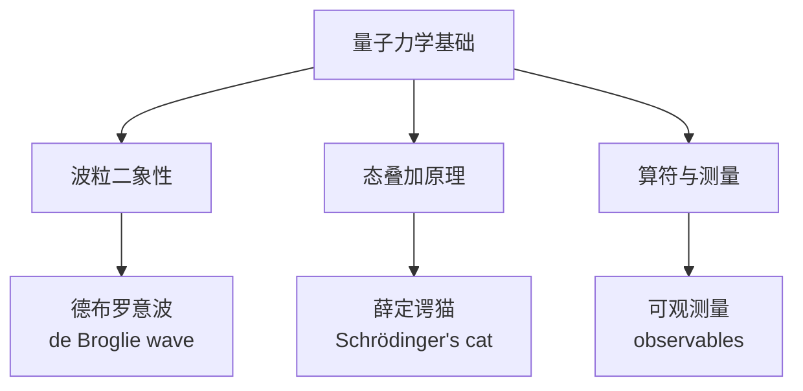
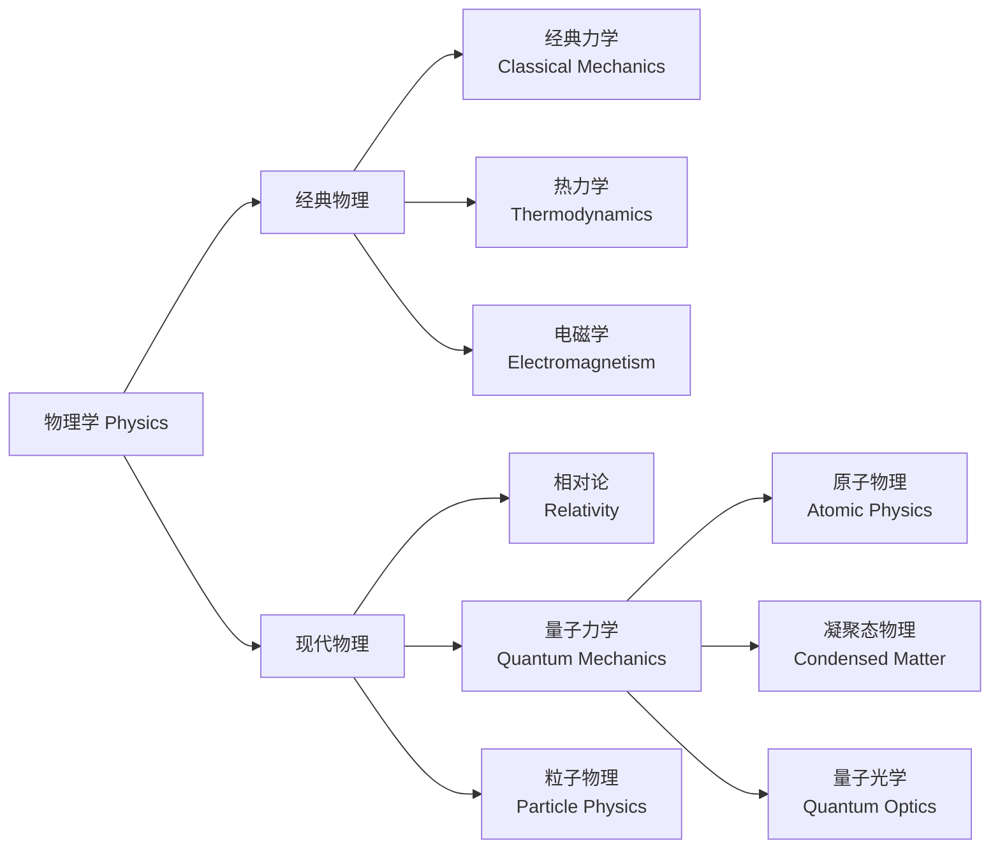
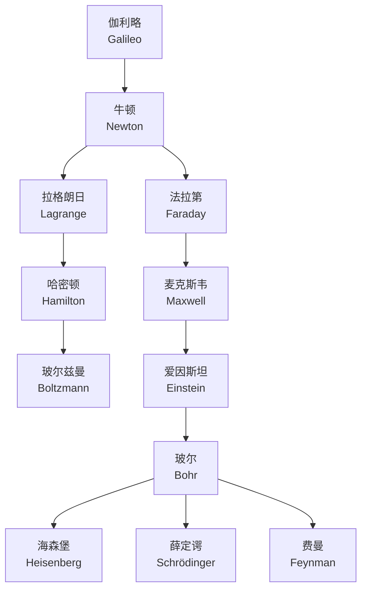

---
aliases:
  - 物理学
  - Physics
  - 物理
tags:
  - physics
  - natural-sciences
  - fundamental
---

# 物理学概论 (Overview of Physics)

## 物理学的基本定义 (Fundamental Definition of Physics)

物理学 (Physics) 是研究物质、能量、空间和时间的基本规律的自然科学 (natural science)。它试图理解宇宙从基本粒子 (elementary particles) 到星系团 (galaxy clusters) 的所有尺度上的行为，并揭示支配这些行为的数学法则。

$$S = \int L \, dt$$

其中 $S$ 是作用量 (action)，$L$ 是拉格朗日量 (Lagrangian)。这一最小作用量原理 (principle of least action) 是物理学中最普遍的原理之一。

---

## 经典力学 (Classical Mechanics)

经典力学描述宏观物体在低速下的运动，其核心是牛顿运动定律 (Newton's laws of motion)：

- **第一定律**：惯性定律，物体保持匀速直线运动或静止状态，除非受到外力作用。
- **第二定律**：$\vec{F} = m\vec{a}$，力等于质量乘以加速度。
- **第三定律**：作用力与反作用力大小相等、方向相反。

拉格朗日力学和哈密顿力学提供了更一般的表述。

$$H = \sum_i p_i \dot{q}_i - L$$

其中 $H$ 是哈密顿量 (Hamiltonian)，$p_i$ 是广义动量 (generalized momentum)，$q_i$ 是广义坐标 (generalized coordinate)。

---

## 热力学与统计力学 (Thermodynamics and Statistical Mechanics)

热力学研究热、功和能量转换的宏观规律：

| 定律 | 内容 |
|------|------|
| 第零定律 | 热平衡的传递性 |
| 第一定律 | 能量守恒：$\Delta U = Q - W$ |
| 第二定律 | 熵增：$\Delta S \geq 0$ |
| 第三定律 | 绝对零度不可达：$T \to 0 \Rightarrow S \to 0$ |

统计力学从微观粒子的统计行为推导宏观热力学量：

$$S = k_B \ln \Omega$$

其中 $k_B$ 是玻尔兹曼常数 (Boltzmann constant)，$\Omega$ 是微观状态数 (number of microstates)。

---

## 电磁学 (Electromagnetism)

电磁学统一了电学和磁学现象。麦克斯韦方程组 (Maxwell's equations) 是经典电磁理论的基础：

$$\nabla \cdot \vec{E} = \frac{\rho}{\varepsilon_0}$$
$$\nabla \cdot \vec{B} = 0$$
$$\nabla \times \vec{E} = -\frac{\partial \vec{B}}{\partial t}$$
$$\nabla \times \vec{B} = \mu_0\vec{J} + \mu_0\varepsilon_0\frac{\partial \vec{E}}{\partial t}$$

电磁波以光速传播：$c = \frac{1}{\sqrt{\mu_0\varepsilon_0}}$。

---

## 量子力学 (Quantum Mechanics)

量子力学描述了微观世界的物理规律。核心概念包括：

- **波函数** (wave function)：$\Psi(x,t)$ 描述量子态
- **薛定谔方程** (Schrödinger equation)：

$$i\hbar\frac{\partial}{\partial t}\Psi = \hat{H}\Psi$$

- **不确定性原理** (uncertainty principle)：$\Delta x \Delta p \geq \frac{\hbar}{2}$
- **量子纠缠** (quantum entanglement)：非定域关联

---

## 相对论 (Relativity)

### 狭义相对论 (Special Relativity)

爱因斯坦在1905年提出，基于两条基本假设：
- 光速不变原理
- 相对性原理

最重要的结果：

$$E = mc^2$$

洛伦兹变换 (Lorentz transformation) 取代了伽利略变换：

$$t' = \gamma\left(t - \frac{vx}{c^2}\right)$$
$$\gamma = \frac{1}{\sqrt{1 - v^2/c^2}}$$

### 广义相对论 (General Relativity)

将引力描述为时空弯曲 (curvature of spacetime)：

$$G_{\mu\nu} = \frac{8\pi G}{c^4} T_{\mu\nu}$$

其中 $G_{\mu\nu}$ 是爱因斯坦张量 (Einstein tensor)，$T_{\mu\nu}$ 是能量-动量张量 (energy-momentum tensor)。

---

## 现代物理学前沿 (Frontiers of Modern Physics)

| 分支领域 | 研究对象 | 开放问题 |
|---------|---------|---------|
| 粒子物理学 | 基本粒子与相互作用 | 暗物质、CP破坏 |
| 宇宙学 | 宇宙起源与演化 | 暗能量、暴胀 |
| 凝聚态物理 | 多体系统、量子材料 | 高温超导机理 |
| 量子信息 | 量子计算与通信 | 容错量子计算 |

---

## 物理学的分支体系 (Branch System of Physics)

---

## 物理学的核心方法论 (Core Methodology of Physics)

物理学的研究方法可以概括为以下循环：

1. **观测与实验** (Observation and Experiment)：收集自然现象的数据
2. **建立模型** (Model Building)：用数学语言描述规律
3. **预测与验证** (Prediction and Verification)：通过实验检验理论
4. **修正理论** (Theory Refinement)：根据结果修正或推翻现有理论

伽利略 (Galileo) 开创了实验与数学相结合的方法，牛顿 (Newton) 建立了经典力学的公理化体系。这一方法论至今仍是所有自然科学的基础。

---

## 物理常数 (Physical Constants)

| 常数名称 | 符号 | 数值 | 单位 |
|---------|------|------|------|
| 光速 | $c$ | $2.998 \times 10^8$ | m/s |
| 引力常数 | $G$ | $6.674 \times 10^{-11}$ | m³/kg·s² |
| 普朗克常数 | $h$ | $6.626 \times 10^{-34}$ | J·s |
| 玻尔兹曼常数 | $k_B$ | $1.381 \times 10^{-23}$ | J/K |
| 元电荷 | $e$ | $1.602 \times 10^{-19}$ | C |
| 真空介电常数 | $\varepsilon_0$ | $8.854 \times 10^{-12}$ | F/m |
| 真空磁导率 | $\mu_0$ | $4\pi \times 10^{-7}$ | N/A² |

---

## 与其它学科的关系 (Relationship with Other Disciplines)

物理学是自然科学中最基础的学科，为化学、生物学、地质学和天文学提供理论基石。物理学的概念和方法也广泛应用于工程学、医学和材料科学。

- **物理与化学**：量子力学解释化学键和分子结构
- **物理与生物学**：生物物理研究生命过程的物理机制
- **物理与地质学**：地球物理研究地球内部结构
- **物理与天文学**：天体物理研究宇宙中的物理过程

---

## 物理教育与研究 (Physics Education and Research)

物理学教育通常分为本科生和研究生两个层次：

- **本科阶段**：学习四大力学（理论力学、电动力学、量子力学、热力学与统计物理）、数理方法和基础实验
- **研究生阶段**：在特定专业方向深入研究，从事前沿科学研究

### 主要研究方向 (Major Research Directions)

| 方向 | 研究内容 | 典型机构 |
|------|---------|---------|
| 高能物理 | 基本粒子与相互作用 | CERN, Fermilab |
| 凝聚态物理 | 量子材料、超导、拓扑物态 | MIT, Stanford |
| 天体物理 | 宇宙学、黑洞、引力波 | Caltech, Princeton |
| 量子信息 | 量子计算、量子通信 | Oxford, USTC |
| 生物物理 | 生命系统物理机制 | Harvard, UCSF |

### 物理学家谱系 (Genealogy of Physicists)

### 物理学竞赛与奖项 (Competitions and Awards)

- **诺贝尔物理学奖** (Nobel Prize in Physics)：每年颁发，表彰最重要的物理学发现
- **国际物理奥林匹克** (IPhO)：面向中学生的国际物理竞赛
- **沃尔夫物理学奖** (Wolf Prize in Physics) 和 **狄拉克奖章** (Dirac Medal)

---

## 参考与延伸阅读 (References and Further Reading)

1. *The Feynman Lectures on Physics* — R. P. Feynman
2. *Classical Mechanics* — H. Goldstein
3. *Introduction to Electrodynamics* — D. J. Griffiths
4. *Principles of Quantum Mechanics* — R. Shankar
5. *Thermal Physics* — C. Kittel
6. *Gravitation* — C. W. Misner, K. S. Thorne, J. A. Wheeler
