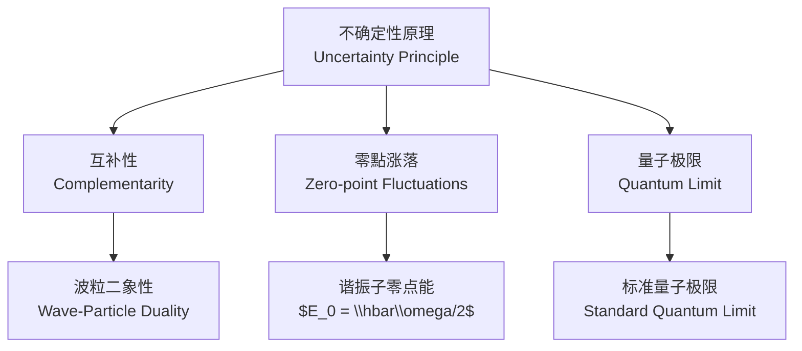

---
aliases:
  - Operators and Measurement
  - 量子算符理论
  - 测量公设
tags:
  - physics
  - quantum-mechanics
  - operators
  - measurement
  - observables
created: 2025-01-20
updated: 2025-05-16
---

# 算符与测量 (Operators and Measurement)

## 概述 (Overview)

在量子力学中，物理可观测量 (observables) 由希尔伯特空间上的厄米算符 (Hermitian operators) 表示。测量过程由波函数坍缩 (wavefunction collapse) 描述。

```mermaid
graph LR
    A[量子态<br/>State $|\\psi\\rangle$] --> B[厄米算符<br/>Hermitian Operator $\\hat{O}$]
    B --> C[本征值 $\\lambda_n$<br/>Eigenvalues]
    B --> D[本征态 $|n\\rangle$<br/>Eigenstates]
    C --> E[测量结果<br/>Measurement Outcome]
    D --> F[坍缩后状态<br/>Post-measurement State]
```

## 算符的基本定义 (Basic Definition)

线性算符 $\hat{A}$ 满足：

$$\hat{A}(c_1|\psi_1\rangle + c_2|\psi_2\rangle) = c_1\hat{A}|\psi_1\rangle + c_2\hat{A}|\psi_2\rangle$$

### 厄米算符 (Hermitian Operator)

厄米算符满足 $\hat{A}^\dagger = \hat{A}$，即对于任意 $|\phi\rangle, |\psi\rangle$：

$$\langle \phi | \hat{A} \psi \rangle = \langle \hat{A} \phi | \psi \rangle$$

厄米算符具有实本征值和正交完备的本征态：

$$\hat{A}|a_n\rangle = a_n|a_n\rangle, \quad a_n \in \mathbb{R}$$

$$\langle a_m | a_n \rangle = \delta_{mn}$$

$$\sum_n |a_n\rangle\langle a_n| = \hat{I}$$

## 常见算符 (Common Operators)

| 算符 (Operator) | 符号 (Symbol) | 位置表象 (Position Representation) | 对易关系 (Commutation) |
|---|---|---|---|
| 位置 (Position) | $\hat{x}$ | $x$ | $[\hat{x}, \hat{p}] = i\hbar$ |
| 动量 (Momentum) | $\hat{p}$ | $-i\hbar \frac{\partial}{\partial x}$ | $[\hat{p}_i, \hat{p}_j] = 0$ |
| 哈密顿量 (Hamiltonian) | $\hat{H}$ | $-\frac{\hbar^2}{2m}\nabla^2 + V(x)$ | $[\hat{H}, \hat{x}] \neq 0$ |
| 角动量 (Angular Momentum) | $\hat{L}$ | $-i\hbar(\mathbf{r} \times \nabla)$ | $[\hat{L}_i, \hat{L}_j] = i\hbar\epsilon_{ijk}\hat{L}_k$ |

## 对易关系 (Commutation Relations)

对易子定义为：

$$[\hat{A}, \hat{B}] = \hat{A}\hat{B} - \hat{B}\hat{A}$$

### 正则对易关系 (Canonical Commutation Relations)

$$[\hat{x}_i, \hat{p}_j] = i\hbar \delta_{ij}$$

$$[\hat{x}_i, \hat{x}_j] = 0$$

$$[\hat{p}_i, \hat{p}_j] = 0$$

### 角动量对易关系 (Angular Momentum Commutation)

$$[L_x, L_y] = i\hbar L_z, \quad [L_y, L_z] = i\hbar L_x, \quad [L_z, L_x] = i\hbar L_y$$

总角动量平方 $L^2 = L_x^2 + L_y^2 + L_z^2$ 满足：

$$[L^2, L_z] = 0$$

## 不确定性原理 (Uncertainty Principle)

对于任意两个厄米算符 $\hat{A}$ 和 $\hat{B}$：

$$\Delta A \cdot \Delta B \geq \frac{1}{2}|\langle [\hat{A}, \hat{B}] \rangle|$$

其中方差定义为：

$$(\Delta A)^2 = \langle \hat{A}^2 \rangle - \langle \hat{A} \rangle^2$$

### 海森堡不确定性原理 (Heisenberg Uncertainty Principle)

对于位置和动量：

$$\Delta x \cdot \Delta p \geq \frac{\hbar}{2}$$

对于能量和时间：

$$\Delta E \cdot \Delta t \geq \frac{\hbar}{2}$$



## 测量公设 (Measurement Postulate)

量子力学的测量公设：

1. 每个可观测量对应一个厄米算符 $\hat{O}$
2. 测量结果必为 $\hat{O}$ 的某个本征值 $\lambda_n$
3. 测量后系统坍缩到对应的本征态 $|n\rangle$

### 投影测量 (Projective Measurement)

投影算符 $P_n = |n\rangle\langle n|$，系统在测量后处于态：

$$|\psi'\rangle = \frac{P_n |\psi\rangle}{\sqrt{\langle \psi | P_n | \psi \rangle}}$$

获得结果 $\lambda_n$ 的概率为：

$$P(\lambda_n) = |\langle n | \psi \rangle|^2 = \langle \psi | P_n | \psi \rangle$$

### 期望值 (Expectation Value)

系统在态 $|\psi\rangle$ 下对可观测量 $\hat{A}$ 的期望值：

$$\langle \hat{A} \rangle = \langle \psi | \hat{A} | \psi \rangle$$

## 本征值问题 (Eigenvalue Problem)

$$(\hat{H} - E_n) |\psi_n\rangle = 0$$

对于无限深方势阱 (infinite square well)：

$$\hat{H} = -\frac{\hbar^2}{2m}\frac{d^2}{dx^2}, \quad 0 < x < a$$

本征函数和本征值：

$$\psi_n(x) = \sqrt{\frac{2}{a}}\sin\left(\frac{n\pi x}{a}\right)$$

$$E_n = \frac{n^2\pi^2\hbar^2}{2ma^2}$$

## 算符的函数 (Functions of Operators)

如果 $\hat{A}$ 是厄米算符且有谱分解 $\hat{A} = \sum_n a_n |n\rangle\langle n|$，则：

$$f(\hat{A}) = \sum_n f(a_n) |n\rangle\langle n|$$

例如时间演化算符 (time evolution operator)：

$$\hat{U}(t) = e^{-i\hat{H}t/\hbar} = \sum_n e^{-iE_n t/\hbar} |n\rangle\langle n|$$

## 海森堡绘景 (Heisenberg Picture)

在薛定谔绘景中，态矢随时间演化而算符不变。在海森堡绘景中，算符随时间演化而态矢不变：

$$\frac{d\hat{A}_H}{dt} = \frac{i}{\hbar}[\hat{H}, \hat{A}_H] + \frac{\partial \hat{A}}{\partial t}$$

若 $\hat{A}$ 不显含时间，则海森堡运动方程为：

$$\frac{d\hat{A}_H}{dt} = \frac{i}{\hbar}[\hat{H}, \hat{A}_H]$$

### 海森堡绘景中的位置和动量

$$\frac{d\hat{x}_H}{dt} = \frac{\hat{p}_H}{m}$$

$$\frac{d\hat{p}_H}{dt} = -\frac{\partial V}{\partial \hat{x}_H}$$

## 相互作用绘景 (Interaction Picture)

哈密顿量分为自由部分和相互作用部分：

$$\hat{H} = \hat{H}_0 + \hat{H}_{int}$$

算符在相互作用绘景中按 $\hat{H}_0$ 演化：

$$\hat{A}_I(t) = e^{i\hat{H}_0 t/\hbar} \hat{A}_S e^{-i\hat{H}_0 t/\hbar}$$

态矢按 $\hat{H}_{int}$ 演化：

$$i\hbar\frac{d}{dt}|\psi_I(t)\rangle = \hat{H}_{int,I}(t) |\psi_I(t)\rangle$$

## 量子比特与泡利算符 (Qubits and Pauli Operators)

泡利矩阵 (Pauli matrices) 是 $2\times 2$ 厄米算符：

$$\sigma_x = \begin{pmatrix} 0 & 1 \\ 1 & 0 \end{pmatrix}, \quad \sigma_y = \begin{pmatrix} 0 & -i \\ i & 0 \end{pmatrix}, \quad \sigma_z = \begin{pmatrix} 1 & 0 \\ 0 & -1 \end{pmatrix}$$

对易关系：

$$[\sigma_i, \sigma_j] = 2i \epsilon_{ijk} \sigma_k$$

## 密度算符 (Density Operator)

对于混合态 (mixed state)，使用密度算符描述：

$$\hat{\rho} = \sum_i p_i |\psi_i\rangle\langle\psi_i|$$

期望值：

$$\langle \hat{A} \rangle = \text{Tr}(\hat{\rho} \hat{A})$$

冯诺依曼熵 (von Neumann entropy)：

$$S = -\text{Tr}(\hat{\rho} \ln \hat{\rho})$$

## 量子测量理论进阶 (Advanced Measurement Theory)

| 测量类型 (Measurement Type) | 描述 (Description) | 数学表达 (Expression) |
|---|---|---|
| 投影测量 (Projective) | 理想测量，完全区分正交态 | $P_n = \|n\rangle\langle n\|$ |
| POVM | 广义测量，允许非正交区分 | $E_n = M_n^\dagger M_n$ |
| 弱测量 (Weak Measurement) | 部分信息提取，扰动小 | $\langle \hat{A} \rangle_w = \frac{\langle \phi \| \hat{A} \| \psi \rangle}{\langle \phi \| \psi \rangle}$ |
