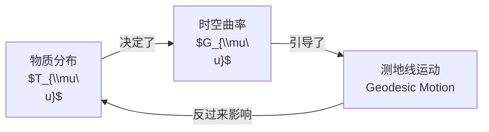
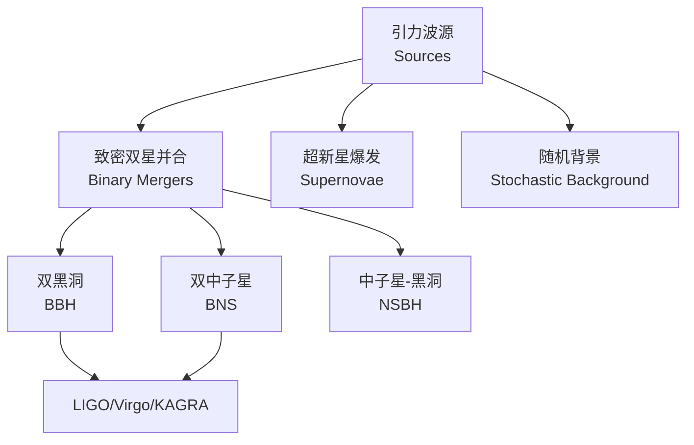

---
aliases:
  - General Relativity
  - 爱因斯坦引力理论
  - GR
tags:
  - physics
  - relativity
  - gravity
  - spacetime
  - cosmology
created: 2025-02-01
updated: 2025-05-16
---

# 广义相对论 (General Relativity)

## 概述 (Overview)

广义相对论是爱因斯坦于1915年提出的引力理论。它将引力描述为时空弯曲的几何效应，而非牛顿理论中的力。

```mermaid
graph TD
    A[广义相对论<br/>General Relativity] --> B[几何描述<br/>Geometric Description]
    A --> C[物理效应<br/>Physical Effects]
    B --> D[度规张量 $g_{\\mu\\nu}$<br/>Metric Tensor]
    B --> E[曲率张量 $R_{\\mu\\nu\\rho\\sigma}$<br/>Curvature Tensor]
    C --> F[引力红移<br/>Gravitational Redshift]
    C --> G[光线偏折<br/>Light Deflection]
    C --> H[水星近日点进动<br/>Perihelion Precession]
    C --> I[引力波<br/>Gravitational Waves]
```

## 等效原理 (Equivalence Principle)

### 弱等效原理 (Weak Equivalence Principle)

惯性质量等于引力质量：

$$m_i = m_g$$

这意味着所有物体在引力场中具有相同的加速度。

### 爱因斯坦等效原理 (Einstein Equivalence Principle)

在局部自由落体参考系中，所有物理定律（包括非引力定律）与狭义相对论中的形式相同。

$$\text{局部惯性系} \iff \text{无引力的狭义相对论}$$

## 度规张量 (Metric Tensor)

时空由度规张量 $g_{\mu\nu}$ 描述。在坐标系 $x^\mu$ 中，线元为：

$$ds^2 = g_{\mu\nu} dx^\mu dx^\nu$$

### 闵可夫斯基度规 (Minkowski Metric)

无引力的平直时空：

$$g_{\mu\nu} = \eta_{\mu\nu} = \text{diag}(-1, +1, +1, +1)$$

### 史瓦西度规 (Schwarzschild Metric)

球对称静态黑洞的外部解：

$$ds^2 = -\left(1 - \frac{2GM}{rc^2}\right)c^2dt^2 + \left(1 - \frac{2GM}{rc^2}\right)^{-1}dr^2 + r^2 d\Omega^2$$

其中 $d\Omega^2 = d\theta^2 + \sin^2\theta d\phi^2$。

## 克里斯托费尔符号 (Christoffel Symbols)

联络系数由度规导出：

$$\Gamma^\rho_{\mu\nu} = \frac{1}{2}g^{\rho\sigma}\left(\partial_\mu g_{\nu\sigma} + \partial_\nu g_{\sigma\mu} - \partial_\sigma g_{\mu\nu}\right)$$

## 曲率张量 (Curvature Tensor)

### 黎曼曲率张量 (Riemann Curvature Tensor)

$$R^\rho_{\sigma\mu\nu} = \partial_\mu \Gamma^\rho_{\nu\sigma} - \partial_\nu \Gamma^\rho_{\mu\sigma} + \Gamma^\rho_{\mu\lambda}\Gamma^\lambda_{\nu\sigma} - \Gamma^\rho_{\nu\lambda}\Gamma^\lambda_{\mu\sigma}$$

### 里奇张量 (Ricci Tensor)

由黎曼张量缩并得到：

$$R_{\mu\nu} = R^\rho_{\mu\rho\nu}$$

### 里奇标量 (Ricci Scalar)

$$R = g^{\mu\nu}R_{\mu\nu}$$

## 爱因斯坦场方程 (Einstein Field Equations)

$$G_{\mu\nu} + \Lambda g_{\mu\nu} = \frac{8\pi G}{c^4}T_{\mu\nu}$$

其中爱因斯坦张量：

$$G_{\mu\nu} = R_{\mu\nu} - \frac{1}{2}Rg_{\mu\nu}$$

$T_{\mu\nu}$ 是能动张量 (stress-energy tensor)，$\Lambda$ 是宇宙学常数 (cosmological constant)。



## 测地线方程 (Geodesic Equation)

自由粒子在弯曲时空中沿测地线运动：

$$\frac{d^2 x^\mu}{d\tau^2} + \Gamma^\mu_{\nu\rho}\frac{dx^\nu}{d\tau}\frac{dx^\rho}{d\tau} = 0$$

对于弱场低速近似，退化为牛顿引力：

$$\frac{d^2 x^i}{dt^2} = -\frac{\partial \Phi}{\partial x^i}$$

其中 $\Phi$ 是牛顿引力势。

## 经典检验 (Classical Tests)

| 效应 (Effect) | 预测 (Prediction) | 实验验证 (Experiment) |
|---|---|---|
| 水星近日点进动 | 每世纪 43 角秒 | 已验证 (1919 年后) |
| 光线偏折 | 1.75 角秒 (太阳边缘) | 日食观测 (1919, Eddington) |
| 引力红移 | $z \approx GM/(Rc^2)$ | Pound-Rebka 实验 (1959) |
| 雷达回波延迟 | $\Delta t \approx 4GM/c^3 \ln(4r_1 r_2/b^2)$ | Viking 火星探测器 |

## 黑洞 (Black Holes)

### 事件视界 (Event Horizon)

史瓦西半径：

$$r_S = \frac{2GM}{c^2}$$

### 克尔黑洞 (Kerr Black Hole)

对于旋转黑洞，度规包含角动量 $J = aM$：

$$ds^2 = -\left(1 - \frac{2GMr}{\rho^2}\right)dt^2 - \frac{4GMar\sin^2\theta}{\rho^2}dtd\phi + \frac{\rho^2}{\Delta}dr^2 + \rho^2 d\theta^2 + \left(r^2 + a^2 + \frac{2GMa^2 r\sin^2\theta}{\rho^2}\right)\sin^2\theta d\phi^2$$

其中：

$$\rho^2 = r^2 + a^2\cos^2\theta, \quad \Delta = r^2 - 2GMr + a^2$$

### 黑洞热力学 (Black Hole Thermodynamics)

| 定律 (Law) | 内容 (Content) |
|---|---|
| 第零定律 | 事件视界表面引力 $\kappa$ 处处相等 |
| 第一定律 | $dM = \kappa dA/(8\pi G) + \Omega dJ$ |
| 第二定律 | 视界面积 $A$ 永不减少 |
| 第三定律 | 无法通过有限步骤使 $\kappa \to 0$ |

霍金辐射温度：

$$T_H = \frac{\hbar\kappa}{2\pi c k_B}$$

## 引力波 (Gravitational Waves)

在弱场近似下，$g_{\mu\nu} = \eta_{\mu\nu} + h_{\mu\nu}$，波动方程：

$$\square \bar{h}_{\mu\nu} = -\frac{16\pi G}{c^4} T_{\mu\nu}$$

在横迹无迹 (TT) 规范下，引力波有两种偏振模：

$$h_+ = A_+ \cos(\omega t - kz), \quad h_\times = A_\times \cos(\omega t - kz)$$



## 宇宙学应用 (Cosmological Applications)

### FLRW 度规 (Friedmann-Lemaître-Robertson-Walker Metric)

描述均匀各向同性的宇宙：

$$ds^2 = -c^2dt^2 + a(t)^2\left[\frac{dr^2}{1 - kr^2} + r^2 d\Omega^2\right]$$

### 弗里德曼方程 (Friedmann Equations)

$$\left(\frac{\dot{a}}{a}\right)^2 = \frac{8\pi G}{3}\rho - \frac{kc^2}{a^2} + \frac{\Lambda c^2}{3}$$

$$\frac{\ddot{a}}{a} = -\frac{4\pi G}{3}\left(\rho + \frac{3p}{c^2}\right) + \frac{\Lambda c^2}{3}$$

## 牛顿极限 (Newtonian Limit)

在弱场 ($g_{\mu\nu} = \eta_{\mu\nu} + h_{\mu\nu}$, $|h_{\mu\nu}| \ll 1$) 和低速 ($dx^i/dt \ll c$) 下，$h_{00} = -2\Phi/c^2$，测地线方程退化为：

$$\frac{d^2 x^i}{dt^2} = -\frac{\partial \Phi}{\partial x^i}$$

其中 $\Phi$ 满足泊松方程：

$$\nabla^2 \Phi = 4\pi G\rho$$
