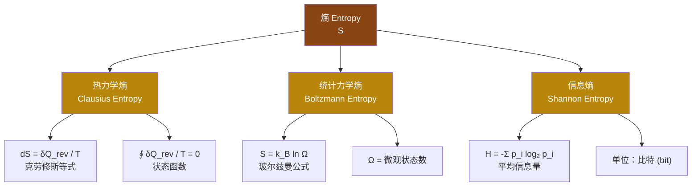

# 熵 (Entropy)

> 熵是热力学中衡量系统混乱程度或不可用能量程度的物理量，也是热力学第二定律的核心概念。它在统计力学中对应微观状态数的对数，在信息论中衡量信息的不确定性。

## 熵的三种定义 (Three Definitions of Entropy)

## 热力学熵 (Thermodynamic Entropy)

### 克劳修斯熵 (Clausius Entropy)

**克劳修斯等式与不等式**：

$$ dS = \frac{\delta Q_{\text{rev}}}{T} $$

对于不可逆过程：

$$ dS > \frac{\delta Q}{T} $$

**核心性质**：
- 熵是**状态函数**，其变化只取决于初末状态，与路径无关
- 可逆循环中：$\oint \frac{\delta Q_{\text{rev}}}{T} = 0$
- 单位：$\text{J/K}$（焦耳每开尔文）

### 熵变的计算 (Calculating Entropy Change)

| 过程类型 | 熵变公式 | 条件 |
|---------|---------|------|
| 等温可逆膨胀 | $\Delta S = nR \ln\frac{V_2}{V_1}$ | 理想气体，T恒定 |
| 等容加热 | $\Delta S = nC_V \ln\frac{T_2}{T_1}$ | 定容比热容 |
| 等压加热 | $\Delta S = nC_P \ln\frac{T_2}{T_1}$ | 定压比热容 |
| 相变 (可逆) | $\Delta S = \frac{\Delta H_{\text{phase}}}{T_{\text{phase}}}$ | 熔点/沸点处 |
| 绝热可逆过程 | $\Delta S = 0$ | 等熵过程 |

### 热力学第二定律 (Second Law of Thermodynamics)

**熵增原理** (Principle of Entropy Increase)：

$$ \Delta S_{\text{孤立系统}} \geq 0 $$

- 孤立系统的熵永不减少
- 可逆过程：$\Delta S = 0$
- 不可逆过程：$\Delta S > 0$
- 自发过程的方向：系统+环境的熵增加

**第二定律的等价表述**：

| 表述 | 内容 |
|:----:|------|
| 克劳修斯表述 | 热量不能自发地从低温物体传到高温物体 |
| 开尔文-普朗克表述 | 不可能从单一热源吸热使之完全转化为功而不产生其他影响 |
| 熵表述 | 孤立系统的熵永不减少 |

## 统计力学熵 (Statistical Entropy)

### 玻尔兹曼公式 (Boltzmann Formula)

$$ S = k_B \ln \Omega $$

其中：
- $k_B = 1.380649 \times 10^{-23} \ \text{J/K}$（玻尔兹曼常数）
- $\Omega$ = 与宏观状态对应的微观状态数

**核心思想**：熵是系统微观无序程度的度量。微观状态数 $\Omega$ 越大，熵越大。

### 热力学平衡 (Thermodynamic Equilibrium)

系统趋于平衡态的过程，就是向着 $\Omega$ 最大（即熵最大）的微观状态分布演化的过程。平衡态对应最大熵状态。

### 例子：两子系统热接触

两系统 $A$ 和 $B$ 接触时：
$$ S_{\text{总}} = S_A + S_B $$
平衡条件：
$$ \frac{\partial S_A}{\partial U_A} = \frac{\partial S_B}{\partial U_B} \implies T_A = T_B $$

温度相等是熵最大化条件下的热平衡条件。

## 信息熵 (Information Entropy)

### 香农熵 (Shannon Entropy)

由克劳德·香农 (Claude Shannon) 1948 年提出，衡量信息源的不确定性：

$$ H = -\sum_{i=1}^{n} p_i \log_2 p_i $$

其中 $p_i$ 是第 $i$ 个事件发生的概率，单位是比特 (bit)。

### 信息熵与热力学熵的关系

| 概念 | 信息熵 (H) | 热力学熵 (S) |
|:----:|:----------:|:------------:|
| 公式 | $H = -\Sigma p_i \log_2 p_i$ | $S = k_B \ln \Omega$ |
| 底数 | 2 (bit) | 自然对数 e |
| 含义 | 不确定性 | 微观状态数 |
| 联系 | $S = k_B H \ln 2$ | 当所有微观状态等概率时 |

### 信息熵应用

- **数据压缩**：熵编码（霍夫曼编码、算术编码）
- **机器学习**：决策树（信息增益 ID3/C4.5）、交叉熵损失函数
- **密码学**：密钥熵（Key Entropy）
- **自然语言处理**：语言模型困惑度 (Perplexity = $2^H$)

## 熵在化学反应中的应用 (Entropy in Chemical Reactions)

**吉布斯自由能** (Gibbs Free Energy)：

$$ \Delta G = \Delta H - T\Delta S $$

| $\Delta H$ | $\Delta S$ | $\Delta G$ | 反应方向 |
|:----------:|:----------:|:----------:|:--------:|
| $-$ (放热) | $+$ (熵增) | 一定 $-$ | 任意温度自发 |
| $+$ (吸热) | $-$ (熵减) | 一定 $+$ | 任意温度非自发 |
| $-$ (放热) | $-$ (熵减) | 取决于 $T$ | 低温自发 |
| $+$ (吸热) | $+$ (熵增) | 取决于 $T$ | 高温自发 |

## 自然界的熵 (Entropy in Nature)

### 典型熵值

| 系统 | 近似熵值 |
|:----:|:--------:|
| 1 mol 理想气体 (STP) | ~126 J/(mol·K) |
| 1 mol 水 (298K, 液态) | 69.9 J/(mol·K) |
| 1 mol 冰 (273K) | 47.9 J/(mol·K) |
| 1 个黑体辐射光子 | ~$3.6 \times 10^{-23}$ J/K |
| 1 bit 信息 (Landauer极限) | $k_B \ln 2 \approx 9.57 \times 10^{-24}$ J/K |

### 熵与宇宙

- **热寂说** (Heat Death)：宇宙最终达到最大熵状态，所有能量均匀分布
- **生命与负熵** (Negentropy)：薛定谔提出生命以"负熵"为食，通过代谢维持低熵有序结构
- **黑洞熵** (Bekenstein-Hawking Entropy)：$S_{\text{BH}} = \frac{k_B c^3 A}{4 G \hbar}$，与视界面积 $A$ 成正比

## 常见误解 (Common Misconceptions)

| 误解 | 正确理解 |
|:----:|---------|
| 熵是混乱度 | 熵是微观状态数的对数，混乱是直观类比 |
| 熵总是增加 | 只有在孤立系统中熵才不减少；开放系统可以熵减 |
| 熵不能为负 | 热力学熵 $S \geq 0$，但熵变 $\Delta S$ 可负 |
| 信息熵=热力学熵 | 两者形式上类比但物理含义不同，通过 $k_B \ln 2$ 换算 |

## 思考题 (Discussion Questions)

1. 为什么打开一瓶香水，香味分子会自发扩散到整个房间？
2. 冰箱能降低内部温度，是否违反了热力学第二定律？
3. 计算机存储 1 GB 的信息，理论上最少需要消耗多少能量？（Landauer原理）
4. DNA复制过程高度有序（熵减），如何与熵增原理相容？
5. 信息熵为 $H=0$ 意味着什么？信息熵最大时对应什么概率分布？

## 相关条目 (Related Entries)

- [[02_NaturalSciences/Physics/Thermodynamics/StatisticalMechanics\|统计力学 (Statistical Mechanics)]]
- [[02_NaturalSciences/Physics/Thermodynamics/INDEX\|热力学索引]]
