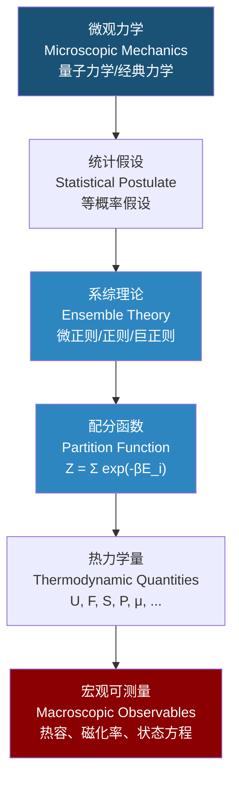

---
aliases: [StatisticalMechanics, 统计力学, 统计物理, 系综, StatisticalPhysics, PartitionFunction, BoltzmannDistribution]
tags: ['02_NaturalSciences', 'Physics', 'Thermodynamics', 'StatisticalMechanics', 'QuantumMechanics']
created: 2026-05-17
updated: 2026-05-17
---

# 统计力学 (Statistical Mechanics)

> 统计力学是用概率统计方法研究大量微观粒子组成宏观系统行为的物理学分支。它从微观粒子的运动规律出发，通过统计平均推导系统的宏观热力学性质，是连接微观力学与宏观热力学的桥梁。

## 核心思想 (Core Idea)

**基本出发点**：宏观状态由大量微观状态通过统计平均决定。

$$ \text{宏观可测量} = \langle \text{微观量} \rangle_{\text{系综平均}} $$

**统计力学基本假设** (Fundamental Postulate)：

对于处于平衡态的孤立系统，所有可达的微观状态等概率出现。这个等概率假设 (Postulate of Equal a Priori Probability) 是整个统计力学的基石。

## 三种系综 (Three Ensembles)

### 微正则系综 (Microcanonical Ensemble)

**特征**：孤立系统，能量 $E$、粒子数 $N$、体积 $V$ 固定。

| 属性 | 含义 |
|:----:|:----:|
| 固定量 | $E$, $V$, $N$ |
| 状态函数 | 熵 $S(E, V, N) = k_B \ln \Omega(E, V, N)$ |
| 微观状态数 | $\Omega(E) = \text{能量在 } E \text{ 到 } E+\delta E \text{ 之间的状态数}$ |
| 特征函数 | 熵 $S$ |
| 典型系统 | 完美绝热容器内的气体 |

**基本关系**：

$$ \frac{1}{T} = \left(\frac{\partial S}{\partial U}\right)_{V,N} $$

$$ \frac{P}{T} = \left(\frac{\partial S}{\partial V}\right)_{U,N} $$

$$ \frac{\mu}{T} = -\left(\frac{\partial S}{\partial N}\right)_{U,V} $$

### 正则系综 (Canonical Ensemble)

**特征**：与热库接触的系统，温度 $T$、粒子数 $N$、体积 $V$ 固定。

| 属性 | 含义 |
|:----:|:----:|
| 固定量 | $T$, $V$, $N$ |
| 配分函数 | $Z(T, V, N) = \sum_i e^{-\beta E_i}$ |
| 玻尔兹曼因子 | $P_i = \frac{1}{Z} e^{-\beta E_i}$ |
| 自由能 | $F = -k_B T \ln Z$ |
| 典型系统 | 恒温水浴中的系统 |

**从配分函数导出热力学量**：

$$ U = \langle E \rangle = -\frac{\partial \ln Z}{\partial \beta} $$

$$ F = -k_B T \ln Z $$

$$ S = -\left(\frac{\partial F}{\partial T}\right)_{V,N} = k_B \ln Z + \frac{U}{T} $$

$$ P = -\left(\frac{\partial F}{\partial V}\right)_{T,N} = \frac{1}{\beta} \frac{\partial \ln Z}{\partial V} $$

$$ \mu = \left(\frac{\partial F}{\partial N}\right)_{T,V} = -\frac{1}{\beta} \frac{\partial \ln Z}{\partial N} $$

$$ C_V = \left(\frac{\partial U}{\partial T}\right)_V $$

### 巨正则系综 (Grand Canonical Ensemble)

**特征**：与热库和粒子库接触的系统，温度 $T$、化学势 $\mu$、体积 $V$ 固定。

| 属性 | 含义 |
|:----:|:----:|
| 固定量 | $T$, $V$, $\mu$ |
| 巨配分函数 | $\Xi(T, V, \mu) = \sum_{N} \sum_i e^{-\beta (E_i - \mu N)}$ |
| 概率 | $P_{i,N} = \frac{1}{\Xi} e^{-\beta (E_i - \mu N)}$ |
| 巨势 | $\Omega_G = -k_B T \ln \Xi = -PV$ |
| 典型系统 | 开放系统，吸附现象 |

**从巨配分函数导出热力学量**：

$$ U = -\frac{\partial \ln \Xi}{\partial \beta} $$

$$ \langle N \rangle = \frac{1}{\beta} \frac{\partial \ln \Xi}{\partial \mu} $$

$$ PV = k_B T \ln \Xi $$

$$ S = k_B \ln \Xi + \frac{U}{T} - \frac{\mu \langle N \rangle}{T} $$

## 配分函数的意义 (Significance of Partition Function)

配分函数 $Z$（或 $\Xi$）是统计力学的"**核心**"——知道配分函数，就可以导出所有热力学量。

$$ Z = \sum_{\text{所有状态}} e^{-\beta E_i} $$

| 热力学量 | 自 $Z$ 的表达式 |
|:--------:|:--------------:|
| 亥姆霍兹自由能 $F$ | $F = -k_B T \ln Z$ |
| 内能 $U$ | $U = -\frac{\partial \ln Z}{\partial \beta} = k_B T^2 \frac{\partial \ln Z}{\partial T}$ |
| 熵 $S$ | $S = k_B \ln Z + \frac{U}{T}$ |
| 压力 $P$ | $P = k_B T \frac{\partial \ln Z}{\partial V}$ |
| 化学势 $\mu$ | $\mu = -k_B T \frac{\partial \ln Z}{\partial N}$ |
| 热容 $C_V$ | $C_V = \frac{\partial U}{\partial T} = k_B \beta^2 \frac{\partial^2 \ln Z}{\partial \beta^2}$ |

## 玻尔兹曼分布 (Boltzmann Distribution)

### 正则系综中的概率分布

$$ P_i = \frac{e^{-\beta E_i}}{Z} $$

其中 $\beta = \frac{1}{k_B T}$。

**关键特征**：
- 高能量状态的占据概率呈指数衰减
- 温度越高，高能态被占据的概率越大
- 零温极限 ($T \to 0$)：系统处于基态

### 麦克斯韦-玻尔兹曼统计 (Maxwell-Boltzmann Statistics)

对于理想气体，单粒子的能量分布：

$$ f(v) \, d^3v = \left(\frac{m}{2\pi k_B T}\right)^{3/2} e^{-\frac{mv^2}{2k_B T}} \, d^3v $$

**速度分量分布**（一维）：
$$ f(v_x) = \sqrt{\frac{m}{2\pi k_B T}} \, e^{-\frac{mv_x^2}{2k_B T}} $$

**最概然速度** (Most Probable Speed)：
$$ v_p = \sqrt{\frac{2k_B T}{m}} $$

**平均速度** (Mean Speed)：
$$ \langle v \rangle = \sqrt{\frac{8k_B T}{\pi m}} $$

**方均根速度** (RMS Speed)：
$$ v_{\text{rms}} = \sqrt{\langle v^2 \rangle} = \sqrt{\frac{3k_B T}{m}} $$

## 量子统计 (Quantum Statistics)

### 玻色-爱因斯坦统计 (Bose-Einstein Statistics)

适用于自旋为整数的粒子（玻色子，如光子、声子、$^4$He 原子）。

$$ \langle n_i \rangle = \frac{1}{e^{\beta(\varepsilon_i - \mu)} - 1} $$

**关键现象**：
- 玻色-爱因斯坦凝聚 (BEC)：低温下宏观数量的玻色子占据基态
- 黑体辐射（光子气体）：$\mu = 0$ 时的普朗克分布
- 德拜模型（声子气体）

### 费米-狄拉克统计 (Fermi-Dirac Statistics)

适用于自旋为半整数的粒子（费米子，如电子、质子、中子）。

$$ \langle n_i \rangle = \frac{1}{e^{\beta(\varepsilon_i - \mu)} + 1} $$

**关键现象**：
- 费米能级 $E_F$：$T=0$ 时最高占据态的能量
- 金属电子的热容 $C_V \propto T$
- 白矮星的电子简并压
- 半导体掺杂与载流子统计

### 三种统计比较

| 统计类型 | 自旋 | 波函数对称性 | 分布函数 | 典型例子 |
|:--------:|:----:|:------------:|:--------:|:--------:|
| 麦克斯韦-玻尔兹曼 (MB) | 任意 | 可区分粒子 | $e^{-\beta(\varepsilon_i - \mu)}$ | 经典理想气体（稀薄） |
| 玻色-爱因斯坦 (BE) | 整数 | 对称 | $\frac{1}{e^{\beta(\varepsilon_i - \mu)} - 1}$ | 光子、声子、BEC |
| 费米-狄拉克 (FD) | 半整数 | 反对称 | $\frac{1}{e^{\beta(\varepsilon_i - \mu)} + 1}$ | 电子、质子、中子 |

**高温低密度极限**：BE 和 FD 分布都趋近于 MB 分布。

## 理想气体的配分函数 (Ideal Gas Partition Function)

**单粒子配分函数**：
$$ Z_1 = \frac{V}{\lambda^3} $$

其中热德布罗意波长 (Thermal de Broglie Wavelength)：
$$ \lambda = \frac{h}{\sqrt{2\pi m k_B T}} $$

**$N$ 个不可区分粒子的正则配分函数**：
$$ Z_N = \frac{Z_1^N}{N!} = \frac{1}{N!} \left(\frac{V}{\lambda^3}\right)^N $$

**由此导出的状态方程**：
$$ PV = Nk_B T $$

**内能**：
$$ U = \frac{3}{2} N k_B T $$

**等容热容**：
$$ C_V = \frac{3}{2} N k_B $$

## 常见模型的平均能量 (Equipartition Theorem)

**能量均分定理** (Equipartition Theorem)：每个二次型自由度贡献 $\frac{1}{2} k_B T$ 的平均能量。

| 系统 | 自由度/粒子 | 平均内能/分子 |
|:----:|:-----------:|:--------------:|
| 单原子分子 | 3（平动） | $\frac{3}{2} k_B T$ |
| 双原子分子（高温） | 3+2+2（平动+转动+振动） | $\frac{7}{2} k_B T$ |
| 固体（杜隆-珀蒂） | 6（3个振动×2） | $3k_B T$ |
| 一维谐振子 | 2 | $k_B T$ |
| 量子谐振子（低温） | — | 需要普朗克分布 |

## 涨落理论 (Fluctuation Theory)

### 能量涨落

$$ \overline{(\Delta E)^2} = \langle E^2 \rangle - \langle E \rangle^2 = k_B T^2 C_V $$

相对涨落：
$$ \frac{\sqrt{\overline{(\Delta E)^2}}}{\langle E \rangle} \propto \frac{1}{\sqrt{N}} $$

宏观系统中相对涨落极小，因此系综平均与时间平均等价（**遍历性假设**）。

### 粒子数涨落（巨正则系综）

$$ \overline{(\Delta N)^2} = k_B T \left(\frac{\partial \langle N \rangle}{\partial \mu}\right)_{T,V} $$

## 相关条目 (Related Entries)

- [[02_NaturalSciences/Physics/Thermodynamics/Entropy\|熵 (Entropy)]]
- [[02_NaturalSciences/Physics/Thermodynamics/INDEX\|热力学索引]]

