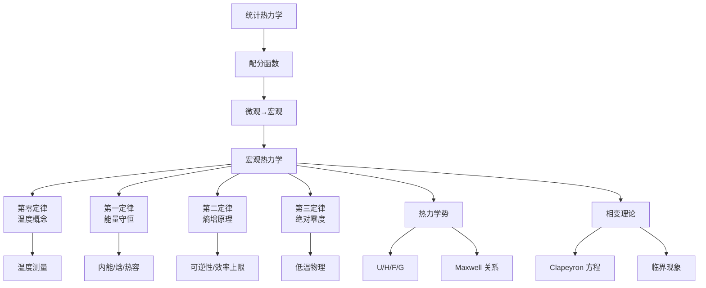

# 热力学概论

热力学（Thermodynamics）是研究能量转换、热现象以及物质宏观性质的物理学分支，核心基础为四大定律。第零定律确立温度概念与热平衡传递性；第一定律即能量守恒，表述系统内能变化等于吸热与对外做功之和；第二定律指明自发过程的方向性，引入熵（Entropy）概念；第三定律规定绝对零度不可达到，并给出熵在绝对零度时的行为。

## 热力学四大定律

### 第零定律 （Zeroth Law）

若系统 A 与系统 C 处于热平衡，且系统 B 与系统 C 处于热平衡，则 A 与 B 也处于热平衡。该定律为温度测量提供理论基础。

### 第一定律 （First Law）

能量守恒定律在热力学中的表述：

$$ \Delta U = Q - W $$

其中 U 为内能（Internal Energy），Q 为系统吸收的热量，W 为系统对外做的功。

### 第二定律 （Second Law）

Clausius 表述：热量不能自发地从低温物体传向高温物体。Kelvin-Planck 表述：不可能从单一热源吸热使之完全转化为功而不产生其他影响。数学表述：

$$ \Delta S \geq 0 $$

孤立系统的熵永不减少。

### 第三定律 （Third Law）

绝对零度（0 K）无法通过有限步骤达到。当温度趋近于 0 K 时，完美晶体的熵趋近于零：

$$ \lim_{T \to 0} S = 0 $$

## 热力学系统分类

| 系统类型 | 能量交换 | 物质交换 | 示例 |
|:---|:---:|:---:|:---|
| 孤立系 （Isolated） | ✗ | ✗ | 理想绝热容器 |
| 封闭系 （Closed） | ✓ | ✗ | 密封加热釜 |
| 开放系 （Open） | ✓ | ✓ | 活细胞 |

## 热力学过程

- **等温过程**（Isothermal）：温度恒定，$ \Delta T = 0 $
- **绝热过程**（Adiabatic）：无热交换，$ Q = 0 $
- **等压过程**（Isobaric）：压强恒定，$ \Delta P = 0 $
- **等容过程**（Isochoric）：体积恒定，$ \Delta V = 0 $
- **可逆过程**（Reversible）：系统始终处于平衡态
- **不可逆过程**（Irreversible）：具有方向性，涉及耗散

## 热力学势 （Thermodynamic Potentials）

| 势函数 | 符号 | 自然变量 | 微分形式 |
|:---|:---:|:---|:---|
| 内能 | $U$ | $S, V$ | $dU = TdS - PdV$ |
| 焓 | $H$ | $S, P$ | $dH = TdS + VdP$ |
| Helmholtz 自由能 | $F$ | $T, V$ | $dF = -SdT - PdV$ |
| Gibbs 自由能 | $G$ | $T, P$ | $dG = -SdT + VdP$ |

## 热力学循环

典型热机循环及其效率：

| 循环名称 | 工质 | 效率公式 | 应用 |
|:---|:---|:---|:---|
| Carnot 循环 | 理想气体 | $ \eta = 1 - T_C/T_H $ | 理论极限 |
| Otto 循环 | 汽油-空气 | $ \eta = 1 - r^{1-\gamma} $ | 汽油机 |
| Diesel 循环 | 柴油-空气 | $ \eta = 1 - (r^{1-\gamma} - 1)/(\alpha^\gamma - 1) $ | 柴油机 |
| Rankine 循环 | 水蒸气 | $ \eta = (h_1 - h_2)/(h_1 - h_4) $ | 火力发电 |
| Brayton 循环 | 空气 | $ \eta = 1 - r_p^{(1-\gamma)/\gamma} $ | 燃气轮机 |

## 统计热力学基础 （Statistical Thermodynamics）

配分函数（Partition Function）是连接微观与宏观的桥梁：

$$ Z = \sum_i g_i e^{-\beta \epsilon_i}, \quad \beta = \frac{1}{k_B T} $$

宏观量可从 Z 导出：

$$ U = -\frac{\partial \ln Z}{\partial \beta}, \quad S = k_B (\ln Z + \beta U), \quad F = -k_B T \ln Z $$

### 三种统计分布

| 分布类型 | 适用粒子 | 分布函数 |
|:---|:---|:---|
| Maxwell-Boltzmann | 可区分粒子 | $ n_i = g_i e^{\alpha - \beta\epsilon_i} $ |
| Bose-Einstein | 玻色子 | $ n_i = g_i / (e^{\beta(\epsilon_i - \mu)} - 1) $ |
| Fermi-Dirac | 费米子 | $ n_i = g_i / (e^{\beta(\epsilon_i - \mu)} + 1) $ |

## 相变与临界现象

- **一级相变**（First-Order）：体积和熵突变，潜热存在
- **二级相变**（Second-Order）：连续相变，比热容跳跃
- **Clausius-Clapeyron 方程**：

$$ \frac{dP}{dT} = \frac{L}{T \Delta V} $$

## 热力学系统关系图

## 热容与比热 （Heat Capacity）

定容热容和定压热容的定义：

$$ C_V = \left( \frac{\partial U}{\partial T} \right)_V, \quad C_P = \left( \frac{\partial H}{\partial T} \right)_P $$

二者关系：

$$ C_P - C_V = T \left( \frac{\partial P}{\partial T} \right)_V \left( \frac{\partial V}{\partial T} \right)_P = \frac{\alpha^2 VT}{\kappa_T} $$

其中 $\alpha$ 为体膨胀系数，$\kappa_T$ 为等温压缩系数。

## 理想气体状态方程与热力学过程

理想气体状态方程：

$$ PV = nRT $$

### 多方过程 （Polytropic Process）

$$ PV^n = \text{constant}, \quad n \text{为多方指数} $$

| n 值 | 过程类型 | 特征 |
|:---:|:---|:---|
| 0 | 等压过程 | $P$ 恒定 |
| 1 | 等温过程 | $T$ 恒定 |
| $\gamma$ | 绝热过程 | $Q = 0$ |
| $\infty$ | 等容过程 | $V$ 恒定 |

## Maxwell 关系式

Maxwell 关系是热力学势二阶偏导数的对称性导出的一组方程：

$$ \left( \frac{\partial T}{\partial V} \right)_S = -\left( \frac{\partial P}{\partial S} \right)_V $$

$$ \left( \frac{\partial T}{\partial P} \right)_S = \left( \frac{\partial V}{\partial S} \right)_P $$

$$ \left( \frac{\partial S}{\partial V} \right)_T = \left( \frac{\partial P}{\partial T} \right)_V $$

$$ \left( \frac{\partial S}{\partial P} \right)_T = -\left( \frac{\partial V}{\partial T} \right)_P $$

这些关系式在实验测量中极为有用——可以通过容易测量的量（P、V、T）推导出难以直接测量的量（S、U、H）。

## 化学势与相平衡

化学势 $\mu$ 是描述物质在相变和化学反应中转移倾向的热力学量：

$$ \mu_i = \left( \frac{\partial G}{\partial n_i} \right)_{T,P,n_{j \neq i}} $$

相平衡条件：多相系统中各相的温度、压强和化学势相等。

Gibbs 相律：

$$ F = C - P + 2 $$

其中 $F$ 为自由度，$C$ 为组分数，$P$ 为相数。

## 热力学第三定律的深层含义

### 绝对熵的计算

利用第三定律，可以计算物质在任意温度下的绝对熵：

$$ S(T) = \int_0^T \frac{C_P(T')}{T'} \, dT' + \sum \frac{\Delta H_{\text{相变}}}{T_{\text{相变}}} $$

### 低温物理现象

- **超导**（Superconductivity）：某些材料在临界温度以下电阻突降为零
- **超流**（Superfluidity）：液氦在 $\lambda$ 点（2.17 K）以下粘性消失
- **玻色-爱因斯坦凝聚**（BEC）：玻色子在极低温下占据同一量子态

## 热力学与信息论

热力学与信息论之间存在深刻联系。Landauer 原理指出：擦除一比特信息必须耗散的最小热量为：

$$ E_{\min} = k_B T \ln 2 $$

Maxwell 妖悖论（Maxwell's Demon）的解决揭示了信息处理与熵增的内在关系——"妖"的测量和记忆操作必须消耗能量，从而维持第二定律的有效性。

## 热力学在生命系统中的应用

生命是开放热力学系统，通过负熵流维持有序结构：

- **自组织**（Self-Organization）：生物分子在能量驱动下自发组装
- **代谢网络**：细胞通过 ATP 水解耦合吸能反应
- **生物热力学**：Gibbs 自由能变化决定生化反应方向
- **进化**：能量捕获效率作为适应度的热力学基础

Schrödinger 在《生命是什么》（1944）中首次提出"负熵"（Negative Entropy）概念，认为生命从环境中摄取有序以对抗熵增。

## 非平衡热力学

非平衡热力学（Non-Equilibrium Thermodynamics）研究偏离平衡态的系统：

### 线性非平衡区

Onsager 倒易关系（Onsager Reciprocal Relations）：

$$ J_i = \sum_j L_{ij} X_j, \quad L_{ij} = L_{ji} $$

其中 $J_i$ 为广义流（热流、扩散流等），$X_j$ 为广义力（温度梯度、浓度梯度等）。

### 耗散结构

Prigogine 提出的耗散结构（Dissipative Structure）理论：开放系统在远离平衡态时，通过耗散能量和物质可自发形成有序结构（如 Bénard 对流、化学振荡反应）。

## 工程应用

- **动力工程**：蒸汽轮机、燃气轮机、内燃机
- **制冷与低温**：蒸气压缩制冷、Linde-Hampson 液化
- **化学工程**：反应平衡、精馏塔设计
- **材料科学**：相图绘制、热处理工艺

## 热力学实验方法

### 量热学 （Calorimetry）

- **差示扫描量热法**（DSC）：测量相变温度和焓变
- **等温滴定微量热法**（ITC）：测定结合常数和热力学参数
- **绝热量热法**：高精度比热容测量

### 温度测量

| 测温方式 | 原理 | 量程 | 精度 |
|:---|:---|:---:|:---:|
| 铂电阻温度计 | 电阻随温度变化 | 14-1235 K | ±0.001 K |
| 热电偶 | Seebeck 效应 | 3-2300 K | ±0.1 K |
| 辐射测温 | Planck 辐射定律 | > 1000 K | 取决于发射率 |
| 气体温度计 | 理想气体状态方程 | 3-1300 K | ±0.0001 K |

## 相关条目

- [[02_NaturalSciences/Physics/Thermodynamics/ThermodynamicsOverview|热力学定律]]
- [[02_NaturalSciences/Physics/Thermodynamics/Entropy|熵]]
- [[02_NaturalSciences/Physics/Thermodynamics/StatisticalMechanics|统计力学]]
- [[02_NaturalSciences/Physics/Thermodynamics/CarnotCycle|卡诺循环]]
