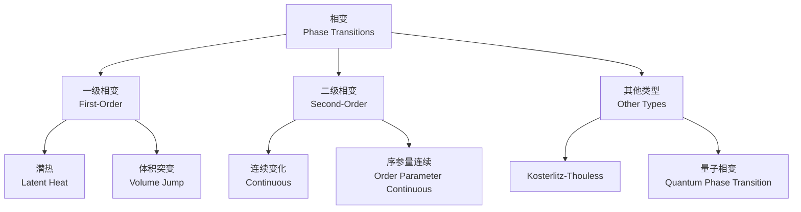
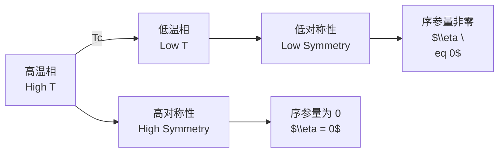

---
aliases:
  - Phase Transitions
  - 相变理论
  - Critical Phenomena
tags:
  - physics
  - thermodynamics
  - phase-transitions
  - critical-phenomena
  - condensed-matter
created: 2025-01-25
updated: 2025-05-16
---

# 相变 (Phase Transitions)

## 概述 (Overview)

相变是物质从一种相 (phase) 转变为另一种相的过程。根据 Ehrenfest 分类，相变分为一级相变和二级相变。



## 相的分类 (Classification of Phases)

| 相 (Phase) | 序参量 (Order Parameter) | 对称性 (Symmetry) | 实例 (Example) |
|---|---|---|---|
| 固相 (Solid) | 晶格周期函数 | 平移对称性破缺 | 冰 (Ice) |
| 液相 (Liquid) | 密度涨落 | 连续平移对称 | 水 (Water) |
| 气相 (Gas) | 密度 | 完全对称 | 水蒸气 (Steam) |
| 铁磁相 (Ferromagnetic) | 磁化强度 $M$ | 旋转对称性破缺 | 铁 (Iron) |
| 超导相 (Superconducting) | 复序参量 $\psi$ | $U(1)$ 规范对称破缺 | 超导体 |
| 超流相 (Superfluid) | 波函数 $\Psi$ | $U(1)$ 对称破缺 | 氦-4 ($^4$He) |

## 一级相变 (First-Order Phase Transition)

吉布斯自由能 $G$ 的一阶偏导在相变点处不连续。

### 克劳修斯-克拉佩龙方程 (Clausius-Clapeyron Equation)

$$\frac{dP}{dT} = \frac{L}{T\Delta V}$$

其中 $L = T\Delta S$ 是潜热 (latent heat)，$\Delta V$ 是体积变化。

### 范德瓦尔斯方程 (van der Waals Equation)

$$\left(P + \frac{a}{V_m^2}\right)(V_m - b) = RT$$

临界点 (critical point) 满足：

$$\left(\frac{\partial P}{\partial V_m}\right)_T = 0, \quad \left(\frac{\partial^2 P}{\partial V_m^2}\right)_T = 0$$

临界参数：

$$P_c = \frac{a}{27b^2}, \quad V_c = 3b, \quad T_c = \frac{8a}{27bR}$$

## 二级相变 (Second-Order Phase Transition)

二阶偏导在相变点处不连续，或发散。



### 朗道相变理论 (Landau Theory)

朗道自由能对序参量 $\eta$ 展开：

$$F(T, \eta) = F_0(T) + \frac{1}{2}a(T)\eta^2 + \frac{1}{4}b(T)\eta^4 + \frac{1}{6}c(T)\eta^6 + \cdots$$

当 $a(T) = a_0(T - T_c)$ 在 $T_c$ 处改变符号时发生相变。

对于二级相变，$b > 0$：

$$\eta(T) = \begin{cases} 0 & T > T_c \\ \pm\sqrt{\frac{a_0(T_c - T)}{b}} & T < T_c \end{cases}$$

对于一级相变，$b < 0$，需要 $\eta^6$ 项稳定系统。

## 临界现象 (Critical Phenomena)

### 临界指数 (Critical Exponents)

| 指数 (Exponent) | 定义 (Definition) | 三维伊辛模型 (3D Ising) | 平均场 (Mean Field) |
|---|---|---|---|
| $\alpha$ | $C_V \sim \|T - T_c\|^{-\alpha}$ | $0.110$ | $0$ (跳跃) |
| $\beta$ | $M \sim (T_c - T)^\beta$ | $0.326$ | $0.5$ |
| $\gamma$ | $\chi \sim \|T - T_c\|^{-\gamma}$ | $1.237$ | $1$ |
| $\delta$ | $M \sim H^{1/\delta}$ 在 $T_c$ | $4.789$ | $3$ |
| $\nu$ | $\xi \sim \|T - T_c\|^{-\nu}$ | $0.630$ | $0.5$ |
| $\eta$ | $G(r) \sim r^{-(d-2+\eta)}$ | $0.036$ | $0$ |

### 标度律 (Scaling Laws)

临界指数满足标度关系：

$$\alpha + 2\beta + \gamma = 2$$

$$\gamma = \nu(2 - \eta)$$

$$\alpha = 2 - d\nu$$

其中 $d$ 是空间维度。

## 关联函数与关联长度 (Correlation Function and Length)

关联函数 (correlation function) 的定义：

$$G(r) = \langle \phi(r)\phi(0) \rangle$$

在临界点附近，关联长度 $\xi$ 发散：

$$\xi \sim |T - T_c|^{-\nu}$$

关联函数在临界点呈幂律衰减：

$$G(r) \sim \frac{1}{r^{d-2+\eta}}$$

## 标度变换与重正化群 (Scaling and Renormalization Group)

重正化群 (Renormalization Group, RG) 变换：

$$R_b[K] = K'$$

将哈密顿量参数 $K$ 映射到粗粒化后的新参数 $K'$。不动点 (fixed point) $K^*$ 满足：

$$R_b[K^*] = K^*$$

```mermaid
flowchart TD
    A[原始哈密顿量<br/>$\\mathcal{H}[K]$] --> B[粗粒化<br/>Coarse-grain]
    B --> C[重新标度<br/>Rescale]
    C --> D[重正化哈密顿量<br/>$\\mathcal{H}[K']$]
    D -->|"重复"| B
    D --> E[不动点<br/>Fixed Point $K^*$]
    E --> F[临界现象<br/>Critical Behavior]
```

## 普适类 (Universality Classes)

具有相同对称性和空间维度的系统属于同一普适类 (universality class)。

| 普适类 (Class) | 对称性 (Symmetry) | 维度 (Dimension) | 实例 (Examples) |
|---|---|---|---|
| 伊辛 (Ising) | $\mathbb{Z}_2$ | $d=3$ | 单轴铁磁体、二元合金 |
| XY 模型 | $O(2)$ | $d=3$ | 超流氦、超导体 |
| 海森堡 (Heisenberg) | $O(3)$ | $d=3$ | 各向同性铁磁体 |
| 高斯 (Gaussian) | — | 任意 $d$ | 自由场理论 |

## 相图 (Phase Diagrams)

### 水的相图 (Phase Diagram of Water)

水的相图包含固、液、气三相，以及多种冰相 (ice phases)。三相点 (triple point) 为 $T = 273.16$ K, $P = 611.73$ Pa。

### 铁磁相图 (Ferromagnetic Phase Diagram)

铁磁体的 $H$-$T$ 相图：

| 区域 (Region) | 状态 (State) | 磁化强度 (Magnetization) |
|---|---|---|
| $T > T_c$ | 顺磁 (Paramagnetic) | $M = 0$ |
| $T < T_c, H = 0$ | 铁磁 (Ferromagnetic) | $M = \pm M_s$ |
| $T < T_c, H \neq 0$ | 铁磁 (Ferromagnetic) | $M = M(H)$ |

## 拓扑相变 (Topological Phase Transitions)

### Kosterlitz-Thouless 相变

在二维 XY 模型中，涡旋 (vortices) 的束缚-解束缚 (binding-unbinding) 转变。KT 相变温度：

$$T_{KT} \approx \frac{\pi J}{2k_B}$$

## 量子相变 (Quantum Phase Transitions)

在零温下由非热力学参数（如压强、磁场）驱动的相变。量子临界点 (quantum critical point) 附近，量子涨落取代热涨落成为主导。

特征能量标度：

$$\hbar\omega_c \sim k_B T^* \sim |g - g_c|^{z\nu}$$

其中 $z$ 是动力学临界指数 (dynamic critical exponent)。
