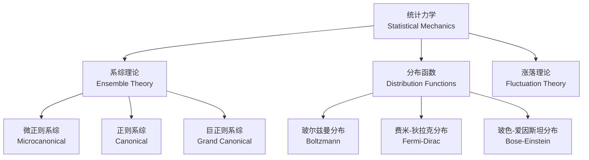

---
aliases:
  - Statistical Mechanics
  - 统计物理学
  - 系综理论
tags:
  - physics
  - thermodynamics
  - statistical-mechanics
  - entropy
  - ensembles
created: 2025-01-22
updated: 2025-05-16
---

# 统计力学 (Statistical Mechanics)

## 概述 (Overview)

统计力学从微观粒子的动力学规律出发，通过统计方法导出宏观热力学性质。其核心思想是将宏观量解释为微观量的统计平均。



## 基本假设 (Fundamental Postulate)

**等概率原理 (Principle of Equal a Priori Probability)**：对于处于平衡态的孤立系统，所有可及的微观态 (accessible microstates) 出现的概率相等。

**各态历经假说 (Ergodic Hypothesis)**：时间平均等于系综平均 (ensemble average)：

$$\langle A \rangle = \lim_{T \to \infty} \frac{1}{T}\int_0^T A(t)dt = \sum_i p_i A_i$$

## 系综理论 (Ensemble Theory)

### 微正则系综 (Microcanonical Ensemble)

系统具有固定的粒子数 $N$、体积 $V$ 和能量 $E$。热力学熵由玻尔兹曼公式给出：

$$S = k_B \ln \Omega(N, V, E)$$

其中 $\Omega$ 是微观状态数。

温度通过熵对能量的导数定义：

$$\frac{1}{T} = \left(\frac{\partial S}{\partial E}\right)_{N,V}$$

压强：

$$P = T\left(\frac{\partial S}{\partial V}\right)_{N,E}$$

### 正则系综 (Canonical Ensemble)

系统与热库 (heat reservoir) 接触，具有固定的 $N, V, T$。配分函数 (partition function)：

$$Z = \sum_i e^{-\beta E_i}, \quad \beta = \frac{1}{k_B T}$$

玻尔兹曼分布：

$$p_i = \frac{1}{Z} e^{-\beta E_i}$$

```mermaid
flowchart LR
    A[配分函数 $Z$<br/>Partition Function] --> B[自由能 $F = -k_BT\\ln Z$]
    B --> C[熵 $S = -\\left(\\frac{\\partial F}{\\partial T}\\right)_V$]
    B --> D[内能 $U = F + TS$]
    B --> E[压强 $P = -\\left(\\frac{\\partial F}{\\partial V}\\right)_T$]
    B --> F[化学势 $\\mu = \\left(\\frac{\\partial F}{\\partial N}\\right)_{T,V}$]
```

热力学量由配分函数导出：

$$F = -k_B T \ln Z$$

$$U = -\frac{\partial \ln Z}{\partial \beta}$$

$$S = k_B(\ln Z + \beta U)$$

$$C_V = \frac{\partial U}{\partial T} = k_B\beta^2 \frac{\partial^2 \ln Z}{\partial \beta^2}$$

### 巨正则系综 (Grand Canonical Ensemble)

系统同时与热库和粒子库接触，具有固定的 $V, T, \mu$。巨配分函数：

$$\Xi = \sum_{N=0}^\infty \sum_i e^{-\beta(E_i - \mu N)}$$

巨势 (grand potential)：

$$\Phi_G = -k_B T \ln \Xi = -PV$$

平均粒子数：

$$\langle N \rangle = \frac{1}{\beta}\frac{\partial \ln \Xi}{\partial \mu}$$

## 量子统计 (Quantum Statistics)

### 玻色-爱因斯坦统计

对于玻色子 (整数自旋)：

$$\langle n_i \rangle = \frac{1}{e^{\beta(\epsilon_i - \mu)} - 1}$$

### 费米-狄拉克统计

对于费米子 (半整数自旋)：

$$\langle n_i \rangle = \frac{1}{e^{\beta(\epsilon_i - \mu)} + 1}$$

### 麦克斯韦-玻尔兹曼统计

在经典极限 $e^{\beta(\epsilon_i - \mu)} \gg 1$ 下，两者退化为：

$$\langle n_i \rangle = e^{-\beta(\epsilon_i - \mu)}$$

## 理想气体 (Ideal Gas)

### 单原子理想气体

配分函数：

$$Z = \frac{1}{N!}\left(\frac{V}{\lambda^3}\right)^N$$

其中热波长 (thermal wavelength)：

$$\lambda = \frac{h}{\sqrt{2\pi m k_B T}}$$

状态方程：

$$PV = Nk_B T$$

### 萨克-泰特罗德方程 (Sackur-Tetrode Equation)

单原子理想气体的熵：

$$S = Nk_B\left[\ln\left(\frac{V}{N\lambda^3}\right) + \frac{5}{2}\right]$$

## 涨落 (Fluctuations)

### 能量涨落

正则系综中能量方差与热容的关系：

$$\langle (\Delta E)^2 \rangle = k_B T^2 C_V$$

### 粒子数涨落

巨正则系综中粒子数方差：

$$\langle (\Delta N)^2 \rangle = k_B T \left(\frac{\partial \langle N \rangle}{\partial \mu}\right)_{T,V}$$

相对涨落：

$$\frac{\sqrt{\langle (\Delta N)^2 \rangle}}{\langle N \rangle} \propto \frac{1}{\sqrt{\langle N \rangle}}$$

## 熵的统计诠释 (Statistical Interpretation of Entropy)

### 玻尔兹曼熵

$$S = k_B \ln \Omega$$

### 吉布斯熵

对于一般概率分布：

$$S = -k_B \sum_i p_i \ln p_i$$

### 香农信息熵 (Shannon Entropy)

信息论中的对应：

$$H = -\sum_i p_i \log_2 p_i$$

## 相空间与刘维尔定理 (Phase Space and Liouville's Theorem)

在 $2N$ 维相空间中，概率密度 $\rho$ 满足刘维尔方程：

$$\frac{d\rho}{dt} = \frac{\partial \rho}{\partial t} + \sum_{i=1}^N \left(\frac{\partial \rho}{\partial q_i}\dot{q}_i + \frac{\partial \rho}{\partial p_i}\dot{p}_i\right) = 0$$

## 伊辛模型 (Ising Model)

哈密顿量：

$$\mathcal{H} = -J\sum_{\langle ij \rangle} s_i s_j - H\sum_i s_i$$

其中 $s_i = \pm 1$。在平均场近似下：

$$m = \tanh\left(\frac{Jzm + H}{k_B T}\right)$$

临界温度：

$$T_c = \frac{zJ}{k_B}$$

## 变分法在统计力学中的应用

利用吉布斯-波戈留波夫不等式 (Gibbs-Bogoliubov inequality)：

$$F \leq F_0 + \langle \mathcal{H} - \mathcal{H}_0 \rangle_0$$

其中 $F_0$ 是试探哈密顿量 $\mathcal{H}_0$ 的自由能，$\langle \cdots \rangle_0$ 是对应系综平均。

## 统计力学的基本热力学关系

| 热力学势 (Potential) | 自然变量 (Natural Variables) | 配分函数关系 (Relation) |
|---|---|---|
| 内能 $U$ | $S, V, N$ | $U = \sum_i p_i E_i$ |
| 亥姆霍兹自由能 $F$ | $T, V, N$ | $F = -k_B T \ln Z$ |
| 吉布斯自由能 $G$ | $T, P, N$ | $G = F + PV$ |
| 巨势 $\Phi_G$ | $T, V, \mu$ | $\Phi_G = -k_B T \ln \Xi$ |
