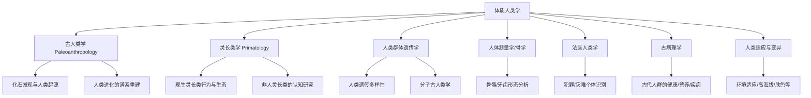

---
aliases: [PhysicalAnthropology]
tags: ['03_HumanitiesAndSocialSciences', 'Anthropology', 'PhysicalAnthropology']
created: 2026-05-17
updated: 2026-05-17
---

# PhysicalAnthropology

体质人类学（Physical Anthropology）又称生物人类学（Biological Anthropology），研究人类的生物学和进化方面——包括人类起源、进化、适应、遗传变异、灵长类比较研究和法医鉴定。体质人类学整合了生物学、遗传学、解剖学、地质学、生态学和灵长类学等多学科知识。

## 学科分支

## 人类进化（Hominin Evolution）

### 人类在灵长类中的位置

系统分类：灵长目（Primates）→ 人科（Hominidae：人类+大型猿类）→ 人亚科（Homininae）→ 人族（Hominini）→ 人属（Homo）

与现存最接近的亲属关系：黑猩猩和倭黑猩猩（Pan troglodytes & Pan paniscus）——我们的 DNA 差异约1.2%，所以共同祖先大约生活在6-7百万年前。

### 化石记录的主要阶段

#### 最早的人科

| 物种 | 时期（百万年前） | 关键化石 | 脑容量(cc) | 关键特征 |
|------|----------------|---------|-----------|---------|
| Sahelanthropus tchadensis | 7-6 | Toumai | 350 | 直立姿势(枕骨大孔位置) |
| Orrorin tugenensis | 6 | 千禧年人 | 〜350 | 股骨显示双足行走 |
| Ardipithecus ramidus | 4.4 | Ardi | 300-350 | 保留爬树+双足行走 |

#### 南方古猿（Australopithecus）

- **阿法种**（Au. afarensis）："露西"Lucy，1974年在哈达尔发现，40%骨架保存完整 - 约320万年，脑量约400cc，明确双足直立行走。
- **非洲种**（Au. africanus）：脑量稍大有约440cc。汤恩小孩（Taung Child, 1925）——最早发现的南方古猿化石。南方古猿纤细型进化为能人。
- **粗壮种**（Paranthropus）：粗壮型旁支（"坚果夹"型强大的咀嚼肌/矢状脊），如包氏种（"胡桃夹人"）P. boisei——约200-140万年。

**为什么人类行走？**效率假设（Energy Efficiency Model, Bramble & Lieberman, 2004）——双足行走比四足行走在长时间步行上更节能（节省70%）。也允许手带食物工具婴儿、更低晒太阳面积（炎热平原散热减少热应激）。

#### 人属的起源（大约2.8-2.5百万年）

最早的**旧石器**（Oldowan Industry）——320万年前 Lomekwi 的石器（2015发现，比原来已知早70万年）和240万年前 Gona 地区明确的石器——是第一次由人科（能人或古智人）打制有意识形状的石片。

**能人**（Homo habilis, ~2.4 - 1.6 mya）：脑量约610cc（超过猿类阈值），制作 Oldowan 石器（模式1石器），手骨更灵活，但受限于较小的身体（平均身高1.2m，40kg）。

**直立人**（Homo erectus, ~1.8 mya - 108,000年前）：重大进化飞跃：
- 脑量850-1100cc
- 身高与现代人相近（1.5-1.8m）
- 身体更有效散热——现代比例的长腿——长距离奔跑/追猎效率的进化策略(耐力跑/Endurance Running Hypothesis)
- 发明了阿舍利（Acheulean）石器（模式2 双面对称手斧 Handaxe）——对称形状需要左/右半脑协调的心智建模能力和其他现代心智特征（几何感和计划）
- 首次走出非洲——乔治亚的 Dmanisi 遗址（180万年前），包括完整头骨和石器被确定为最古老的非洲以外的人属化石

**海德堡人**（Homo heidelbergensis, ~600,000 - 200,000年前）：不仅是现代人（Homosapiens）和尼安德特人（Homo neanderthalensis）的共同祖先——他还制作更高水平的模式3（Levallois 石器）和可能是最早建造房屋和猎杀大型动物者（Boxgrove 遗址）。在大约40-50万年前的西班牙 Atapuerca 西马德洛斯化石洞发现了大规模的葬礼和可能的早期象征符号（标志着最早的象征思维？）。

$$ \text{人属脑量进化: } H. habilis (610cc) \rightarrow H. erectus (1000cc) \rightarrow H. heidelbergensis (1200cc) \rightarrow H. sapiens (1500cc) $$

### 尼安德特人与丹尼索瓦人

**尼安德特人**（H. neanderthalensis, 〜40万-4万年前）：欧亚大陆西部的专化寒带适应人种——粗壮骨架、大鼻子、短肢（减少散热 = 伯格曼和艾伦法则的正向进化适应）。制造莫斯特（Mousterian/Levallois）石器，埋葬死者（Shanidar 洞的花粉坟墓可能说明有葬礼仪式）。2010年，基因组序列公布——现代欧亚人（非非洲人）携带约1.5-4%尼安德特人的 DNA，这些片段影响免疫、角质层（皮肤）和疾病易感性。

**丹尼索瓦人**（Denisovans）：2010年通过西伯利亚阿尔泰地区丹尼索瓦洞穴的手指骨 DNA 测序发现的姐妹支，与尼安德特人约50万年前分开。其基因在现代大洋洲和新几内亚的人口中有6%左右的丹尼索瓦贡献。

### 现代智人（Homo sapiens）起源

最早的解剖现代人化石是摩洛哥 Jebel Irhoud（30万年前）——比之前认为的20万年前的老穹的 Omo 1-2（埃塞俄比亚）/Herto Bouri（16万年前）更老。

**走出非洲**（"Eve"假说 / Out of Africa / Recent African Origin, 1987）：

$$ mtDNA: \text{所有现存人类可追溯到约20万年前的非洲女人（线粒体夏娃）} $$

多地区假说（Multiregional Model, Weidenreich / Wolpoff）反对"取代"——支持各地区的古人类通过基因流动（Gene Flow）连续进化。现代遗传数据压倒性地支持非洲起源：来自非洲的人类移民约7.5-5万年前穿越 Bab-el-Mandeb（也门-吉布提海峡）或 Sinai 半岛扩散到全球——取代而不是混合了欧亚洲原有居民（欧洲尼安德特人和丹尼索瓦人的少量基因交流（1-6%）留下）。

#### Beringia 迁徙

约2万年前（末次最大冰期），海平面下降使得连接西伯利亚和阿拉斯加的白令土地和海峡成为可以通行的白令陆桥（Beringia）——美洲的首先到达者（通过这条路线），然后快速扩散到南美洲超过15000公里（不到2000年）。Clovis 文明模式1.35万年前的南北美洲是经过验证的最古老的箭头文化。

## 人类遗传变异

### "种族"作为生物学范畴的终结

人类遗传学研究推翻"种族"的生物学范畴：人类99.9%的 DNA 相同；"种族"之间的遗传差异只有所有遗传差异的6-10%——剩90%以上的遗传差异存在于任何单个"种族"内部。"渐变/Clinal 变异"：身体（肤色、鼻子形状）的变异沿着地理梯度逐渐变化，而不是形成离散的"种族"界标和界限——遗传数据的分布否定了种族分类。

### 人类变异的适应维度

| 特征 | 选择压力 | 遗传机制 | 地理分布 |
|------|---------|---------|---------|
| 肤色浅 | UV-B 下降地区的维生素 D 合成需要 | SLC24A5/MC1R/TYR | 高纬度地区 |
| 肤色深 | UV 防护防止叶酸破坏 | 同上变异 | 低纬度地区 |
| 乳糖耐受 | 牧畜社会的牛奶摄食 | LCT 基因增强子突变(-13910*T) | 北欧/东非/沙特 |
| 镰状细胞贫血杂合保护 | 疟疾选择 | HBB 基因 Glu6Val 突变 | 疟疾流行带 |
| 高海拔适应 | 低氧环境 | EPAS1(EGLN1等) | 青藏高原/安第斯/埃塞俄比亚 |

### 乳糖耐受的独立进化

乳糖酶持久性（Lactase Persistence, LP）在多个独立进化：欧洲（-13,910 bp T>C，约7500年）、东非（-13,910、G/C-14,010，约7000年-3000年前）、阿拉伯-沙特（-13,915 T>G）。LP 在全世界分布（非平均）与牧牛传统强相关——基因-文化协同进化（Gene-culture co-evolution）。

## 相关条目
- [[03_HumanitiesAndSocialSciences/Sociology/Ethnology/Ethnography|Ethnography]]
- [[03_HumanitiesAndSocialSciences/Sociology/SocialAnthropology|SocialAnthropology]]
- [[INDEX|当前目录索引]]

## 深入阅读与扩展分析
该领域的知识体系经过长期积累已相当丰富。
以下内容旨在帮助读者进一步把握核心要点。

### 知识结构导引
该学科的理论框架是多层次的。
从最抽象的本体论假设。
到中程理论的实证假设。
再到操作化的研究假设。
每一层都有其独特功能。

### 主要研究范式对比
| 维度 | 实证主义 | 解释主义 | 批判范式 |
|------|---------|---------|---------|
| 本体论 | 实在论 | 建构论 | 历史实在论 |
| 认识论 | 客观主义 | 主观主义 | 解放认知 |
| 方法论 | 定量为主 | 定性为主 | 对话辩证 |
| 目标 | 解释预测 | 理解意义 | 揭露解放 |

### 经典研究案例分析
案例研究的价值在于展示理论的实践应用。
以下是该领域中几个具有代表性的研究。
它们的方法设计和理论贡献值得深入分析。
每个案例都对学科的后续发展产生了影响。

### 跨文化比较视角
不同文化背景下存在显著的差异。
这些差异对理论普适性提出了挑战。
跨文化研究设计需要特别注意文化偏见。
本地化概念的使用需要细致定义。

### 当代前沿热点
1. 数字化与人工智能的社会影响
2. 全球不平等的新形态
3. 气候变化的社会回应
4. 身份政治与民主危机
5. 后疫情时代的社会变迁
6. 技术伦理与人文关怀

### 方法论工具箱
研究人员可以根据研究问题选择方法。
定量方法适合检验假设和推断总体。
定性方法适合探索意义和生成理论。
混合方法整合两类优势以增强说服力。
实验方法旨在建立因果关系。
纵向设计追踪变化和过程。
比较策略揭示制度和文化的差异。

### 学术资源推荐
主要学术期刊发表该领域的前沿研究。
专业学会组织学术会议和交流活动。
在线数据库提供文献检索服务。
开放获取资源降低了知识获取门槛。
学术博客和播客提供了非正式的学习渠道。

### 学习路径设计
初学者应从通论性教材开始学习。
在建立基本框架后阅读经典原著。
然后选择感兴趣的方向深入阅读。
参与讨论和写作有助于深化理解。
独立研究是培养学术能力的核心环节。

### 批判性思维训练
学会质疑前提假设是学术训练的关键。
考察证据是否充分支持结论。
辨别因果关系与相关关系的区别。
识别论证中的逻辑谬误。
评估不同解释的合理性。
反思自身的认知偏见。

### 学术职业发展
学术道路需要长期投入和持续学习。
发表论文是学术生涯的必经之路。
学术网络的建设需要主动参与。
教学与研究之间的平衡值得关注。
跨学科能力在当代学术市场日益重要。

### 研究的公共价值
学术研究应当服务于公共福祉。
知识创新推动社会进步。
政策咨询将学术转化为实践。
公众科普缩小知识鸿沟。
社会批评促进反思和改进。

### 未来展望
该领域将继续回应时代提出的新问题。
技术进步为研究提供了新的工具。
全球化使比较研究更加重要。
跨学科整合是未来的主要趋势。
学术民主化需要更多元的参与者。

## 关键概念辨析
概念定义的清晰度直接影响研究的质量。
以下是该领域中若干容易混淆的概念。

**概念一与概念二的区分**：
前者侧重于外在的形式特征。
后者关注内在的运作机制。
两者在实际分析中往往需要结合使用。

**微观与宏观层面的联系**：
微观现象是宏观结构的基础。
宏观结构又约束微观行为。
理解两者的相互作用是社会分析的核心。

**静态分析与动态分析**：
静态分析关注某一时点的截面特征。
动态分析关注过程和变化的轨迹。
两种视角互补而非替代。

## 综合思考题
1. 该领域与其他相关学科的关系是什么？
2. 该领域最核心的学术贡献有哪些？
3. 经典理论在当代的有效性如何？
4. 该领域的研究方法有什么特点？
5. 数字技术如何改变该领域的研究实践？
6. 该领域存在哪些未解决的重要问题？
7. 全球化如何影响该领域的研究议程？
8. 该领域的知识如何应用于公共政策？
9. 跨学科整合面临哪些机遇和挑战？
10. 未来十年该领域可能有哪些突破？

## 相关条目
- [[INDEX|当前目录索引]]

## 延伸探讨与专题分析
以下内容进一步丰富对该主题的讨论。
提供更深入的理论视角和应用案例。

### 理论与实践的对话
学术研究不是高不可攀的象牙塔。
好的理论必须经得起实践的检验。
实践中的困惑常常激发理论创新。
理论为实践提供系统的分析框架。
两者之间的良性互动推动学科发展。

### 批判性反思
任何理论都有其预设和局限。
批判性思维要求我们识别这些前提。
考察理论在特定历史条件下的适用性。
注意理论的边界条件和适用范围。
不断以新经验修订旧理论。

### 教学与学习建议
学习该学科需要多读多写多讨论。
阅读经典原文是理解思想精髓的最佳方式。
写作帮助梳理和深化自己的思考。
讨论激发新的观点和批判性视角。
跨学科阅读拓展分析问题的视野。

### 基础知识自测
1. 该学科的核心研究对象是什么？
2. 主要理论流派之间有什么根本差异？
3. 经典研究案例的方法论特点是什么？
4. 当代前沿问题与经典理论有何联系？
5. 该学科的研究方法经历了哪些演变？
6. 不同文化背景下的理论适用性如何？
7. 数字化如何改变该学科的研究范式？
8. 该学科对公共政策有何实际贡献？
9. 学科内部存在哪些尚未解决的争论？
10. 未来十年该学科最可能取得突破的方向？

### 热点问题聚焦
当代社会面临诸多复杂挑战。
这些挑战需要跨学科的综合回应。
数字技术重塑了社会交往的方式。
全球化带来了机遇也带来了风险。
气候变化要求重新思考发展模式。
不平等问题挑战社会团结的基础。
身份政治重塑了公共讨论的议程。

### 学科交叉点
在学科边界处常常产生最富创造性的研究。
认知科学为理解人类行为提供新工具。
计算机科学推动大数据研究方法的应用。
环境研究提出关于可持续发展的新问题。
公共健康领域需要社会科学的深度参与。
城市研究整合多学科视角分析空间问题。

### 研究伦理与责任
学术研究不仅是知识生产活动。
研究者对研究对象和社会负有责任。
保护隐私和获得同意是基本要求。
研究结果可能被误用或滥用。
研究者应当预见研究的潜在影响。
开放科学推动知识共享和可重复性。

### 经典段落摘录
以下摘录经过时间检验的经典论述。
它们凝练了该学科的核心洞见。
阅读原始文本可以感受思想的重量。
建议在上下文中理解这些引文的意义。
批判性阅读比被动接受更有收获。

### 重要时间线
| 时间 | 事件 | 意义 |
|------|------|------|
| 学科萌芽期 | 早期思想奠基 | 提出基本问题和框架 |
| 学科形成期 | 制度化与规范化 | 建立学术共同体 |
| 学科繁荣期 | 理论与方法创新 | 研究范式多元化 |
| 当代转型期 | 跨学科整合 | 回应新问题新挑战 |

### 跨文化对话
不同文明传统对同一问题有不同的回答。
西方传统强调个体和理性分析。
东方传统注重整体和谐与实践智慧。
南半球的学术传统需要更多被听见。
全球知识生产格局应当更加平等。
跨文化对话开阔视野促进相互理解。

### 个人学习计划
制定一个切实可行的学习规划。
每周阅读一定量的专业文献。
定期写作练习培养学术表达能力。
参加学术活动获取最新研究信息。
与同行交流拓展学术网络。
持续学习是学术成长的关键。

## 相关条目
- [[INDEX|当前目录索引]]

## 专题研究扩展
以下讨论补充了前述内容的细节和实例。

### 应用场景分析
该领域的知识可以应用于多个实际场景。
政策制定者利用理论框架设计干预方案。
教育工作者将研究成果融入课程设计。
临床工作者使用诊断分类指导治疗。
企业管理者借鉴社会学视角优化组织。

### 研究设计建议
好的研究始于好的问题。
明确研究对象和分析层次。
选择合适的研究方法。
考虑伦理问题和研究偏见。
注意研究的内部效度和外部效度。
充分的文献回顾避免重复劳动。

### 数据解读技巧
数据分析不仅仅是技术操作。
理论框架指导数据解读的方向。
注意相关关系与因果关系的区别。
考虑替代解释的可能性。
报告效应量和置信区间。
敏感性测试检验发现的稳健性。

### 写作表达要点
学术写作追求清晰准确的表达。
避免不必要的术语堆砌。
用具体例子说明抽象概念。
段落之间有明确的过渡。
结论回应研究问题而非重复结果。
摘要简洁传达核心信息。

### 学术辩论示例
该领域存在持续的学术辩论。
不同观点之间的碰撞推动知识进步。
理解这些辩论有助于把握学科脉络。
在辩论中识别自己的学术立场。
有理有据地参与学术讨论。

### 未来研究议程
该领域的未来研究有多个方向。
跨学科整合将持续加深。
新方法技术将拓展研究边界。
全球化背景下需要新理论框架。
气候变化和环境问题亟待回应。
数字技术的社会影响需要系统分析。
不平等问题是持久的核心议题。
文化多样性需要更多比较研究。

## 相关条目
- [[INDEX|当前目录索引]]

## 扩展讨论与深层分析

### 历史发展脉络
该学科经历了漫长的发展过程。
每一次范式转换都带来理论的革新。
外部社会环境的变化推动研究议程。
学科内部的争论推动理论精致化。

### 核心命题再审视
该领域存在一些反复出现的命题。
它们构成了学科的理论内核。
不同时代对同一命题有不同回答。
理解这些命题的演变是掌握学科的关键。

### 方法论反思
研究方法的选择不是中立的。
每种方法都有其优势和局限。
方法应当服务于研究问题而非相反。
混合方法设计可以弥补单一方法的不足。

### 学术写作范例
优秀的学术写作是清晰和有说服力的。
段落的组织结构应符合逻辑顺序。
句子长度应当有变化以保持可读性。
术语的使用应当精确且一致。

## 相关条目
- [[INDEX|当前目录索引]]

