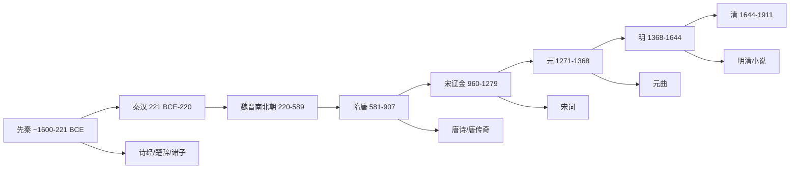

# AncientChineseLiterature

**中国古代文学**
(Ancient Chinese Literature)
涵盖从先秦到 1840 年的中国文学传统。
形成了世界上延续最长、最丰富的文学传统之一。
中国文学的抒情传统极为深厚。

## 时间线

## 先秦文学 (~1600–221 BCE)

### 诗歌

《诗经》中国最早诗歌总集。
收录 305 篇，分风、雅、颂三部分。
"关关雎鸠，在河之洲。"

《楚辞》以屈原为代表。
《离骚》最长政治抒情诗。
"路漫漫其修远兮，吾将上下而求索。"

### 散文

历史散文: 《尚书》《左传》《国语》。
诸子散文: 《论语》《孟子》《老子》。
孔子仁政礼教。老子道法自然。
庄子逍遥游齐物论。
孟子民贵君轻。荀子性恶论。
韩非子法家集大成。

## 秦汉文学 (221 BCE–220 CE)

### 汉赋

司马相如 *子虚赋* *上林赋*。
扬雄、班固、张衡汉赋四大家。

### 史传文学

司马迁 *史记* (130 篇，52 万字)。
"史家之绝唱，无韵之离骚"。
班固 *汉书* 断代史典范。

### 乐府民歌

*孔雀东南飞* 最长叙事诗。
*古诗十九首* 五言诗成熟标志。
*上邪* 爱情誓言。

## 魏晋南北朝 (220–589)

建安文学: 三曹与建安七子。
曹操作品慷慨悲凉。
曹植 *洛神赋*。
竹林七贤: 阮籍、嵇康。
陶渊明田园诗人。
"采菊东篱下，悠然见南山。"
*桃花源记* *归去来兮辞*。
谢灵运山水诗开创者。

文学批评:
刘勰 *文心雕龙* 体系性理论。
钟嵘 *诗品*。
萧统 *文选*。

## 隋唐 (581–907)

### 唐诗

初唐四杰: 王勃、杨炯、卢照邻、骆宾王。
王勃"海内存知己，天涯若比邻"。
陈子昂"前不见古人"。

李白 (701-762): 诗仙浪漫主义。
"君不见黄河之水天上来。"
"天生我材必有用。"
静夜思、蜀道难、将进酒。

杜甫 (712-770): 诗圣现实主义。
"安得广厦千万间。"
三吏三别、春望、登高。

王维诗佛山水田园。
"大漠孤烟直，长河落日圆。"
白居易新乐府运动。
《长恨歌》《琵琶行》。
李商隐无题诗。
"相见时难别亦难。"
杜牧晚唐七绝高手。
"停车坐爱枫林晚。"

### 唐传奇与古文运动

*莺莺传* *枕中记* *南柯太守传*。
韩愈古文运动。
柳宗元 *永州八记*。

## 宋代 (960–1279)

### 宋词

婉约派: 柳永、李清照。
柳永"执手相看泪眼"。
李清照"寻寻觅觅，冷冷清清"。
豪放派: 苏轼、辛弃疾。
苏轼"大江东去，浪淘尽"。
辛弃疾"醉里挑灯看剑"。
苏轼文学全才。
李清照 *漱玉词*。
陆游 9300 首诗传世。

### 宋代散文

唐宋八大家六位出宋代:
欧阳修、曾巩、王安石。
苏洵、苏轼、苏辙。

## 元代 (1271–1368)

关汉卿 *窦娥冤*。
王实甫 *西厢记*。
马致远 *汉宫秋* *天净沙·秋思*。
白朴 *梧桐雨*。
南戏: 高明 *琵琶记*。

## 明代 (1368–1644)

四大奇书:
罗贯中 *三国演义* (历史演义)。
施耐庵 *水浒传* (英雄传奇)。
吴承恩 *西游记* (神魔小说)。
兰陵笑笑生 *金瓶梅* (世情小说)。

戏曲: 汤显祖 *牡丹亭*。
"情不知所起，一往而深。"
*紫钗记* *南柯记* *邯郸记*。
"临川四梦"。
冯梦龙 *三言* *喻世明言*。
*警世通言* *醒世恒言*。

## 清前期 (1644–1840)

曹雪芹 *红楼梦*(1791)。
中国古典小说最高峰。
蒲松龄 *聊斋志异* 狐鬼花妖。
吴敬梓 *儒林外史* 讽刺小说。
洪昇 *长生殿*。
孔尚任 *桃花扇*。
纳兰性德"人生若只如初见"。
桐城派: 方苞、姚鼐古文。

## 核心特征

文以载道: 文学道德教化。
抒情传统: 以诗为核心。
意象思维: 比兴意境美学。
文体演变: 诗→词→曲→小说。

## 相关领域

- [[ClassicalChinesePhilology|中国传统小学]]
- [[ContemporaryChineseLiterature|中国当代文学]]
- [[LiteraryCriticism|文学批评]]

---

- [[../../INDEX|当前目录索引]]
