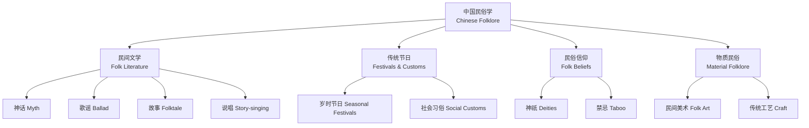

---
aliases:
  - ChineseFolklore
  - 中国民俗学
  - 民间文学
tags:
created: 2026-05-17
updated: 2026-05-17
  - ChineseCulture
  - Folklore
  - FolkLiterature
  - IntangibleCulturalHeritage
---

# 中国民俗学 (Chinese Folklore)

## 概述

中国民俗学（Chinese Folklore）研究中国民间的传统习俗、口头文学、节庆仪式和信仰体系。自1918年北京大学歌谣征集运动（Ballad Collecting Movement）以来，作为独立学科发展至今，与人类学（Anthropology）、社会学（Sociology）和民族学（Ethnology）紧密交叉。

## 民俗学分支

## 核心概念表

| 概念 | 英文 | 定义 | 主要特征 |
|------|------|------|---------|
| 民俗 | Folklore | 民间世代传承的生活文化 | 集体性、口头性、传承性、变异性 |
| 民间文学 | Folk Literature | 民众口头创作和传播的文学 | 集体创作、口头流传、匿名性 |
| 神话 | Myth | 关于神灵和世界起源的叙述 | 神圣性、解释性、仪式关联 |
| 传说 | Legend | 与历史人物或地方相关的故事 | 历史性、地方性、可信性 |
| 民间故事 | Folktale | 虚构的民间叙事 | 类型化、幻想性、道德教化 |
| 仪式 | Ritual | 程式化的象征性行为 | 规范性、周期性、象征意义 |

## 民俗学研究方法

### 田野调查

田野调查（Fieldwork）是民俗学最核心的研究方法，研究者深入民间社区进行实地考察：

**参与观察（Participant Observation）**：研究者作为社区成员参与日常活动，在自然情境中观察和记录民俗行为。经典的参与观察要求至少一个完整的岁时周期（一年）。

**深度访谈（In-depth Interview）**：与民俗传承人（Folklore Bearer）进行开放式访谈，获取第一手的口述资料。关键步骤包括：
- 选择信息提供者（Informant）：寻找社区中知识最丰富、表达能力最强的传承人
- 拟定访谈提纲：围绕特定民俗事象展开
- 录音与转录：忠实记录方言和口语表达
- 资料整理：运用文本分析（Textual Analysis）和语境分析（Contextual Analysis）

### 文献研究

民俗文献研究利用历史文献、地方志（Local Gazetteer）、碑刻（Inscriptions）、族谱（Genealogy）等资料，追溯民俗事象的历史演变。顾颉刚的孟姜女故事研究是文献研究法的典范。

### 比较研究法

比较研究法（Comparative Method）通过跨文化比较揭示民俗的共性、差异和传播路径：

$$ \text{故事类型} \xrightarrow{\text{跨文化比较}} \text{母题分析} \xrightarrow{\text{历史-地理学派}} \text{起源与传播路线} $$

AT 分类法（Aarne-Thompson Classification）将民间故事按类型编号，是全球民间故事研究的基础工具。

## 民间文学

### 民间歌谣

民间歌谣（Folk Ballad）是中国最早的诗歌形式。**《诗经·国风》** 收录了160篇周代民歌，开创了中国现实主义文学传统。汉乐府民歌（Han Music Bureau Ballads）如《上邪》《孔雀东南飞》继承了这一传统。

**地域歌谣类型**：
- 吴歌（Wu Ballad）：江浙地区，柔美婉转
- 粤歌（Cantonese Ballad）：广东地区
- 客家山歌（Hakka Mountain Song）：闽粤赣客家地区
- 花儿（Hua'er）：甘青宁回族聚居区
- 信天游（Xintianyou）：陕北黄土高原

**少数民族歌谣**：
- 藏族《格萨尔王传》（King Gesar Epic）：世界最长史诗
- 蒙古族长调（Long Song）：联合国非遗代表作
- 壮族山歌：三月三歌圩
- 侗族大歌（Dong Grand Song）：多声部无伴奏合唱

### 民间故事

**神奇故事（Magic Tales）**：
- 田螺姑娘（The Snail Maiden）：田螺化为女子报恩
- 白蛇传（Legend of the White Snake）：白蛇修炼成人
- 蛇郎（The Snake Husband）：人与异类通婚

**生活故事（Realistic Tales）**：
- 巧媳妇（The Clever Bride）：智慧化解矛盾
- 聪明的女婿（Wise Son-in-Law）：幽默讽刺

**寓言（Fable）**：守株待兔、狐假虎威、画蛇添足、揠苗助长

### 四大民间传说

四大民间传说（Four Great Folktales）是中国民间文学的经典代表：

1. **牛郎织女**（The Cowherd and the Weaver Girl）：七夕节（Qixi Festival）起源，牵牛星与织女星的悲欢离合
2. **孟姜女哭长城**（Lady Meng Jiang）：对暴政的血泪控诉，孟姜女哭倒长城
3. **梁山伯与祝英台**（The Butterfly Lovers）：同窗三载，化蝶双飞，被称为东方《罗密欧与朱丽叶》
4. **白蛇传**（Legend of the White Snake）：西湖断桥相遇，雷峰塔镇压，法海与白娘子的冲突

### 民间说唱

| 形式 | 时期 | 特点 | 代表 |
|------|------|------|------|
| 敦煌变文 | 唐代 | 佛经俗讲，韵散结合 | 《目连救母变文》 |
| 话本 | 宋元 | 说话人底本，白话小说 | 《碾玉观音》 |
| 宝卷 | 明清 | 宣卷讲唱，宗教故事 | 《香山宝卷》 |
| 弹词 | 明清 | 三弦/琵琶伴奏，吴语为主 | 《再生缘》 |
| 鼓词 | 北方 | 鼓板伴奏，北方曲艺 | 《杨家将》 |
| 相声 | 近现代 | 说学逗唱，喜剧艺术 | 传统段子 |

## 传统节日

### 岁时节令体系

中华民族的传统节日体系（Traditional Festival System）与农业生产周期和天文历法密切相关：

- **春节**（Spring Festival）：除夕守岁（Staying Up）、贴春联（Spring Couplets）、压岁钱（Red Envelope）
- **元宵节**（Lantern Festival）：正月十五赏灯猜谜（Lantern Riddles）
- **龙抬头**（Dragon Head Raising）：二月二，春耕理发
- **清明节**（Qingming Festival）：祭祖扫墓（Tomb Sweeping）、踏青放风筝
- **端午节**（Dragon Boat Festival）：龙舟竞渡、吃粽子、挂艾草
- **七夕节**（Qixi Festival）：女儿节穿针乞巧（Needlework Contest）
- **中元节**（Ghost Festival）：七月十五祭祀亡灵
- **中秋节**（Mid-Autumn Festival）：赏月团圆、吃月饼（Mooncake）
- **重阳节**（Double Ninth Festival）：登高赏菊、敬老爱老
- **腊八节**（Laba Festival）：腊八粥（Laba Porridge）
- **小年**（Little New Year）：腊月二十三祭灶（Kitchen God Worship）

### 二十四节气歌

$$
\begin{aligned}
&\text{春雨惊春清谷天，夏满芒夏暑相连。} \\
&\text{秋处露秋寒霜降，冬雪雪冬小大寒。} \\
&\text{上半年是六廿一，下半年是八廿三。} \\
&\text{每月两节不变更，最多相差一两天。}
\end{aligned}
$$

二十四节气（24 Solar Terms）被列入联合国人类非物质文化遗产代表作名录，是古代农耕文明的智慧结晶。

## 民俗信仰

### 民间神祇

中国民间信仰（Folk Beliefs）是多神崇拜体系，融合了道教、佛教和原始信仰：

- **土地公**（Earth God）：村落守护神，最基层的神祇
- **灶神**（Kitchen God）：腊月二十三上天汇报人间善恶
- **财神**（God of Wealth）：正月初五接财神
- **门神**（Door Gods）：神荼郁垒或秦琼尉迟恭
- **妈祖**（Mazu）：海神，闽台及东南亚广泛信仰
- **关公**（Lord Guan）：武财神，忠义象征
- **观音**（Guanyin）：慈悲救苦的菩萨

### 禁忌与象征系统

- **文字谐音**（Homophonic Symbolism）：
  - 鱼 (Fish) → 余（Abundance）
  - 蝠 (Bat) → 福（Blessing）
  - 鹿 (Deer) → 禄（Prosperity）
  - 莲花 → 连年有余
- **本命年**（Zodiac Year of Birth）：扎红腰带避邪
- **风水**（Fengshui）：环境选择与吉凶预测

## 民俗学理论

| 学派 | 代表人物 | 核心观点 |
|------|---------|---------|
| 历史-地理学派 | 芬兰学派 | 追溯故事起源和传播路线 |
| 功能主义 | Malinowski | 民俗满足社会需求的功能 |
| 结构主义 | Lévi-Strauss | 分析民俗的深层结构模式 |

## 学术史

- **1918年**：北京大学歌谣征集处成立，标志着中国现代民俗学的开端
- **1920年**：《歌谣》周刊创刊
- **1930年代**：钟敬文创建中国民俗学会
- **1983年**：中国民俗学会重新成立

## 物质民俗

### 民间建筑

传统民居（Traditional Vernacular Architecture）是中国物质民俗的重要组成部分，体现了人与自然和谐共生的理念：

- **四合院**（Siheyuan / Courtyard House）：北京地区，轴线对称，等级分明，体现了儒家宗法观念
- **土楼**（Tulou / Earthen Building）：福建客家，圆形或方形，聚族而居，防御性强
- **窑洞**（Yaodong / Cave Dwelling）：黄土高原，依山而建，冬暖夏凉
- **吊脚楼**（Stilt House）：湘西苗族，适应山地潮湿环境
- **蒙古包**（Yurt / Mongolian Ger）：草原游牧，便于迁徙拆卸

### 民间服饰

传统服饰（Traditional Costume）具有鲜明的地域和民族特色：

- **旗袍**（Cheongsam / Qipao）：起源于满族，民国时期改良为女性国服
- **汉服**（Hanfu）：汉族传统服饰，交领右衽，宽袍大袖，近年复兴运动蓬勃
- **唐装**（Tang Suit）：现代改良的中式服装，立领对襟
- **少数民族服饰**：苗族银饰、藏族氆氇、彝族百褶裙

### 民间工艺

中国传统工艺（Traditional Chinese Crafts）品种丰富，技艺精湛：

| 工艺类型 | 代表 | 主要产地 | 特色 |
|---------|------|---------|------|
| 陶瓷 | 景德镇瓷器 | 江西景德镇 | 青花、粉彩、玲珑 |
| 刺绣 | 苏绣、湘绣 | 苏州、湖南 | 双面绣、乱针绣 |
| 木雕 | 东阳木雕 | 浙江东阳 | 多层浮雕 |
| 剪纸 | 窗花 | 北方各地 | 镂空造型、喜庆题材 |
| 年画 | 杨柳青年画 | 天津杨柳青 | 木版套印、色彩鲜艳 |

## 非物质文化遗产

## 相关条目

- [[AncientChineseLiterature|中国古代文学]]
- [[../Linguistics/MinorityLanguages|少数民族语言]]
- [[../History/CulturalHistory|文化史]]
- [[../../INDEX|当前目录索引]]
