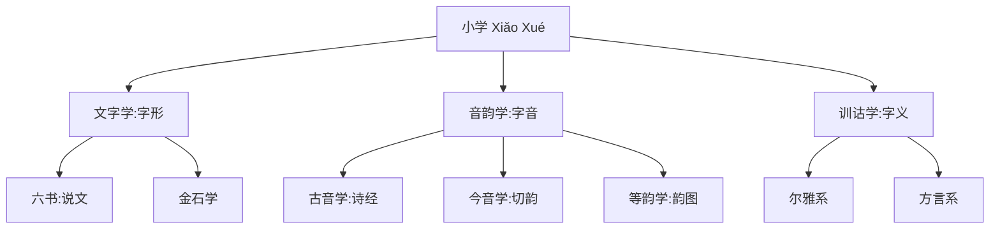
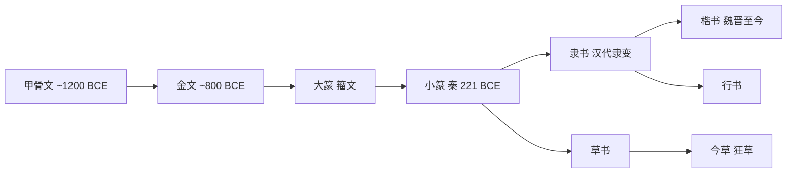

# ClassicalChinesePhilology

**中国传统小学**
(Classical Chinese Philology)
自汉代以来分为三个分支：
文字学、音韵学和训诂学。
小学是传统经学的基础。

## 小学的三个分支

## 文字学

### 六书

许慎总结汉字构造原理。

象形: 画成其物，如日、月、山、水。
指事: 视而可识，如上、下、本、末。
会意: 比类合谊，如休(人依木)。
形声: 以事为名取譬相成。
占汉字总量 80% 以上，如江、河。
转注: 建类一首同意相受，如考、老。
假借: 本无其字依声托事，如来、其。

### 汉字形体演变

### 文字学经典

许慎《说文解字》(100 CE)。
9353 个小篆字头。
顾野王《玉篇》(543) 第一部楷书字典。
段玉裁《说文解字注》清代最权威。
王筠《说文释例》。
朱骏声《说文通训定声》。
容庚《金文编》。
郭沫若甲骨文研究。

## 音韵学

### 古音学

研究周秦时期汉语语音。
《诗经》押韵归纳韵部。
谐声系统揭示上古语音。
清代大家: 顾炎武、江永、戴震。
段玉裁、王念孙、孔广森。
王力上古音三十三韵部。

### 今音学

研究中古汉语 (隋唐时期)。
陆法言《切韵》(601) 193 韵。
《广韵》(1008) 206 韵最重要。

三十六字母:
帮滂并明、非敷奉微。
端透定泥、知彻澄娘。
精清从心邪、照穿床审禅。
见溪群疑、影晓匣喻、来日。

### 等韵学

《韵镜》《七音略》《切韵指掌图》。

### 近代音

周德清《中原音韵》(1324)。
元代入声消失、平分阴阳。

## 训诂学

### 核心方法

形训: 根据字形解释字义。
声训: 从声音关系推导语义。
义训: 直接解释词义。
互训、递训、反训等方式。

### 经典著作

《尔雅》最早训诂词典列于十三经。
扬雄《方言》最早方言词典 27 卷。
刘熙《释名》声训推源。
王念孙《广雅疏证》清代巅峰。
郝懿行《尔雅义疏》。
王引之《经传释词》。

### 通假字

古书通假字识别是核心技能。
"破读"确定正确读音和释义。

## 清代朴学

乾嘉学派:
吴派惠栋治经重汉学师法。
皖派戴震"由字通词，由词通道"。
高邮王氏父子:
王念孙《读书杂志》。
王引之《经义述闻》。
王国维:"清代三百年，
小学进步与经史研究相表里。"

## 现代意义

传统小学为中国现代语言学
提供了丰富材料和方法论基础。
与西方现代语言学逐步融合，
形成中国语言学的独特面貌。

## 相关领域

- [[AncientChineseLiterature|中国古代文学]]
- [[../Linguistics/Phonetics|语音学]]
- [[../Linguistics/HistoricalLinguistics|历史语言学]]

---

- [[../../INDEX|当前目录索引]]
