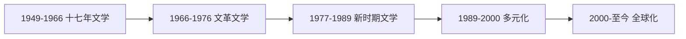

# ContemporaryChineseLiterature

**中国当代文学**
(Contemporary Chinese Literature)
指 1949 年以来的中国文学。
经历了社会主义现实主义、文革、
新时期、先锋和全球化等阶段。

## 分期

### 十七年文学 (1949–1966)

第一次文代会确立"文艺为工农兵服务"。

革命历史小说:
杜鹏程 *保卫延安*。
吴强 *红日*。
曲波 *林海雪原*。
杨沫 *青春之歌*。
梁斌 *红旗谱*。
罗广斌/杨益言 *红岩*。

农村题材:
赵树理 *小二黑结婚*。
周立波 *山乡巨变*。
柳青 *创业史*。

都市题材: 周而复 *上海的早晨*。
诗歌: 郭小川、贺敬之。
散文: 杨朔、刘白羽、秦牧。

### 文革时期 (1966–1976)

八个样板戏:
京剧《红灯记》《智取威虎山》。
《沙家浜》《海港》《奇袭白虎团》。
芭蕾《红色娘子军》《白毛女》。
交响乐《沙家浜》。

地下文学:
食指 *相信未来*。
白洋淀诗群: 多多、芒克。
张扬 *第二次握手* 手抄本。

### 新时期文学 (1977–1989)

伤痕文学:
刘心武 *班主任*(1977)。
卢新华 *伤痕*(1978)。
从维熙 *大墙下的红玉兰*。

反思文学:
王蒙 *活动变人形*。
张贤亮 *男人的一半是女人*。
谌容 *人到中年*。
张承志 *黑骏马*。

改革文学:
蒋子龙 *乔厂长上任记*。

寻根文学 (1985):
韩少功 *爸爸爸*。
阿城 *棋王* *孩子王*。
贾平凹 *商州* 系列。
莫言 *红高粱家族*。
王安忆 *小鲍庄*。

先锋文学 (1985–1989):
马原 *虚构*。
残雪 *山上的小屋*。
余华 *十八岁出门远行*。
格非 *迷舟*。
孙甘露 *访问梦境*。
苏童 *一九三四年的逃亡*。

朦胧诗:
北岛"卑鄙是卑鄙者的通行证"。
舒婷 *致橡树*。
顾城"黑夜给了我黑色的眼睛"。
海子 *面朝大海，春暖花开*(1989)。

### 1990 年代多元化

新写实: 池莉 *烦恼人生*。
刘震云 *单位* *一地鸡毛*。
王安忆 *长恨歌*(1995)。

女性写作:
陈染 *私人生活*。
林白 *一个人的战争*。
铁凝 *玫瑰门*。

王小波 *黄金时代* *沉默的大多数*。
王朔痞子文学。
韩东、朱文、李洱、毕飞宇。

### 21 世纪文学 (2000–至今)

莫言 *蛙*(2012 诺奖)。
*红高粱家族* *丰乳肥臀* *生死疲劳*。
余华 *兄弟* *第七天* *活着*。
苏童 *河岸* *黄雀记*。
格非 *江南三部曲*(茅盾文学奖)。
刘震云 *一句顶一万句*。
阿来 *尘埃落定*。

网络文学:
刘慈欣 *三体*(雨果奖 2015)。
猫腻 *将夜* *庆余年*。
天下霸唱 *鬼吹灯*。
南派三叔 *盗墓笔记*。

海外华文:
高行健 *灵山*(2000 诺奖)。
哈金 *等待*。
严歌苓 *陆犯焉识* *金陵十三钗*。
李翊云 *War Trash*。

## 文学奖项

茅盾文学奖(四年一届)。
鲁迅文学奖。
诺贝尔文学奖:
高行健 (2000)、莫言 (2012)。

## 批评热点

纯文学与介入 (人文精神讨论)。
现代主义与本土化。
文学与市场 (出版体制与畅销书)。
世界文学中的中国。

## 相关领域

- [[AncientChineseLiterature|中国古代文学]]
- [[LiteraryCriticism|文学批评]]
- [[../ForeignLanguagesAndLiteratures/WorldLiterature|世界文学]]

---

- [[../../INDEX|当前目录索引]]
