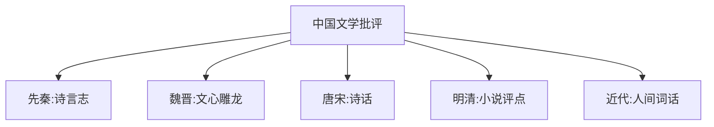

# LiteraryCriticism

**文学批评**
(Literary Criticism)
是对文学作品的阐释、分析和评价。
既包括具体作品的评论实践，
也包括普遍性的文学理论研究。

## 主要批评流派

### 形式主义与新批评

俄国形式主义 (1915-1930):
什克洛夫斯基 "陌生化" (Ostranenie)。
雅各布森 "文学性"。
普洛普 *故事形态学* 31 功能。

新批评 (1930-1960s):
意图谬误与感受谬误。
布鲁克斯: 反讽、含混、悖论。
细读 (Close Reading) 方法。
关注文本自足性。

### 结构主义与符号学

索绪尔: 能指/所指。
列维-斯特劳斯: 神话结构。
热奈特: 叙事学。
巴特: *S/Z* "作者之死"。
克里斯蒂娃: 互文性。

### 读者反应批评

伊瑟尔: 召唤结构、隐含读者。
姚斯: 接受美学、期待视野。
费什: 解释共同体。

### 心理分析批评

弗洛伊德: 俄狄浦斯情结、无意识。
拉康: 镜像阶段、三界结构。
荣格: 集体无意识、原型。

### 马克思主义批评

卢卡契: 现实主义理论。
葛兰西: 文化霸权。
阿尔都塞: 意识形态国家机器。
阿多诺: 文化工业批判。
詹姆逊: 政治无意识。
伊格尔顿: *文学理论导论*。

### 后结构主义与解构

德里达: 延异、逻各斯中心主义。
福柯: 话语-权力、知识型。
德勒兹: 块茎、千高原。
利奥塔: 宏大叙事危机。

### 女性主义批评

波伏娃: "女人不是天生的"。
肖尔瓦特: 女性批评学。
西苏: 女性书写。
斯皮瓦克: 后殖民女性主义。
巴特勒: 性别操演。

### 后殖民批评

萨义德 *东方学*(1978)。
霍米·巴巴: 混杂性、第三空间。
斯皮瓦克: 属下研究。

### 生态批评

布伊尔: 环境想象力。
深层生态学。
生态女性主义。

## 中国文学批评传统

关键词:
**意境**: 情景交融的艺术世界。
**风骨**: 刚健文风。
**神韵**: 含蓄深远。
**性灵**: 袁枚性灵说。
**格调**: 文体规范。
**肌理**: 翁方纲肌理说。

### 王国维境界说

"古今之成大事业、大学问者，
必经过三种之境界：
1. 昨夜西风凋碧树，独上高楼，望尽天涯路。
2. 衣带渐宽终不悔，为伊消得人憔悴。
3. 众里寻他千百度，蓦然回首，
   那人却在灯火阑珊处。"

## 当代批评前沿

数字人文 (Digital Humanities):
远读 (Distant Reading)、文本挖掘。
情动理论 (Affect Theory)。
世界文学理论。
人类世批评 (Anthropocene Criticism)。

## 相关领域

- [[AncientChineseLiterature|中国古代文学]]
- [[ContemporaryChineseLiterature|中国当代文学]]
- [[../ForeignLanguagesAndLiteratures/WorldLiterature|世界文学]]

---

- [[../../INDEX|当前目录索引]]
