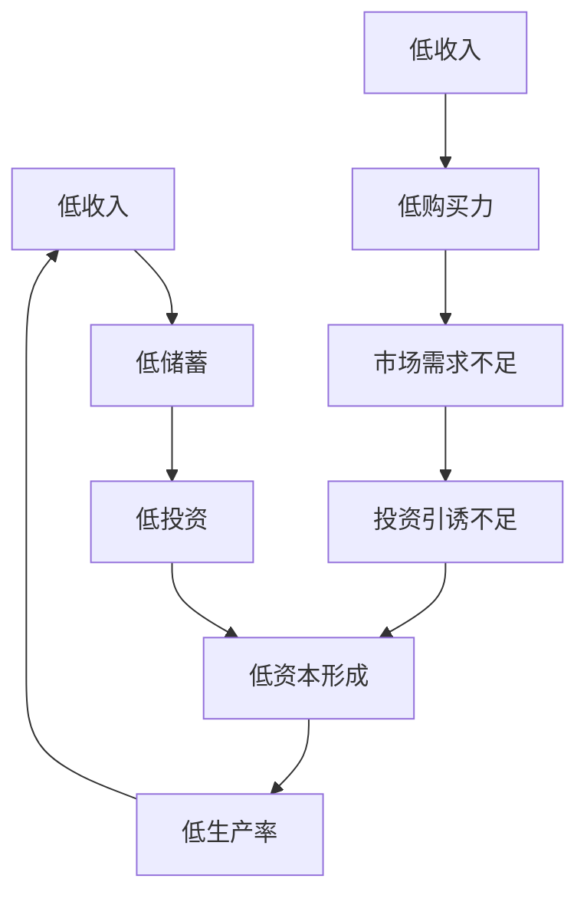
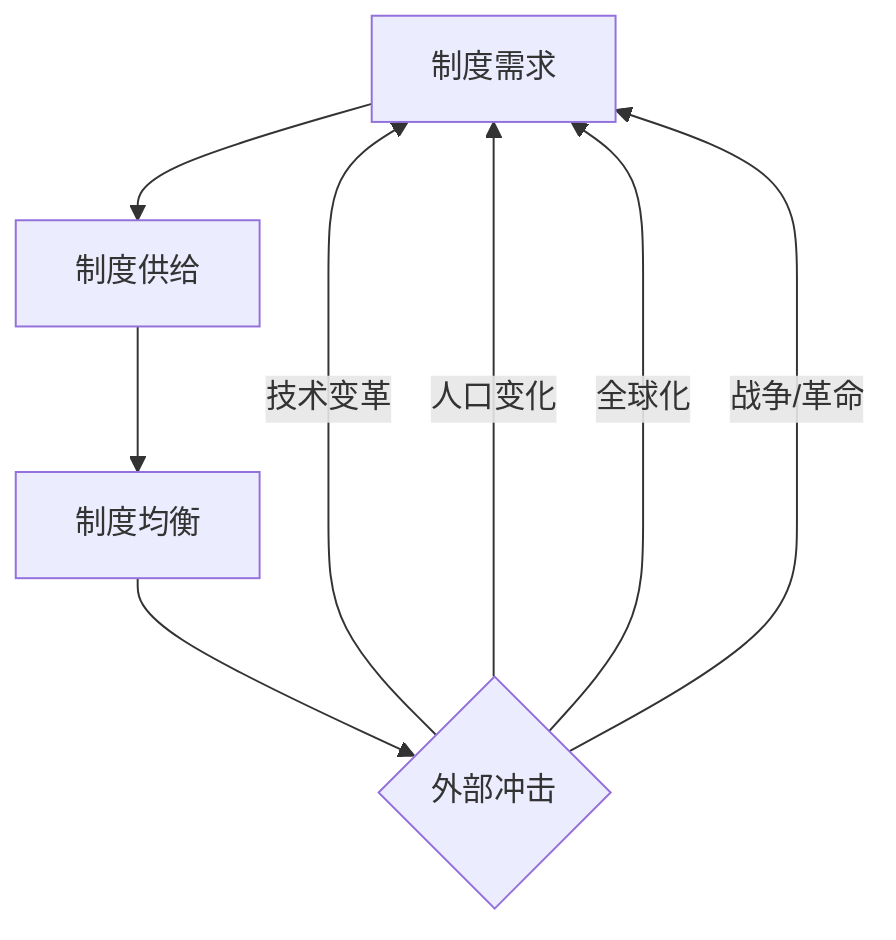

# 发展经济学 (Development Economics)

## 一、发展经济学概述

### 1.1 定义与研究对象

发展经济学（Development Economics）是研究发展中国家如何实现经济结构转型和经济发展的学科。它分析发展中国家经济增长的障碍、动力和路径，为制定发展政策提供理论依据。

### 1.2 发展经济学的演变

| 阶段 | 时间 | 核心理论 | 政策建议 |
|------|------|----------|----------|
| 结构主义 | 1940s-1960s | 大推动、平衡增长 | 政府主导工业化 |
| 新古典主义 | 1970s-1980s | 市场机制、自由贸易 | 结构调整、自由化 |
| 新制度主义 | 1990s至今 | 制度质量、路径依赖 | 制度建设、治理改革 |
| 可持续发展 | 2000s至今 | 包容性增长、绿色发展 | SDGs、减贫与环保 |

### 1.3 经济发展的衡量指标

| 指标 | 公式/定义 | 局限性 |
|------|-----------|--------|
| GDP per capita | $\frac{\text{GDP}}{\text{人口}}$ | 忽略分配和环境 |
| HDI（人类发展指数） | $\frac13(\text{寿命指数} + \text{教育指数} + \text{收入指数})$ | 忽略不平等和自由 |
| GNI per capita | 国民总收入/人口 | 受汇率影响 |
| MPI（多维贫困指数） | 健康+教育+生活水平 | 数据收集困难 |
| Gini系数 | $\frac{A}{A+B}$（洛伦兹曲线） | 仅反映收入不平等 |

## 二、经典发展理论

### 2.1 罗森斯坦-罗丹的大推进理论

大推进理论（Big Push Theory）认为发展中国家需要大规模、全面投资才能突破贫困陷阱：

$$
\text{工业化} = f(\text{同时投资多个互补部门})
$$

**核心逻辑**：单个产业的投资因市场狭小难以盈利，多个产业同时投资可创造相互需求，实现规模经济。

### 2.2 纳克斯的贫困恶性循环理论

**供给与需求双重循环**：纳克斯将贫困陷阱分解为供给侧的"低储蓄→低投资→低收入"循环和需求侧的"低购买力→低投资→低收入"循环。

### 2.3 刘易斯的二元经济模型

刘易斯模型（Lewis Dual-Sector Model）将发展中国家的经济分为传统农业部门和现代工业部门：

$$
\text{劳动力无限供给} \to \text{工业部门扩张} \to \text{结构性转型}
$$

| 阶段 | 特征 | 标志 |
|------|------|------|
| 第一阶段 | 劳动力无限供给 | 农业边际生产力接近零 |
| 第二阶段 | 劳动力短缺 | 工资开始上升 |
| 转折点（Lewis Turning Point） | 两部门边际产量相等 | 劳动力市场一体化 |

### 2.4 罗斯托的经济增长阶段论

| 阶段 | 特征 | 示例 |
|------|------|------|
| 传统社会 | 农业为主，科技停滞 | 前工业社会 |
| 起飞前准备 | 现代科技引入，基础设施投资 | 18世纪英国 |
| 起飞（Take-off） | 高投资率，主导产业形成 | 工业革命 |
| 走向成熟 | 技术进步扩散到经济各部门 | 发达经济体 |
| 大众高消费时代 | 消费主导，福利国家 | 战后西方国家 |

### 2.5 赫尔希曼的不平衡增长理论

不平衡增长（Unbalanced Growth）主张优先投资具有强前向和后向关联效应的产业：

$$
\text{关联效应} = \text{前向关联} + \text{后向关联}
$$

## 三、增长理论

### 3.1 哈罗德-多马模型

$$
\frac{\Delta Y}{Y} = \frac{s}{k}
$$

其中 $s$ 为储蓄率，$k$ 为资本-产出比。该模型强调储蓄和资本积累是增长的唯一源泉。

### 3.2 索洛-斯旺模型

索洛模型（Solow-Swan Model）引入技术进步因素：

$$
Y = A K^\alpha L^{1-\alpha}
$$

$$
\frac{\Delta k}{k} = s f(k) - (n + \delta)k
$$

| 变量 | 含义 |
|------|------|
| $k$ | 人均资本 |
| $s$ | 储蓄率 |
| $n$ | 人口增长率 |
| $\delta$ | 折旧率 |
| $A$ | 技术水平（全要素生产率） |
| $f(k)$ | 人均产出函数 |

**收敛假说（Convergence Hypothesis）**：穷国的人均收入增长速度应快于富国，最终实现收入水平趋同。

### 3.3 内生增长理论

内生增长理论（Endogenous Growth Theory）将技术进步内生化：

$$
Y = A K^\alpha L^{1-\alpha}, \quad A = f(\text{R&D支出}, \text{人力资本}, \text{制度质量})
$$

**罗默模型**（Romer Model）强调知识溢出效应和研发投入对增长的驱动。

## 四、贫困与不平等

### 4.1 贫困的测量

$$
\text{贫困率} = \frac{\text{贫困线下人口}}{\text{总人口}} \times 100\%
$$

国际贫困线：每人每日生活支出低于2.15美元（2017年PPP）。

### 4.2 库兹涅茨倒U型假说

库兹涅茨假说（Kuznets Inverted-U Hypothesis）认为在经济发展初期，收入不平等加剧；在经济发展后期，收入不平等趋于减小：

$$
\text{不平等} = a + b\ln(\text{GDP per capita}) + c[\ln(\text{GDP per capita})]^2
$$

### 4.3 阿马蒂亚·森的可行能力方法

森（Amartya Sen）提出发展是扩展人的实质性自由的过程：

$$
\text{发展} = \text{扩展可行能力（Capabilities）}
$$

| 概念 | 定义 |
|------|------|
| 功能性活动（Functionings） | 个人实际做到或达到的状态 |
| 可行能力（Capabilities） | 个人所能实现的功能性活动的组合 |
| 自由（Freedom） | 实现可行能力的机会和过程 |

## 五、制度与发展

### 5.1 制度的重要性

阿西莫格鲁（Acemoglu）和罗宾逊（Robinson）的研究表明，制度是决定长期经济增长的根本因素：

$$
\text{经济发展} = f(\text{包容性制度}, \text{人力资本}, \text{技术进步})
$$

**包容性制度**（Inclusive Institutions）保护产权、鼓励创新、促进公平竞争，是繁荣的根源。**汲取性制度**（Extractive Institutions）将资源从多数人转移到少数人手中，阻碍发展。

### 5.2 制度变迁路径

## 六、发展政策

### 6.1 工业化战略

| 战略 | 政策工具 | 成功案例 | 风险 |
|------|----------|----------|------|
| 进口替代（ISI） | 关税保护、配额、补贴 | 巴西、墨西哥 | 效率低下、国际收支危机 |
| 出口导向 | 出口补贴、汇率管理 | 韩国、台湾、新加坡 | 依赖外部市场 |
| 平衡增长 | 各产业协调投资 | 较少成功 | 资源分散 |
| 产业政策 | 选择性支持 | 日本、中国 | 寻租风险 |

### 6.2 人力资本投资

$$
\text{人力资本回报率} > \text{物质资本回报率}
$$

教育的私人回报率和社会回报率在不同教育阶段呈现不同特征。

### 6.3 援助与债务

| 对外援助类型 | 特点 | 争议 |
|-------------|------|------|
| 无偿援助 | 不需偿还 | 可能造成依赖 |
| 优惠贷款 | 低利率、长期限 | 债务可持续性 |
| 技术援助 | 知识转移 | 适应性不足 |
| 债务减免 | 减轻债务负担 | 道德风险 |

### 6.4 可持续发展目标（SDGs）

联合国2030年可持续发展议程包含17项目标，涵盖消除贫困、零饥饿、良好健康、优质教育、性别平等、清洁饮水、清洁能源、体面工作、产业创新、减少不平等、可持续城市、负责任消费、气候行动、水下生物、陆地生物、和平正义和伙伴关系。

## 七、发展经济学的当代议题

### 7.1 中国发展经验

改革开放以来，中国实现了人类历史上规模最大的经济增长和减贫成就。"中国模式"的特征包括：渐进式改革、出口导向、基础设施投资、有效政府与市场结合。

### 7.2 中等收入陷阱

中等收入陷阱（Middle-Income Trap）指经济体在达到中等收入水平后增长停滞。跨越陷阱需要从要素驱动转向创新驱动。

## 八、发展经济学的未来方向

| 方向 | 内容 | 政策含义 |
|------|------|----------|
| 数字化转型 | 数字技术的普及为发展带来新机遇 | 数字基础设施建设、数字素养教育 |
| 绿色转型 | 环境可持续性与经济发展的协调 | 绿色金融、清洁能源投资 |
| 人力资本深化 | 教育投入和创新能力的提升 | 教育质量改革和终身学习 |
| 制度变革 | 包容性制度的建设和完善 | 产权保护、法治建设、反腐败 |
| 区域合作 | 南南合作和区域一体化 | 一带一路、RCEP等合作框架 |

## 相关条目

- [[03_HumanitiesAndSocialSciences/Economics/PublicEconomics|PublicEconomics]]
- [[PoliticalEconomy]]
- [[RegionalEconomics]]
- [[03_HumanitiesAndSocialSciences/Economics/Econometrics/INDEX|Econometrics]]
- [[INDEX|当前目录索引]]
