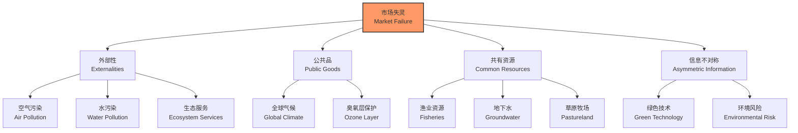
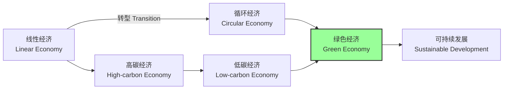

---
aliases:
  - 环境经济学
  - Environmental Economics
  - 资源经济学
  - 生态经济学
  - 绿色经济
  - 气候经济学
tags:
created: 2026-05-17
updated: 2026-05-17
  - economics
  - environmental_economics
  - market_failure
  - pigouvian_tax
  - coase_theorem
  - green_economy
  - climate_change
  - sustainability
---

# 环境经济学 (Environmental Economics)

环境经济学是经济学与环境科学深度交叉的学科，系统研究环境问题中的资源配置效率、市场失灵机制与政策干预工具。它运用微观经济学的理论框架分析污染、自然资源耗竭与生态系统退化，并通过成本-效益分析、非市场价值评估与制度设计为可持续发展政策提供严谨的经济学基础。

## 环境作为经济系统的组成部分

### 自然环境的经济功能

自然环境在经济系统中并非外生的被动背景，而是扮演多重不可或缺的功能角色：

| 经济功能 (Economic Function) | 说明 (Description) | 经济学分类 |
| :--- | :--- | :--- |
| 资源供给 (Resource Provision) | 提供原材料、能源与基因资源 | 自然资源资本 (Natural Capital) |
| 废物吸纳 (Waste Assimilation) | 吸收、稀释与降解污染物 | 环境自净服务 (Assimilative Services) |
| 生命支持 (Life Support) | 维持气候稳定、水循环、土壤形成与养分循环 | 生态系统服务 (Ecosystem Services) |
| 休闲与文化 (Amenity and Culture) | 提供美学享受、精神慰藉、文化遗产与科研价值 | 非使用价值 (Non-use Values) |

传统国民经济核算体系（如 GDP）未能充分反映这些环境功能的价值，导致对真实经济福利的系统性高估和对自然资本耗竭的忽视。

### 自然资本与可持续收入

Hicksian 收入概念被扩展应用于环境语境：**可持续收入 (Sustainable Income)** 指在不减少自然资本存量（包括可再生资源的再生能力与不可再生资源的替代投资）前提下的最大可持续消费量。若当代消费以牺牲环境为代价，则实际经济收入被高估：

$$
\text{真实储蓄率 (Genuine Savings Rate)} = \text{总储蓄} - \text{固定资产折旧} - \text{自然资本耗竭} - \text{污染损害} + \text{人力资本投资}
$$

世界银行的真实储蓄率指标试图将环境退化与资源耗竭纳入国民核算体系，为评估发展的可持续性提供量化工具。

## 市场失灵与环境问题 (Market Failure and Environmental Problems)

### 环境外部性的经济学解释

环境问题的核心经济学解释是 **外部性 (Externality)**：经济主体的行为对未参与直接交易的第三方产生未通过市场价格反映的额外成本或收益。

#### 负外部性：污染

污染是典型的负外部性。竞争性企业的利润最大化决策仅考虑私人成本 $C_p(q)$，完全忽视其生产活动施加于社会的外部成本：

$$
\max_q \; \pi = p \cdot q - C_p(q) \quad \Rightarrow \quad p = MC_p
$$

然而，社会最优产量要求价格等于社会边际成本：

$$
p = MC_s = MC_p + MEC
$$

其中 $MEC$ 为边际外部成本 (Marginal External Cost)。由于 $MC_s > MC_p$，市场均衡产量 $q_m$ 必然超过社会最优产量 $q^*$，产生 **福利净损失 (Deadweight Loss, DWL)**：

$$
DWL = \int_{q^*}^{q_m} \left[ MEC(q) - \left( p - MC_p(q) \right) \right] \, dq
$$

#### 正外部性：生态系统服务

生态系统服务（如森林的水源涵养、湿地的洪水调蓄、授粉昆虫的农业服务）往往具有显著的正外部性。私人保护或恢复这些服务的激励严重不足，因为收益外溢至整个社会，而成本由私人承担。

### 公共品属性

许多环境资源兼具公共品与共有资源属性：

- **非竞争性**：一个人享受清洁空气或生物多样性不减少他人享受。
- **非排他性**：难以排除未付费者享受环境改善带来的收益。

这导致典型的 **搭便车问题 (Free-rider Problem)**，市场机制无法有效供给环境保护。

### 共有地悲剧

Garrett Hardin (1968) 的 **共有地悲剧 (Tragedy of the Commons)** 描述了开放获取资源 (Open-access Resources) 的过度使用逻辑：每个使用者的私人收益为正，但社会边际成本被所有使用者分摊，导致资源利用强度超过社会最优水平，直至租金完全耗散。

## 环境政策工具 (Environmental Policy Instruments)

### 命令-控制型管制

传统环境政策主要依赖直接行政管制：

- **技术标准 (Technology Standards)**：强制所有污染源采用特定的减排技术（如汽车催化转化器、电厂脱硫装置）。
- **绩效标准 (Performance Standards)**：设定单位产出或排放口的污染物浓度/总量上限。

**主要缺陷**：缺乏灵活性，未考虑不同企业间边际减排成本的巨大差异，导致社会整体减排成本高于必要水平。

### 经济激励型工具

#### Pigouvian 税

Arthur Pigou (1920) 提出通过对污染排放征税，使私人成本内部化，与社会成本一致：

$$
t^* = MEC(q^*) = MSC(q^*) - MPC(q^*)
$$

若边际外部成本恒定（$MEC = \bar{e}$），则定额税即可实现最优；若边际外部成本随排放量增加而递增，则税率应随排放量调整（累进税率）。

Pigouvian 税的核心优势：
- 持续激励企业投资于清洁技术创新以降低税负；
- 为政府创造财政收入，可用于降低其他扭曲性税收（双重红利假说）；
- 在信息充分的理想条件下可达到社会最优减排量。

**现实挑战**：准确估计边际外部成本极为困难；面临强大的产业与政治阻力；可能引发碳泄漏（carbon leakage）与国际竞争力问题。

#### 排污权交易 (Emissions Trading)

排污权交易（可交易许可, Tradable Permits）设定总排放上限，通过市场交易分配减排责任：

- **总量控制与交易 (Cap-and-Trade)**：政府设定排放总量上限（cap），发放或拍卖许可，允许企业间交易（trade）。
- **成本效益**：减排边际成本低的企业多减排并出售多余许可，边际成本高的企业购买许可，实现整体社会减排成本最小化。

均衡时，所有企业的边际减排成本相等且等于许可市场价格：

$$
MAC_A = MAC_B = \dots = MAC_N = P_{\text{permit}}
$$

| 政策工具 | 价格确定性 | 数量确定性 | 收入效应 | 动态效率 | 创新激励 |
| :--- | :--- | :--- | :--- | :--- | :--- |
| 排放税 | 是 | 否 | 政府收入 | 强 | 持续 |
| 总量管制 | 否 | 是 | 依分配方式 | 中等 | 中等 |
| 技术标准 | 否 | 否 | 无 | 弱 | 弱 |
| 绩效标准 | 否 | 否 | 无 | 弱 | 弱 |

#### 补贴与押金-返还制度

- **减排补贴**：对减排投资或清洁生产给予补贴，但可能产生财政负担与道德风险。
- **押金-返还制度 (Deposit-Refund Systems)**：消费者购买产品时支付押金，归还包装或废弃物时返还，有效减少乱扔垃圾并促进资源回收（如饮料瓶回收系统）。

### 基于市场的自愿工具

- **环境认证与生态标签**：如能源之星 (Energy Star)、有机食品认证、森林管理委员会 (FSC) 认证，通过信息揭示引导消费者向绿色产品转移需求。
- **自愿协议 (Voluntary Agreements)**：政府与行业协商减排目标，行业换取监管灵活性与公众形象提升。

## Coase 定理与产权方法

### 定理的核心内容

Ronald Coase (1960) 提出了颠覆性的洞见：在交易成本为零且产权明确界定的理想条件下，无论初始产权如何配置，市场交易都能自动达到社会最优的污染水平，无需政府征税或管制。

### 现实世界的局限

Coase 定理的理论优雅性与其现实适用性之间存在巨大鸿沟：

- **交易成本往往显著高昂**：多方利益相关者的谈判、信息获取、合约起草、执行与监督可能成本极高。
- **产权界定困难**：清洁空气、河流流量、生物多样性等环境资源难以像私有财产那样清晰界定与有效保护。
- **收入分配效应**：产权的初始配置影响财富与福利分配，公平的产权安排本身就是政治问题。
- **策略性行为与搭便车**：受影响者可能采取 hold-up 策略，或 free-ride 于他人的谈判努力。

因此，Coase 定理更多是理论基准与政策设计的参照系，而非可直接操作的政策处方。在交易成本较低、受影响方数量有限且产权可界定的场景（如局部水污染、相邻土地纠纷），自愿谈判或责任规则可能有效。

## 环境评估方法

### 成本-效益分析 (Cost-Benefit Analysis, CBA)

CBA 是环境政策评估的核心分析工具，要求将所有政策影响（包括环境损害与改善）货币化并折现：

$$
NPV = \sum_{t=0}^{T} \frac{B_t - C_t}{(1 + r)^t}
$$

其中 $r$ 为社会折现率 (Social Discount Rate)。折现率的选择具有深刻的伦理与经济学争议：

- **纯时间偏好率**：反映当代人对未来的主观贴现。
- **机会成本**：资本的社会回报率，反映资源的时间价值。
- **增长率效应**：若未来代人预期更富裕，由于边际效用递减，未来收益的现值权重应降低。

Nicholas Stern 在《斯特恩气候变化经济学评论》(2006) 中使用低折现率（接近纯时间偏好率）强调气候行动的紧迫性；William Nordhaus 则主张与市场利率一致的较高折现率，得出更渐进的减排路径。

### 非市场价值评估技术

环境价值的很大一部分存在于非市场领域，需要特殊的评估方法：

| 评估方法 (Method) | 基本原理 (Principle) | 典型应用 (Application) |
| :--- | :--- | :--- |
| 旅行成本法 (Travel Cost Method) | 通过旅行支出与时间成本推断景观/休闲场所的价值 | 国家公园、自然保护区、海滩 |
| 享乐定价法 (Hedonic Pricing) | 通过房产价格差异分解环境属性的隐含价值 | 空气质量、噪音水平、景观视野 |
| 条件价值评估 (CVM) | 直接调查受访者的支付意愿 (WTP) 或接受补偿意愿 (WTA) | 濒危物种、自然景观、生态系统恢复 |
| 选择实验 (Choice Experiment) | 通过多属性选择任务推断各属性的边际价值 | 多重环境属性组合评估 |
| 效益转移 (Benefit Transfer) | 将已有研究的估值结果转移至新情境 | 数据有限时的快速评估 |

**总经济价值 (Total Economic Value, TEV)** 框架将环境价值系统分解为：

$$
TEV = UV + NUV = (DUV + IUV) + (OV + BV + EV)
$$

- **使用价值 (Use Value, UV)**：直接使用价值 (Direct UV)、间接使用价值 (Indirect UV)。
- **非使用价值 (Non-use Value, NUV)**：选择价值 (Option Value)、遗赠价值 (Bequest Value)、存在价值 (Existence Value)。

## 绿色经济与可持续发展

### 绿色经济的内涵

绿色经济（Green Economy）强调经济增长与环境保护之间的协同关系，而非传统观念中的权衡取舍。UNEP 将其定义为 "改善人类福祉与社会公平，同时显著降低环境风险与生态稀缺的经济"。

### 可持续发展的经济学框架

Brundtland 报告（1987）将可持续发展定义为 "满足当代需求而不损害后代满足其需求能力的发展"。在经济学框架下，可持续发展要求：

$$
\frac{dK_{\text{总}}}{dt} \geq 0, \quad K_{\text{总}} = K_m + K_h + K_n
$$

即人造资本 ($K_m$)、人力资本 ($K_h$) 与自然资本 ($K_n$) 的总和保持代际非减。

- **弱可持续性 (Weak Sustainability)**：允许人造资本替代自然资本，只要总资本不减。
- **强可持续性 (Strong Sustainability)**：要求关键自然资本（如臭氧层、生物多样性、气候系统）不可减少，因其具有不可替代性。

### 低碳经济转型

应对气候变化要求经济系统的深度脱碳：

- **碳定价机制**：全球碳价联盟、欧盟碳边境调节机制（CBAM, Carbon Border Adjustment Mechanism）。
- **绿色技术创新**：通过研发补贴、公共采购与专利政策诱导清洁技术突破。
- **公正转型 (Just Transition)**：确保脱碳过程不加剧化石能源依赖地区与工人的负担，通过再培训、社会保障与产业多元化实现转型正义。

## 结语

环境经济学为理解和解决环境问题提供了严谨而系统的经济分析框架。从外部性理论到 Pigouvian 税，从 Coase 定理到成本-效益分析，从非市场价值评估到绿色经济转型，这些理论与工具帮助决策者在效率与公平、经济增长与生态保护之间寻求动态平衡。面对气候变化、生物多样性丧失与资源耗竭等全球性挑战，环境经济学正从局部污染控制扩展至行星边界 (Planetary Boundaries) 管理，为人类文明的可持续未来提供不可或缺的智力支撑。
