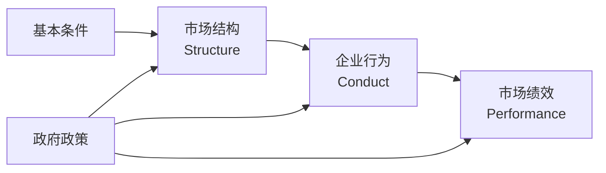
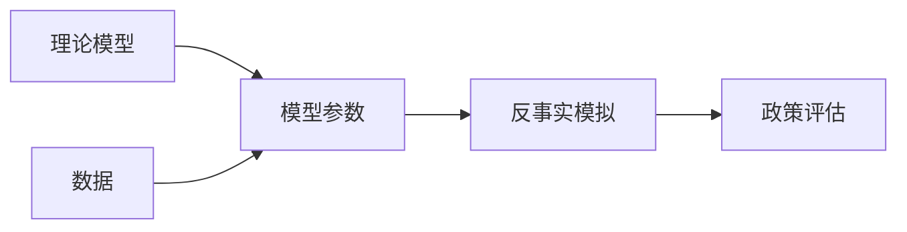

# 产业组织 (Industrial Organization)

## 一、产业组织概述

### 1.1 定义与研究范围

产业组织（Industrial Organization, IO）是微观经济学的一个分支，研究市场如何组织以及企业如何在市场中竞争与合作。它关注不完全竞争市场的运行机制、企业行为和市场绩效之间的关系。

### 1.2 结构-行为-绩效范式

SCP 范式（Structure-Conduct-Performance Paradigm）是产业组织学的经典分析框架：

| 要素 | 内容 |
|------|------|
| 市场结构 | 市场集中度、产品差异化、进入壁垒、成本结构 |
| 企业行为 | 定价策略、广告、研发、合谋、并购 |
| 市场绩效 | 效率、利润、创新、公平分配 |

### 1.3 市场结构的分类

| 市场结构 | 企业数量 | 产品差异化 | 进入壁垒 | 价格控制力 |
|----------|----------|------------|----------|------------|
| 完全竞争 | 大量 | 同质 | 低 | 无 |
| 垄断竞争 | 许多 | 差异化 | 低 | 有限 |
| 寡头垄断 | 少数 | 同质或差异化 | 高 | 相互依赖 |
| 完全垄断 | 一家 | 独特 | 极高 | 显著 |

## 二、市场力量与垄断

### 2.1 垄断的成因

$\text{垄断来源} = \text{规模经济} + \text{进入壁垒} + \text{产品差异化} + \text{法律保护}$

| 类型 | 成因 | 案例 |
|------|------|------|
| 自然垄断 | 规模经济显著 | 电网、自来水、铁路 |
| 法律垄断 | 专利、版权、特许权 | 制药专利 |
| 资源垄断 | 关键资源独占 | 矿产资源 |
| 技术垄断 | 技术领先 | 高端芯片制造 |

### 2.2 垄断的福利损失

**勒纳指数**（Lerner Index）：$L = \frac{P - MC}{P} = -\frac{1}{\varepsilon_d}$

### 2.3 价格歧视

| 级别 | 特征 | 示例 |
|------|------|------|
| 一级价格歧视 | 向每位消费者收取其保留价格 | 拍卖 |
| 二级价格歧视 | 按购买数量差别定价 | 数量折扣 |
| 三级价格歧视 | 按市场细分差别定价 | 学生票/成人票 |

## 三、寡头垄断理论

### 3.1 古诺模型

古诺模型（Cournot Model）：$\text{企业选择产量}$。对称双寡头均衡：$q^* = \frac{a - c}{3b}$

### 3.2 斯塔克尔伯格模型

领导者先选择产量，追随者随后做出最优反应。

### 3.3 伯川德模型

伯川德模型（Bertrand Model）：企业选择价格，均衡价格等于边际成本（伯川德悖论）。

### 3.4 合谋与卡特尔

合谋稳定性条件：$\delta \geq 1 - \frac{1}{n}$，企业数量越多越不稳定。

## 四、产品差异化

### 4.1 豪特林模型

豪特林模型（Hotelling Model）分析空间差异化竞争。线性城市模型中两家企业位于两个四分之一位置（最大差异化原则）。

### 4.2 纵向差异化

纵向差异化是产品质量维度上的差异，高质量产品吸引高估值消费者。

### 4.3 广告经济学

| 广告类型 | 功能 | 理论 |
|----------|------|------|
| 信息型广告 | 传递产品存在和特征 | 减少信息不对称 |
| 说服型广告 | 改变消费者偏好 | 品牌忠诚与市场力量 |
| 信号型广告 | 传递产品质量信号 | 高质量企业投放更多广告 |

## 五、进入壁垒

| 类型 | 来源 |
|------|------|
| 结构性壁垒 | 规模经济、绝对成本优势 |
| 策略性壁垒 | 掠夺性定价、过度投资 |
| 法律/行政壁垒 | 许可证、配额、专利 |

**可竞争市场理论**：只要存在潜在进入威胁，在位企业也会将价格定在竞争水平。

## 六、研发与创新

阿罗的替代效应：竞争性企业比垄断企业更有研发激励。专利竞赛和网络效应（梅特卡夫定律：$\text{网络价值} \propto n^2$）。

## 七、反垄断与竞争政策

| 国家/地区 | 核心法律 | 执法机构 |
|-----------|----------|----------|
| 美国 | 谢尔曼法、克莱顿法 | FTC、DOJ |
| 欧盟 | 欧盟运行条约第101、102条 | 欧盟委员会 |
| 中国 | 反垄断法 | 国家市场监管总局 |

**反垄断规制对象**：垄断协议、滥用市场支配地位、经营者集中、行政垄断。

**HHI 指数**：$\text{HHI} = \sum s_i^2$，>2500为高度集中。

## 八、产业组织的前沿议题

### 8.1 平台经济

平台经济（Platform Economy）以双边市场为特征，跨边网络效应使平台具有自然垄断倾向，引发了反垄断监管的新挑战。

### 8.2 大数据与市场力量

大数据作为生产要素改变了市场力量的来源。数据驱动的竞争策略包括个性化定价、用户锁定和数据壁垒。

### 8.3 数字市场反垄断

| 问题 | 传统分析 | 数字市场特征 |
|------|----------|-------------|
| 相关市场界定 | 产品市场+地理市场 | 多边市场、动态边界 |
| 市场支配地位 | 市场份额为主 | 网络效应、数据优势 |
| 竞争损害理论 | 价格上升 | 质量下降、创新抑制 |
| 救济措施 | 结构救济+行为救济 | 数据互操作、算法透明 |

### 8.4 全球价值链

全球价值链（Global Value Chains, GVC）分析生产的跨国分工。升级路径包括工艺升级、产品升级、功能升级和链条升级。

### 8.5 中国产业组织政策

中国产业组织政策以反垄断法为核心，同时包含产业政策和竞争政策的协调。国企改革、市场准入负面清单和公平竞争审查制度是近年改革的重点。

## 九、产业组织理论的主要学者

| 学者 | 贡献 | 代表作 |
|------|------|--------|
| 克鲁格曼（P. Krugman） | 新经济地理学、规模经济与贸易 | 《地理与贸易》 |
| 梯若尔（J. Tirole） | 产业组织理论、规制理论 | 《产业组织理论》 |
| 萨顿（J. Sutton） | 沉没成本与市场结构 | 《沉没成本与市场结构》 |
| 夏皮罗（C. Shapiro） | 网络效应与竞争政策 | 《信息规则》 |

## 相关条目

- [[03_HumanitiesAndSocialSciences/Economics/Microeconomics]]
- [[03_HumanitiesAndSocialSciences/Economics/InternationalEconomics|InternationalEconomics]]
- [[03_HumanitiesAndSocialSciences/Law/IntellectualPropertyLaw|IntellectualPropertyLaw]]
- [[GameTheory]]
- [[INDEX|当前目录索引]]

## 十、产业组织实证方法

### 10.1 结构估计

结构估计（Structural Estimation）是产业组织实证研究的前沿方法。研究者设定企业竞争行为的理论模型，通过数据估计模型参数，进而进行反事实模拟（Counterfactual Simulation）。

### 10.2 新实证产业组织

新实证产业组织（New Empirical Industrial Organization, NEIO）运用计量方法推断市场势力：

- **需求估计**：Berry-Levinsohn-Pakes（BLP）随机系数 Logit 模型
- **生产函数估计**：Olley-Pakes 方法、Levinsohn-Petin 方法
- **进入退出模型**：Bresnahan-Reiss 模型、博弈估计

### 10.3 自然实验与准实验

产业组织研究中的自然实验方法包括：
- **双重差分法（DID）**：评估政策或事件的影响
- **断点回归（RDD）**：利用门槛值附近的随机性
- **工具变量（IV）**：解决内生性问题

## 十一、产业组织的经典案例

| 案例 | 涉及理论 | 政策含义 |
|------|----------|----------|
| 美国 AT&T 拆分 | 自然垄断、范围经济 | 放松管制促进竞争 |
| 微软反垄断案 | 捆绑销售、网络效应 | 技术垄断的边界 |
| 谷歌购物搜索案 | 搜索偏向、市场支配地位 | 数字平台反垄断 |
| 高通标准必要专利案 | FRAND 承诺、专利劫持 | 知识产权与竞争政策 |
| 滴滴与 Uber 合并案 | 相关市场界定、经营者集中 | 平台经济并购审查 |

## 十二、产业组织理论的前沿展望

| 方向 | 核心问题 | 研究方法 |
|------|----------|----------|
| 数据驱动的市场力量 | 大数据是否创造新的进入壁垒 | 机器学习、因果推断 |
| 注意力经济 | 平台竞争中的用户注意力配置 | 双边市场模型 |
| 算法合谋 | 算法定价是否构成默示合谋 | 模拟、实验经济学 |
| 创新竞争 | 专利竞赛与市场结构的关系 | 动态博弈模型 |
| 供应链组织 | 纵向一体化和契约设计 | 不完全契约理论 |

## 十三、产业组织的主要学术期刊

| 期刊名称 | 领域 | 出版社 |
|----------|------|--------|
| Journal of Political Economy | 综合经济学 | University of Chicago |
| American Economic Review | 综合经济学 | AEA |
| RAND Journal of Economics | 产业组织 | RAND Corporation |
| Journal of Industrial Economics | 产业组织 | Wiley |
| International Journal of Industrial Organization | 产业组织 | Elsevier |
| Review of Industrial Organization | 产业组织 | Springer |

## 十四、产业组织理论的学习路径

1. **基础阶段**：微观经济学原理、博弈论基础、计量经济学入门
2. **核心阶段**：产业组织理论（Tirole）、反垄断经济学（Motta）、竞争政策
3. **进阶阶段**：计量经济学方法（结构估计）、产业组织前沿（平台经济、拍卖理论）
4. **实证阶段**：Stata/Python/R 编程、实证研究论文写作、学术发表

## 相关条目
- [[INDEX|当前目录索引]]
