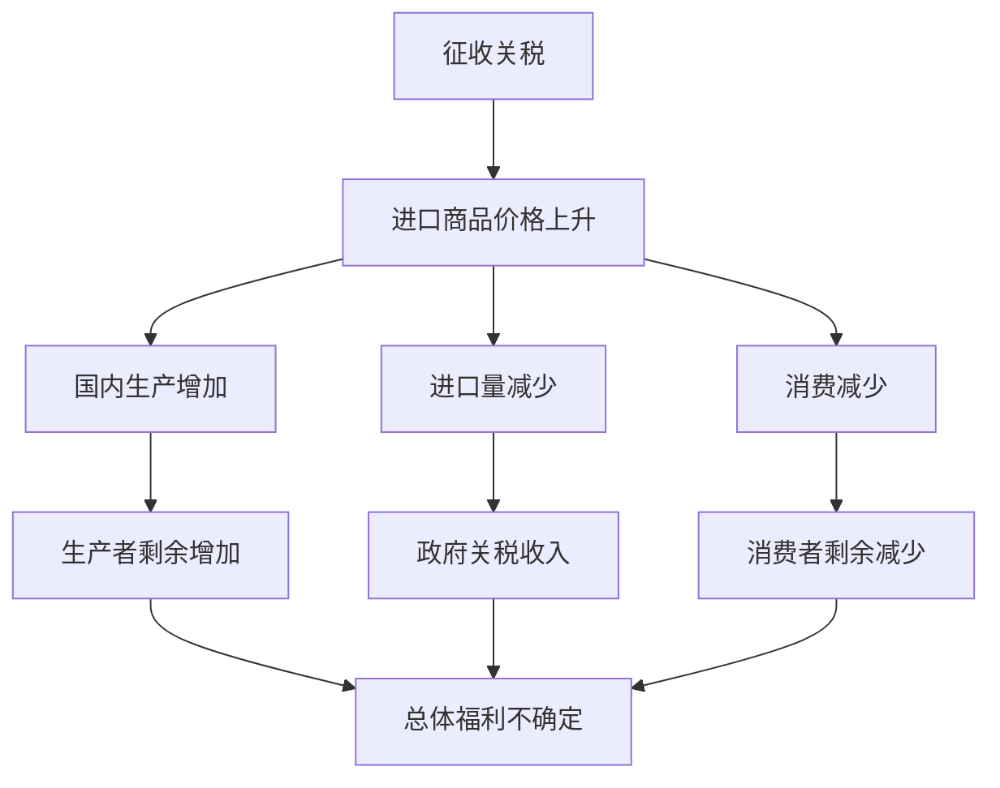

# 国际经济学 (International Economics)

## 一、国际经济学概述

### 1.1 定义与分支

国际经济学（International Economics）研究国家之间经济活动的相互依存关系，包括贸易、投资、货币流动和国际经济制度。其两大核心分支是国际贸易（International Trade）和国际金融（International Finance）。

### 1.2 国际经济学的核心问题

| 分支 | 核心问题 |
|------|----------|
| 国际贸易 | 为什么国家之间进行贸易？贸易模式由什么决定？ |
| 国际贸易 | 贸易对收入分配和就业有何影响？ |
| 贸易政策 | 关税和贸易壁垒的效应是什么？ |
| 国际金融 | 汇率如何决定？ |
| 国际金融 | 国际资本流动的原因和后果是什么？ |
| 国际宏观 | 开放经济中的宏观经济政策如何运作？ |

## 二、国际贸易理论

### 2.1 古典贸易理论

**绝对优势理论**（Absolute Advantage, Adam Smith）：具有更高劳动生产率的国家具有绝对优势。

**比较优势理论**（Comparative Advantage, David Ricardo）：

$$
\text{比较优势} = \text{机会成本更低}
$$

即使一国在所有商品上都没有绝对优势，它仍然可以通过专业化生产并出口其比较优势最大的商品而从贸易中获益。

### 2.2 赫克歇尔-俄林模型

H-O 模型将比较优势归结为要素禀赋差异：一国出口密集使用其丰裕要素的产品。

**斯托尔珀-萨缪尔森定理**：贸易使丰裕要素受益，稀缺要素受损。

### 2.3 新贸易理论

新贸易理论（New Trade Theory）解释行业内贸易（Intra-industry Trade）：

| 理论 | 提出者 | 核心观点 |
|------|--------|----------|
| 规模经济贸易理论 | 克鲁格曼 | 规模经济与产品差异化驱动行业内贸易 |
| 林德需求相似理论 | 林德 | 收入水平相近国家偏好相似 |

### 2.4 新新贸易理论

梅里兹模型（Melitz Model）：贸易开放导致高生产率企业出口，低生产率企业退出。

## 三、贸易政策

### 3.1 关税

关税（Tariff）是对进口商品征收的税。大国可通过最优关税改善贸易条件，小国关税只会造成福利损失。

### 3.2 非关税壁垒

| 措施 | 定义 | 影响 |
|------|------|------|
| 进口配额 | 限制进口数量 | 与关税类似，但租归进口商 |
| 自愿出口限制 | 出口国主动限制出口 | 配额租金转移到外国 |
| 技术性壁垒 | 标准、检疫、认证 | 增加合规成本 |
| 反倾销税 | 抵销倾销差额 | 易被滥用 |
| 补贴 | 对国内产业补助 | 扭曲贸易与生产 |

### 3.3 贸易保护的理由

幼稚产业保护、战略性贸易政策、国家安全、就业保护。

## 四、国际金融

### 4.1 汇率制度

**不可能三角（Impossible Trinity）**：$\text{货币政策独立性} + \text{资本自由流动} + \text{汇率稳定} \leq 2$

### 4.2 汇率决定理论

| 理论 | 核心内容 | 公式 |
|------|----------|------|
| 购买力平价（PPP） | 汇率反映两国价格水平之比 | $E = \frac{P}{P^*}$ |
| 利率平价（IRP） | 远期汇率由利率差决定 | $F = E \times \frac{1+r}{1+r^*}$ |

### 4.3 国际收支

$\text{经常账户} + \text{资本与金融账户} + \text{错误与遗漏} = 0$

| 账户 | 内容 |
|------|------|
| 经常账户 | 货物贸易、服务贸易、初次收入、二次收入 |
| 资本账户 | 资本转移、非生产非金融资产 |
| 金融账户 | 直接投资、证券投资、其他投资、储备资产 |

## 五、国际货币体系

### 5.1 演变

金本位制→布雷顿森林体系→牙买加体系（浮动汇率合法化）。最优货币区（OCA）理论由蒙代尔提出。

### 5.2 国际金融组织

| 组织 | 成立 | 职能 |
|------|------|------|
| IMF | 1944 | 汇率监督、金融援助 |
| 世界银行 | 1944 | 发展援助、减贫 |
| WTO | 1995 | 贸易规则和争端解决 |

## 六、国际资本流动与金融危机

| 类型 | 原因 | 案例 |
|------|------|------|
| 货币危机 | 汇率制度崩溃 | 1997亚洲金融危机 |
| 银行危机 | 银行系统不良贷款 | 2008全球金融危机 |
| 债务危机 | 主权债务违约 | 2010欧债危机 |

## 七、全球化与去全球化

### 7.1 全球化的经济效应

全球化促进了全球经济增长和贫困减少，但也加剧了国内收入不平等。

### 7.2 贸易摩擦与保护主义

中美贸易摩擦涉及关税战、技术禁运和供应链重组。

### 7.3 区域经济一体化

| 区域协定 | 成员 | 特点 |
|----------|------|------|
| RCEP | 东盟+中日韩澳新 | 全球最大自贸协定 |
| CPTPP | 太平洋11国 | 高标准贸易规则 |
| 中欧全面投资协定 | 中国+欧盟 | 市场准入和公平竞争 |

## 八、中国在国际经济中的地位

### 8.1 中国对外贸易发展

中国已成为全球第一大货物贸易国和第二大经济体。中国在全球价值链中扮演着"世界工厂"的角色，正在向价值链高端攀升。

### 8.2 "一带一路"倡议

"一带一路"倡议（Belt and Road Initiative, BRI）是中国推动的国际合作框架，涵盖基础设施互联互通、贸易畅通、资金融通、民心相通。

### 8.3 人民币国际化

人民币国际化包括人民币在跨境贸易结算、投资计价和国际储备中的使用。人民币已被纳入 IMF 特别提款权（SDR）货币篮子。

## 相关条目

- [[03_HumanitiesAndSocialSciences/Economics/MonetaryEconomics|MonetaryEconomics]]
- [[03_HumanitiesAndSocialSciences/Economics/DevelopmentEconomics|DevelopmentEconomics]]
- [[PoliticalEconomy]]
- [[03_HumanitiesAndSocialSciences/Economics/Econometrics/INDEX|Econometrics]]
- [[INDEX|当前目录索引]]

## 深入阅读与扩展分析
该领域的知识体系经过长期积累已相当丰富。
以下内容旨在帮助读者进一步把握核心要点。

### 知识结构导引
该学科的理论框架是多层次的。
从最抽象的本体论假设。
到中程理论的实证假设。
再到操作化的研究假设。
每一层都有其独特功能。

### 主要研究范式对比
| 维度 | 实证主义 | 解释主义 | 批判范式 |
|------|---------|---------|---------|
| 本体论 | 实在论 | 建构论 | 历史实在论 |
| 认识论 | 客观主义 | 主观主义 | 解放认知 |
| 方法论 | 定量为主 | 定性为主 | 对话辩证 |
| 目标 | 解释预测 | 理解意义 | 揭露解放 |

### 经典研究案例分析
案例研究的价值在于展示理论的实践应用。
以下是该领域中几个具有代表性的研究。
它们的方法设计和理论贡献值得深入分析。
每个案例都对学科的后续发展产生了影响。

### 跨文化比较视角
不同文化背景下存在显著的差异。
这些差异对理论普适性提出了挑战。
跨文化研究设计需要特别注意文化偏见。
本地化概念的使用需要细致定义。

### 当代前沿热点
1. 数字化与人工智能的社会影响
2. 全球不平等的新形态
3. 气候变化的社会回应
4. 身份政治与民主危机
5. 后疫情时代的社会变迁
6. 技术伦理与人文关怀

### 方法论工具箱
研究人员可以根据研究问题选择方法。
定量方法适合检验假设和推断总体。
定性方法适合探索意义和生成理论。
混合方法整合两类优势以增强说服力。
实验方法旨在建立因果关系。
纵向设计追踪变化和过程。
比较策略揭示制度和文化的差异。

### 学术资源推荐
主要学术期刊发表该领域的前沿研究。
专业学会组织学术会议和交流活动。
在线数据库提供文献检索服务。
开放获取资源降低了知识获取门槛。
学术博客和播客提供了非正式的学习渠道。

### 学习路径设计
初学者应从通论性教材开始学习。
在建立基本框架后阅读经典原著。
然后选择感兴趣的方向深入阅读。
参与讨论和写作有助于深化理解。
独立研究是培养学术能力的核心环节。

### 批判性思维训练
学会质疑前提假设是学术训练的关键。
考察证据是否充分支持结论。
辨别因果关系与相关关系的区别。
识别论证中的逻辑谬误。
评估不同解释的合理性。
反思自身的认知偏见。

### 学术职业发展
学术道路需要长期投入和持续学习。
发表论文是学术生涯的必经之路。
学术网络的建设需要主动参与。
教学与研究之间的平衡值得关注。
跨学科能力在当代学术市场日益重要。

### 研究的公共价值
学术研究应当服务于公共福祉。
知识创新推动社会进步。
政策咨询将学术转化为实践。
公众科普缩小知识鸿沟。
社会批评促进反思和改进。

### 未来展望
该领域将继续回应时代提出的新问题。
技术进步为研究提供了新的工具。
全球化使比较研究更加重要。
跨学科整合是未来的主要趋势。
学术民主化需要更多元的参与者。

## 关键概念辨析
概念定义的清晰度直接影响研究的质量。
以下是该领域中若干容易混淆的概念。

**概念一与概念二的区分**：
前者侧重于外在的形式特征。
后者关注内在的运作机制。
两者在实际分析中往往需要结合使用。

**微观与宏观层面的联系**：
微观现象是宏观结构的基础。
宏观结构又约束微观行为。
理解两者的相互作用是社会分析的核心。

**静态分析与动态分析**：
静态分析关注某一时点的截面特征。
动态分析关注过程和变化的轨迹。
两种视角互补而非替代。

## 综合思考题
1. 该领域与其他相关学科的关系是什么？
2. 该领域最核心的学术贡献有哪些？
3. 经典理论在当代的有效性如何？
4. 该领域的研究方法有什么特点？
5. 数字技术如何改变该领域的研究实践？
6. 该领域存在哪些未解决的重要问题？
7. 全球化如何影响该领域的研究议程？
8. 该领域的知识如何应用于公共政策？
9. 跨学科整合面临哪些机遇和挑战？
10. 未来十年该领域可能有哪些突破？

## 相关条目
- [[INDEX|当前目录索引]]
