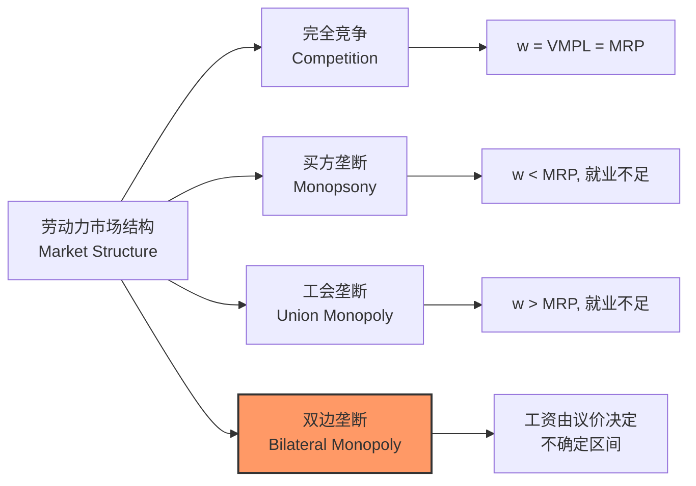
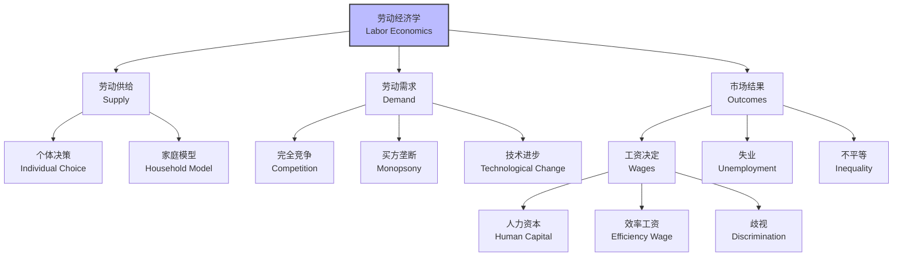

---
aliases:
  - 劳动经济学
  - Labor Economics
  - 劳动力市场
  - 人力资本
  - 工资决定
  - 失业
  - 就业
tags:
  - economics
  - labor_economics
  - labor_supply
  - labor_demand
  - human_capital
  - wage_determination
  - unemployment
  - discrimination
  - labor_market_policy
---

# 劳动经济学 (Labor Economics)

劳动经济学研究劳动力市场的运行规律与制度特征，系统分析劳动供给与需求、人力资本投资、工资决定机制、失业现象与劳动力市场政策。它将微观经济学的理性选择理论应用于劳动决策，同时关注制度安排、权力关系与信息不对称对劳动结果的深刻影响，为理解就业、收入与不平等提供了核心的经济学分析框架。

## 劳动供给 (Labor Supply)

### 个体劳动供给的基本模型

劳动者在 **闲暇 (Leisure)** 与 **收入 (Income)** 之间进行权衡以实现效用最大化。标准的劳动供给模型表述为：

$$
\max_{L, C} \; U(C, L) \quad \text{s.t.} \quad C = w \cdot (T - L) + V
$$

其中 $T$ 为总时间禀赋（如每天24小时或每周168小时），$L$ 为闲暇时间，$w$ 为小时工资率，$V$ 为非劳动收入（如财产收入、转移支付），$C$ 为消费。

效用最大化的一阶条件导出劳动供给决策的核心方程：

$$
\frac{MU_L}{MU_C} = w
$$

即闲暇与消费的边际替代率等于工资率——多工作一小时带来的消费增益恰好补偿失去的闲暇效用。

### 收入效应与替代效应

工资变化通过两种相反的心理机制影响劳动供给：

| 效应 (Effect) | 工资上升的直接影响 | 方向 | 经济直觉 |
| :--- | :--- | :--- | :--- |
| 替代效应 (Substitution Effect) | 闲暇相对变贵，激励用工作替代闲暇 | 正（增加劳动供给） | 时间的机会成本上升 |
| 收入效应 (Income Effect) | 实际收入增加，增加闲暇需求 | 负（减少劳动供给） | 闲暇是正常品 |

净效应取决于两种效应的相对强度：

- 当替代效应 > 收入效应时，工资上升导致劳动供给增加，劳动供给曲线向上倾斜。
- 当收入效应 > 替代效应时，工资上升反而减少劳动供给，劳动供给曲线 "向后弯曲" (Backward-bending)。

实证研究表明：男性劳动供给的工资弹性较小（接近零甚至微负），而女性（尤其已婚女性）的劳动供给对工资变化更为敏感，这与家庭分工、育儿责任与社会规范密切相关。

### 家庭劳动供给模型

Gary Becker 的家庭经济学模型将家庭视为生产单位，在 **时间配置 (Time Allocation)** 与 **家庭生产 (Household Production)** 框架下分析劳动决策：

- **比较优势分工**：配偶中市场工资较高者投入更多时间于市场工作，另一方可专业化于家庭生产（育儿、家务），实现家庭整体效用最大化。
- **联合决策与税收**：累进所得税、儿童保育成本与社会保障规则影响家庭整体劳动供给，而非仅个体决策。
- **家庭内部议价**：配偶的相对收入、外部选择 (outside options) 与社会规范影响家庭内部的资源分配与劳动分工。

## 劳动需求 (Labor Demand)

### 利润最大化与要素需求

竞争性企业的利润最大化要求劳动的边际产品价值等于工资率：

$$
VMPL = P \cdot MPL = w
$$

其中 $MPL = \frac{\partial Q}{\partial L}$ 为劳动边际产量 (Marginal Product of Labor)。若 $VMPL > w$，企业应增雇工人；反之则应裁员或缩短工时。

### 短期与长期劳动需求

- **短期分析**：资本存量固定，劳动需求仅受劳动边际产量递减规律约束。增加劳动投入在固定资本上导致边际产量递减。
- **长期分析**：企业可同时调整资本与劳动组合。给定生产函数 $Q = F(K, L)$，成本最小化的一阶条件要求：

$$
\frac{MP_L}{MP_K} = \frac{w}{r}
$$

即等产量线与等成本线的切点决定最优要素比例。工资上升将诱使企业用资本替代劳动（替代效应），但产出收缩也减少劳动需求（规模效应）。

### 劳动需求弹性的决定因素

劳动需求对工资变化的敏感程度受多种因素影响：

| 影响因素 (Factor) | 对劳动需求弹性的影响 |
| :--- | :--- |
| 产品需求价格弹性 | 产品需求弹性越大，劳动需求弹性越大 |
| 资本与劳动的替代弹性 | 要素越易替代，劳动需求弹性越大 |
| 劳动成本占总成本比例 | 劳动成本份额越高，弹性越大 |
| 其他生产要素的供给弹性 | 其他要素供给越弹性，劳动需求弹性越大 |
| 时间维度 | 长期劳动需求弹性大于短期弹性 |

### 非竞争性劳动力市场

- **产品市场垄断**：垄断者根据边际收益产品 ($MRP = MR \cdot MPL$) 而非价值边际产品 ($VMPL = P \cdot MPL$) 决定雇佣量。由于 $MR < P$，垄断者的劳动需求低于竞争水平。
- **买方垄断 (Monopsony)**：单一雇主或高度集中的雇主群体面对向上倾斜的劳动供给曲线。利润最大化要求 $ME_L = MRP_L$，其中 $ME_L$ 为边际劳动成本 (Marginal Expense of Labor)。买方垄断导致工资低于竞争均衡且就业量不足。

## 人力资本理论 (Human Capital Theory)

### 人力资本投资的经济学分析

Gary Becker (1964) 的开创性著作《人力资本》将教育、培训与健康视为 **人力资本 (Human Capital)** 投资，其决策逻辑与物质资本投资完全一致：

$$
\sum_{t=1}^{T} \frac{W_t^E - W_t^{NE}}{(1 + r)^t} \geq C
$$

其中 $W_t^E$ 与 $W_t^{NE}$ 分别为受教育与未受教育者在第 $t$ 年的工资收入，$C$ 为教育的直接成本（学费、书籍）与机会成本（放弃的收入），$r$ 为贴现率。若人力资本投资的净现值 (NPV) 为正，则理性个体选择接受教育。

### 教育的信号功能

Michael Spence (1973) 的 **信号模型 (Signaling Model)** 提出了重要的替代性解释：教育未必直接提高工人的生产率，而是作为能力信号帮助雇主在信息不对称的劳动力市场中区分高能力与低能力工人。高能力者以较低成本完成教育，低能力者成本高昂，因此教育水平成为可信的筛选信号。

| 理论视角 | 核心机制 | 政策含义 | 局限性 |
| :--- | :--- | :--- | :--- |
| 人力资本理论 | 教育直接提高生产率与技能 | 扩大教育供给、提升教育质量 | 难以解释文凭效应与过度教育 |
| 信号理论 | 教育筛选预先存在的能力差异 | 关注教育成本与信号效率 | 忽视教育的真实技能形成作用 |
| 社会阶层再生产 | 教育传递文化资本与社会网络 | 关注教育公平与机会均等 | 低估教育的经济回报 |
| 文凭主义 (Credentialism) | 学位作为就业门槛而非技能指标 | 反思学位膨胀与过度教育 | 可能低估高等教育的社会外部性 |

### 在职培训与一般/特殊培训

Becker 区分了两类在职培训：

- **一般培训 (General Training)**：提高工人的市场通用技能（如编程、会计），增加工人在所有企业的边际产出。由于工人可在劳动力市场上获得更高工资，一般培训的成本主要由工人承担（通过接受较低培训期工资）。
- **特殊培训 (Specific Training)**：提高企业专用技能（如特定生产流程、企业文化），仅增加在该企业的边际产出。由于工人离职会使投资流失，企业与工人共享成本与收益，这解释了为何提供特殊培训的企业倾向于支付高于市场水平的工资以降低离职率。

## 工资决定 (Wage Determination)

### 竞争性工资差异

在完全竞争模型中，工资差异由补偿性差异与人力资本差异解释：

- **补偿性工资差异 (Compensating Differentials)**：工作条件差、职业风险高或工作不愉快的职业需支付更高工资以补偿工人。如深海潜水员、矿工、夜班工人的工资溢价。
- **人力资本差异**：教育、工作经验、技能认证差异导致边际产出不同，进而形成工资差异。

Mincer 工资方程是估计教育回报率的经典工具：

$$
\ln(w) = \alpha + \beta_1 S + \beta_2 E + \beta_3 E^2 + \gamma X + \varepsilon
$$

其中 $S$ 为受教育年限，$E$ 为工作经验年限，$X$ 为其他控制变量。国际比较中，教育的平均回报率通常在 8-12% 之间，发展中国家往往更高。

### 效率工资理论

效率工资模型 (Efficiency Wage Theory) 解释为何企业可能自愿支付高于市场出清水平的工资：

1. **降低离职率 (Turnover Reduction)**：高工资减少工人流动，降低招聘、筛选与培训新员工的成本。
2. **减少偷懒 (Shirking Reduction)**：高工资提高被解雇的机会成本，激励工人付出更多努力（Shapiro-Stiglitz 模型）。
3. **逆向选择与筛选 (Adverse Selection / Sorting)**：高工资吸引更高能力、更积极的申请者，改善企业的人力资本池。
4. **健康与营养效应**：在发展中国家，高于生存水平的工资改善工人营养状况与健康，直接提升生产率。

效率工资理论的重要推论是 **非自愿失业 (Involuntary Unemployment)**：即使存在愿意接受更低工资的失业工人，企业也不会降薪雇佣，因为这会降低现有员工的努力水平与整体效率。

### 劳动力市场歧视

Gary Becker 的 **歧视偏好模型 (Taste-based Discrimination)** 将歧视视为雇主、雇员或顾客的偏好：

- **雇主歧视**：雇主因个人偏好而回避雇佣特定群体，支付 "歧视溢价"。竞争市场理论上应消除雇主歧视（非歧视企业成本更低）。
- **顾客歧视**：顾客偏好由特定群体提供服务，导致市场分割与工资差异。
- **雇员歧视**：现有工人不愿与特定群体共事，导致工作场所隔离。

然而，**统计歧视 (Statistical Discrimination)** 更为持久：雇主利用群体统计信息（如平均测试分数、犯罪率）推断个体特征，即使个体实际能力高于群体平均，也可能遭受不利对待。这种歧视在信息不对称下是理性的，但对被歧视的个体极不公平。

## 失业 (Unemployment)

### 失业的主要类型

| 失业类型 (Type) | 核心原因 (Primary Cause) | 特征 (Characteristics) | 典型持续时间 |
| :--- | :--- | :--- | :--- |
| 摩擦性失业 (Frictional) | 劳动力市场信息不完全、工作匹配需要时间 | 短期、不可避免、随经济活力变化 | 数周 |
| 结构性失业 (Structural) | 技能不匹配、地理错配、产业技术转型 | 长期、需再培训或地理迁移 | 数月到数年 |
| 周期性失业 (Cyclical) | 总需求不足、经济衰退 | 与经济周期同步、宏观政策焦点 | 数月到数年 |
| 季节性失业 (Seasonal) | 季节性行业（旅游业、农业、建筑业） | 可预测、周期性重复 | 数月 |

### 自然失业率

**自然失业率 (Natural Rate of Unemployment)** 是通货膨胀稳定时的失业率，由摩擦性与结构性因素决定：

$$u^* = \frac{s}{s + f}$$

其中 $s$ 为离职率 (separation rate)，$f$ 为就职率 (job-finding rate)。降低自然失业率需要减少摩擦（如改进就业信息匹配系统）与结构性障碍（如职业培训、促进地理流动）。

### 搜寻-匹配模型

Peter Diamond、Dale Mortensen 与 Christopher Pissarides 发展的 **DMP 模型** 将失业视为搜寻与匹配摩擦的均衡结果：

- **匹配函数 (Matching Function)**：$m = m(u, v)$，描述失业者 ($u$) 与职位空缺 ($v$) 之间的匹配效率。
- **贝弗里奇曲线 (Beveridge Curve)**：失业率与空缺率的负相关关系。曲线外移表明匹配效率下降或结构性失业问题加剧。
- **工资议价**：匹配成功后，工人与雇主通过 Nash 议价分割匹配剩余 (match surplus)：

$$
\max_w \; (V_E - V_U)^\beta \cdot (J_F - J_V)^{1-\beta}
$$

其中 $\beta$ 为工人的相对议价能力，$V_E - V_U$ 为工人就业与失业的价值差，$J_F - J_V$ 为企业 filled job 与空缺职位的价值差。

## 劳动力市场制度

### 最低工资政策

最低工资政策的效果存在持久的理论争议与实证分歧：

- **标准竞争模型**：最低工资高于均衡水平导致低技能工人就业减少。
- **买方垄断模型**：在劳动力市场存在买方垄断力时，适度的最低工资可提高就业与工资水平。
- **Card 与 Krueger (1994)** 的新泽西-宾夕法尼亚快餐业自然实验未发现最低工资上调的负面就业效应，引发激烈学术争论。后续大量研究与元分析表明，温和上调的就业效应接近零或轻微负向，尤其是在低工资行业与低技能工人中。

### 工会与集体谈判

- **工会工资溢价 (Union Wage Premium)**：实证研究表明，工会工人工资通常比可比非工会工人高 10-20%。
- **Voice/Exit 机制**：Albert Hirschman 指出工会提供 "声音" (voice) 机制，使工人表达不满而不必 "退出" (exit)，降低离职率但可能降低效率。
- **集体谈判覆盖度**：北欧国家的行业级 (sectoral) 谈判 vs. 英美的企业级 (firm-level) 谈判，对工资不平等、灵活性与宏观经济绩效产生不同影响。

### 失业保险制度

失业保险 (Unemployment Insurance, UI) 设计面临保险价值与道德风险之间的根本权衡：

- **道德风险**：较高的 UI 替代率延长失业持续时间，因为降低了搜寻工作的紧迫性（Baily-Chetty 最优 UI 模型）。
- **消费平滑**：UI 为失业者提供收入保障，防止消费急剧下降，具有显著的社会保险价值。
- **最优 UI 替代率**：在消费平滑收益与搜寻激励成本之间取得平衡，典型 OECD 国家的替代率在 50-70% 之间。
- **经验税率 (Experience Rating)**：美国部分州按企业的裁员历史调整 UI 税率，抑制企业随意解雇。

## 劳动力市场的新趋势与挑战

### 技术变革与就业结构

- **技能偏向型技术变革 (Skill-Biased Technological Change, SBTC)**：计算机、自动化与人工智能提高对高技能工人的相对需求，加剧工资不平等。
- **任务模型 (Task Model)**：David Autor、Frank Levy 与 Richard Murnane 区分常规任务（规则明确、易被自动化）与非常规任务（需要创造力、判断力与灵活性），解释 "就业极化" (Job Polarization)——中间技能岗位消失，高技能与低技能岗位增长。
- **零工经济 (Gig Economy)**：平台经济（Uber、滴滴、外卖平台）重塑传统雇佣关系，将标准雇佣转化为独立承包，挑战传统劳动保护、社会保障与税收框架。

### 全球劳动力市场一体化

- **移民经济学**：George Borjas 强调移民对本地低技能工人的潜在工资压力；David Card 的研究发现总体影响较小。共识是移民对本地工人的平均影响温和，但可能对特定子群体产生局部影响。
- **离岸外包 (Offshoring)**：中间生产任务的跨国转移影响发达国家劳动力需求结构， Routine 任务首当其冲。

## 结语

劳动经济学通过供给-需求分析、人力资本理论与搜寻-匹配模型，为理解劳动力市场提供了强大而系统的理论工具。从个体劳动-闲暇权衡到全球技术变革对就业结构的冲击，从效率工资导致的非自愿失业到最低工资政策的实证争议，劳动经济学持续关注市场力量与制度安排如何共同塑造劳动者的工作条件、收入水平与整体福祉。在自动化加速、平台经济崛起与人口结构深刻变化的新时代，劳动经济学正面临前所未有的理论挑战与政策需求。
