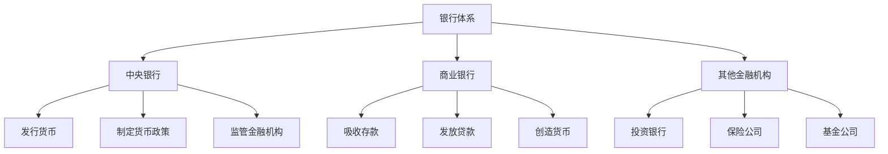
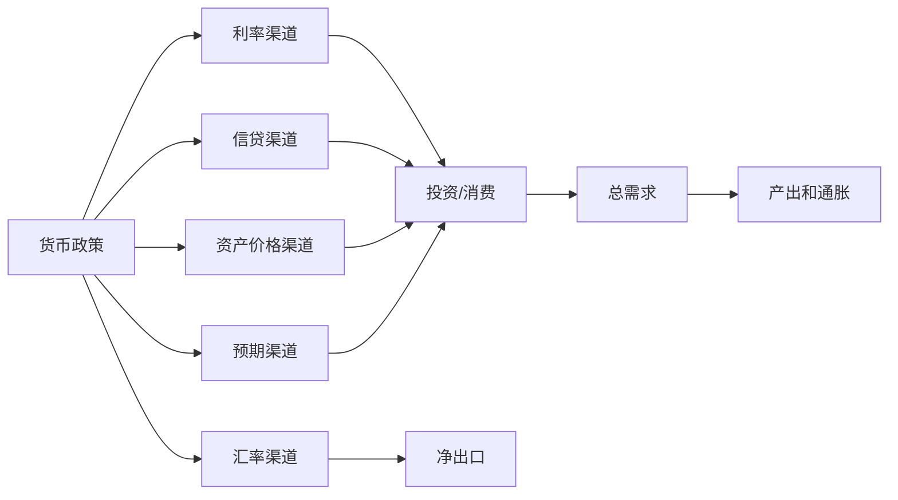
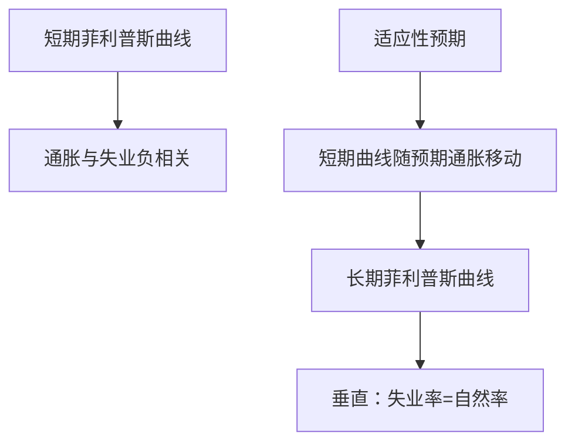

# 货币经济学 (Monetary Economics)

## 一、货币经济学概述

### 1.1 定义与研究对象

货币经济学（Monetary Economics）研究货币、信用、银行体系以及货币政策对经济的影响。其核心问题包括货币的本质与职能、货币供求、利率决定、通货膨胀以及货币政策传导机制。

### 1.2 货币的职能

| 职能 | 描述 | 含义 |
|------|------|------|
| 交易媒介 | 用于商品和服务的交换 | 克服物物交换的双重巧合需求 |
| 计价单位 | 衡量商品和服务的价值标准 | 降低信息成本 |
| 价值储藏 | 将购买力从现在转移到未来 | 需具备保值和安全性 |
| 延期支付标准 | 为未来交易提供计值依据 | 对金融市场发展尤为重要 |

### 1.3 货币供给的层次

不同类型的货币按流动性由高到低排列：

| 层次 | 构成 | 流动性 |
|------|------|--------|
| M0 | 流通中的现金（纸币+硬币） | 最高 |
| M1 | M0 + 活期存款 | 高 |
| M2 | M1 + 准货币（定期存款、储蓄存款、货币市场基金） | 中 |
| M3 | M2 + 金融债券、大额存单等 | 较低 |

## 二、货币需求理论

### 2.1 古典货币数量论

**费雪交易方程式**（Fisher Equation of Exchange）：

$$
MV = PY
$$

其中 $M$ 为货币供给量，$V$ 为货币流通速度，$P$ 为价格水平，$Y$ 为实际产出。

**剑桥方程式**（Cambridge Equation）：

$$
M_d = kPY
$$

其中 $k$ 为持币系数，表示人们愿意以货币形式持有的收入比例。

### 2.2 凯恩斯的流动性偏好理论

凯恩斯提出人们持有货币的三种动机：

$$
M_d = L_1(Y) + L_2(r)
$$

| 动机 | 定义 | 决定因素 |
|------|------|----------|
| 交易动机 | 日常交易需要 | 收入水平 |
| 预防动机 | 应对意外支出 | 收入水平和不确定性 |
| 投机动机 | 利用利率变化获利 | 利率预期 |

### 2.3 鲍莫尔-托宾模型

鲍莫尔-托宾模型（Baumol-Tobin Model）将交易动机与利率联系起来：

$$
\text{最优每次取款额} = \sqrt{\frac{2bT}{r}}
$$

$$
\text{平均货币持有量} = \frac{1}{2}\sqrt{\frac{2bT}{r}}
$$

其中 $b$ 为取款的固定交易成本，$T$ 为总支出，$r$ 为利率。

### 2.4 弗里德曼的现代货币数量论

弗里德曼（Milton Friedman）将货币视为一种资产，货币需求取决于永久收入（Permanent Income）和货币相对于其他资产的收益率：

$$
M_d = f(Y_p, r_b - r_m, r_e - r_m, \pi^e - r_m)
$$

其中 $Y_p$ 为永久收入，$r_b$、$r_e$、$r_m$ 分别为债券、股票和货币的收益率，$\pi^e$ 为预期通胀率。

## 三、货币供给与银行体系

### 3.1 银行体系的结构



### 3.2 货币乘数

货币乘数（Money Multiplier）描述了基础货币扩张为货币供给的过程：

$$
M = m \times B
$$

其中 $M$ 为货币供给，$B$ 为基础货币（Monetary Base），$m$ 为货币乘数。

$$
m = \frac{1 + c}{r + c + e}
$$

| 符号 | 含义 |
|------|------|
| $c$ | 通货-存款比率 |
| $r$ | 法定存款准备金率 |
| $e$ | 超额准备金率 |

### 3.3 中央银行的资产负债表

中央银行的资产负债表是其货币政策操作的核心工具：

| 资产 | 负债 |
|------|------|
| 外汇储备 | 流通中的货币（M0） |
| 对政府债权 | 商业银行准备金 |
| 对商业银行债权（再贷款、再贴现） | 政府存款 |
| 其他资产 | 发行债券（央票） |

## 四、货币政策

### 4.1 货币政策目标

```
最终目标 ──┬── 价格稳定（首要目标）
           ├── 充分就业
           ├── 经济增长
           └── 金融稳定
```

**泰勒规则**（Taylor Rule）：描述中央银行如何调整利率以实现通胀和产出目标：

$$
i = r^* + \pi + 0.5(\pi - \pi^*) + 0.5(y - y^*)
$$

其中 $i$ 为名义利率，$r^*$ 为自然实际利率，$\pi$ 为实际通胀率，$\pi^*$ 为目标通胀率，$y - y^*$ 为产出缺口。

### 4.2 货币政策工具

| 工具 | 机制 | 特点 |
|------|------|------|
| 公开市场操作 | 买卖政府债券调控基础货币 | 最常用、灵活 |
| 再贴现率 | 调整向央行借款的成本 | 发挥"最后贷款人"职能 |
| 法定准备金率 | 调整货币乘数 | 效果猛烈，不常用 |
| 利率走廊 | 设定利率上下限 | 引导市场利率 |
| 量化宽松（QE） | 大规模购买资产 | 零利率下限时的非常规工具 |

### 4.3 货币政策传导机制



## 五、通货膨胀

### 5.1 通货膨胀的定义与测量

通货膨胀（Inflation）是一般价格水平持续上涨的现象。常用指标包括：

- CPI（消费者价格指数）
- PPI（生产者价格指数）
- GDP平减指数

### 5.2 通货膨胀理论

**需求拉动型通货膨胀**：总需求超过总供给：

$$
\text{过多的货币追逐过少的商品}
$$

**成本推动型通货膨胀**：生产成本上升推动价格上涨，如工资推动和原材料价格推动。

**结构性通货膨胀**：经济结构失衡导致的部门间价格传递。

**货币数量论解释**：

$$
\Delta M + \Delta V = \Delta P + \Delta Y
$$

在长期，货币供给增长率决定通货膨胀率。

### 5.3 菲利普斯曲线

菲利普斯曲线（Phillips Curve）描述通货膨胀与失业之间的交替关系：

$$
\pi = \pi^e - \beta(u - u_n) + \varepsilon
$$

其中 $u$ 为实际失业率，$u_n$ 为自然失业率，$\pi^e$ 为预期通胀率。



## 六、利率理论

### 6.1 可贷资金理论

可贷资金理论（Loanable Funds Theory）将利率视为可贷资金供给与需求均衡的结果：

$$
\text{可贷资金供给} = \text{储蓄} + \text{货币供给增加} + \text{海外资本流入}
$$

$$
\text{可贷资金需求} = \text{投资} + \text{政府赤字} + \text{海外资本流出}
$$

### 6.2 流动性偏好理论

利率由货币供求决定，货币供给由央行外生决定，货币需求取决于收入和利率：

$$
\text{均衡利率} = \{\text{货币供给} = \text{货币需求}(Y, r)\}
$$

### 6.3 利率的期限结构

**预期理论**：长期利率等于预期短期利率的平均值。

$$
i_{nt} = \frac{i_t + i_{t+1}^e + \cdots + i_{t+n-1}^e}{n}
$$

**流动性溢价理论**：长期债券包含期限溢价以补偿流动性风险。

**市场分割理论**：不同期限的债券市场是分割的，利率由各自市场供求决定。

## 七、金融稳定

### 7.1 系统性风险

系统性风险（Systemic Risk）是金融系统局部冲击可能引发整个系统危机的风险。宏观审慎政策（Macroprudential Policy）旨在防范系统性风险。

### 7.2 金融监管

| 监管工具 | 目的 |
|----------|------|
| 资本充足率 | 确保银行具备吸收损失的能力 |
| 流动性覆盖率 | 确保短期流动性 |
| 杠杆率 | 限制过度杠杆 |
| 压力测试 | 评估极端情景下的韧性 |

## 相关条目

- [[03_HumanitiesAndSocialSciences/Economics/Macroeconomics]]
- [[03_HumanitiesAndSocialSciences/Economics/InternationalEconomics|InternationalEconomics]]
- [[03_HumanitiesAndSocialSciences/Economics/PublicEconomics|PublicEconomics]]
- [[INDEX|当前目录索引]]
