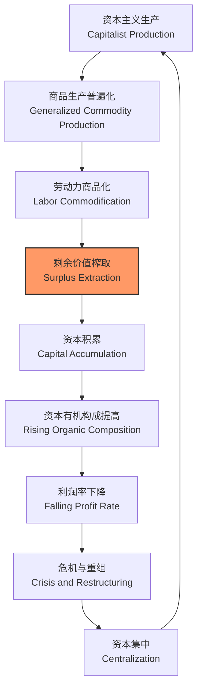

---
aliases:
  - 政治经济学
  - Political Economy
  - 马克思主义经济学
  - 制度经济学
  - 经济权力
  - 全球化
  - 不平等
tags:
  - economics
  - political_economy
  - marxist_economics
  - institutional_economics
  - economic_power
  - globalization
  - inequality
  - capitalism
  - development
---

# 政治经济学 (Political Economy)

政治经济学研究经济系统与政治权力、社会制度之间的深层互动关系。不同于新古典经济学将政治制度视为外生给定的简化假设，政治经济学将分配冲突、权力不对称与制度变迁内生于分析框架，探讨资源配置如何在利益博弈中形成，并反过来塑造社会结构、国家形态与全球秩序。

## 古典政治经济学 (Classical Political Economy)

### 亚当·斯密与国民财富

Adam Smith 的《国民财富的性质和原因的研究》(1776) 奠定了古典政治经济学的基础框架：

- **劳动分工 (Division of Labor)**：分工是提高生产率的根本源泉，但受市场范围限制。"劳动分工受市场规模限制" (The division of labor is limited by the extent of the market) 成为经济地理与贸易理论的基石。
- **看不见的手 (Invisible Hand)**：个体在竞争性市场中追求自利，在价格信号的引导下无意中促进了社会整体利益。
- **重商主义批判**：系统批判国家对贸易的过度干预，主张自由贸易、轻税薄赋与有限政府。

### 李嘉图与比较优势

David Ricardo 的比较优势理论指出：即使一国在所有商品生产上均处于绝对劣势，仍可通过专业化生产相对劣势较小的商品并从贸易中获益。这一理论成为自由贸易政策的基石，但也掩盖了贸易收益的分配不均问题。

### 马尔萨斯与人口论

Thomas Malthus 的人口论认为：人口呈几何级数增长，而粮食仅呈算术级数增长，除非通过战争、饥荒或瘟疫等 "积极抑制"，否则人均资源趋向生存水平。这一悲观预测为后世关于增长极限与可持续发展的争论埋下了思想伏笔。

## 马克思主义经济学 (Marxist Economics)

### 劳动价值论

Karl Marx 在《资本论》(1867-1894) 中发展了系统的 **劳动价值论 (Labor Theory of Value)**：

- **使用价值 (Use-value)**：商品满足人类特定需要的能力，由具体劳动创造。
- **交换价值 (Exchange-value)**：商品在市场上可交换的比例，由生产该商品所需的社会必要劳动时间决定。
- **社会必要劳动时间 (Socially Necessary Labor Time)**：在现有正常生产条件与社会平均劳动熟练度下生产商品所需的劳动时间。

### 剩余价值与剥削机制

资本主义生产的核心是 **剩余价值 (Surplus Value)** 的榨取与资本积累：

$$
\text{商品价值} = c + v + s
$$

- $c$：**不变资本 (Constant Capital)**，生产资料转移的价值。
- $v$：**可变资本 (Variable Capital)**，劳动力价值，即工资。
- $s$：**剩余价值 (Surplus Value)**，被资本家无偿占有的、超出劳动力价值的价值。

**剩余价值率 (Rate of Surplus Value)**：

$$
m' = \frac{s}{v}
$$

衡量剥削的相对程度。利润率则受资本有机构成的深刻影响：

$$
r = \frac{s}{c + v} = \frac{m' \cdot v}{c + v} = \frac{m'}{\frac{c}{v} + 1}
$$

随着技术进步与资本积累，**资本有机构成 (Organic Composition of Capital)** $c/v$ 呈上升趋势，这将趋势性地压低一般利润率（**利润率下降趋势, Tendency of the Rate of Profit to Fall, TRPF**），构成资本主义经济危机的内生性根源。

### 资本积累与危机理论

Marx 深入分析了资本积累的内在矛盾：

1. **生产过剩危机**：资本对劳动的剥削导致工人阶级消费能力不足，与无限扩张的生产能力形成根本矛盾。
2. **资本集中与垄断**：自由竞争必然导致资本集聚与集中，垄断取代自由竞争，改变资本主义的运行机制。
3. **无产阶级化与阶级对立**：小生产者破产、劳动力商品化，社会日益分化为资产阶级与无产阶级两大对立阵营。

## 制度经济学 (Institutional Economics)

### 老制度主义

Thorstein Veblen、John Commons 与 Wesley Mitchell 创立的老制度主义强调：

- **制度 (Institutions)**：约定俗成的行为模式、规范与习惯，而非仅指正式组织。
- **演化视角**：经济系统像生物系统一样经历演化过程，而非趋向静态均衡。
- **炫耀性消费 (Conspicuous Consumption)**：Veblen 指出消费行为不仅是满足需求，更是社会地位与身份认同的符号表达。

### 新制度经济学

Ronald Coase、Douglass North、Oliver Williamson 与 Elinor Ostrom 发展的新制度经济学将制度分析形式化并纳入主流经济学框架：

#### 交易成本经济学

**交易成本 (Transaction Costs)** 是理解经济制度选择的核心概念：

$$
TC = \text{搜寻与信息成本} + \text{谈判与决策成本} + \text{缔约成本} + \text{监督成本} + \text{执行与适应成本}
$$

Williamson 的 **资产专用性 (Asset Specificity)** 框架解释纵向一体化：当交易涉及高度专用性投资（如地点专用、物理专用、人力专用）且交易频率高、不确定性大时，市场合约的高交易成本使层级组织（企业）成为更优的治理结构。

#### 产权经济学

Douglass North 强调产权制度是经济增长与发展的关键：

- **有效产权**：清晰界定、可执行且交易成本低的产权制度激励投资、创新与经济活动。
- **制度变迁**：制度变迁具有 **路径依赖 (Path Dependence)** 特征，初始条件与关键历史事件可长期锁定经济绩效，导致不同国家的发展轨迹分化。

| 制度质量维度 | 核心内涵 | 经济影响 |
| :--- | :--- | :--- |
| 产权保护 | 私人财产的法律保障与执行 | 投资激励、资本积累、创新 |
| 契约执行 | 司法系统的效率与公正性 | 降低交易成本、扩大贸易范围 |
| 政府治理 | 腐败控制、行政效率、透明度 | 资源配置效率、投资者信心 |
| 政治稳定 | 政权更迭的可预测性与和平性 | 长期投资风险、规划确定性 |

## 经济权力与不平等

### 权力的多维度分析

政治经济学将 **权力 (Power)** 视为核心分析变量，而非新古典经济学中的边缘现象：

- **议价权力 (Bargaining Power)**：由退出选择 (exit options)、稀缺性与不可替代性决定。在劳动力市场中，高技能工人拥有更强的议价地位。
- **结构性权力 (Structural Power)**：Charles Lindblom 指出，资本流动能力对企业与国家施加深层约束—— "市场作为监狱" (the market as prison)。资本外流威胁迫使政府在政策上迎合资本利益。
- **话语权力 (Discursive Power)**：通过意识形态、知识体系与定义权塑造经济偏好、制度合法性与公共舆论。

### 收入分配与不平等

政治经济学关注市场结果的政治建构与分配后果：

- **功能收入分配**：国民收入中劳动份额 (Labor Share) 与资本份额 (Capital Share) 的划分。全球范围内劳动份额自1980年代以来呈下降趋势。
- **规模收入分配**：个人或家庭层面的收入分布，通过基尼系数、分位数比率（如 P90/P10）、顶端收入份额（Top 1%）等指标衡量。
- **代际流动性**：父代经济地位对子代经济成就的影响程度，以代际收入弹性 (IGE) 衡量。

Thomas Piketty (2014) 在《21世纪资本论》中提出的核心不等式 $r > g$——资本回报率 (r) 长期高于经济增长率 (g)——意味着财富继承者比劳动者积累更快，导致财富集中度在缺乏强力干预时趋势性上升。

### 精英俘获与寻租

- **精英俘获 (Elite Capture)**：政治与经济精英相互勾结，操纵政策制定以维护自身特权与利益。
- **寻租 (Rent-seeking)**：通过非生产性活动（游说、贿赂、垄断保护）获取政府创造的租金，造成社会福利净损失。
- **俘获型国家 (Captured State)**：国家机构被特定利益集团主导，失去公共性与中立性。

## 全球化与政治经济学

### 全球化的多维经济进程

全球化涉及商品、资本、劳动力与信息的跨国流动加速：

| 维度 | 核心表现 | 政治经济学问题 |
| :--- | :--- | :--- |
| 贸易自由化 | 关税下降、区域贸易协定、WTO 规则 | 赢家与输家的分配冲突、去工业化压力 |
| 资本流动 | FDI、证券投资、金融全球化 | 资本逃离、汇率危机、货币政策空间压缩 |
| 劳动力迁移 | 国际移民、难民流动、人才外流 | 工资下行压力、社会融合挑战、汇款依赖 |
| 生产全球化 | 全球价值链 (GVCs) 分工深化 | 权力不对称、劳动标准竞赛、利润分配失衡 |

### 全球价值链与权力不对称

Gary Gereffi 等人的 **全球价值链 (Global Value Chains, GVCs)** 分析揭示了全球化生产中的权力结构：

- **治理结构**：价值链由主导企业（通常是品牌持有者、零售商或平台企业）通过标准设定、订单分配、技术控制与认证体系进行治理。
- **微笑曲线 (Smiling Curve)**：附加值高度集中于研发/设计端与品牌营销端，而制造组装端利润微薄。全球南方国家往往被锁定在附加值最低的环节。
- **升级困境 (Upgrading Dilemma)**：发展中国家嵌入 GVCs 面临 "低端锁定" 风险，向高附加值环节升级受技术壁垒、知识产权与权力结构的系统性约束。

### 国际政治经济学视角

- **霸权稳定论 (Hegemonic Stability Theory)**：Charles Kindleberger 提出，开放的国际经济体系需要霸权国提供公共品（如储备货币、最后贷款人、安全保证）。
- **依附理论 (Dependency Theory)**：Raúl Prebisch 与 Hans Singer 指出中心-边缘结构下，初级产品贸易条件长期恶化，外围国家陷入依附性发展与不发达状态。
- **世界体系理论 (World-Systems Theory)**：Immanuel Wallerstein 将世界划分为核心、半边缘与边缘区域，分析资本主义世界体系的周期性波动（A/B 阶段）、霸权周期与长期趋势。

## 当代前沿议题

### 新自由主义的兴起与批判

1980年代以来的新自由主义全球化以私有化、去监管化、贸易自由化与财政紧缩为特征。批判者指出：

- 金融化 (financialization) 加剧经济不稳定与贫富分化。
- 福利国家收缩导致社会保护弱化与民众不安全感上升。
- 民主赤字 (democratic deficit)：经济决策权力从民选国家政府转移至超国家机构、跨国公司与金融市场。

### 气候政治经济学

气候变化是当代政治经济学最具紧迫性的议题：

- **碳资本主义 (Carbon Capitalism)**：化石能源利益集团通过政治游说、 funding 智库与旋转门机制系统性地阻挠气候政策。
- **绿色转型正义 (Just Transition)**：确保脱碳过程不加剧脆弱群体（如化石能源工人、低收入消费者）的负担，通过再培训、社会保障与产业多元化实现公正转型。
- **全球气候治理**：共同但有区别的责任原则 (Common But Differentiated Responsibilities) 与发达国家历史排放责任的伦理-政治争议。

## 结语

政治经济学深刻揭示了经济活动深嵌于权力关系、制度结构与历史路径之中。从 Marx 对资本积累与危机的批判到 North 对制度变迁与路径依赖的分析，从 Piketty 的 $r > g$ 到全球价值链中的权力不对称，政治经济学持续追问：经济繁荣的成果如何在社会成员间分配？谁掌握决定分配规则的话语权与制度权力？在全球化深化、数字化加速与气候变化紧迫的当代语境下，这些问题的答案比以往任何时候都更加关键。
